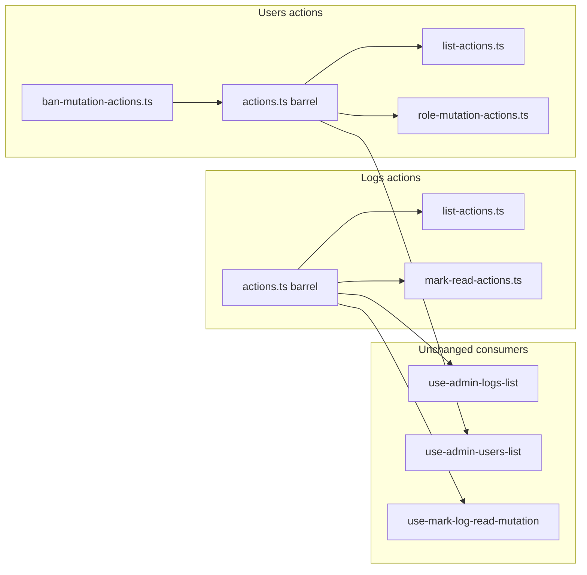

# Phase 14 Epic 5 — Actions Layer Thinning

> **Track progress:** as you complete each step, update the corresponding `todos` entry's `status` to `completed` in this plan's frontmatter.

> **Precondition:** `git status --porcelain` must be empty before the first implementation edit. If dirty, halt and ask the user to commit or stash. The epic must land as a single commit containing only this epic's work — `code-review` derives its range from that commit. Before the first implementation edit, record `git rev-parse HEAD` as the epic baseline SHA.

**This epic is a good candidate for Build in Parallel.** Track A (logs actions) and Track B+C (users actions + test split) touch disjoint directories; build the end state directly in each track, then verify once.

Branch `phase-14/tech-debt-hardening` is correct (Epics 1–4 `Complete`). Next epic per [phase-14-tech-debt-hardening.prd.md](docs/prds/phase-14-tech-debt-hardening.prd.md): **Epic 5 — Actions-Layer Thinning** (F067, F087, F078).

*(Note: an untracked `.cursor/plans/phase_14_epic_4_type_derivation_add39acc.plan.md` may still show in porcelain — commit or remove it in a separate housekeeping step before the first implementation edit so the precondition check passes. This Epic 5 plan file is staged in the epic commit at close-out alongside implementation files.)*

## Context

Both admin action files still carry full inline server-action bodies despite `_lib/` helpers existing underneath. Audit findings:

| Finding | Today | Target |
| ------- | ----- | ------ |
| F067 | [`src/app/admin/logs/actions.ts`](src/app/admin/logs/actions.ts) (~370 LOC) — list, stats, tags, and mark-read actions in one file | Mark-read group → `_lib/mark-read-actions.ts`; list group → `_lib/list-actions.ts`; [`actions.ts`](src/app/admin/logs/actions.ts) becomes re-export barrel only |
| F087 | [`src/app/admin/users/actions.ts`](src/app/admin/users/actions.ts) (~300 LOC) — list/stats inline; mutations partially delegated | Same barrel pattern: list → `_lib/list-actions.ts`; role mutations → `_lib/role-mutation-actions.ts`; ban mutations → `_lib/ban-mutation-actions.ts` |
| F078 | [`src/app/admin/users/actions.unit.test.ts`](src/app/admin/users/actions.unit.test.ts) (~767 LOC) | Split into three files mirroring the new action modules |

**Hard constraints from PRD:**
- Both barrels preserve the current import surface — all ten hook consumers import from `../actions` today and must keep working unchanged
- Neither barrel retains inline action bodies
- Users test split covers the same cases with no loss
- Logs test file stays as one file (F078 is users-only)



## Track A — Logs actions barrel (F067)

### 1. Create [`src/app/admin/logs/_lib/list-actions.ts`](src/app/admin/logs/_lib/list-actions.ts)

- Top of file: `'use server'`
- Move from current [`actions.ts`](src/app/admin/logs/actions.ts):
  - `listLogsAction`, `getLogStatsAction`, `listLogTagsAction`
  - Related exported types: `ListLogsActionInput`, `ListLogsActionResult`, `GetLogStatsActionResult`, `ListLogTagsActionResult`
  - Private helper `isValidCursor`
- Keep imports: `createClient`, data-table constants, assert-admin-caller, log-list-filters parsers, list helpers, `mapAdminActionFault`

### 2. Create [`src/app/admin/logs/_lib/mark-read-actions.ts`](src/app/admin/logs/_lib/mark-read-actions.ts)

- Top of file: `'use server'`
- Move:
  - `markLogReadAction`, `markLogUnreadAction`, `markAllLogsReadAction`
  - Related exported types: `MarkLogReadActionResult`, `MarkLogUnreadActionResult`, `MarkAllLogsReadActionResult`
  - Private helper `isValidLogId`
- Keep imports: `createClient`, assert-admin-caller, filter parsing, mark-app-logs-read helpers, `mapAdminActionFault`

### 3. Replace [`src/app/admin/logs/actions.ts`](src/app/admin/logs/actions.ts) with thin barrel

- `'use server'` + re-export all actions and types from the two new modules
- Preserve existing type re-exports consumers may rely on: `AssertAdminCallerResult`, `LogsActionError`, `LogListFilters`, `AppLogStats`
- **No inline function bodies remain**

**Verify:** existing [`src/app/admin/logs/actions.unit.test.ts`](src/app/admin/logs/actions.unit.test.ts) continues importing `./actions` — all describes should pass unchanged.

## Track B — Users actions barrel (F087)

Users mutations already delegate to [`run-role-mutation.ts`](src/app/admin/users/_lib/run-role-mutation.ts) and [`run-ban-mutation.ts`](src/app/admin/users/_lib/run-ban-mutation.ts). This track moves the remaining inline list/stats bodies and thin mutation wrappers into modules.

### 4. Create [`src/app/admin/users/_lib/list-actions.ts`](src/app/admin/users/_lib/list-actions.ts)

- `'use server'`
- Move: `listUsersAction`, `getUserStatsAction`
- Move types: `ListUsersActionInput`, `ListUsersActionResult`, `GetUserStatsActionResult`, re-export `AdminUserStats`

### 5. Create [`src/app/admin/users/_lib/role-mutation-actions.ts`](src/app/admin/users/_lib/role-mutation-actions.ts)

- `'use server'`
- Move: `promoteUserAction`, `demoteUserAction`
- Move types: `RoleMutationActionInput`, `PromoteUserActionResult`, `DemoteUserActionResult`
- Keep one-line delegation to `runPromoteUserMutation` / `runDemoteUserMutation`

### 6. Create [`src/app/admin/users/_lib/ban-mutation-actions.ts`](src/app/admin/users/_lib/ban-mutation-actions.ts)

- `'use server'`
- Move: `banUserAction`, `unbanUserAction`
- Move types: `BanUserActionInput`, `BanUserActionResult`, `UnbanUserActionResult`
- Keep `isAdminBanDuration` validation in `banUserAction`; delegate to `runBanUserMutation` / `runUnbanUserMutation`

### 7. Replace [`src/app/admin/users/actions.ts`](src/app/admin/users/actions.ts) with thin barrel

- Re-export all actions and types from the three modules
- Preserve `AssertAdminCallerResult`, `UsersActionError` re-exports
- Drop unused imports that existed only in the monolith (e.g. `createServiceClient` if still unused after the move)

## Track C — Users actions test split (F078)

Split [`src/app/admin/users/actions.unit.test.ts`](src/app/admin/users/actions.unit.test.ts) into three co-located files under `_lib/`:

| New file | Describes moved |
| -------- | --------------- |
| [`list-actions.unit.test.ts`](src/app/admin/users/_lib/list-actions.unit.test.ts) | `listUsersAction`, `getUserStatsAction` |
| [`role-mutation-actions.unit.test.ts`](src/app/admin/users/_lib/role-mutation-actions.unit.test.ts) | `promoteUserAction`, `demoteUserAction` |
| [`ban-mutation-actions.unit.test.ts`](src/app/admin/users/_lib/ban-mutation-actions.unit.test.ts) | `banUserAction`, `unbanUserAction` |

**Split rules:**
- Each file owns only the `vi.mock` declarations its tests need (list tests skip mutation mocks; mutation tests skip list RPC mocks)
- Keep `await import('../actions')` — tests verify the **barrel surface**, matching production hook imports
- Delete the monolithic `actions.unit.test.ts` after the three files pass
- No new shared test-helper module unless duplication becomes painful — prefer self-contained files per testing rule file-size guidance

## Scope boundaries

**In scope:** F067, F087, F078 only.

**Out of scope:**
- Epic 6 hygiene (deps, env tests, reference demo docs)
- Changing action behavior, validation messages, or error codes
- Splitting [`logs/actions.unit.test.ts`](src/app/admin/logs/actions.unit.test.ts)
- Touching hooks, table components, or `_lib/` query helpers beyond what imports require

## Verification

Quality bar — stop on failure:

```bash
pnpm type-check && pnpm lint && pnpm format-check && pnpm test:ci
```

Targeted pre-gate (optional, faster feedback):

```bash
pnpm test:file -- src/app/admin/logs/actions.unit.test.ts
pnpm test:file -- src/app/admin/users/_lib/list-actions.unit.test.ts
pnpm test:file -- src/app/admin/users/_lib/role-mutation-actions.unit.test.ts
pnpm test:file -- src/app/admin/users/_lib/ban-mutation-actions.unit.test.ts
```

Manual smoke (optional, quick):
- Admin Users: list loads, promote/demote/ban/unban still toast and refresh
- Admin Logs: filters work, row click marks read, mark-all-read on filtered view

## Commit epic

Authorized by this approved plan:

1. Review diff; stage Epic 5 implementation files plus this plan file ([`.cursor/plans/phase_14_epic_5_actions_thinning_168df3e8.plan.md`](.cursor/plans/phase_14_epic_5_actions_thinning_168df3e8.plan.md)) with its frontmatter todo statuses updated to `completed`.
2. Conventional commit, e.g. `refactor(phase-14): split admin actions into per-operation modules`, ending with:

   ```
   Epic: 14.5
   ```

3. Commit (`git_write`). If pre-commit hook fails, fix and retry (new commit attempt, not amend).
4. Confirm `git status --porcelain` is empty.

**Do not push.**

## Handoff

Epic 14.5 committed. Baseline SHA: `b071bb9a86254bd06ac3b5974f197fc2a2dce1ac`. Next: open a new agent window and run `/code-review`.
