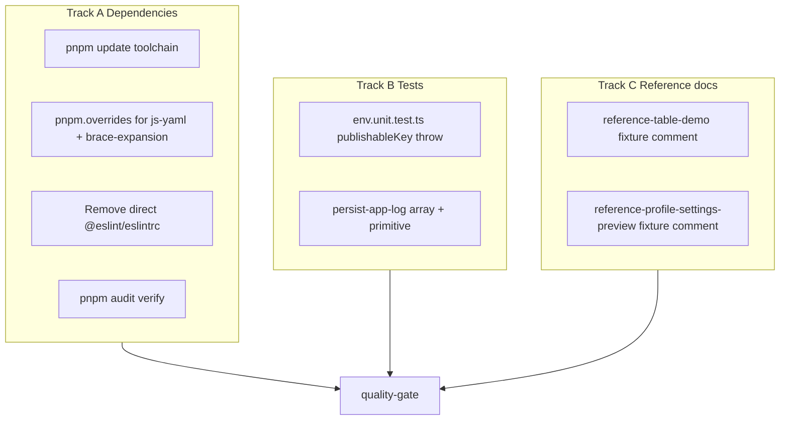

# Phase 14 Epic 6 — Hygiene & Drift

> **Track progress:** as you complete each step, update the corresponding `todos` entry's `status` to `completed` in this plan's frontmatter.

> **Precondition:** `git status --porcelain` must be empty before the first implementation edit. If dirty, halt and ask the user to commit or stash. The epic must land as a single commit containing only this epic's work — `code-review` derives its range from that commit.

**This epic is a good candidate for Build in Parallel.** Track A (dependency hygiene), Track B (test coverage), and Track C (reference demo docs) touch disjoint files; build the end state directly in each track, then verify once.

Branch `phase-14/tech-debt-hardening` is correct. Epics 1–5 are `Complete` per [phase-14-tech-debt-hardening.prd.md](docs/prds/phase-14-tech-debt-hardening.prd.md). **Epic 6 is the final epic in Phase 14** — after commit + `/code-review`, the phase is ready for `/ship-phase`.

## Context

Audit findings F081, F092, F079, F093, F090, F098 — all independent maintenance items with no ordering constraints beyond Epic 1's shared debounce hook (already consumed).

| Finding | Current state | Target |
| ------- | ------------- | ------ |
| F081 | `pnpm audit` reports 4 high-severity paths: `brace-expansion` (3 semver ranges) + `js-yaml@4.2.0` via ESLint/vitest toolchain | Patched transitive versions; audit clean for these two packages |
| F092 | `@eslint/eslintrc` is a **direct** devDependency in [package.json](package.json) but **never imported** in [eslint.config.mjs](eslint.config.mjs); eslint@9.39.2 already pulls it transitively | Remove direct dep; confirm lint still passes |
| F079 | [env.unit.test.ts](src/utils/env.unit.test.ts) covers missing URL throw but **not** missing publishable-key throw | Add symmetric test for the second branch |
| F093 | [persist-app-log.unit.test.ts](src/utils/persist-app-log.unit.test.ts) covers object + circular paths; array/primitive `{ value }` wrapper branches untested | Add two `normalizeLogContext` assertions |
| F090 | [reference-table-demo.tsx](src/app/(marketing)/reference/_components/reference-table-demo.tsx) **already uses** shared `useDebouncedValue` (Epic 1); client-side pagination is the remaining doc gap | Inline fixture comment only — **no debounce refactor** |
| F098 | [reference-profile-settings-preview.tsx](src/app/(marketing)/reference/_components/reference-profile-settings-preview.tsx) composes real profile subcomponents but has demo-only password form + [reference-demo-persist.ts](src/app/(marketing)/reference/_lib/reference-demo-persist.ts) stub | Inline fixture comment — **no restructure** |

**Hard constraints from PRD:**
- No re-implementation of either reference demo beyond documentation
- Real profile dialog is not restructured to serve the demo
- Reference table stays client-side paginated (sanctioned exception already in [data-tables.mdc](.cursor/rules/data-tables.mdc))



---

## Step 1 — Patch transitive CVEs (F081)

**Start:** run `pnpm audit` to capture baseline (expect 4 high on brace-expansion + js-yaml).

**Approach (escalate only as needed):**

1. **Toolchain bump first** — update devDependencies that own the vulnerable paths when semver-safe:
   - `eslint`, `eslint-config-next`, `@vitest/coverage-v8`, `@vitest/eslint-plugin`, `vitest`
   - Re-run `pnpm install` and `pnpm audit`

2. **Targeted overrides for anything still flagged** — add a `pnpm.overrides` block to [package.json](package.json) (precedent in archived [phase_1_epic_1a plan](.cursor/plans/archive/phase_1_epic_1a_foundation_cleanup.plan.md)):
   - `"js-yaml@4": "^4.3.0"` (closes GHSA-52cp-r559-cp3m; major-scoped so the override cannot force a js-yaml@3 consumer across the 3→4 breaking change)
   - `"brace-expansion"`: pin to patched versions per installed major — currently `1.1.14` → `>=1.1.16`, `2.1.1` → `>=2.1.2`, `5.0.6` → `>=5.0.7`. Use semver-specific override keys if a single pin breaks resolution (e.g. `"brace-expansion@2": "2.1.2"`, `"brace-expansion@5": "5.0.7"`, `"brace-expansion@1": "1.1.16"`)

3. **Verify:** `pnpm audit` must report **zero high** advisories on `brace-expansion` and `js-yaml`. Other advisories (e.g. `sharp` via Next image tooling) are **out of scope** for this epic.

4. **Regression:** `pnpm lint` and `pnpm test:ci` after lockfile change — dependency bumps can break vitest/eslint config.

---

## Step 2 — Remove orphaned `@eslint/eslintrc` (F092)

1. Confirm [eslint.config.mjs](eslint.config.mjs) uses flat config only (`defineConfig`, `eslint-config-next/core-web-vitals`) — no `FlatCompat` import.
2. Remove `"@eslint/eslintrc"` from `devDependencies` in [package.json](package.json).
3. Run `pnpm install` — eslint@9 still resolves `@eslint/eslintrc` transitively (verified via `pnpm why`).
4. Run `pnpm lint` — must pass unchanged.

**If removal breaks resolution** (unlikely): restore the dep and add a one-line comment in `package.json` or `eslint.config.mjs` explaining it is a peer-resolution shim — but removal is the expected outcome.

---

## Step 3 — Cover `getPublicSupabaseEnv` missing-key throw (F079)

In [src/utils/env.unit.test.ts](src/utils/env.unit.test.ts), inside the existing `describe('getPublicSupabaseEnv')` block, add a test mirroring the URL-missing case:

- Stub `NEXT_PUBLIC_SUPABASE_URL` to a valid URL
- Stub `NEXT_PUBLIC_SUPABASE_PUBLISHABLE_KEY` to empty string
- Assert `getPublicSupabaseEnv()` throws containing `[supabase-env] Missing NEXT_PUBLIC_SUPABASE_PUBLISHABLE_KEY`

Follow the existing dynamic-import + `vi.stubEnv` / `vi.resetModules` pattern used by the URL test.

---

## Step 4 — Cover `normalizeLogContext` array and primitive shapes (F093)

In [src/utils/persist-app-log.unit.test.ts](src/utils/persist-app-log.unit.test.ts), add tests against the exported `normalizeLogContext` helper (already imported in sibling tests):

| Input | Expected context |
| ----- | ---------------- |
| `['a', 'b']` (array) | `{ value: ['a', 'b'] }` |
| `'plain-string'` (primitive) | `{ value: 'plain-string' }` |

Optionally assert one numeric primitive (`42`) if a single string case feels thin — keep to 2 tests max per testing.mdc H/I/B discipline.

---

## Step 5 — Document reference table demo fixture (F090)

[reference-table-demo.tsx](src/app/(marketing)/reference/_components/reference-table-demo.tsx) already imports `useDebouncedValue` from `@/hooks/use-debounced-value` — **no hook migration needed**.

Add a concise file-level comment (after `'use client'`) documenting:
- This is an intentional showroom fixture over static sample data, not production admin behavior
- Client-side sort + pagination is the **sanctioned exception** per `data-tables.mdc` (no server to page against)
- Search debounce uses the shared hook from Epic 1

Do **not** convert to server-side paging or restructure the demo hook layer.

---

## Step 6 — Document reference profile settings fixture (F098)

Add a concise file-level comment in [reference-profile-settings-preview.tsx](src/app/(marketing)/reference/_components/reference-profile-settings-preview.tsx) documenting:
- **Real production pieces:** `ProfileAvatarField`, `ProfileThemeSegment`, `BlurSaveTextField`, `useBlurSaveField` — parity with the live profile dialog
- **Demo-only pieces:** local password accordion form (not wired to Supabase), `referenceDemoPersist` stub in [_lib/reference-demo-persist.ts](src/app/(marketing)/reference/_lib/reference-demo-persist.ts) (simulated delay, no DB write), read-only demo email
- Non-persisting saves on a public showroom page are **correct behavior**, not drift

Do **not** restructure the real profile dialog or extract shared password demo wiring.

---

## Out of scope (explicit)

- CSP enforcement (F053) — deferred per ROADMAP
- Hero screenshot (F085) — manual PM/design task
- `sharp` / libvips advisories surfaced by audit — not listed in Epic 6 PRD
- MSW removal (F072) — intentionally deferred per AGENTS.md
- AGENTS.md / TECH_DEBT_AUDIT sync — handled at `/ship-phase`, not this epic commit

---

### Verification

Quality bar — same commands as [WORKFLOW_GUIDE Step 5 exit condition](docs/WORKFLOW_GUIDE.md). Stop on failure:

```bash
pnpm type-check && pnpm lint && pnpm format-check && pnpm test:ci
```

Additionally confirm `pnpm audit` shows no high-severity `brace-expansion` or `js-yaml` paths.

### Commit epic

Authorized by this approved plan:

1. Review diff; stage only files in scope for this epic (implementation + this plan file).
2. Write a conventional commit message. It **must** end with an `Epic:` git trailer:

   ```
   chore(phase-14): hygiene sweep — deps, tests, reference fixture docs

   Epic: 14.6
   ```

3. Commit (request `git_write`). Pre-commit hook runs automatically — if it fails, **fix and retry the commit**.
4. Verify `git status --porcelain` is empty after commit.
5. Capture the epic baseline SHA — the commit's parent: `git rev-parse HEAD~1`. This is the range start `/code-review` uses against the epic commit.

**Do not push** — push remains `ship-phase`.

### Handoff

End the run by telling the user:

*"Epic 14.6 committed. Baseline SHA for `/code-review`: <sha>. Next: open a new agent window and run `/code-review`."*

Substitute the actual SHA from step 5. Pass nothing else.
