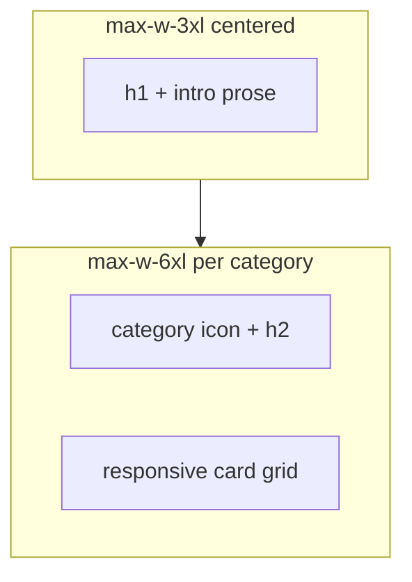

# Phase 15 Epic 1 — Features content source & `/features` page

> **Track progress:** as you complete each step, update the corresponding `todos` entry's `status` to `completed` in this plan's frontmatter.

> **Precondition:** confirm `git branch --show-current` outputs `phase-15/features-page-landing-refresh`. If it doesn't match, halt and ask the user — do not switch branches.

> **Precondition:** `git status --porcelain` must be empty before the first implementation edit. If dirty, halt and ask the user to commit or stash. The epic must land as a single commit containing only this epic's work — `code-review` derives its range from that commit.

Visual reference: [`.mockups/features_page_mockup.html`](.mockups/features_page_mockup.html) — intro width, category headings, card grid rhythm, and conditional "See it live" links. **Do not ship mockup copy verbatim** — re-derive names and blurbs from [AGENTS.md](AGENTS.md) § Implemented now — do not lift mockup copy.

**Scope boundary:** Epic 2 owns the home highlight reel, "See all features" CTA, and nav repoint. Leave [`landing-content.ts`](src/config/landing-content.ts) and [`site.ts`](src/config/site.ts) nav unchanged in this epic — the home grid remains a valid consumer until Epic 2 migrates it.

**Sequential build** — content source, page, and auth boundary are one landing surface; no parallel split.

---

## Step 1 — Features content source (Story 1.1)

**New file:** [`src/config/features-content.ts`](src/config/features-content.ts)

Define a single exported taxonomy the rest of the phase will share:

| Field | Purpose |
| ----- | ------- |
| Category | `name`, category `icon` (Lucide), stable `id`, ordered `capabilities[]` |
| Capability | `name`, one-line `blurb`, `icon`, optional `referenceAnchor`, optional `homeHighlight: true` |

**Reference demo links:** reuse existing `/reference` section ids only — `design-system`, `forms`, `feedback`, `toast`, `table` (today defined in [`reference-anchor-links.ts`](src/app/(marketing)/reference/_lib/reference-anchor-links.ts)). Type anchor ids as a string-literal union in the config file; do **not** import from route `_lib` into `src/config/`.

**Home highlight flag:** mark exactly **six** capabilities with `homeHighlight: true`, aligned with the themes of today's home grid (design tokens, primitives, a11y, admin shell, agent conventions, collaboration model). Epic 2 will consume this flag; Epic 1 only defines it.

**Category inventory:** the locked set of seven categories is auth, admin console, design system, observability, SEO/GEO, PM & agent workflow, site content/config. Rewrite every card name/blurb from AGENTS.md truth. Capabilities without a live demo omit `referenceAnchor` entirely — no placeholder links.

**Guard test:** [`src/config/features-content.unit.test.ts`](src/config/features-content.unit.test.ts) must assert (a) every `referenceAnchor` matches a `REFERENCE_ANCHOR_LINKS` id, and (b) exactly six `homeHighlight` entries.

---

## Step 2 — `/features` page shell & SEO (Story 1.2)

**Path constant** in [`src/constants/app-paths.ts`](src/constants/app-paths.ts):

- `FEATURES_PATH = '/features' as const`

**Route** under [`src/app/(marketing)/features/`](src/app/(marketing)/features/):

- [`page.tsx`](src/app/(marketing)/features/page.tsx) — server component; one `<h1>`; exports `metadata` (title ~"Features" / inventory framing, description, `alternates.canonical: FEATURES_PATH`)
- [`opengraph-image.tsx`](src/app/(marketing)/features/opengraph-image.tsx) — mirror the [`terms/opengraph-image.tsx`](src/app/(marketing)/terms/opengraph-image.tsx) pattern

Sitemap needs no manual edit — [`discoverMarketingRoutes()`](src/utils/discover-app-routes.ts) auto-includes new `(marketing)` pages.

**Page layout** (two-tier width — match home/reference):



**Components** in `features/_components/`:

- Category section — heading row (icon + `h2`) + grid wrapper
- Capability card — icon, name, blurb; **"See it live →"** link to `${REFERENCE_PATH}#${referenceAnchor}` only when `referenceAnchor` is set — match the ArrowRight affordance used by [`landing-feature-item.tsx`](src/app/(marketing)/_components/landing-feature-item.tsx); replicate the markup in the new card component; do not import `LandingFeatureItem` or any part of it, so Epic 2's home-grid changes cannot affect `/features`.

Use semantic tokens and existing chrome ([`SiteContainer`](src/components/site-container.tsx), [`Badge`](src/components/ui/badge.tsx) if useful). Cards can use shadcn `Card` or bordered `bg-card` divs — match reference/home marketing density, not mockup hex colors.

**Intro copy** (tone from mockup, words from inventory framing in PRD): evaluator-facing — "everything in the box" inventory, not product marketing. Prose at narrow width; grids widen below.

---

## Step 3 — Public auth boundary (Story 1.3)

Hard-constraint change — update enforcement and docs together ([change protocol](AGENTS.md#change-protocol)):

| File | Change |
| ---- | ------ |
| [`src/supabase/proxy.ts`](src/supabase/proxy.ts) | Add `pathname === FEATURES_PATH` to `isPublicRoute` |
| [`src/supabase/proxy.unit.test.ts`](src/supabase/proxy.unit.test.ts) | Add `'/features'` to `PUBLIC_EXACT` in `isDiscoveredPublicRoute` — discovered-route matrix auto-asserts public access |
| [`AGENTS.md`](AGENTS.md) | Update every place the public-route list appears — the Hard constraints auth-boundary bullet, the Auth & session dev-mode passthrough sentence, and the `(marketing)` row in Where things live — to include `/features`. Grep AGENTS.md for `/workflow` to find them all. |
| [`LEXICON.md`](LEXICON.md) | Update [Auth boundary](LEXICON.md) allowlist sentence |
| [`.cursor/rules/security.mdc`](.cursor/rules/security.mdc) | Update public-routes sentence |
| [`.cursor/rules/supabase.mdc`](.cursor/rules/supabase.mdc) | Update public-routes sentence |

---

## Step 4 — LEXICON site config close-out (PRD Notes)

One-line amendment to [LEXICON.md § Site config](LEXICON.md): name [`features-content.ts`](src/config/features-content.ts) alongside [`landing-content.ts`](src/config/landing-content.ts) as the capability-inventory re-skin surface.

---

## Epic success verification (manual smoke)

After quality gate, spot-check:

- `/features` renders all categories and cards from the content source
- Cards with demos show "See it live" → correct `/reference#…` anchor; all other cards have **no** link
- Intro prose is narrow; card grids are wider (compare to `/` features section and `/reference`)
- Signed-out visit to `/features` returns 200 (no login redirect)
- `pnpm check:auth-boundary` passes

**Out of scope for this epic:** home grid copy/CTA changes, nav Features href change (still `/#features` in [`site.ts`](src/config/site.ts)).

---

### Verification

Full CI mirror required for this epic because it adds a new public route and changes the auth boundary. Stop on failure:

```bash
pnpm pre-push
```

### Commit epic

Authorized by this approved plan:

1. Review diff; stage only files in scope for this epic.
2. Write a conventional commit message (`feat`/`fix`/`docs`/etc.). It **must** end with an `Epic:` git trailer — this is the only thing `code-review` uses to find the commit:

   ```
   feat(phase-15): features content source and public features page

   Epic: 15.1
   ```

   Format is `Epic: {phase}.{id}` — phase number as written in ROADMAP (decimals OK: `7.5`), epic id as written (`1`, `1A`). Blank line before the trailer, nothing after it. Exactly one commit in the repo may carry a given `Epic:` value.
3. Commit (request `git_write`). Pre-commit hook runs automatically — if it fails, **fix and retry the commit** (a failed pre-commit hook aborts the commit, so there is nothing to amend).
4. Verify `git status --porcelain` is empty after commit.

**Do not push** — push remains `ship-phase`.

### Handoff

Epic 15.1 committed. Next: open a new agent window and run `/code-review`.
