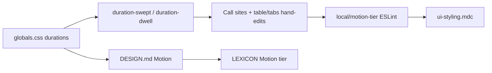

# Phase 16 Epic 1 — Motion tier system

> **Track progress:** as you complete each step, update the corresponding `todos` entry's `status` to `completed` in this plan's frontmatter.

> **Precondition:** confirm `git branch --show-current` outputs `phase-16/motion-system-table-fetch-feedback`. If it doesn't match, halt and ask the user — do not switch branches.

> **Precondition:** `git status --porcelain` must be empty before the first implementation edit. If dirty, halt and ask the user to commit or stash. The epic must land as a single commit containing only this epic's work — `code-review` derives its range from that commit.

> **Baseline:** before the first implementation edit, run `git rev-parse HEAD`, record the SHA in the plan run, and carry it to the handoff message.

## Scope

Stories **1.1** (tokens + docs) and **1.2** (migrate call sites + ESLint + authoring rule) ship together as one end state. No interim wiring.

**Chosen duration values** (per PRD story 1.1):
- **Swept:** `150ms` — bulk-swept surfaces (nav, rows, tiles, links)
- **Dwell:** `300ms` — one-at-a-time surfaces (`MarketingDisplayCard` only today)

Utility names: `duration-swept` / `duration-dwell` via Tailwind v4 `--duration-*` theme keys.

---

## 1. Tokens in `globals.css`

In [`src/app/globals.css`](src/app/globals.css), declare each token **exactly once** with a literal value in the `@theme inline` block (after `--spacing`, before `--animate-*`):

```css
--duration-swept: 150ms;
--duration-dwell: 300ms;
```

Do **not** add a `:root` entry and do **not** add a bridge line that references the same name via `var(...)`.

Confirm `duration-swept` / `duration-dwell` resolve in a class string (dev server or a quick CSS inspect) before migrating call sites.

---

## 2. Docs — DESIGN.md + LEXICON.md

**[`DESIGN.md`](DESIGN.md)**
- Add `### Motion` under Token groups, after Spacing.
- Cover: traversal-rate principle; Swept vs Dwell coverage; scope boundary (state transitions on persistent elements only — not enter/exit or layout); rationale for excluding `src/components/ui/` from ongoing lint; utility names only (no ms values in the doc).
- Update Token architecture bridge inventory and Structure vs theme bullets to include duration tokens.
- Cross-link LEXICON “Motion tier”.

**[`LEXICON.md`](LEXICON.md)**
- Add Contents link + `### Motion tier` entry: one–two sentences on the principle and tiers; pointer to DESIGN.md Motion as canonical home; no values.

---

## 3. Migrate call sites

**Dwell (only):**
- [`src/components/marketing-display-card.tsx`](src/components/marketing-display-card.tsx) — add `duration-dwell` next to `transition-colors`

**Swept — outside `src/components/ui/`** (re-enumerate with a search at build time; current inventory):

| File | Notes |
|------|--------|
| [`site-nav-links.tsx`](src/components/site-nav-links.tsx) | `linkBaseStyles` |
| [`site-footer.tsx`](src/components/site-footer.tsx) | social + legal links |
| [`stat-tile.tsx`](src/components/stat-tile.tsx) | cva base |
| [`landing-features.tsx`](src/app/(marketing)/_components/landing-features.tsx) | “See all features” link |
| [`feature-capability-card.tsx`](src/app/(marketing)/features/_components/feature-capability-card.tsx) | reference link |
| [`admin/page.tsx`](src/app/admin/page.tsx) | three dashboard cards |
| [`logs-table.tsx`](src/app/admin/logs/_components/logs-table.tsx) | fetch-dim opacity |
| [`users-table.tsx`](src/app/admin/users/_components/users-table.tsx) | fetch-dim opacity |
| [`banner-starts-at-field.tsx`](src/app/admin/settings/_components/banner-starts-at-field.tsx) | input-like trigger |

**Out of scope — disable, do not tier:**
- [`admin-shell.tsx`](src/app/admin/_components/admin-shell.tsx) — header `transition-[width,height]` is a layout transition. Leave the classes as-is; add `eslint-disable-next-line local/motion-tier` with comment: `layout transition — out of scope per Phase 16 PRD`.

**Swept — one-time hand-edits inside lint-excluded `ui/` (PRD exceptions only):**
- [`src/components/ui/table.tsx`](src/components/ui/table.tsx) — `TableRow`: add `duration-swept`
- [`src/components/ui/tabs.tsx`](src/components/ui/tabs.tsx) — trigger: `duration-swept`; line indicator: `after:duration-swept` next to `after:transition-opacity`

At every in-scope call site, if the class string already carries a numeric duration utility (e.g. `duration-200`), **remove it** when adding the tier utility. Never leave two transition-duration utilities in one string.

Do **not** retune other `ui/` transitions (accordion, sheet, sidebar layout, etc.) — out of scope.

Leave existing non-token `duration-200` / enter-exit animation durations in vendored UI alone (those files are lint-excluded and not in the hand-edit list).

---

## 4. ESLint rule `local/motion-tier`

New [`eslint-rules/motion-tier.mjs`](eslint-rules/motion-tier.mjs), modeled on [`eslint-rules/semantic-tokens.mjs`](eslint-rules/semantic-tokens.mjs):

- Scan `className` / `class`, `cva()`, and `cn()` from `@/utils/tailwind` the same way.
- If a class string contains a `transition` / `transition-*` utility, require the same string also contains `duration-swept` or `duration-dwell` (variant-prefixed forms like `after:duration-swept` count).
- **Exempt** from the tier requirement: `transition-none`, `transition-discrete`, and `transition-normal` (including variant-prefixed forms).
- Same known limitation as semantic-tokens: no cross-file identifier resolution.

Register `local/motion-tier` in **its own** config block in [`eslint.config.mjs`](eslint.config.mjs) — not the block that holds semantic-tokens. Same `files: ['src/**/*.{ts,tsx}']` and `ignores: ['src/components/ui/**']`. Not a hard constraint — no new `check:*` script or AGENTS.md entry.

**Tests** in [`eslint.config.unit.test.ts`](eslint.config.unit.test.ts) — use ESLint `lintText()` with synthetic `filePath` values. **Do not** add any fixture files.

1. **Fail:** `filePath: 'src/components/motion-tier-fail.tsx'`, class string with bare `transition-colors` → reports `local/motion-tier`
2. **Ignore:** `filePath: 'src/components/ui/motion-tier-ignored.tsx'`, same bare string → does not report
3. **Pass:** `filePath: 'src/components/motion-tier-pass.tsx'`, class string with `transition-colors duration-swept` → does not report

---

## 5. Authoring standard

Add a **Motion tiers** section to [`.cursor/rules/ui-styling.mdc`](.cursor/rules/ui-styling.mdc) (mirror of Semantic Tokens — same auto-attach globs; do not create a separate rule file):
- Duration follows traversal rate; use `duration-swept` / `duration-dwell` with every `transition-*` outside `src/components/ui/`
- Point to DESIGN.md Motion + LEXICON
- Note the `src/components/ui/` exclusion and the two deliberate one-time hand-edits (`table.tsx`, `tabs.tsx`).
- Document the layout-transition carve-out: transitions that animate layout (width, height, position) rather than element state are out of scope for the tier system. Take the carve-out with an `eslint-disable-next-line local/motion-tier` plus a comment naming the reason; cite `admin-shell.tsx`'s header transition as the reference example.

Update the `ui-styling.mdc` row blurb in [`.cursor/rules/README.md`](.cursor/rules/README.md) to mention motion tiers.

---

## 6. Verify migration

`pnpm lint` green is the proof every in-scope call site was migrated. Re-grep `transition` under `src/` excluding `components/ui/` if anything slips past the rule (shared constants, template edge cases).



### Verification

Quality bar — stop on failure:

```bash
pnpm type-check && pnpm lint && pnpm format-check && pnpm test:ci
```

Also run `pnpm pre-push` once before commit (PRD success criterion).

### Commit epic

Authorized by this approved plan:

1. **Before the first implementation edit**, capture baseline: `git rev-parse HEAD`. Record the SHA in the plan run and carry it to the handoff.
2. Review diff; stage only files in scope for this epic.
3. Conventional commit with `Epic:` trailer:

   ```
   feat(phase-16): motion duration tokens and tier enforcement

   Epic: 16.1
   ```

4. Commit (request `git_write`). If pre-commit fails, fix and retry — do not amend.
5. Verify `git status --porcelain` is empty after commit.

**Do not push.**

### Handoff

End the run by telling the user:

*"Epic 16.1 committed. Baseline SHA: \<sha\>. Next: open a new agent window and run `/code-review`."*
