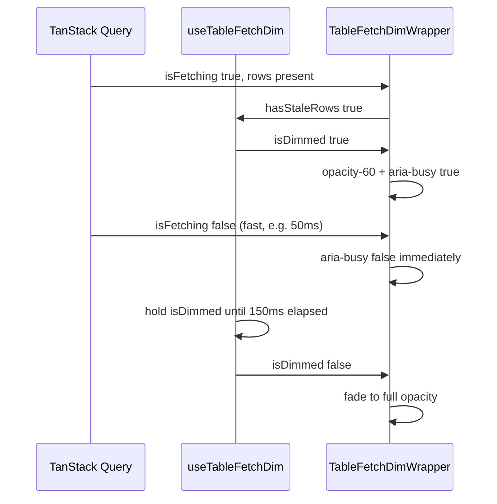

# Phase 16 Epic 2 — Table refetch dim feedback

> **Track progress:** as you complete each step, update the corresponding `todos` entry's `status` to `completed` in this plan's frontmatter.

> **Precondition:** `git status --porcelain` must be empty before the first implementation edit. If dirty, halt and ask the user to commit or stash. The epic must land as a single commit containing only this epic's work — `code-review` derives its range from that commit.

## Scope

Story **2.1** ships as one end state: shared dim logic, both tables migrated, unit tests, no duplicated wrapper code in either table file.

**Current duplication** (identical in both tables):

```113:118:src/app/admin/logs/_components/logs-table.tsx
      <div
        aria-busy={isFetching}
        className={cn(
          'duration-swept transition-opacity',
          isFetching && rows.length > 0 && 'opacity-60',
        )}
```

Same pattern in [`users-table.tsx`](src/app/admin/users/_components/users-table.tsx) lines 104–109.

**Problem:** dim toggles strictly with `isFetching`. A fetch resolving in &lt;150ms reverses `opacity-60` mid-transition (`duration-swept`), causing flicker.

**Fix:** decouple **visual dim** (minimum hold = transition duration) from **fetch state** (`aria-busy` stays on `isFetching` only).



---

## 1. Shared hook — `useTableFetchDim`

Add [`src/hooks/use-table-fetch-dim.ts`](src/hooks/use-table-fetch-dim.ts):

- Export `TABLE_FETCH_DIM_MIN_MS = 150` with a comment tying it to the `--duration-swept` token in [`globals.css`](src/app/globals.css) by name only.
- Signature: `useTableFetchDim(isFetching: boolean, hasStaleRows: boolean): boolean` → returns `isDimmed`.
- **Dim on:** `isFetching && hasStaleRows` → set dimmed immediately; record start timestamp.
- **Dim off:** when `isFetching` becomes false after a dim cycle started, schedule release after `max(0, MIN_MS - elapsed)` — do not delay data; only the opacity class persists.
- **Re-fetch during hold:** if `isFetching` goes true again while a release timer is pending, cancel timer, reset start time, stay dimmed.
- **No dim on initial load:** when `hasStaleRows` is false, never set dimmed (preserves current behavior).
- Cleanup timeouts on unmount / effect re-run (follow [`use-debounced-value.unit.test.ts`](src/hooks/use-debounced-value.unit.test.ts) fake-timer patterns).

---

## 2. Shared wrapper — `TableFetchDimWrapper`

Add [`src/components/table-fetch-dim-wrapper.tsx`](src/components/table-fetch-dim-wrapper.tsx):

- Props: `isFetching`, `hasStaleRows`, `children`.
- Calls `useTableFetchDim(isFetching, hasStaleRows)`.
- Renders the wrapper `div` with:
  - `aria-busy={isFetching}` — **never** the visual hold state (PRD requirement).
  - `className={cn('duration-swept transition-opacity', isDimmed && 'opacity-60')}`.
- Client component (`'use client'`) since the hook uses `useEffect`.

This removes all dim wrapper markup from both table files.

---

## 3. Wire both admin tables

Replace the inline wrapper `div` in:

- [`src/app/admin/logs/_components/logs-table.tsx`](src/app/admin/logs/_components/logs-table.tsx)
- [`src/app/admin/users/_components/users-table.tsx`](src/app/admin/users/_components/users-table.tsx)

With:

```tsx
<TableFetchDimWrapper isFetching={isFetching} hasStaleRows={rows.length > 0}>
  <DataTableShell … />
</TableFetchDimWrapper>
```

Remove now-unused `cn` import from each file if nothing else uses it.

**Unchanged:** `DataTablePaginationControls` `isPending={isFetching}`, toolbar refresh spinners, skeleton-on-empty behavior — only the table-body dim wrapper changes.

---

## 4. Unit tests

Add [`src/hooks/use-table-fetch-dim.unit.test.ts`](src/hooks/use-table-fetch-dim.unit.test.ts) with `vi.useFakeTimers()` / `vi.useRealTimers()` (mirror [`use-debounced-value.unit.test.ts`](src/hooks/use-debounced-value.unit.test.ts)):

| Case | Assert |
|------|--------|
| No stale rows | `isFetching` true + `hasStaleRows` false → `isDimmed` stays false |
| Normal refetch | `isFetching` true + `hasStaleRows` true → `isDimmed` true |
| **PRD core** | Fetch ends at 50ms → `isDimmed` still true until 150ms from dim start, then false |
| Slow fetch | Fetch ends at 200ms → `isDimmed` clears immediately when fetch ends (0ms remaining hold) |

Add [`src/components/table-fetch-dim-wrapper.unit.test.tsx`](src/components/table-fetch-dim-wrapper.unit.test.tsx) — one focused test for the a11y split:

- Simulate a fetch cycle via prop changes + fake timers.
- Assert `aria-busy` becomes `"false"` as soon as `isFetching` is false, independent of any hold timer (use `toHaveAttribute('aria-busy', 'false')`).

Do **not** add `toHaveClass` assertions.

---

## 5. Update data-table authoring rule

One-line addition to the Loading Pattern bullet in [`.cursor/rules/data-tables.mdc`](.cursor/rules/data-tables.mdc):

- Visual dim uses [`TableFetchDimWrapper`](src/components/table-fetch-dim-wrapper.tsx) with a minimum hold matching `duration-swept` so fast refetches complete a full fade cycle; `aria-busy` reflects actual fetch state only.

The AGENTS.md **Implemented now** entry for the shared dim behavior and the new `TableFetchDimWrapper` component is deferred to the phase-level `/sync-repo-docs` pass. No README or env changes are needed.

---

## Verification

Quality bar — stop on failure:

```bash
pnpm type-check && pnpm lint && pnpm format-check && pnpm test:ci
```

Also run `pnpm pre-push` once before commit (PRD success criterion).

### Commit epic

Authorized by this approved plan:

1. Review diff; stage only files in scope for this epic.
2. Conventional commit with `Epic:` trailer:

   ```
   feat(phase-16): shared table refetch dim with minimum hold

   Epic: 16.2
   ```

3. Commit (request `git_write`). If pre-commit fails, fix and retry — do not amend.
4. Verify `git status --porcelain` is empty after commit.
5. Capture the epic baseline SHA: run `git rev-parse HEAD` and record the output for the handoff message.

**Do not push.**

### Handoff

End the run by telling the user:

*"Epic 16.2 committed. Baseline SHA: \<sha\>. Next: open a new agent window and run `/code-review`."*
