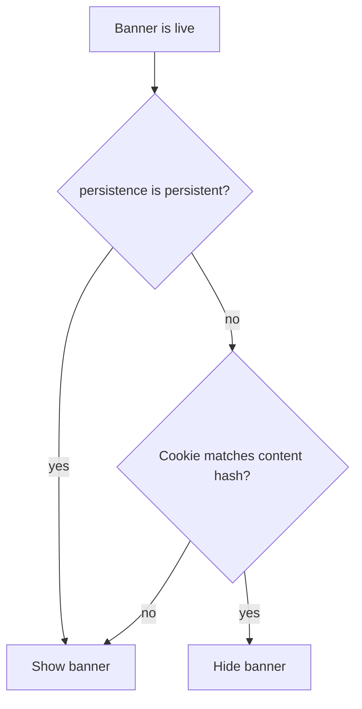

# Phase 18 Epic 2 — Persistence as a banner setting

> **Track progress:** as you complete each step, update the corresponding `todos` entry's `status` to `completed` in this plan's frontmatter.

> **Precondition:** `git status --porcelain` must be empty before the first implementation edit. If dirty, halt and ask the user to commit or stash. The epic must land as a single commit containing only this epic's work — `code-review` derives its range from that commit.

Work continues on `phase-18/banner-persistence-dismissal`. No migration — banner values are JSON in the existing `app_settings.value` column, and the PRD forbids a backfill because cloned spinoff databases will never run one.

**Do not pin.** Choosing `persistent` in this epic correctly removes the dismiss control and ignores stored dismissal. The banner still scrolls away until Epic 3. Help copy may say "stay in view" (the finished product); do not add "coming soon" language.

## What exists

Banner settings are a typed JSON object ([`src/types/banner.ts`](src/types/banner.ts)) validated by [`src/utils/banner-settings-schema.ts`](src/utils/banner-settings-schema.ts). Load goes through `parseBannerSettingValue` → `parseAppSettingValue` → `resolveAppSettings`. A parse failure **throws**, so a required new field would break every banner already stored without it.

The admin form is [`src/app/admin/settings/_components/banner-setting-row.tsx`](src/app/admin/settings/_components/banner-setting-row.tsx): variant select + show-icon checkbox, per-section Save, live [`AppBanner`](src/components/app-banner.tsx) preview. Preview currently hides dismiss chrome (`showDismiss` is false whenever `preview` is true).

Live slots ([`public-banner-slot.tsx`](src/components/public-banner-slot.tsx), [`authenticated-banner-slot.tsx`](src/components/authenticated-banner-slot.tsx)) always pass `dismissible` into `AppBanner`. [`resolveLiveBannerSlot`](src/utils/banner-dismiss-cookie.ts) hides a live banner whenever the cookie matches the content hash, with no persistence check.



## 1. Add persistence to the setting shape

In [`src/types/banner.ts`](src/types/banner.ts):

- Add `BANNER_PERSISTENCES = ['dismissible', 'persistent']` next to the existing variant/mode lists.
- Add `persistence` to `BannerSettingValue`.
- Set `DEFAULT_BANNER_SETTING.persistence` to `dismissible` so shipping is a no-op until an admin opts in.

In [`src/utils/banner-settings-schema.ts`](src/utils/banner-settings-schema.ts):

- Stored schema: `persistence` is `z.enum(BANNER_PERSISTENCES).default('dismissible')` so a missing key loads, an invalid value fails (same as every other field). Do not use `.strict()` — extra keys are already stripped.
- Form schema, `bannerValueToFormValues`, `formValuesToBannerValue`, and `bannerSettingValuesEqual` all include `persistence`. A persistence-only edit must enable Save.

No new helper for `config.persistence === 'dismissible'` — three call sites can say it.

## 2. Admin control, preview, and features copy

In [`banner-setting-row.tsx`](src/app/admin/settings/_components/banner-setting-row.tsx), add a Persistence control immediately after the variant / show-icon row — same form, same Save. Use a two-item ToggleGroup (`Dismissible` / `Persistent`) to match Mode, not a checkbox. Help copy under the control: persistent banners stay in view and cannot be dismissed, and are for messages a user can't afford to miss.

Preview must show the dismiss control appear and disappear as the draft persistence changes. Today [`AppBanner`](src/components/app-banner.tsx) hides dismiss in preview. Change that:

- Drop the `dismissible` prop. Dismissibility comes from `config.persistence`.
- Show the dismiss button when persistence is `dismissible` — including in preview.
- In preview the button is inert but visually identical to live — `pointer-events-none` + `aria-hidden` + `tabIndex={-1}`, not `disabled`. A `disabled` button renders at reduced opacity, which would make the preview misrepresent the live banner. Live banners still need `onDismiss` to actually close.

Update the Banners admin blurb in [`src/config/features-content.ts`](src/config/features-content.ts) so persistence is named among what an admin can configure. Leave the Public banners capability alone.

## 3. Live banners honor persistence

[`resolveLiveBannerSlot`](src/utils/banner-dismiss-cookie.ts): skip the cookie match when `persistence === 'persistent'`. Still return `dismissKey` — slots use it as a remount key. A banner switched to persistent therefore reappears even though its headline/detail (and cookie) have not changed. Switching back honors the same cookie again.

Both slots: stop passing hardcoded `dismissible`. Keep passing `onDismiss`; `AppBanner` ignores it when persistent. Do not write a cookie when there is no dismiss control.

Do not change cookie names, hash, sign-out clearing, or layout/pinning.

## 4. Tests

Minimum that locks the success criteria — do not add a test per field permutation.

- [`banner-settings-schema.unit.test.ts`](src/utils/banner-settings-schema.unit.test.ts): object without `persistence` parses as `dismissible`; `persistent` is accepted; an invalid value is rejected.
- [`app-settings.unit.test.ts`](src/utils/app-settings.unit.test.ts): one stored banner row that omits `persistence` resolves without throwing and equals the defaulted dismissible object. This is the "old row loads" path — `resolveAppSettings` throws on parse failure.
- [`banner-setting-row.integration.test.tsx`](src/app/admin/settings/_components/banner-setting-row.integration.test.tsx): help copy is visible; choosing Persistent removes the preview dismiss button; Save sends `persistence: 'persistent'`.
- [`app-banner.unit.test.tsx`](src/components/app-banner.unit.test.tsx): this file is the one place where the dropped `dismissible` prop and the new default-visible dismiss button both bite — reconcile the whole file, not one case.
  - Two tests pass `dismissible` today and will no longer type-check: "should call onDismiss when the dismiss button is clicked" and "should not render dismiss chrome in preview mode". Both need the prop removed and a `config.persistence` value supplied instead.
  - Four tests render without the prop and previously got no dismiss button; each now shows one whenever its config resolves to `dismissible`. Check every assertion in the file against the new behavior, not just the two above.
  - Replace "should not render dismiss chrome in preview mode" with: preview + dismissible shows the button, preview + persistent does not, live + persistent does not even when `onDismiss` is passed.
- [`banner-dismiss-cookie.unit.test.ts`](src/utils/banner-dismiss-cookie.unit.test.ts): persistent config with a matching cookie still resolves to a visible slot; dismissible + matching cookie still returns null.
- One case on each slot test file: persistent config renders the banner with no dismiss button.

Existing default-spreading tests keep working because `DEFAULT_BANNER_SETTING` becomes dismissible. Do not add a features-content assertion for the blurb — that file's tests only check anchors and home highlights.

## Verification

Manual check first — `resolveLiveBannerSlot` is unit-tested (§ 4), but nothing covers the server component wiring the cookie read into it.

Steps 1–3 use **one** banner. Leave the other banner untouched for the whole run — step 4 depends on a stored value that was never re-saved, which no longer exists once a banner is saved.

1. Set one banner to Persistent, save, reload `/admin/settings` — the choice is still Persistent; preview has no X.
2. With that banner live, visit the matching surface — no dismiss control.
3. Set it back to Dismissible, dismiss it, reload — it stays gone. Switch to Persistent without changing copy — it comes back. Switch to Dismissible again — it stays gone.
4. On the banner never saved during steps 1–3: it still loads and behaves as Dismissible.

Then the quality bar — [AGENTS.md § Agent workflow](AGENTS.md#agent-workflow) step 3. Stop on failure:

```bash
pnpm pre-push
```

## Commit epic

Authorized by this approved plan:

1. Review diff; stage only files in scope for this epic.
2. Write a conventional commit message. It **must** end with an `Epic:` git trailer — this is the only thing `code-review` uses to find the commit:

   ```
   feat(phase-18): per-banner persistence setting

   Epic: 18.2
   ```

   Format is `Epic: {phase}.{id}` — phase number as written in ROADMAP, epic id as written. Blank line before the trailer, nothing after it. Exactly one commit in the repo may carry a given `Epic:` value.
3. Commit (request `git_write`). Pre-commit hook runs automatically — if it fails, **fix and retry the commit** (a failed pre-commit hook aborts the commit, so there is nothing to amend).
4. Verify `git status --porcelain` is empty after commit.

**Do not push** — push remains `ship-phase`.

### Handoff

End the run by telling the user:

*"Epic committed. Next: open a new agent window and run `/code-review`."*

Pass nothing else. `code-review` resolves the epic, its commit, and the baseline from the PRD and git.
