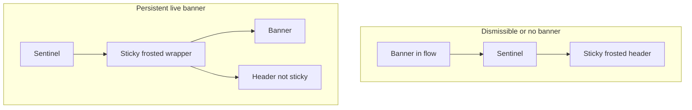

# Phase 18 Epic 3 — Pinned Rendering

> **Track progress:** as you complete each step, update the corresponding `todos` entry's `status` to `completed` in this plan's frontmatter.

> **Precondition:** `git status --porcelain` must be empty before the first implementation edit. If dirty, halt and ask the user to commit or stash. The epic must land as a single commit containing only this epic's work — `code-review` derives its range from that commit.

Work continues on `phase-18/banner-persistence-dismissal`. Pinning is layout only — do not change persistence storage, dismiss cookies, admin preview, features copy, or in-page anchor offsets (`scroll-pt-20`, `scroll-mt-24`).

**Known limitation, accepted for this epic.** Those anchor offsets assume header height alone, so while a persistent banner is pinned, an in-page anchor target (e.g. `/#features`) lands behind the pinned strip by roughly the banner's height. Correcting it requires measuring banner height — the approach this epic exists to avoid — and a larger fixed offset would over-offset the far more common no-banner case. Leave the offsets as they are.

**Do not pin the banner and header as two sticky elements.** Banner height varies with detail copy and mobile wrapping; a separately-pinned banner would need a measured offset. One sticky wrapper around both.

## What exists

Both surfaces already stack a live banner above a shared sticky header, with no wrapper:

- Marketing: [`marketing-top-stack.tsx`](src/app/(marketing)/_components/marketing-top-stack.tsx) renders the public slot, then [`LandingHeader`](src/app/(marketing)/_components/landing-header.tsx)
- Authenticated: [`(app)/layout.tsx`](src/app/(app)/layout.tsx) renders the authenticated slot, then [`AppShell`](src/app/(app)/_components/app-shell.tsx) (header is inside the shell)

[`SiteHeaderChrome`](src/components/site-header-chrome.tsx) owns the current pin and frost: a 1px sentinel, then `<header class="sticky top-0 z-50">` whose border/backdrop switch when [`useScrolled`](src/hooks/use-scrolled.ts) sees the sentinel leave the viewport. An earlier change **removed** a sticky wrapper around banner + header because a sentinel *inside* that wrapper can never leave the viewport, so frost never appears. This epic brings the wrapper back only when the live banner is `persistent`, and puts the sentinel **above** it.

Epic 2 already decides dismiss chrome and cookie ignore from `config.persistence`. It does not change layout. A `persistent` banner still scrolls away until this epic.



## 1. Pin in header chrome

Extend [`SiteHeaderChrome`](src/components/site-header-chrome.tsx) with optional `banner` and `pin`. [`SiteHeader`](src/components/site-header.tsx) passes both through. The banner stays a sibling of `<header>`, never inside it.

- **`pin` is false** (default, and the dismissible path): render `banner` (if any), then the current sentinel + sticky frosted header. Document order and frost timing stay as they are today.
- **`pin` is true:** render the sentinel first, then one `sticky top-0 z-50` wrapper that holds the banner and the header. Move the existing frost classes (`border-b`, rest vs scrolled background/blur, `duration-swept`) onto that wrapper — the combined surface, as the PRD calls out. The inner `<header>` is not sticky and does not apply its own frost or reserved hairline (the wrapper owns that edge).

Make `pin` and `sticky={false}` unrepresentable together in `SiteHeaderChrome`'s prop type rather than resolving the conflict at runtime — a caller passing both should fail type-check, not be silently overridden.

No gap, padding, or extra border between banner and header — the banner's existing `border-b` is the join. No CSS variables, no height measurement, no `sticky` on [`AppBanner`](src/components/app-banner.tsx).

Reuse the same frost class pair already on the header; do not invent a second treatment.

## 2. Wire both surfaces from one slot resolution

`pin` must match the banner that actually mounts. Compute it from the same `resolveLiveBannerSlot` result the slots already use: `pin` is true only when that result is non-null and `persistence === 'persistent'`. Do not derive pin from settings alone — a scheduled banner's live state is request-time, and a dismissed dismissible banner must not pin.

Turn each slot entry into a small async loader that returns `{ banner, pin }` instead of only the slot node:

- [`public-banner-slot-entry.tsx`](src/components/public-banner-slot-entry.tsx)
- [`authenticated-banner-slot-entry.tsx`](src/components/authenticated-banner-slot-entry.tsx) (keep `connection()`)

Then:

- [`MarketingTopStack`](src/app/(marketing)/_components/marketing-top-stack.tsx) becomes async, loads the public slot, and passes `banner` + `pin` into [`LandingHeader`](src/app/(marketing)/_components/landing-header.tsx) → `SiteHeader`. Do not wrap it in `Suspense` — render it awaited.
- [`(app)/layout.tsx`](src/app/(app)/layout.tsx) loads the authenticated slot and passes `banner` + `pin` into `AppShell` → `SiteHeader`. Drop the banner sibling that currently sits outside the shell. Resolve the slot **in parallel** with the layout's existing auth await (`Promise.all`), never sequentially after it.

Both surfaces await slot resolution before rendering the header, by design. `pin` determines the header's own layout, so there is nothing to stream around it — a `Suspense` fallback would paint an unpinned header and then insert the banner above it after paint. This is not the parent-awaits-child waterfall that `nextjs.mdc` § Avoiding Data-Fetching Waterfalls warns against; the parallelism requirement above is what that rule asks for here.

Do not merge the two slot components. Do not change cookie names, hash, sign-out clearing, or `resolveLiveBannerSlot`.

## 3. Tests

Pinning is CSS, and tests must not assert classes. Lock composition, not stickiness:

- [`site-header.unit.test.tsx`](src/components/site-header.unit.test.tsx): when a banner node is passed, it appears in the document with the existing `banner` landmark. The current no-banner case already covers `pin` false. Add one `pin` true case asserting that the banner and the header render as a single composed unit — both present, banner ahead of the header in document order — so a future refactor that drops the banner or reorders the pair fails.
- Leave [`use-scrolled.unit.test.ts`](src/hooks/use-scrolled.unit.test.ts) and both slot test files alone — sentinel behavior and dismiss/persistence are unchanged.
- Do not add layout, AppBanner, or features-content tests.

## Verification

Manual check first — nothing in the suite can prove stickiness or frost timing.

Use **one** banner for steps 1–3; leave the other dismissible so you still have a control.

1. Set that banner to Persistent, save, visit the matching surface. Scroll — the banner stays on screen with the header, no gap or overlap, including at a narrow viewport with wrapping detail copy.
2. Keep scrolling — the header's border and backdrop appear on the **combined** banner+header strip (a visible change vs frost on the header alone after the banner has gone).
3. Set it back to Dismissible. Scroll — the banner leaves; the header sticks and frosts as it does today.
4. With **no** live banner, scroll — header frost still appears.

Then the quality bar — [AGENTS.md § Agent workflow](AGENTS.md#agent-workflow) step 3. Stop on failure:

```bash
pnpm pre-push
```

## Commit epic

Authorized by this approved plan:

1. Review diff; stage only files in scope for this epic.
2. Write a conventional commit message. It **must** end with an `Epic:` git trailer — this is the only thing `code-review` uses to find the commit:

   ```
   feat(phase-18): pin persistent banners with the header

   Epic: 18.3
   ```

   Format is `Epic: {phase}.{id}` — phase number as written in ROADMAP, epic id as written. Blank line before the trailer, nothing after it. Exactly one commit in the repo may carry a given `Epic:` value.
3. Commit (request `git_write`). Pre-commit hook runs automatically — if it fails, **fix and retry the commit** (a failed pre-commit hook aborts the commit, so there is nothing to amend).
4. Verify `git status --porcelain` is empty after commit.

**Do not push** — push remains `ship-phase`.

### Handoff

End the run by telling the user:

*"Epic committed. Next: open a new agent window and run `/code-review`."*

Pass nothing else. `code-review` resolves the epic, its commit, and the baseline from the PRD and git.
