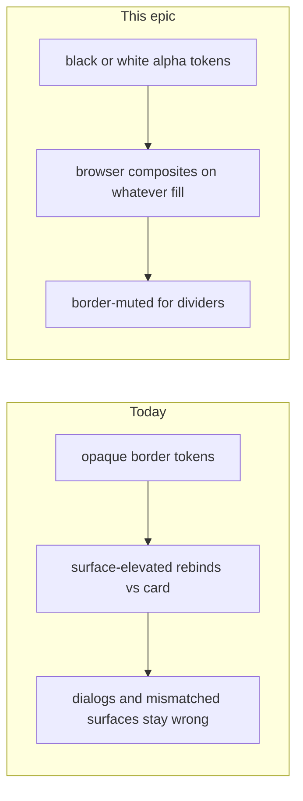

# Phase 19 Epic 1 — Composited Border Tokens

> **Track working-tree progress:** as you complete each step, update the corresponding `todos` entry's `status` to `completed` in this plan's frontmatter.

> **Precondition:** confirm `git branch --show-current` outputs `phase-19/surface-coherence-border-tokens`. If it doesn't match, halt and ask the user — do not switch branches.

> **Precondition:** `git status --porcelain` must be empty before the first implementation edit. If dirty, halt and ask the user to commit or stash. The epic must land as a single commit containing only this epic's work — `code-review` derives its range from that commit.

**Working tree at plan time:** `.cursor/skills/kickoff-phase/SKILL.md` is dirty and is not this epic. Halt and ask the user to commit or stash it before implementation starts — never discard it.

This epic is mechanical only. Provisional alphas ship here; the by-eye pass is Epic 2. Do not tune values, do not self-certify visuals, do not build the calibration route.

Stories share [`src/app/globals.css`](src/app/globals.css) and the same primitives. Build the end state in one pass — do not remove the lint rule without the call sites, and do not remove the utility while the rule is still registered.



## What ships

Borders become a semi-transparent neutral — black-alpha in light, white-alpha in dark — so contrast comes from compositing against the surface they sit on. Token names stay the same. `--border-muted` is the one separately-tuned, lighter value, and every separator primitive defaults to it. `surface-elevated` and `local/surface-elevated` retire with no replacement utility.

## 1. Composite the border tokens

In [`src/app/globals.css`](src/app/globals.css):

- In `:root` / `.light`, set `--border`, `--input`, and `--sidebar-border` to the same value: `oklch(0 0 0 / 0.09)`.
- In `.dark`, set the same three to `oklch(1 0 0 / 0.10)`.
- Add `--border-muted` next to them, deliberately lighter: `oklch(0 0 0 / 0.05)` in light, `oklch(1 0 0 / 0.06)` in dark.
- Add `--color-border-muted: var(--border-muted);` in the `@theme inline` block so `bg-border-muted` / `border-border-muted` exist.
- Delete the `@utility surface-elevated` block and its 88/12 comment in the same edit.

These numbers are provisional starting values from the PRD. Do not refine them.

Leave `dark:bg-input/30` and `dark:hover:bg-input/50` on field primitives and the outline button untouched. That fill role is now the same number as the border, which is the point.

## 2. Dividers default to muted; delete weight overrides

Three primitives, so no call site chooses a weight:

- [`src/components/ui/separator.tsx`](src/components/ui/separator.tsx) — `bg-border` becomes `bg-border-muted`.
- [`src/components/ui/dropdown-menu.tsx`](src/components/ui/dropdown-menu.tsx) `DropdownMenuSeparator` — `bg-border -mx-1` becomes `bg-border-muted mx-2`. Content is `p-1` and items are `px-2`, so `mx-2` lands the rule on the 12px content column instead of full-bleed.
- [`src/components/ui/select.tsx`](src/components/ui/select.tsx) `SelectSeparator` — same change. The viewport is also `p-1`.

Delete the hand-tuned `className="bg-border/40"` on both separators in [`src/app/(app)/_components/profile/profile-modal-content.tsx`](src/app/(app)/_components/profile/profile-modal-content.tsx) and the mirrored pair in [`src/app/(marketing)/reference/_components/reference-profile-settings-preview.tsx`](src/app/(marketing)/reference/_components/reference-profile-settings-preview.tsx). Bare `<Separator />` — do not re-point those overrides at muted.

Drop `bg-sidebar-border` from [`src/components/ui/sidebar/sidebar-layout.tsx`](src/components/ui/sidebar/sidebar-layout.tsx) `SidebarSeparator` so it inherits the muted default. Keep `mx-2 w-auto`. Leaving the override would keep sidebar group rules at full border weight.

## 3. Retire `surface-elevated` atomically

Find every call site by string grep, not by running the rule — the rule ignores `src/components/ui/` and several voluntary sites live there.

Remove the class from all of these, and only the class:

- [`src/components/ui/card.tsx`](src/components/ui/card.tsx)
- [`src/components/ui/alert.tsx`](src/components/ui/alert.tsx) default variant
- [`src/components/ui/dropdown-menu.tsx`](src/components/ui/dropdown-menu.tsx) content and sub-content
- [`src/components/ui/select.tsx`](src/components/ui/select.tsx) content
- [`src/components/ui/sonner.tsx`](src/components/ui/sonner.tsx) — keep `--normal-border: var(--border)` in the style object; that line is what carries the composited token into Sonner
- [`src/components/ui/sidebar/sidebar-shell.tsx`](src/components/ui/sidebar/sidebar-shell.tsx) all three branches
- [`src/components/ui/sidebar/sidebar-provider.tsx`](src/components/ui/sidebar/sidebar-provider.tsx)
- [`src/components/stat-tile.tsx`](src/components/stat-tile.tsx)
- [`src/components/error-panel.tsx`](src/components/error-panel.tsx)
- [`src/components/marketing-display-card.tsx`](src/components/marketing-display-card.tsx)
- [`src/app/admin/_components/admin-shell-skeleton.tsx`](src/app/admin/_components/admin-shell-skeleton.tsx)
- [`src/app/admin/logs/_components/logs-tag-combobox.tsx`](src/app/admin/logs/_components/logs-tag-combobox.tsx)
- [`src/app/(marketing)/reference/_components/reference-toast-section.tsx`](src/app/(marketing)/reference/_components/reference-toast-section.tsx)
- [`src/app/(marketing)/workflow/_components/workflow-documents-section.tsx`](src/app/(marketing)/workflow/_components/workflow-documents-section.tsx)
- [`src/app/(marketing)/workflow/_components/workflow-diagram.tsx`](src/app/(marketing)/workflow/_components/workflow-diagram.tsx)

Delete [`eslint-rules/surface-elevated.mjs`](eslint-rules/surface-elevated.mjs). Its header debt (class-string-only, misses the toast style object and the SVG fills) closes with the file.

In [`eslint.config.mjs`](eslint.config.mjs): drop the import, the `'surface-elevated'` plugin member, and the entire `local/surface-elevated: error` config block.

In [`eslint.config.unit.test.ts`](eslint.config.unit.test.ts): delete the `local/surface-elevated` describe block and `getSurfaceElevatedBlock`. Narrow both unions on `getLocalRuleBlock` to the remaining single members (`motion-tier` / `local/motion-tier`) — do not leave a dead `'surface-elevated'` member. Type-check will still pass if you forget.

Delete the `surface-elevated` bullet in [`.cursor/rules/ui-styling.mdc`](.cursor/rules/ui-styling.mdc). No replacement utility, no replacement lint line.

Strip the two index mentions in [`.cursor/rules/README.md`](.cursor/rules/README.md): the `ui-styling.mdc` table cell that says "elevated surfaces", and the UI summary bullet that names `surface-elevated`.

Riders, in files this pass already opens:

- [`src/app/(app)/_components/profile/profile-modal-content.tsx`](src/app/(app)/_components/profile/profile-modal-content.tsx) — `// debt:` on the accordion trigger's `px-2`, which breaks the modal content column. Name the upgrade: drop that extra horizontal padding when the trigger is restyled.
- [`src/app/(app)/_components/profile/profile-settings-form.tsx`](src/app/(app)/_components/profile/profile-settings-form.tsx) — `// debt:` on the bio field for the native textarea resize grabber. Name the upgrade: `resize-none` on the primitive or this call site.

Do not fix either. Do not touch accordion padding or textarea resize.

## 4. Re-skin docs so a generated palette cannot revert this

In [`DESIGN.md`](DESIGN.md):

- **Inherited structure** — name the alpha channel on `--border`, `--input`, `--sidebar-border`, and `--border-muted` as inherited structure. Hue and lightness on those tokens stay re-skinnable theme.
- **Semantic colors table** — delete the `surface-elevated` row; add a `border-muted` row (`bg-border-muted` / `border-border-muted`, dividers).
- **Diff-apply step** — carve out border alpha: a tweakcn export ships opaque borders; applying values blindly would revert this phase. Preserve the `/ 0.0N` channel on the four tokens; replace hue/lightness only.
- **Smoke test** — both themes, not dark only. Keep card / popover / sidebar borders. Add dark field-fill composites: a field on the page vs the same field on a card or in the profile modal, at rest and on hover.
- **Audit grep (rider)** — add a third `rg` that flags opaque assignments of those four tokens in `globals.css` (an `oklch(...)` with no `/`). Ship it only if the pattern is a clean one-liner; skip if it is not. Not a success criterion.
- Bump **Last updated** to 2026-08-23.

This covers the [AGENTS.md § Agent workflow](AGENTS.md#agent-workflow) step 4 doc sync by hand: DESIGN.md above, `.cursor/rules/README.md` in story 3. `README.md` carries no affected content — do not run `/sync-repo-docs`, which would produce edits outside this epic's single commit.

Do not write the ADR or the LEXICON entry — those wait on Epic 2's by-eye verdict.

## Verify (mechanical)

Stop on the first miss:

- `pnpm pre-push` green.
- Grep for `surface-elevated` returns nothing across `src/`, `eslint-rules/`, `eslint.config.mjs`, `eslint.config.unit.test.ts`, `DESIGN.md`, and `.cursor/rules/`. `docs/prds/` and `.cursor/plans/` retain the string by design — they are the record of why it existed and why it went. Do not edit them and do not widen this grep to cover them.
- Grep for opacity modifiers on border/input/sidebar-border/border-muted in both `bg-` and `border-` shapes returns nothing. Do **not** include `bg-input/` — that is the sanctioned dark field fill. `border-input/` is still a miss.
- `local/surface-elevated` appears nowhere in the ESLint config, and neither union on `getLocalRuleBlock` still names it.
- All four border tokens carry an alpha channel in both `:root` and `.dark`, and `--border-muted` has a `@theme inline` bridge.

No visual sign-off. Light sidebar borders getting slightly more visible, and dark fields inside cards/dialogs gaining fill, are expected and belong to Epic 2.

## Verification

Quality bar — [AGENTS.md § Agent workflow](AGENTS.md#agent-workflow) step 3. Stop on failure:

```bash
pnpm pre-push
```

## Commit epic

Authorized by this approved plan:

1. Review diff; stage only files in scope for this epic.
2. Write a conventional commit message. It **must** end with an `Epic:` git trailer — this is the only thing `code-review` uses to find the commit:

   ```
   feat(phase-19): composite border tokens and retire surface-elevated

   Epic: 19.1
   ```

   Format is `Epic: {phase}.{id}` — phase number as written in ROADMAP, epic id as written. Blank line before the trailer, nothing after it. Exactly one commit in the repo may carry a given `Epic:` value.
3. Commit (request `git_write`). Pre-commit hook runs automatically — if it fails, **fix and retry the commit** (a failed pre-commit hook aborts the commit, so there is nothing to amend).
4. Verify `git status --porcelain` is empty after commit.

**Do not push** — push remains `ship-phase`.

## Handoff

End the run by telling the user:

*"Epic committed. Next: open a new agent window and run `/code-review`."*