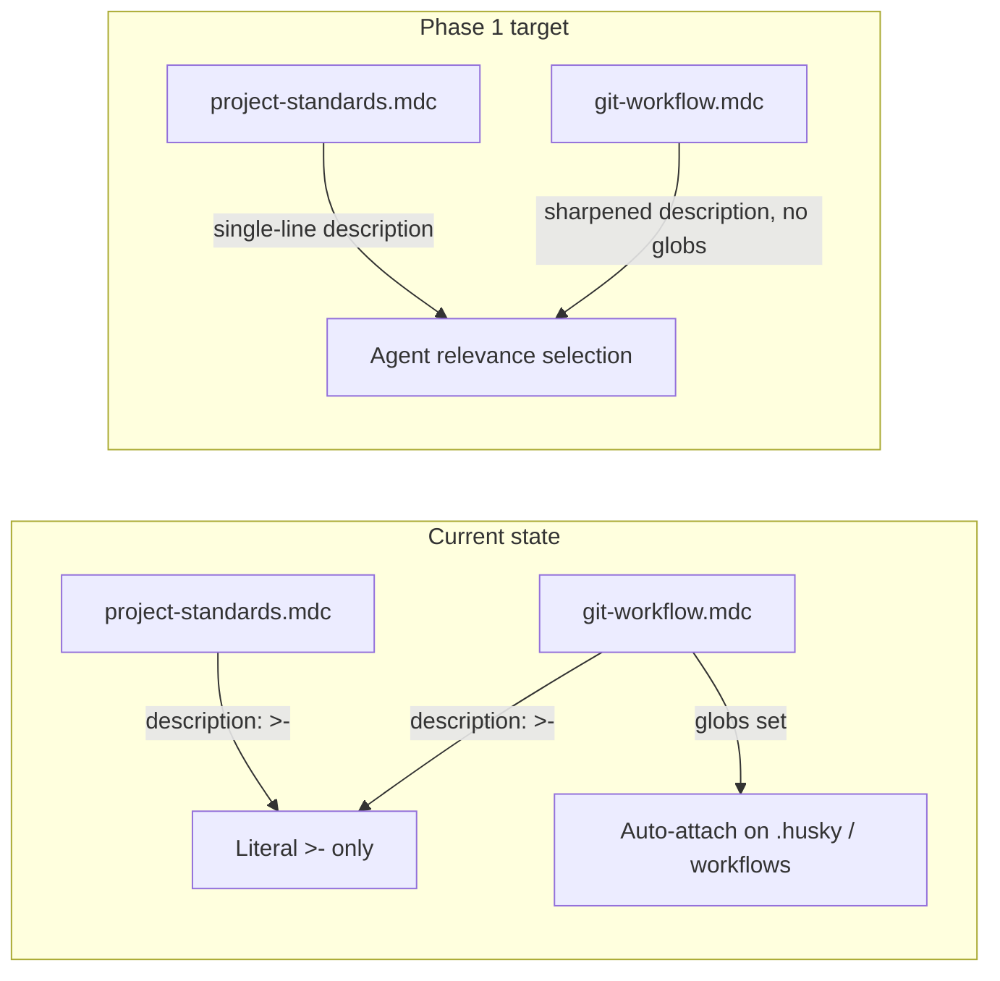

# Phase 1 — Unblock the Broken Rules

Source: [TEMP_cursor_rule_globs_findings.md](TEMP_cursor_rule_globs_findings.md) (Phase 1 section, lines 86–99).

## Problem

Cursor's frontmatter reader is not a full YAML parser. Two rules use folded-scalar descriptions (`>-` + indented continuation lines), which render as the literal string `>-` — the actual description never reaches the model.

| Rule | Current mode | Why it's broken |
| --- | --- | --- |
| [`project-standards.mdc`](.cursor/rules/project-standards.mdc) | Agent Requested (no globs) | Description is the **only** activation path — effectively unreachable |
| [`git-workflow.mdc`](.cursor/rules/git-workflow.mdc) | Auto + Agent Requested (with globs) | Description is also broken; globs suppress description-based selection anyway (finding 2) |

Additionally, when `globs` is set, Cursor ignores the description for agent-side relevance selection. The README's "Auto + Agent requested" mode for `git-workflow.mdc` describes behavior Cursor does not support — each rule resolves to exactly one activation path.



## Scope (locked)

**In scope — 2 files only:**
- [`.cursor/rules/project-standards.mdc`](.cursor/rules/project-standards.mdc)
- [`.cursor/rules/git-workflow.mdc`](.cursor/rules/git-workflow.mdc)

**Explicitly out of scope for Phase 1:**
- README / skill doc updates (Phase 4)
- Glob syntax conversion to comma-separated form (Phases 2–3)
- Frontmatter comment moves in `forms`, `notifications`, `supabase-sql`, `typescript` (Phase 3)
- Glob breadth audit (follow-up)
- Rule body content edits beyond frontmatter

## Changes

### 1. [`project-standards.mdc`](.cursor/rules/project-standards.mdc) — fix description only

Replace the folded scalar:

```yaml
description: >-
  Project-wide code organization conventions — file layout, module depth
  heuristic, utils placement. Use when creating new files or restructuring
  modules.
```

With a single-line string (same text, no `>-`):

```yaml
description: Project-wide code organization conventions — file layout, module depth heuristic, utils placement. Use when creating new files or restructuring modules.
```

No other frontmatter keys change. `alwaysApply: false` and no globs stay as-is.

### 2. [`git-workflow.mdc`](.cursor/rules/git-workflow.mdc) — frontmatter restructure

**Remove globs entirely** — delete the `globs` key and both entries (`.husky/**`, `.github/workflows/**`). This converts the rule to pure Agent Requested, matching the locked PM decision.

**Convert description to a single-line string** and sharpen it. The description becomes the rule's sole activation trigger, so it must name every intent the rule governs — not just "git workflow standards." Per the [rule-authoring skill](.cursor/skills/rule-authoring/SKILL.md) activation guidance: vague descriptions are effectively unreachable.

Proposed sharpened description (starting point — refine during implementation if needed):

> Conventional commits, branch naming, Husky pre-commit/pre-push hooks, CI workflow files, and GitHub CLI PR format. Use when committing, creating branches, opening or reviewing pull requests, or editing `.husky/` or `.github/workflows/` files.

This preserves the hook/CI coverage that globs previously provided, but routes it through agent relevance selection instead.

**Move the frontmatter comment below the closing `---` delimiter.** Current comment:

```yaml
# Globs scoped to git-infrastructure files only; otherwise Agent Requested for commit/branch/PR work.
```

Relocate it immediately after the closing `---`, before the `# Git Workflow & Conventional Commits` heading. Update the comment text to reflect the new mode (Agent Requested only; no globs). Frontmatter should contain only the three real keys: `description`, `globs` (absent here), `alwaysApply`.

Target frontmatter shape:

```yaml
---
description: <sharpened single-line string>
alwaysApply: false
---
```

### 3. Do not touch rule bodies

Both files have substantial, high-signal content (conventional commit types, Husky hook details, PR format, Ousterhout depth heuristic). Phase 1 is frontmatter-only — no pruning, no section moves, no content rewrites.

## Verification

Phase 1 has no mechanical test gate (unlike Phase 2's glob-syntax pilot). Verification is behavioral:

1. **Start a fresh Cursor chat session** after the changes land (rules resolve when a session builds context; mid-session checks can false-pass).
2. Confirm both rules appear in the agent-requestable rules list with their full description text — not the literal `>-`.
3. Ask the agent to perform a commit or open a PR — `git-workflow.mdc` should be selected via description relevance.
4. Ask the agent to create a new file or restructure a module — `project-standards.mdc` should be selected.

If `git-workflow.mdc` fails to attach on commit/PR tasks, iterate on the description wording (add trigger phrases like "conventional commit", "gh pr create", "pre-push hook") before committing.

## Commit

Per the findings doc: commit at the end of Phase 1. Suggested message:

> fix(rules): restore Agent Requested activation for project-standards and git-workflow

`pnpm pre-push` is deferred to Phase 4 — these are markdown-only frontmatter edits with no code impact.

## Why this order matters

Phase 1 is self-contained and unblocks the only confirmed breakage. It also removes `git-workflow.mdc` from the glob set **before** Phase 3 rolls out comma-separated glob syntax — so Phase 3 never converts globs that are about to be deleted.

## What comes next (not part of this plan)

- **Phase 2:** Pilot comma-separated glob syntax on `rule-authoring-pointer.mdc` with a fresh-session pass/fail gate
- **Phase 3:** Roll out glob syntax + comment hygiene to remaining ~19 rules
- **Phase 4:** Update README and rule-authoring skill; run `pnpm pre-push`
