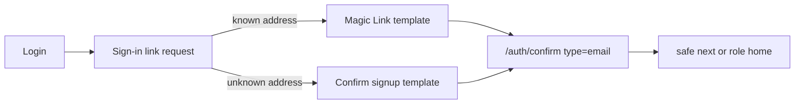

# Phase 20 Epic 1 — Magic Link Sign-In

> **Track progress:** as you complete each step, update the corresponding `todos` entry's `status` to `completed` in this plan's frontmatter.

> **Precondition:** confirm `git branch --show-current` outputs `phase-20/magic-link-auth`. If it doesn't match, halt and ask the user — do not switch branches.

> **Precondition:** `git status --porcelain --untracked-files=no` must be empty before the first implementation edit. If dirty, halt and ask the user to commit or stash. (Untracked files, e.g. the active plan file in `.cursor/plans/`, are not a halt.) The epic must land as a single commit containing only this epic's work — `code-review` derives its range from that commit.

Password stays the primary login path. This epic ships **link-only** passwordless sign-in. Do not add code entry, resend UI, recovery-code changes, a `has_password` profile flag, or features-page copy — those are later epics. Do not extract a shared email-request component; Epic 5 decides that after both screens exist.



A passwordless send produces one of two emails. Both templates must use the same PKCE confirm URL this project already documents for signup (`token_hash` + `type=email` + `next`). Current Supabase guidance treats `type=email` as the PKCE type for both magic-link and signup confirmation; do not introduce `type=magiclink` in the templates.

## 1. Shared auth constants

Add [`src/constants/auth.ts`](src/constants/auth.ts) as the repo mirror of dashboard Authentication settings (dashboard remains authoritative; nothing enforces the match):

- Code length: 6
- Lifetime: 15 minutes
- Minimum interval between sends: 30 seconds

Epic 2 will consume these in the UI. This epic's consumer is setup documentation pointing at the file. Do not invent unused helpers around them.

## 2. Confirm route: default destination vs bounce

[`src/app/auth/confirm/route.ts`](src/app/auth/confirm/route.ts) already verifies `token_hash` + `type` and prefers a safe `next`. Password login uses role fallback when there is no bounce ([`getPostAuthRedirectPath`](src/utils/admin.ts): admin → `/admin`, else `/home`). Magic-link requests with no pending destination omit `emailRedirectTo`, so the template's `RedirectTo` is typically the Site URL. Today that would count as a safe `next` and dump people on the marketing origin instead of role home.

After a successful verify, use `next` only when it is same-origin **and** not the site root (`/` or an origin-only URL). Otherwise use role fallback. Do not treat `/home` as "no preference" — an explicit bounce to app home must still win.

Extend [`src/utils/is-safe-redirect.ts`](src/utils/is-safe-redirect.ts) with a **single exported predicate** covering the whole decision — true only when `next` is same-origin and not the site root — and unit-test it there. Both the confirm route and the sign-in-link request form call that one predicate; do not ship a separate site-root helper callers have to remember to compose with `isSafeRedirect`.

Extend [`src/app/auth/confirm/route.integration.test.ts`](src/app/auth/confirm/route.integration.test.ts):

- Site-root / origin-only `next` → role fallback (non-admin `/home`, admin `/admin`)
- Existing safe-path, off-origin, missing-`next`, and failure cases stay as they are (`type=email` is already the passwordless PKCE type)

The handler already accepts whatever `EmailOtpType` the query string carries. No second verify path.

## 3. Request screen and login CTA

New public route `/auth/sign-in-link` (covered by existing `/auth/**`; do not edit AGENTS.md). Match the forgot-password shape, not a new layout.

- Page: [`src/app/auth/sign-in-link/page.tsx`](src/app/auth/sign-in-link/page.tsx) — metadata title, `Suspense` + `next` search param like [`src/app/auth/login/page.tsx`](src/app/auth/login/page.tsx), exactly one `h1`
- Form: [`src/components/sign-in-link-form.tsx`](src/components/sign-in-link-form.tsx) — stay on `useState` like the other auth forms ([`forms.mdc`](.cursor/rules/forms.mdc)). Email field with `autocomplete="username"`. Errors through `extractAuthFormError` / `AppErrorSurface`

**Request:** `signInWithOtp({ email, options: { shouldCreateUser: true, emailRedirectTo } })`. Set `emailRedirectTo` only when `next` passes the shared predicate from [`src/utils/is-safe-redirect.ts`](src/utils/is-safe-redirect.ts) — do not re-implement the redirect check inline. Build the absolute value as `` `${window.location.origin}${next}` ``, matching [`src/components/sign-up-form.tsx`](src/components/sign-up-form.tsx). Omit `emailRedirectTo` otherwise so confirm can apply role fallback. Do not hardcode `/home` as the fallback redirect — that would send admins to app home.

`next` can contain `?` and `&` — the proxy sets it to pathname plus search. Anywhere this epic appends `next` to a link (the login CTA and the request screen's footer link), build the URL with `URLSearchParams`, never string interpolation.

**Confirmation copy names the address** (this is allowed here; recovery stays hedged). Suggested shape: title "Check Your Email", body that includes the address they typed. Initial title something like "Sign in with email"; submit "Send sign-in link". Footer link back to login, carrying `next` when present.

**Login secondary CTA** in [`src/components/login-form.tsx`](src/components/login-form.tsx): below the primary Login button, above Sign up — password stays the hero. Copy in the "Email me a sign-in link" register. Href `/auth/sign-in-link`, with `next` appended when the login page received one. Do not pass `next` through Forgot password (out of scope).

Tests, following the forgot-password / login integration pattern:

- Sign-in-link form: autofill; success names the address; `signInWithOtp` called with `shouldCreateUser: true` and `emailRedirectTo` containing the pending path when `next` is safe; `emailRedirectTo` omitted when `next` is missing or unsafe; mapped send-rate-limit / generic error via existing `extractAuthFormError`
- Login form: the new link is present; with `next` it includes that query param

Auth-boundary discovery will pick up the new route. No allowlist edit.

## 4. Reference templates and setup docs

Commit paste-ready HTML under `supabase/templates/` (new folder). These are **reference copies**, not applied by the CLI. Do not add template paths to [`supabase/config.toml`](supabase/config.toml).

- `magic-link.html` — Magic Link / OTP template
- `confirm-signup.html` — Confirm signup template

Both links: `{{ .SiteURL }}/auth/confirm?token_hash={{ .TokenHash }}&type=email&next={{ .RedirectTo }}`. Link only — no `{{ .Token }}` (Epic 2). Do not rewrite Recovery here (Epic 3).

Update [README.md](README.md) **Email templates and redirect URLs**:

- Add the Magic Link template line (same URL pattern as Confirm signup, which already exists)
- Point at `supabase/templates/` as the copies to paste
- Document that dashboard OTP length, lifetime, and minimum send interval must match [`src/constants/auth.ts`](src/constants/auth.ts) (6 characters, 15 minutes, 30 seconds) — already confirmed on this project as of 2026-08-26; spinoffs must set them
- One warning: tightening password strength rules in the dashboard silently breaks passwordless account creation, because the platform generates an internal password on signup. This project has no character requirements; a spinoff that adds them will lose this path

No DESIGN.md or features-inventory change.

## Manual verification

Paste the two reference templates into the linked project's dashboard before live email will work. Then:

1. From `/auth/login`, password form is unchanged; "Email me a sign-in link" is secondary.
2. Request a link for an **existing** password account, follow the email in the same browser, land signed in (app home, or `/admin` if admin).
3. Request a link for an **unknown** address; account is created; following the signup-confirmation email signs them in.
4. Hit a protected URL carrying **two query parameters** (e.g. `/admin/logs?level=error&unread=1`) while signed out, use the sign-in-link path, and land on that exact page with both parameters intact — not a generic home, and not the path with its query truncated. This exercises how `{{ .RedirectTo }}` is interpolated into the template's `next=` parameter.
5. Confirmation state names the address. Rate-limit copy is already mapped; exhausting the hourly send cap is a once-by-hand check, not a repeat exercise.

## Verification

Quality bar. Stop on failure:

```bash
pnpm pre-push
```

## Commit epic

Authorized by this approved plan:

1. Review diff; stage only files in scope for this epic.
2. Write a conventional commit message (`feat`/`fix`/`docs`/etc.). It **must** end with an `Epic:` git trailer — this is the only thing `code-review` uses to find the commit:

   ```
   feat(phase-20): magic link sign-in via email link

   Epic: 20.1
   ```

   Format is `Epic: {phase}.{id}` — phase number as written in ROADMAP (decimals OK: `7.5`), epic id as written (`1`, `1A`). Blank line before the trailer, nothing after it. Exactly one commit in the repo may carry a given `Epic:` value.
3. Commit (request `git_write`). Pre-commit hook runs automatically — if it fails, **fix and retry the commit** (a failed pre-commit hook aborts the commit, so there is nothing to amend).
4. Verify `git status --porcelain --untracked-files=no` is empty after commit.

**Do not push** — push remains `ship-phase`.

## Handoff

Report the epic is committed, then list what's left for the user.

No migration in this epic. Then:

1. Work through the plan's manual verification steps (dashboard template paste first).
2. Fix and commit anything broken.

Then ask: *"Mark this epic complete?"*

On confirmation, read `.cursor/skills/mark-epic-complete/SKILL.md` and follow it in full, preconditions included — it is user-invoked, so reading the file is this run's only route to it. Without confirmation, end the run; the user can type `/mark-epic-complete` later.
