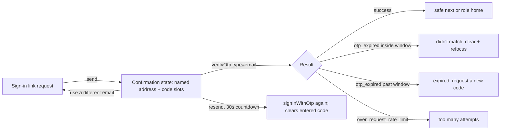

# Phase 20 Epic 2 — Magic Link Code Entry

> **Track progress:** as you complete each step, update the corresponding `todos` entry's `status` to `completed` in this plan's frontmatter.

> **Precondition:** `git status --porcelain --untracked-files=no` must be empty before the first implementation edit. If dirty, halt and ask the user to commit or stash. (Untracked files, e.g. the active plan file in `.cursor/plans/`, are not a halt.) The epic must land as a single commit containing only this epic's work — `code-review` derives its range from that commit.

Scope is the sign-in-link flow only. Do not touch the password-recovery screen or recovery template (Epic 3), the profile password flag (Epic 4), or feature-inventory copy (Epic 5). The link path shipped in Epic 1 keeps working unchanged — the code is an alternative on the same screen, not a replacement.

Confirmed platform facts this plan is built on:

- Typed codes verify with `supabase.auth.verifyOtp({ email, token, type: 'email' })` — `type: 'email'` covers **both** arrival paths (known-address sign-in and unknown-address signup confirmation). Do not branch on which email was sent; the request screen cannot know.
- Wrong and expired codes return the **same** platform error (`otp_expired`, 403). Distinct messaging comes from a time split against `AUTH_OTP_LIFETIME_MINUTES` (PM-approved): a failure inside the window since the last send is "didn't match"; after it, "expired". The form owns the clock; the util owns the copy.
- Rate-limited verification already maps through `over_request_rate_limit` in `src/utils/extract-auth-form-error.ts`.



## 1. Code-entry primitive

Adopt the shadcn `input-otp` primitive so it is owned alongside the other primitives:

```bash
pnpm dlx shadcn@latest add input-otp -y -o
```

This adds `src/components/ui/input-otp.tsx` and the `input-otp` dependency. This is the standard owned-primitive pattern, not installing shadcn as a package. Slot count comes from `AUTH_OTP_CODE_LENGTH` at the call site, never hardcoded.

## 2. Code entry in the confirmation state

All in [`src/components/sign-in-link-form.tsx`](src/components/sign-in-link-form.tsx); the confirmation state becomes the end state directly (no intermediate code-free version to replace).

- Confirmation-state copy must present the code as a real alternative to the link, not leave the link as the only stated route. Keep the first sentence verbatim — `We sent a sign-in link to {email}.` — and replace what follows it with copy naming the code (e.g. `Enter the code from that email below, or follow the link instead.`). Update the card title and description off "Check Your Email" / "Sign-in link sent" to wording that covers both routes.
- Render the slot input below that copy. The underlying input carries `autoFocus` and `autoComplete="one-time-code"` so the OS can offer the code from email; manual paste must work regardless.
- Verify and resend failures render through `AppErrorSurface`, which today sits inside the email-state `<form>` only — it needs an instance in the confirmation state too.
- Verify on complete (input-otp `onComplete`): `verifyOtp({ email, token, type: 'email' })`. Guard against double submission while a verify is in flight.
- On success the session is already set by the browser client. Follow the shipped pattern in [`src/components/login-form.tsx`](src/components/login-form.tsx): `router.refresh()` first, then `router.push(destination)` — without the refresh the Router Cache can serve a pre-auth payload for the destination and bounce back to login. Destination is `next` when it passes `isUsableRedirectNext`, else role fallback via `getPostAuthRedirectPath(user.app_metadata)` from the verify response — the same destination logic `/auth/confirm` uses. Do not hardcode `/home`.
- On failure: map through `extractAuthFormError`. The form computes the time split and passes the result as a boolean on the existing options parameter (extend `ExtractAuthFormErrorOptions` with `otpExpired?: boolean`); the util must not read `Date.now()` or import `AUTH_OTP_LIFETIME_MINUTES`. Add two static `otp_expired` entries in the `AUTH_ERROR_OVERRIDES` shape, selected by that flag, per `error-handling.mdc` § Auth form errors. Copy when false: the code didn't match, try again. When true: the code has expired, request a new one. Absent flag defaults to the didn't-match copy — a wrong code with unknown timing is the common case. After any failure, clear the slots and refocus the input.
- Way back: a "use a different email" control returns to the email state with the submitted address prefilled and editable, so correcting a typo is an edit rather than a retype.
- Arrival reset: a fresh client-side arrival at `/auth/sign-in-link` must always mount the email state — never a previous request's confirmation state or address. First confirm whether the confirmation state actually survives a client-side away-and-back today; if it does not, report that and change nothing rather than guarding against a defect that isn't there. If it does, name the mechanism that resets it. Verification is manual only (Manual verification step 5) — a component-level test cannot drive real client-side navigation, and asserting an unmount/remount would be testing React, not this behavior.

## 3. Resend with countdown

In the same confirmation state:

- Resend control disabled with a visible countdown seeded from `AUTH_OTP_MIN_SEND_INTERVAL_SECONDS`, starting after the initial send and restarting on every resend.
- Resend calls `signInWithOtp` with the identical options as the original send (`shouldCreateUser: true`, same `emailRedirectTo` logic — reuse the existing send path, don't fork it). It clears any partially entered code and refocuses the slots.
- A server rejection (e.g. `over_email_send_rate_limit`, already mapped) surfaces as an inline message via `extractAuthFormError` — never a silent no-op, and the countdown does not restart on a rejected resend.
- The platform invalidates the previous code when a new one is sent; no client work needed, but the resend copy should not promise otherwise.

## 4. Error-mapping tests

Extend [`src/utils/extract-auth-form-error.unit.test.ts`](src/utils/extract-auth-form-error.unit.test.ts) for the new `otp_expired` mapping: `otpExpired: false` message, `otpExpired: true` message, and the default when the flag is absent. No fake timers — the util does not read the clock.

## 5. Sign-in-link form tests

Extend [`src/components/sign-in-link-form.integration.test.tsx`](src/components/sign-in-link-form.integration.test.tsx), mocking the browser client as the file already does. The redirect cases also need a `next/navigation` mock exposing `refresh` and `push`, which this file does not have yet — add it alongside the existing `@/supabase/client` mock.

- Successful code entry: `verifyOtp` called with email, 6-digit token, `type: 'email'`; `refresh` then `push` to safe `next` when present and to role fallback otherwise (admin → `/admin`, non-admin → `/home`).
- Wrong code inside the window → didn't-match message; past the window (control the form's clock) → expired message. Both clear and refocus the input.
- Rate-limited verify → the existing too-many-attempts message.
- Resend: countdown renders from 30, control disabled during it, partial code cleared on resend, rejected resend shows the send-rate-limit message and does not restart the countdown.
- Way back returns to the email field with the submitted address still in it.

Arrival reset is not covered here — see step 2.

## 6. Email templates and setup docs

Reference copies under `supabase/templates/` — still paste-ready bodies, not CLI-applied; `supabase/config.toml` untouched.

- [`supabase/templates/magic-link.html`](supabase/templates/magic-link.html) and [`supabase/templates/confirm-signup.html`](supabase/templates/confirm-signup.html): add `{{ .Token }}` alongside the existing link. Format for automatic detection: unbroken digits, visually prominent, and no competing digit strings nearby (do not state the 15-minute lifetime as a numeral next to the code — spell it out or place it away from the code). Keep the existing link; both paths stay live.
- The subject line lives in the dashboard, not the HTML body. In [README.md](README.md) **Email templates and redirect URLs**, document both subjects with the code first (e.g. `{{ .Token }} is your Seminova sign-in code`) — code in the subject is what lets the OS offer it without opening the message.
- Document as spinoff setup steps: code length, lifetime, and minimum send interval must match `src/constants/auth.ts` (the OTP-settings note from Epic 1 covers the values; extend it to say the code-entry UI reads those constants, so drift shows up as a wrong slot count or a mismatched countdown).

## Manual verification

Paste the two updated templates and set both subject lines in the dashboard before live email reflects this epic. Then:

1. **Known address:** request a sign-in link, type the code from the email without clicking the link, land signed in (app home, or `/admin` if admin).
2. **Unknown address:** same flow; the signup-confirmation email's code creates the account and signs in.
3. **Wrong browser (the core fix):** request on desktop, read the email on a phone, type the code on the desktop — the desktop signs in.
4. **Failure messaging:** enter a wrong code promptly → didn't-match copy, slots cleared and refocused. Resend, then try the *first* code → fails (resend invalidates it). Resend countdown shows 30 seconds and blocks early clicks.
5. **Way back and arrival reset:** from the confirmation state, use a different email → email field with the submitted address prefilled and editable. Then submit, navigate to login and back via in-app links → email state, no prior address, no confirmation state. This is the only verification of arrival reset — run it deliberately.
6. **Rate limit:** the too-many-attempts message is a once-by-hand check (requires exhausting the hourly send allowance) — do not exercise it repeatedly.

## Verification

Quality bar. Stop on failure:

```bash
pnpm pre-push
```

## Commit epic

Authorized by this approved plan:

1. Review diff; stage only files in scope for this epic.
2. Write a conventional commit message (`feat`/`fix`/`docs`/etc.). It **must** end with an `Epic:` git trailer — this is the only thing `code-review` uses to find the commit:

   ```
   feat(phase-20): code entry for magic link sign-in

   Epic: 20.2
   ```

   Format is `Epic: {phase}.{id}` — phase number as written in ROADMAP (decimals OK: `7.5`), epic id as written (`1`, `1A`). Blank line before the trailer, nothing after it. Exactly one commit in the repo may carry a given `Epic:` value.
3. Commit (request `git_write`). Pre-commit hook runs automatically — if it fails, **fix and retry the commit** (a failed pre-commit hook aborts the commit, so there is nothing to amend).
4. Verify `git status --porcelain --untracked-files=no` is empty after commit.

**Do not push** — push remains `ship-phase`.

## Handoff

Report the epic is committed, then list what's left for the user.

No migration in this epic. Then:

1. Work through the plan's manual verification steps (dashboard template paste and subject lines first).
2. Fix and commit anything broken.

Then ask: *"Mark this epic complete?"*

On confirmation, read `.cursor/skills/mark-epic-complete/SKILL.md` and follow it in full, preconditions included — it is user-invoked, so reading the file is this run's only route to it. Without confirmation, end the run; the user can type `/mark-epic-complete` later.