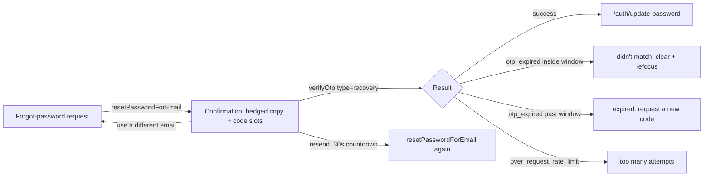

# Phase 20 Epic 3 — Recovery Code Entry

> **Track progress:** as you complete each step, update the corresponding `todos` entry's `status` to `completed` in this plan's frontmatter.

> **Precondition:** `git status --porcelain --untracked-files=no` must be empty before the first implementation edit. If dirty, halt and ask the user to commit or stash. (Untracked files, e.g. the active plan file in `.cursor/plans/`, are not a halt.) The epic must land as a single commit containing only this epic's work — `code-review` derives its range from that commit.

Scope is the password-recovery request screen and its email template. Do not extract a shared email-request or OTP component — Epic 5 decides that after both screens exist. Do not touch the sign-in-link form, profile password flag (Epic 4), or feature-inventory copy (Epic 5). The existing recovery **link** path stays live unchanged.

Copy the shipped code-entry experience from [`src/components/sign-in-link-form.tsx`](src/components/sign-in-link-form.tsx) into [`src/components/forgot-password-form.tsx`](src/components/forgot-password-form.tsx). Stay on `useState` ([`forms.mdc`](.cursor/rules/forms.mdc)). Reuse [`InputOTP`](src/components/ui/input-otp.tsx), [`AUTH_OTP_*`](src/constants/auth.ts), and [`extractAuthFormError`](src/utils/extract-auth-form-error.ts) as-is — no new error mappings.

Confirmed platform facts this plan is built on:

- Typed recovery codes verify with `supabase.auth.verifyOtp({ email, token, type: 'recovery' })`. That is the client equivalent of the link path's `/auth/confirm?type=recovery`.
- Success establishes a recovery session. Destination is always `/auth/update-password` — the same target already passed as `redirectTo` on `resetPasswordForEmail`. Do not use role fallback (`/home` / `/admin`); the person has not set the new password yet.
- Wrong and expired codes still return the same platform error (`otp_expired`). Reuse the Epic 2 time split: the form owns the clock against `lastSentAt` and `AUTH_OTP_LIFETIME_MINUTES`; the util owns the copy via `otpExpired`.
- Recovery confirmation **must not name the submitted address**. Magic link can; recovery cannot (account enumeration). The existing hedged first sentence stays verbatim.

One platform fact is **not** confirmed and must be checked before the failure path is written: what error code `verifyOtp({ email, token, type: 'recovery' })` returns when the address has no account. `extractAuthFormError` returns the didn't-match copy **only** for `otp_expired`; any other code falls through to the generic "We couldn't complete that request" message, which is different copy for the no-account case and therefore an enumeration channel. Check it against a live unknown address first. If the code is not `otp_expired`, this epic adds an `AUTH_ERROR_OVERRIDES` entry mapping it to the same didn't-match copy plus a unit test in `extract-auth-form-error.unit.test.ts` — and the "no new error mappings" constraint above gives way for that one entry.



## 1. Code-entry experience on the recovery confirmation state

All in [`src/components/forgot-password-form.tsx`](src/components/forgot-password-form.tsx). Build the end state directly — the confirmation state today is copy-only; replace it with the full experience in one pass. Page shell [`src/app/auth/forgot-password/page.tsx`](src/app/auth/forgot-password/page.tsx) is unchanged.

**Send path.** Keep `resetPasswordForEmail(email, { redirectTo: origin + '/auth/update-password' })`. Extract it into a shared send function used by the initial submit and by resend (same pattern as `sendSignInLink`). On successful send, set `lastSentAt`, seed the 30s countdown from `AUTH_OTP_MIN_SEND_INTERVAL_SECONDS`, and clear any partial code.

**Confirmation copy — dual-route, still hedged.** Exact strings, not suggestions:

- Title (replaces "Check Your Email"): `Complete password reset`
- Description (replaces "Password reset instructions sent"): `Use the link or code from your email`
- First body sentence, verbatim and unchanged: `If you registered using your email and password, you will receive a password reset email.`
- Second body sentence: `If you received an email, enter the code below, or follow the link instead.`

Nothing in the confirmation state interpolates `email` — unlike sign-in-link, whose equivalent sentence names the address. Update the existing success-path test that currently asserts "Check Your Email".

**Code entry.** Same OTP wiring as sign-in-link: slot count from `AUTH_OTP_CODE_LENGTH`, `autoFocus`, `autoComplete="one-time-code"`, verify on `onComplete`, guard double-submit with `isVerifying`. Failures render through `AppErrorSurface` in the confirmation state (today it only exists on the email form). After any verify failure: map with `extractAuthFormError(caught, { email, otpExpired })`, clear slots, refocus.

**Success.** `router.refresh()` then `router.push('/auth/update-password')` — refresh first so the update-password page's `getUser()` sees the recovery session (same Router Cache reason as login / sign-in-link).

**Resend.** Disabled with a visible countdown after every successful send. Resend reuses the send function (identical `redirectTo`). Clears partial code and refocuses. Server rejection surfaces via `extractAuthFormError` — never a silent no-op — and does not restart the countdown. The platform invalidates the previous code; no client work.

**Way back.** A "use a different email" control returns to the email state with the submitted address prefilled and editable.

**Arrival reset.** Copy the `useLayoutEffect` unmount cleanup from sign-in-link so a client-side away-and-back never shows a previous request's confirmation state (including the address that request was sent to). The PRD names this as the same defect recovery has today.

Do not add a login footer on the confirmation state that recovery never had. Leave the email-state "Already have an account? Login" link as it is.

## 2. Forgot-password form tests

Extend [`src/components/forgot-password-form.integration.test.tsx`](src/components/forgot-password-form.integration.test.tsx). Add `verifyOtp` to the existing `@/supabase/client` mock, plus a `next/navigation` mock exposing `refresh` and `push`. Copy the `enterOtpCode` helper and fake-timer / `Activity` patterns from [`src/components/sign-in-link-form.integration.test.tsx`](src/components/sign-in-link-form.integration.test.tsx). Keep the existing autofill and send-failure cases.

- Confirmation copy is hedged: the submitted address does **not** appear in the confirmation body; dual-route wording is present; `resetPasswordForEmail` still called with `redirectTo` containing `/auth/update-password`.
- Successful code entry: `verifyOtp` called with email, 6-digit token, `type: 'recovery'`; `refresh` then `push('/auth/update-password')`. No role-fallback cases.
- Wrong code inside the window → didn't-match message; past the window → expired message. Both clear the input.
- Rate-limited verify → existing too-many-attempts message.
- Resend: countdown from 30, control disabled during it, partial code cleared on resend, rejected resend shows send-rate-limit copy and does not restart the countdown.
- Way back returns to the email field with the submitted address still in it.
- Arrival reset: hide/show via React `Activity` → empty email field, request state, no confirmation state.

- Unknown-address parity: a verify failure for an address with no account renders the **same message string** as a known-address wrong code. Assert the strings match rather than asserting one of them — that is the property, and it is what breaks if the platform returns a different error code for the no-account case.

Do not invent a second confirmation variant — parity is asserted on the single one.

No new unit tests for `extractAuthFormError` — the `otp_expired` mapping already shipped in Epic 2. The one exception is the no-account mapping above, if the platform check finds a code other than `otp_expired`.

## 3. Recovery email template and setup docs

Commit a paste-ready reference copy at [`supabase/templates/reset-password.html`](supabase/templates/reset-password.html). Same formatting as [`supabase/templates/magic-link.html`](supabase/templates/magic-link.html): `{{ .Token }}` as unbroken prominent digits, no competing numerals next to the code, existing link kept live. Link href uses `type=recovery` (already documented in README):

`{{ .SiteURL }}/auth/confirm?token_hash={{ .TokenHash }}&type=recovery&next={{ .RedirectTo }}`

Do not add template paths to [`supabase/config.toml`](supabase/config.toml). Do not rewrite magic-link or confirm-signup templates.

In [README.md](README.md) **Email templates and redirect URLs**:

- Split the existing single `**Reset Password:**` bullet into `**Reset Password body:**` (string unchanged) and `**Reset Password subject:**`, matching the `body:` / `subject:` sub-bullet shape the other two templates already use.
- Reset Password subject is `{{ .Token }} is your Seminova password reset code` — code first, not the sign-in subject.
- The section already points at `supabase/templates/` once as a directory; it does not reference templates per file. Do not add per-template file paths.
- Extend the OTP-settings note so it names the recovery code-entry UI as a second consumer of the constants, not only sign-in-link.

## Manual verification

Paste the new Reset Password template and set its subject line in the dashboard before live email reflects this epic. Then:

1. **Known address:** request a reset, type the code from the email without clicking the link, land on the set-new-password screen, save a password, land signed in.
2. **Unknown address:** same request screen, same hedged messages, no address named. Entering a code fails as didn't-match (not "no account"). Nothing discloses whether the address exists.
3. **Link path still works:** follow the email link instead of typing the code; still arrive at set-new-password.
4. **Wrong browser:** request on desktop, read the email on a phone, type the code on the desktop — desktop reaches set-new-password.
5. **Failure messaging:** wrong code promptly → didn't-match, slots cleared. Resend, then try the *first* code → fails. Countdown shows 30 seconds and blocks early clicks.
6. **Way back and arrival reset:** from confirmation, use a different email → email field with the submitted address prefilled. Submit, navigate to login and back via in-app links → email state, no prior address, no confirmation state.
7. **Rate limit:** too-many-attempts / too-many-emails is a once-by-hand check — do not exercise it repeatedly.

## Verification

Quality bar. Stop on failure:

```bash
pnpm pre-push
```

## Commit epic

Authorized by this approved plan:

1. Review diff; stage only files in scope for this epic.
2. Write a conventional commit message (`feat`/`fix`/`docs`/etc.). It **must** end with an `Epic:` git trailer — this is the only thing `code-review` uses to find the commit:

   ```
   feat(phase-20): code entry for password recovery

   Epic: 20.3
   ```

   Format is `Epic: {phase}.{id}` — phase number as written in ROADMAP (decimals OK: `7.5`), epic id as written (`1`, `1A`). Blank line before the trailer, nothing after it. Exactly one commit in the repo may carry a given `Epic:` value.
3. Commit (request `git_write`). Pre-commit hook runs automatically — if it fails, **fix and retry the commit** (a failed pre-commit hook aborts the commit, so there is nothing to amend).
4. Verify `git status --porcelain --untracked-files=no` is empty after commit.

**Do not push** — push remains `ship-phase`.

## Handoff

Report the epic is committed, then list what's left for the user.

No migration in this epic. Then:

1. Work through the plan's manual verification steps (dashboard Reset Password template paste and subject line first).
2. Fix and commit anything broken.

Then ask: *"Mark this epic complete?"*

On confirmation, read `.cursor/skills/mark-epic-complete/SKILL.md` and follow it in full, preconditions included — it is user-invoked, so reading the file is this run's only route to it. Without confirmation, end the run; the user can type `/mark-epic-complete` later.
