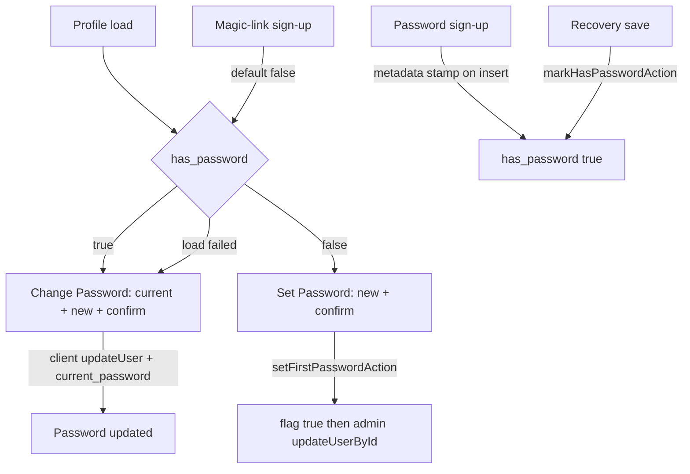

# Phase 20 Epic 4 — First Password

> **Track progress:** as you complete each step, update the corresponding `todos` entry's `status` to `completed` in this plan's frontmatter.

> **Precondition:** `git status --porcelain --untracked-files=no` must be empty before the first implementation edit. If dirty, halt and ask the user to commit or stash. (Untracked files, e.g. the active plan file in `.cursor/plans/`, are not a halt.) The epic must land as a single commit containing only this epic's work — `code-review` derives its range from that commit.

A passwordless signup still stores a platform-generated hash that cannot be distinguished from a real password, which is why this flag lives on the profile. Do not inspect `auth.users`. Do not touch feature-inventory copy or extract a shared email-request component (Epic 5). Do not change the login form or the recovery request screen.

**Why the first-password submit is a server action, not a client `updateUser`.** Phase 6 turned on Secure password change: a normal session cannot set a new password without the current one. A magic-link session is not a recovery session, and the person does not know the generated hash. Omitting `current_password` on the client would fail (or would require turning that setting off, which re-opens password change without reauth). The first-password path therefore uses the existing secret-key client, gated on a **server-read** of the flag being false. Change-password stays on the client with `current_password`, as it is today.

**This widens the sanctioned secret-key surface.** [`security.mdc`](.cursor/rules/security.mdc) § Secret key scopes elevated access to "admin role mutations (in-app server actions on `/admin/users` and CLI scripts)"; `setFirstPasswordAction` is a user-triggered, non-admin path. Update that line in the same change so the rule still describes the shipped surface. Whether this also warrants an ADR is a PM decision outside this epic — flag it at handoff, do not write one here.



## 1. Flag on the profile, and every write that sets a password

**Migration** — follow the [create-migration skill](.cursor/skills/create-migration/SKILL.md). One file; UTC timestamp from `date -u +%Y%m%d%H%M%S`, ordered after [`20260720151459_revoke_client_execute_trigger_functions.sql`](supabase/migrations/20260720151459_revoke_client_execute_trigger_functions.sql). Agents do not run `pnpm db:push` or `pnpm db:types`.

- Add `public.profiles.has_password boolean not null default false`.
- Backfill **all existing rows to true** (every account from before this phase).
- Column comment: app-level “has a user-chosen password”; not derived from the auth hash.
- Replace `handle_new_user()` so a new row is `true` only when `raw_user_meta_data->>'has_password' = 'true'`; otherwise false. Re-apply the execute revokes from the revoke-trigger-functions migration — `CREATE OR REPLACE` must not make the trigger function callable via PostgREST again.
- **Column grants:** [`20260622120000_create_profiles.sql`](supabase/migrations/20260622120000_create_profiles.sql) creates `profiles` with no explicit grants, so `authenticated` holds Supabase's default table-level `UPDATE` on every column. A column grant is additive and would change nothing on its own — `revoke update on public.profiles from authenticated` **first**, then `grant update (display_name, avatar_url, bio) on public.profiles to authenticated`. They must not be able to flip `has_password` from the client (setting it false would skip current-password). `service_role` keeps full update. No new RLS policies — owner SELECT/UPDATE already covers the row. Nothing else writes those columns from the client: `updateProfileAction` updates and selects exactly those three.
- Write the SQL in lowercase per [`supabase-sql.mdc`](.cursor/rules/supabase-sql.mdc) § Style. The revoke-trigger-functions migration being copied from is uppercase — do not carry that over.

**Human halt:** review the SQL, then `pnpm db:push` and `pnpm db:types`. Do not hand-edit [`src/types/database.types.ts`](src/types/database.types.ts). If types are stale, halt.

**Read path.** [`has_password` is not a blur-save field](src/types/profile.ts) — do not add it to `ProfileFields` or the profile form schema. Add `hasPassword: boolean` on [`CurrentUserProfile`](src/app/(app)/_lib/get-current-user-profile.ts), select it with the other columns, and map it. **Load failure fail-closes to `true`** so a missing profile never hides current-password. Thread `hasPassword` through [`app-header-account-nav.tsx`](src/app/(app)/_components/app-header-account-nav.tsx), [`admin-sidebar-nav-user.tsx`](src/app/admin/_components/admin-sidebar-nav-user.tsx), [`profile-dialog-provider.tsx`](src/app/(app)/_components/profile/profile-dialog-provider.tsx), [`profile-settings-dialog.tsx`](src/app/(app)/_components/profile/profile-settings-dialog.tsx), and [`profile-modal-content.tsx`](src/app/(app)/_components/profile/profile-modal-content.tsx) into the password section. Keep it out of [`updateProfileAction`](src/app/(app)/_lib/profile/actions.ts).

**Shared constant.** Move `MIN_PASSWORD_LENGTH = 6` out of [`profile-password-section.tsx`](src/app/(app)/_components/profile/profile-password-section.tsx) into [`src/constants/auth.ts`](src/constants/auth.ts), and import it in both the component and the new server-boundary schema. The duplicate literal in [`reference-profile-settings-preview.tsx`](src/app/(marketing)/reference/_components/reference-profile-settings-preview.tsx) stays — that fixture is out of scope.

**Write paths** — set the flag when the app sets a password; never the reverse.

1. **Password sign-up.** [`sign-up-form.tsx`](src/components/sign-up-form.tsx) already has no session until email confirm. Stamp `options.data.has_password: true` on `signUp` so the insert trigger records it. Magic-link `signInWithOtp` must not send that stamp.
2. **First password from profile.** New `setFirstPasswordAction` in [`actions.ts`](src/app/(app)/_lib/profile/actions.ts): `getUser()`, read `has_password` with the user-scoped client, reject if true (operational — they must use current-password), then validate through a shared zod schema `safeParse` at the server boundary — a new schema module in [`_lib/profile/`](src/app/(app)/_lib/profile/) alongside [`profile-form-schema.ts`](src/app/(app)/_lib/profile/profile-form-schema.ts), following `forms.mdc` § Server Action pattern and `security.mdc` § Input Validation. Not an inline length check; map the first issue to a user-safe message, never return a raw `ZodError`. Length comes from the shared `MIN_PASSWORD_LENGTH`.

   **Write order: flag first, then password.** `createServiceClient()` → set `has_password: true` on that user’s profile row, then `auth.admin.updateUserById` with the new password. Flag-first fails closed — a failed password update leaves the account showing Change Password with recovery-by-email still available. Password-first fails open: if the flag write fails after the password lands, the no-current-password path stays open on that account permanently. Either write failing returns a fault envelope; never `success: true` on a partial write. Revalidate the app layout **and** the admin layout — the admin shell mounts the same `ProfileDialogProvider` via [`admin-sidebar-nav-user.tsx`](src/app/admin/_components/admin-sidebar-nav-user.tsx), so revalidating `/(app)` alone leaves it stale. Do not log the password. [`actions.ts`](src/app/(app)/_lib/profile/actions.ts) is already on the server-only import allowlist.
3. **Change password from profile.** Unchanged: client `updateUser` with `current_password`. Flag is already true; do not write it.
4. **Recovery.** After a successful `updateUser({ password })` in [`update-password-form.tsx`](src/components/update-password-form.tsx), call a new `markHasPasswordAction` (session + service client sets `has_password: true` for that user, idempotent). Failures log **server-side inside the action** via `appLog.error` with a kebab-case tag — not from the form. `update-password-form.tsx` is a client module, where `appLog` is ESLint-blocked and `clientLog` would need a new declared key in [`client-log-registry.ts`](src/config/client-log-registry.ts). The form ignores the result and redirects either way — the password is already saved; a later first-password submit would overwrite, which is acceptable. Do not block on the flag.

## 2. First-password variant in the profile modal

All in the existing accordion. One component, two variants — do not split a second password section. Stay on `useState`.

The state crosses a component boundary: the heading is the accordion trigger in [`profile-modal-content.tsx`](src/app/(app)/_components/profile/profile-modal-content.tsx), but the successful set happens in [`profile-password-section.tsx`](src/app/(app)/_components/profile/profile-password-section.tsx). Hold local `hasPassword` state in `ProfileModalContent`, initialized from the server prop; pass it down, and pass an `onFirstPasswordSet` callback up that flips it — so a successful first set switches the heading immediately. Also `router.refresh()` so the next open is correct.

Exact copy:

| | Has password (keep) | First password |
|---|---|---|
| Accordion trigger | Change Password | Set Password |
| Fields | Current, New, Confirm | New, Confirm (no current) |
| Submit | Update password / Updating… | Set password / Setting… |
| Success toast | Password updated | Password set |

Hidden username field and `autocomplete` tokens stay as they are ([`forms.mdc`](.cursor/rules/forms.mdc)). First-password submit calls `setFirstPasswordAction` with the new password only (confirm is client-side). Change-password submit stays on `updateUser` with `current_password`. Validation (length 6, match) is shared. Errors still go through `InlineError` / `extractAuthFormError` / `AppErrorSurface`.

Do not restyle the reference profile preview — that demo is a change-password fixture, not a second product surface.

## 3. Tests for both variants

Minimum that would catch a real miss. Do not add a showroom test.

- [`profile-password-section.integration.test.tsx`](src/app/(app)/_components/profile/profile-password-section.integration.test.tsx) — default the existing cases to `hasPassword: true`. Add first-password: no current field, `setFirstPasswordAction` (not `updateUser`), toast “Password set”. Keep mismatch/short validation covering the first-password fields too (one of the two variants is enough for the shared checks if both submit through the same validator — prefer asserting first-password has no current field and change-password still sends `current_password`).
- [`profile-modal-content.integration.test.tsx`](src/app/(app)/_components/profile/profile-modal-content.integration.test.tsx) — pass `hasPassword: true` into existing cases. Add: `hasPassword: false` shows “Set Password” and, once expanded, no current field.
- [`get-current-user-profile.unit.test.ts`](src/app/(app)/_lib/get-current-user-profile.unit.test.ts) — happy path maps `has_password`; load-failure returns `hasPassword: true`.
- [`actions.unit.test.ts`](src/app/(app)/_lib/profile/actions.unit.test.ts) — `setFirstPasswordAction`: unauthorized; already-has-password rejected without admin call; happy path flag-then-admin-update; password update failing after the flag write returns a fault envelope rather than `success: true`. `markHasPasswordAction`: unauthorized; happy path sets true.
- [`update-password-form.integration.test.tsx`](src/components/update-password-form.integration.test.tsx) — successful save calls `markHasPasswordAction`.
- [`sign-up-form.integration.test.tsx`](src/components/sign-up-form.integration.test.tsx) — `signUp` includes `options.data.has_password: true`.

Nav provider mocks do not need new assertions unless types force a prop through.

## Manual verification

Requires the migration applied (`pnpm db:push`) and types regenerated.

1. **Existing password account:** Profile accordion still reads “Change Password”, current field is present, wrong current password is rejected, correct current + new succeeds, toast “Password updated”.
2. **New magic-link account:** Accordion reads “Set Password”, no current field. Set a password, toast “Password set”, heading becomes “Change Password”. Confirm the current session survives — navigate to another protected page without being bounced to login (`auth.admin.updateUserById` can invalidate refresh tokens depending on project settings). Then sign out, sign in with email + that password.
3. **Password sign-up (after email confirm):** Accordion is “Change Password” from the first open — not the first-password variant.
4. **Recovery from a magic-link account:** Complete reset by code, save a new password, land signed in. Profile accordion is “Change Password”.
5. **First-password failure:** short / mismatch stay inline and do not call the server.

## Verification

Quality bar. Stop on failure:

```bash
pnpm pre-push
```

## Commit epic

Authorized by this approved plan:

1. Review diff; stage only files in scope for this epic.
2. Write a conventional commit message (`feat`/`fix`/`docs`/etc.). It **must** end with an `Epic:` git trailer — this is the only thing `code-review` uses to find the commit:

   ```
   feat(phase-20): first-password profile variant

   Epic: 20.4
   ```

   Format is `Epic: {phase}.{id}` — phase number as written in ROADMAP (decimals OK: `7.5`), epic id as written (`1`, `1A`). Blank line before the trailer, nothing after it. Exactly one commit in the repo may carry a given `Epic:` value.
3. Commit (request `git_write`). Pre-commit hook runs automatically — if it fails, **fix and retry the commit** (a failed pre-commit hook aborts the commit, so there is nothing to amend).
4. Verify `git status --porcelain --untracked-files=no` is empty after commit.

**Do not push** — push remains `ship-phase`.

## Handoff

Report the epic is committed, then list what's left for the user.

The epic added a migration — humans run `pnpm db:push` and `pnpm db:types` (already required mid-build before types-dependent code); nothing verifies against un-pushed schema. Then:

1. The backfill stamps `has_password = true` on **every** existing row — including the passwordless accounts created while verifying Epics 1–3. Those will show “Change Password” with no password the person knows. Delete and recreate them, or flip the column by hand, before manual step 2.
2. Work through the plan's manual verification steps.
3. Fix and commit anything broken.
4. Flag for the PM: this epic added a user-triggered secret-key call site. Whether that warrants an ADR is their decision, not this epic's.

Then ask: *"Mark this epic complete?"*

On confirmation, read `.cursor/skills/mark-epic-complete/SKILL.md` and follow it in full, preconditions included — it is user-invoked, so reading the file is this run's only route to it. Without confirmation, end the run; the user can type `/mark-epic-complete` later.
