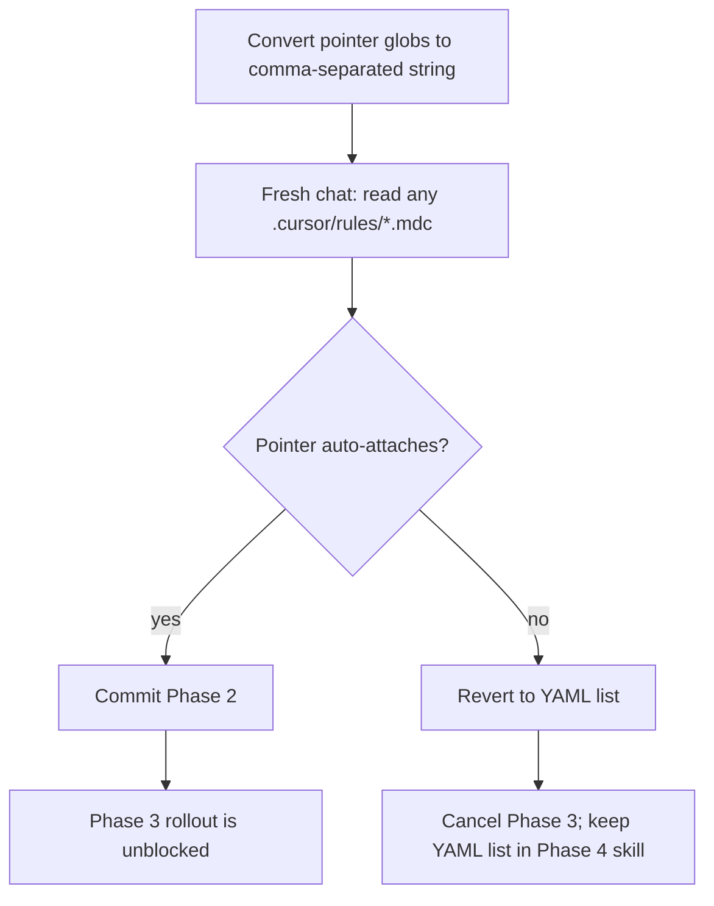

# Phase 2 — Prove the Glob Syntax

Source: [TEMP_cursor_rule_globs_findings.md](TEMP_cursor_rule_globs_findings.md) (Phase 2, lines 101–119). Locked PM decision: switch glob syntax to the documented comma-separated single-line form, but **prove it on one rule first**.

## Why this phase exists

Cursor’s docs prescribe `globs` as a comma-separated string (`docs/**/*.md, docs/**/*.mdx`). This repo uses quoted YAML lists instead. Finding 5 already confirmed the list form **works** — `rule-authoring-pointer.mdc` auto-attached during the audit. The documented form is the unproven one here.

Phase 3 would convert ~19 remaining rules. Doing that without a pass/fail signal would turn a working activation path into a silent miss across the whole set.



## Scope (locked)

**In scope — 1 file only:** [`.cursor/rules/rule-authoring-pointer.mdc`](.cursor/rules/rule-authoring-pointer.mdc)

**Why this rule:** it is the only globbed rule with an observed, reproducible before-state. A pass/fail signal is unambiguous.

**Explicitly out of scope:**
- All other globbed rules (Phase 3)
- Frontmatter comments in `forms`, `notifications`, `supabase-sql`, `typescript` (Phase 3)
- README / skill updates (Phase 4 — must describe what this phase *proved*, not what we hoped)
- Glob path changes, brace expansion, rule body edits
- Glob-breadth audit (follow-up)

## The change

Current frontmatter (YAML list — known working):

```yaml
---
description: Points to the rule-authoring skill before any .cursor/rules/*.mdc file is created or edited.
globs:
  - '.cursor/rules/**/*.mdc'
  - '.cursor/rules/**/*.md'
alwaysApply: false
---
```

Replace `globs` with the documented comma-separated single-line form. Match the docs character-for-character: no quotes, comma + space between patterns, same two patterns, same order. Do not introduce brace expansion.

```yaml
---
description: Points to the rule-authoring skill before any .cursor/rules/*.mdc file is created or edited.
globs: .cursor/rules/**/*.mdc, .cursor/rules/**/*.md
alwaysApply: false
---
```

Leave `description`, `alwaysApply`, and the rule body untouched.

## Verification (the gate)

Rules resolve when a session builds context. A conversion made mid-session can false-pass. **Do not treat this chat, or the implementing chat, as evidence.**

After the edit lands on disk:

1. Start a **new Cursor chat** in this repo (not a continuation).
2. Ask the agent to **read any** `.cursor/rules/*.mdc` file (for example `security.mdc` or `logging.mdc` — not the pointer itself).
3. **Pass:** the pointer body appears as an auto-attached rule — the same “relevant to the files you just read” injection seen during the audit. The body is the two-sentence stub that says to read `.cursor/skills/rule-authoring/SKILL.md`.
4. **Fail:** that injection does not appear.

Optional sanity check in the same fresh session: `@`-mention a non-matching file (for example a file under `src/`) and confirm the pointer does **not** attach. That guards against the new syntax accidentally always-applying.

## Gate outcomes

**If it attaches:** commit Phase 2, then Phase 3 may convert the remaining globbed rules the same way.

**If it does not attach:** stop. Restore the YAML list form in this one file. Do not start Phase 3. When Phase 4 updates the rule-authoring skill, keep “use a YAML list” — the documented comma-separated form is what failed, and the list form is what still works. Do not try quoted strings, different separators, or a second pilot file in the same pass; that would dilute the gate.

## Commit

Do **not** commit until the fresh-session gate passes. Findings require a commit at the end of every phase; verification is part of this phase.

Suggested message:

> fix(rules): pilot documented comma-separated glob syntax on rule-authoring-pointer

`pnpm pre-push` stays deferred to Phase 4 — this is a one-line frontmatter edit with no code impact.

If the gate fails, restore the list form and leave the working tree clean (no commit of the failed syntax).
