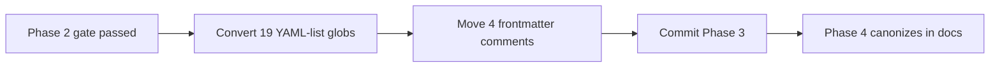

# Phase 3 — Roll Out Frontmatter Hygiene

Source: [TEMP_cursor_rule_globs_findings.md](TEMP_cursor_rule_globs_findings.md) (Phase 3, lines 121–132). Locked PM decision: switch remaining Auto Attached rules to the documented comma-separated glob form, and keep frontmatter to the three real keys only.

Phase 2 already proved that form on [`rule-authoring-pointer.mdc`](.cursor/rules/rule-authoring-pointer.mdc) in a fresh session. This phase is the mechanical rollout — not a second pilot.

## Prerequisite

Phase 2 committed the proven shape. Copy it character-for-character:

- `globs:` then a single unquoted line
- comma + space between patterns
- same patterns, same order as today
- no quotes, no brace expansion, no wrapping

## Scope (locked)

**In scope — 19 files**, all still using a YAML list:

- [`api-development.mdc`](.cursor/rules/api-development.mdc)
- [`data-tables.mdc`](.cursor/rules/data-tables.mdc)
- [`do-migrations-agent.mdc`](.cursor/rules/do-migrations-agent.mdc)
- [`documentation.mdc`](.cursor/rules/documentation.mdc)
- [`error-handling.mdc`](.cursor/rules/error-handling.mdc)
- [`forms.mdc`](.cursor/rules/forms.mdc) — also has a frontmatter comment
- [`logging.mdc`](.cursor/rules/logging.mdc)
- [`nextjs.mdc`](.cursor/rules/nextjs.mdc)
- [`notifications.mdc`](.cursor/rules/notifications.mdc) — also has a frontmatter comment
- [`react-tanstack-query.mdc`](.cursor/rules/react-tanstack-query.mdc)
- [`security.mdc`](.cursor/rules/security.mdc)
- [`seo.mdc`](.cursor/rules/seo.mdc)
- [`supabase-sql.mdc`](.cursor/rules/supabase-sql.mdc) — also has a frontmatter comment
- [`supabase.mdc`](.cursor/rules/supabase.mdc)
- [`testing.mdc`](.cursor/rules/testing.mdc)
- [`typescript.mdc`](.cursor/rules/typescript.mdc) — also has a frontmatter comment
- [`ui-accessibility.mdc`](.cursor/rules/ui-accessibility.mdc)
- [`ui-shadcn.mdc`](.cursor/rules/ui-shadcn.mdc)
- [`ui-styling.mdc`](.cursor/rules/ui-styling.mdc)

**Do not touch:**

- Always-on: `code-minimalism.mdc`, `do-migrations-pointer.mdc`, `general-conventions.mdc`, `pm-collaboration.mdc`
- Agent Requested (Phase 1): `project-standards.mdc`, `git-workflow.mdc`
- Already converted (Phase 2): `rule-authoring-pointer.mdc`
- README, rule-authoring skill, TEMPLATE.md (Phase 4)
- Rule bodies, glob *paths*, `alwaysApply` presence/absence, key order, descriptions

**Stale skill warning:** editing `.mdc` files will auto-attach [`rule-authoring-pointer.mdc`](.cursor/rules/rule-authoring-pointer.mdc), which still says “use a YAML list.” Follow this plan. Phase 4 updates the skill after the rollout is real.

## Changes

### 1. Convert every remaining `globs` list to one comma-separated line

Preserve pattern order. One-glob files (`supabase-sql.mdc`) become a single unquoted pattern with no comma.

Target lines (patterns copied from current lists):

- `api-development.mdc` — `src/app/api/**/*.ts, src/app/api/**/*.tsx`
- `data-tables.mdc` — `src/components/**/*table*.tsx, src/app/**/*table*.tsx`
- `do-migrations-agent.mdc` — `supabase/migrations/**/*.sql, **/*.plan.md`
- `documentation.mdc` — `docs/**/*.md, docs/**/*.txt`
- `error-handling.mdc` — `src/app/api/**/*.ts, src/app/**/actions.ts, src/app/**/error.tsx`
- `forms.mdc` — `src/**/*form*, src/**/actions.ts, src/**/*password-dialog*, src/**/*password-section*, src/**/*avatar-field*, src/hooks/use-blur-save-field.ts, src/components/blur-save-text-field.tsx, src/components/field-save-indicator.tsx`
- `logging.mdc` — `src/**/*.ts, src/**/*.tsx, scripts/**/*.ts`
- `nextjs.mdc` — `src/app/**/*.tsx, src/app/**/*.ts, src/components/**/*.tsx`
- `notifications.mdc` — `src/**/*form*, src/**/actions.ts, src/utils/app-toast.ts, src/utils/toast-icon-config.tsx, src/**/*password-dialog*, src/**/*table*.tsx, src/**/*avatar-field*, src/components/field-save-indicator.tsx`
- `react-tanstack-query.mdc` — `src/hooks/**/*.ts, src/components/**/*.tsx, src/providers/ReactQueryProvider.tsx`
- `security.mdc` — `src/**/*.ts, src/**/*.tsx, src/supabase/proxy.ts, src/app/api/**/*.ts, supabase/migrations/**/*.sql`
- `seo.mdc` — `src/app/**/*.ts, src/app/**/*.tsx, src/config/site.ts, src/utils/site-url.ts, src/utils/robots-policy.ts, src/utils/sitemap-routes.ts, src/utils/structured-data.ts, src/utils/og-image.tsx, src/utils/brand-mark-image.tsx, src/utils/discover-app-routes.ts, src/utils/proxy-matcher.ts`
- `supabase-sql.mdc` — `supabase/migrations/**/*.sql`
- `supabase.mdc` — `src/**/*.ts, src/**/*.tsx, src/supabase/**/*.ts, supabase/migrations/**/*.sql`
- `testing.mdc` — `**/*.test.ts, **/*.test.tsx, **/*.unit.test.ts, **/*.unit.test.tsx, **/*.integration.test.ts, **/*.integration.test.tsx, src/test/**/*.tsx`
- `typescript.mdc` — `src/**/*.ts, src/**/*.tsx, scripts/**/*.ts`
- `ui-accessibility.mdc` — `src/components/**/*.tsx, src/app/**/*.tsx`
- `ui-shadcn.mdc` — `src/components/ui/**/*.tsx, src/components/**/*.tsx, src/app/**/*.tsx`
- `ui-styling.mdc` — `src/components/**/*.tsx, src/app/**/*.tsx`

Longest line is `seo.mdc` (11 patterns). Leave it as one line — do not wrap.

### 2. Move the four remaining frontmatter comments below the closing delimiter

Same pass, same files. YAML `#` comments *inside* frontmatter become Markdown headings if pasted below `---` as `# ...`. Match Phase 1’s [`git-workflow.mdc`](.cursor/rules/git-workflow.mdc) pattern: HTML comment, immediately after the closing `---`, before the rule heading. Keep the existing wording; only strip the `# ` prefix and wrap.

- `forms.mdc` — `<!-- Form-shaped paths only — actions, *form* components, password dialogs, avatar upload. New form components must match these globs or be added to them. -->`
- `notifications.mdc` — `<!-- Feedback surfaces only — forms, actions, toast API, table toasts, inline indicators. New feedback components must match these globs or be added to them. -->`
- `typescript.mdc` — `<!-- Globs: app + admin-script TypeScript only — excludes Vitest/config, Husky, migrations, .cursor/, and test files -->`
- `supabase-sql.mdc` — `<!-- Auto-attaches on migration SQL edits — project deltas only; general Postgres/Supabase patterns live in docs. -->`

After this, no `.cursor/rules/*.mdc` frontmatter block should contain a `#` comment. Frontmatter keys stay only `description`, `globs`, and `alwaysApply` (when already present).

## Verification

Mechanical only — Phase 2 was the attach gate. Do not treat a same-session attach as evidence, and do not block the commit on a second fresh-session pilot.

After the edits:

1. Every in-scope file has `globs:` as a single line, not a YAML list.
2. Pattern strings and order match the list above (diff should be frontmatter-only).
3. No `#` comments remain between the two `---` delimiters in any rule.
4. The six skipped / already-converted files are unchanged.
5. No `{ts,tsx}` (or other brace expansion) was introduced.

Optional, not a gate: in a later fresh chat, open one converted file (for example a `src/app/**/*.tsx` page) and confirm `nextjs.mdc` still auto-attaches. A miss would be a Phase 2 regression to investigate, not a reason to mix syntaxes.

## Commit

Per the findings doc: commit at the end of Phase 3. Suggested message:

> fix(rules): convert remaining Auto Attached globs to documented comma-separated form

`pnpm pre-push` stays deferred to Phase 4.

## What comes next (not part of this plan)

- **Phase 4:** Update [`.cursor/rules/README.md`](.cursor/rules/README.md) and [`.cursor/skills/rule-authoring/SKILL.md`](.cursor/skills/rule-authoring/SKILL.md) to describe what Phases 1–3 actually did; run `pnpm pre-push`.
- **Follow-up:** glob-breadth audit (finding 4) remains a separate effort.
