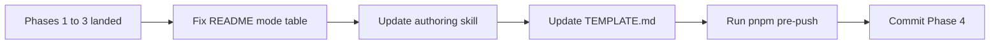

# Phase 4 — Canonize in Docs

Source: [TEMP_cursor_rule_globs_findings.md](TEMP_cursor_rule_globs_findings.md) (Phase 4, lines 171–190). Locked PM decisions from that file still hold: one activation path per rule; comma-separated globs (Phase 2 gate passed; Phase 3 rolled them out); frontmatter is the three real keys only.

This phase writes the guidance to match the repo as it is now. It does not change any `.mdc` rule file.



## Prerequisite

Phases 1–3 are committed. Copy the **proven** shapes, not the old skill text:

- `git-workflow.mdc` is Agent Requested only (no globs; description is the sole trigger)
- Every globbed rule uses `globs: pattern1, pattern2` (unquoted, comma + space, no brace expansion)
- Rationale comments sit as HTML comments immediately below the closing `---`, not inside frontmatter — see [`.cursor/rules/forms.mdc`](.cursor/rules/forms.mdc) and [`.cursor/rules/git-workflow.mdc`](.cursor/rules/git-workflow.mdc)

## Scope (locked)

**In scope — 3 files, then the quality gate:**

- [`.cursor/rules/README.md`](.cursor/rules/README.md)
- [`.cursor/skills/rule-authoring/SKILL.md`](.cursor/skills/rule-authoring/SKILL.md)
- [`.cursor/skills/rule-authoring/TEMPLATE.md`](.cursor/skills/rule-authoring/TEMPLATE.md) — still shows a YAML glob list; agents copy this when creating a new rule, so leaving it stale would undo Phase 3 on the next new file

**One-line sibling (same finding 6 wording):** [`.cursor/README.md`](.cursor/README.md) currently says other rules attach “when you edit matching files.” Change that one phrase to match the skill’s attach trigger. No other edits there.

**Do not touch:**

- Any `.cursor/rules/*.mdc` body or frontmatter
- Glob-breadth / always-on overlap (finding 4 — still a separate follow-up)
- [RULE_AUDIT.md](RULE_AUDIT.md) (owned by `/audit-rules`)
- [TEMP_cursor_rule_globs_findings.md](TEMP_cursor_rule_globs_findings.md) — leave it until the follow-up is planned; do not delete it in this phase
- Archive plans, AGENTS.md (no hard-constraint or shipped-feature change)

When editing the README, follow [`.cursor/skills/github-docs-authoring/SKILL.md`](.cursor/skills/github-docs-authoring/SKILL.md) for GFM (relative links, alert syntax already in use). Keep the existing table/details voice; this is a correction pass, not a rewrite.

## Changes

### 1. [`.cursor/rules/README.md`](.cursor/rules/README.md) — drop the dual mode

**Index table (line 54):** reclassify `git-workflow.mdc` as **Agent requested**, globs column `—`, same purpose text. Move the row next to `project-standards.mdc` so the table stays Always on → Agent requested → Auto attached.

**Details (`git-workflow.mdc` subsection):** replace “Applies to: `.husky/**`, `.github/workflows/**` (auto-attached); Agent Requested for commit/branch/PR work” with Agent Requested via description (commit, branch, PR, and edits under `.husky/` / `.github/workflows/`). No glob attach.

**Agent Requested list:** add `git-workflow.mdc` beside `project-standards.mdc`.

**How it works:** keep the three real keys, then state each rule has **exactly one** activation path. Tighten item 2: Auto Attached fires when a matching file **enters agent context** (agent read, edit, or @-mention) — not from editor focus alone. Add one sentence: when `globs` is set, the description is not used for agent-side relevance selection (that is why a dual “Auto + Agent requested” mode does not exist).

Leave per-rule glob summaries for the Auto Attached files as they are; those paths did not change in Phase 3.

### 2. [`.cursor/skills/rule-authoring/SKILL.md`](.cursor/skills/rule-authoring/SKILL.md) — Activation modes section

Rewrite the **Activation modes** block (currently lines 148–170) so it describes proven behavior. Keep the rest of the skill (budgets, no-op test, ownership table, checklists) unchanged.

**Frontmatter shape**

- Only three keys: `description`, `globs`, `alwaysApply`. Anything else is ignored.
- Rationale comments do **not** go in frontmatter. Put them as an HTML comment immediately after the closing `---`, before the rule heading (Phase 1/3 pattern). Drop the current line “In each rule's frontmatter, document *why* its globs trigger it.”
- `description` must be a **single-line string**. Folded scalars (`>-` plus continuation lines) are dropped by Cursor’s reader and show up as the literal two characters `>-` — that was the Phase 1 breakage.

**Exactly one path**

- Always Apply — `alwaysApply: true` (globs and description ignored).
- Auto Attached — `alwaysApply: false` + `globs` set. Description is decoration; it is **not** used for relevance selection.
- Agent Requested — `alwaysApply: false`, **no** `globs`, a specific description. Vague descriptions stay effectively unreachable.
- Manual — no globs, no meaningful description; `@rule-name` only.

**Glob syntax (replace “use a YAML list”)**

- Documented form, now proven in this repo: one unquoted comma-separated line, comma + space between patterns. Example: `docs/**/*.md, docs/**/*.mdx`.
- Keep the brace-expansion warning: `src/**/*.{ts,tsx}` can fail silently; write `.ts` and `.tsx` as separate patterns on that same line.
- YAML lists worked here before the migration; do not reintroduce them. The authoring standard matches Cursor’s docs and the current files.

**Attach mechanics (finding 6)**

Replace “open/edited file” with: a globbed rule attaches when a matching file **enters agent context** (Read, edit, or @-mention). Editor focus alone does not attach. Mid-session focus switches do not re-run glob attachment.

Add the verification note: a turn-1 self-report may show only always-on + Agent Requested until a matching file is read. Glob rules then appear in the “relevant to files you just read” injection. Do not treat turn-1 attachment as the check.

Cursor’s current docs match this: “Auto-attached when a matching file is in context”; globs are comma-separated. Cite [Cursor rules docs](https://cursor.com/docs/rules) if a link is useful; the README already has a rules-docs link (update that URL only if it is still the old `docs.cursor.com/context/rules` path and you are already in the file).

### 3. [`.cursor/skills/rule-authoring/TEMPLATE.md`](.cursor/skills/rule-authoring/TEMPLATE.md)

Replace the YAML glob list with the documented single-line form. Show the comment-below-delimiter pattern. Keep the body sections as they are.

Target frontmatter shape (placeholders only):

```yaml
---
description: [One sentence — what guidance this provides]
globs: [pattern1, pattern2]
alwaysApply: false
---

<!-- Why these globs / this mode. -->
```

For Agent Requested templates, omit `globs` entirely rather than leaving an empty key. A one-line note under the fence is enough: drop `globs` when the rule is description-only.

### 4. [`.cursor/README.md`](.cursor/README.md) — one phrase

In “What Cursor auto-loads,” change “when you edit matching files” to “when a matching file enters agent context (read, edit, or @-mention).” Point at `rules/README.md` as today.

## Verification

Doc-only, plus the sequence’s deferred quality gate.

1. Grep the two authoring files and the rules README: no remaining “Auto + Agent requested”, “use a YAML list”, or “open/edited file” as the attach trigger.
2. TEMPLATE.md no longer shows a YAML `globs:` list.
3. `git-workflow.mdc` appears once in the README table, as Agent requested, with no husky/workflow globs.
4. Run **`pnpm pre-push`** (type-check → hard-constraint checks → lint → format-check → `test:ci`). This is the first time in this sequence; findings require it before the Phase 4 commit even though these files are markdown. If Prettier or a hook rewrites a file, include that in the same commit (do not `--amend` unless the amend rules in the git user rule are all met).

No fresh-session attach gate — Phase 2 already proved syntax; this phase only documents it.

## Commit

Per the findings doc: commit at the end of Phase 4 after `pnpm pre-push` passes. Suggested message:

> docs(rules): canonize activation modes after glob-syntax rollout

## What this phase does not do

- Glob-breadth measurement / narrowing (finding 4 follow-up)
- Rule content edits, adding/removing rules, pointer-stub conversions
- Deleting the temp findings file (follow-up still lives there)
