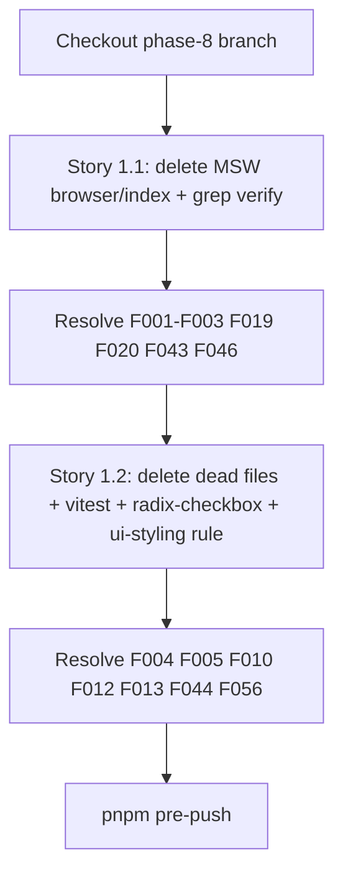

# Phase 8 Epic 1 — Purge starter demo & dead code

**Active phase:** [Phase 8 Tech Debt Audit Remediation](docs/prds/phase-8-tech-debt-remediation.prd.md) (`Ready` — flip to `Active` when build starts; required before `/mark-epic-complete` will succeed)

**Findings addressed:** F001–F005, F010, F012, F013, F019, F020, F043, F044, F046 (F056 mooted by deleting checkbox per PRD scope decision)

---

## Current state (important)

Story **1.1 is partially complete** on the current tree — verify, do not redo:

| Item | Status |
|------|--------|
| `useGetMessage` hook + test | Already deleted |
| `axios` dependency | Already removed from [package.json](package.json) |
| `/api/message` MSW handler | [src/mocks/handlers.ts](src/mocks/handlers.ts) is already `export const handlers = []` |
| [react-tanstack-query.mdc](.cursor/rules/react-tanstack-query.mdc) | Already cites `use-sign-out.ts` |
| [testing.mdc](.cursor/rules/testing.mdc) examples | Already cite `use-sign-out.unit.test.ts` (no `useGetMessage` entry) |

**Still open for 1.1:** unused MSW browser entrypoints and audit resolutions for F001–F003, F019, F020, F043.

---

## Story 1.1 — Finish demo data-fetching layer removal

**Delete unused MSW browser entrypoints (F046):**

- [src/mocks/browser.ts](src/mocks/browser.ts) — unused; tests use `msw/node` via [vitest.setup.ts](vitest.setup.ts) → [src/mocks/server.ts](src/mocks/server.ts)
- [src/mocks/index.ts](src/mocks/index.ts) — not imported anywhere; safe to delete

**Keep:** [src/mocks/server.ts](src/mocks/server.ts), empty [handlers.ts](src/mocks/handlers.ts), MSW in devDependencies.

**Verify:** Grep repo for `useGetMessage`, `axios`, `/api/message`, `mocks/browser`, `mocks/index` — expect zero hits outside [TECH_DEBT_AUDIT.md](TECH_DEBT_AUDIT.md) Resolved/history text.

**Audit sync:** Move F001, F002, F003, F019, F020, F043 from Findings → Resolved (dated 2026-07-05) per [audit-tech-debt skill](.cursor/skills/audit-tech-debt/SKILL.md) verify-in-code gate.

---

## Story 1.2 — Remove dead components and re-exports

**Delete files (no production imports):**

| File | Finding | Notes |
|------|---------|-------|
| [src/components/auth-button.tsx](src/components/auth-button.tsx) | F004, F044 | Superseded by `LandingAuthSlot` / nav-user menus |
| [src/providers/ThemeProvider.tsx](src/providers/ThemeProvider.tsx) | F005 | [layout.tsx](src/app/layout.tsx) imports `ThemeProvider` from `next-themes` directly |
| [src/app/(marketing)/_components/landing-copyright.tsx](src/app/(marketing)/_components/landing-copyright.tsx) | F010 | [site-footer.tsx](src/components/site-footer.tsx) imports `SiteCopyright` directly |
| [src/components/ui/checkbox.tsx](src/components/ui/checkbox.tsx) | F012, F056 | Never imported |
| [src/components/ui/collapsible.tsx](src/components/ui/collapsible.tsx) | F013 | Never imported; sidebar uses its own `collapsible` prop, not this primitive |

**Config / rule touch-ups:**

- [vitest.config.ts](vitest.config.ts) — remove `'src/components/auth-button.tsx'` from coverage exclude list (file won't exist)
- [package.json](package.json) — `pnpm remove @radix-ui/react-checkbox` (only consumer was checkbox primitive; remaining `@radix-ui/react-*` packages stay for Epic 2)
- [.cursor/rules/ui-styling.mdc](.cursor/rules/ui-styling.mdc) — update theming bullet from `ThemeProvider.tsx` wrapper to [src/app/layout.tsx](src/app/layout.tsx) (`next-themes` directly); [DESIGN.md](DESIGN.md) already points at layout — no change needed there

**Explicitly keep (PRD scope decision):** [landing-container.tsx](src/app/(marketing)/_components/landing-container.tsx) (F011)

**Verify:** `npx knip` should no longer flag auth-button, landing-copyright, checkbox, collapsible, ThemeProvider, mocks browser/index. Landing (`/`), admin (`/admin`), and profile (`/profile`) render unchanged.

**Audit sync:** Resolve F004, F005, F010, F012, F013, F044, F046, F056 in TECH_DEBT_AUDIT.md.

---

## Execution flow



Stories are sequential (shared touch points: package.json, vitest config, audit file).

---

## Quality gate

```bash
pnpm pre-push
```

Expect: type-check, lint, format-check, test:ci all green; coverage thresholds unchanged (deletions only, no new logic).

---

## Manual testing checklist

No intentional user-visible behavior changes — smoke that nothing broke:

1. **`/`** — landing header auth CTAs, footer copyright line, features/tech stack render
2. **`/auth/login`** — sign-in form loads
3. **`/profile`** (signed in) — settings form, avatar, theme segment render
4. **`/admin`** (admin user) — sidebar shell and users table load
5. **Dark mode toggle** on profile — confirms `next-themes` in layout still works after ThemeProvider wrapper deletion

---

## Out of scope (later epics)

- Remaining `@radix-ui/react-*` dedup (Epic 2)
- Coverage exclusions for admin chrome (Epic 3)
- AGENTS.md sync — no route/schema/env changes in this epic

---

## Close-out

When implementation is fully finished:

1. Ensure Phase 8 PRD and ROADMAP row are **`Active`** (not `Ready`) — otherwise `/mark-epic-complete` will halt
2. Run **`/mark-epic-complete`** to tag `### Epic 1: Purge starter demo & dead code` with `` `Complete` `` in [phase-8-tech-debt-remediation.prd.md](docs/prds/phase-8-tech-debt-remediation.prd.md)
