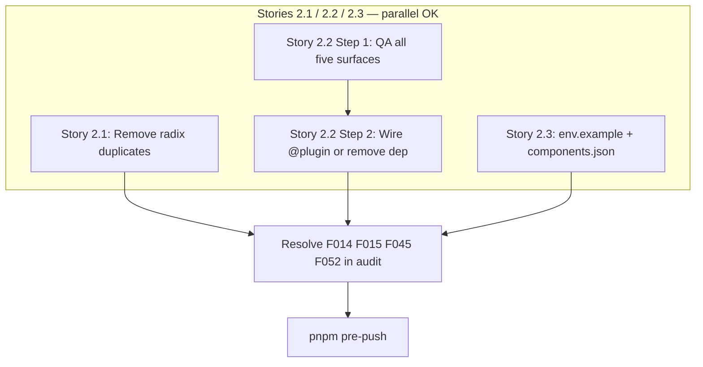

# Phase 8 Epic 2 — Dependency & config hygiene

**Active phase:** [Phase 8 Tech Debt Audit Remediation](docs/prds/phase-8-tech-debt-remediation.prd.md) (`Active`)

**Branch:** `phase-8/tech-debt-remediation` (already checked out — Epic 1 is `Complete`, so no branch setup needed)

**Findings addressed:** F014, F015, F045, F052

Stories 2.1, 2.2, and 2.3 touch disjoint files and **can run in parallel**. Audit resolution and the quality gate must wait until all three stories finish.

---

## Current state

| Finding | Status |
|---------|--------|
| **F014** — Three `@radix-ui/react-*` packages in [package.json](package.json) while all UI imports use umbrella `radix-ui` | Open — `@radix-ui/react-dropdown-menu`, `@radix-ui/react-label`, `@radix-ui/react-slot` remain; **zero** source imports from `@radix-ui/react-*` (Epic 1 removed checkbox) |
| **F015** — `tailwindcss-animate` in devDependencies, not wired | Open — [globals.css](src/app/globals.css) has only `@import 'tailwindcss'`; [postcss.config.mjs](postcss.config.mjs) has no plugin. `animate-in` / `fade-in-0` / `slide-in-from-*` classes appear in [dialog.tsx](src/components/ui/dialog.tsx), [sheet.tsx](src/components/ui/sheet.tsx), [dropdown-menu.tsx](src/components/ui/dropdown-menu.tsx), [alert-dialog.tsx](src/components/ui/alert-dialog.tsx), [tooltip.tsx](src/components/ui/tooltip.tsx) |
| **F045** — `VERCEL_URL` undocumented | Open — read in [layout.tsx](src/app/layout.tsx) for `metadataBase`; missing from [.env.example](.env.example) |
| **F052** — Stale `@/lib` alias | Open — [components.json](components.json) line 18 points at non-existent `src/lib/`; repo uses `@/utils/tailwind` for `cn()` |

**PRD scope decision (already made):** umbrella `radix-ui` is canonical — remove all individual `@radix-ui/react-*` packages.

---

## Story 2.1 — Deduplicate Radix dependencies (F014)

1. Remove the three unused packages:

```bash
pnpm remove @radix-ui/react-dropdown-menu @radix-ui/react-label @radix-ui/react-slot
```

2. Grep-verify: no `@radix-ui/react-` references remain in source or [package.json](package.json); lockfile has no **direct** `@radix-ui/react-*` entries (transitive via `radix-ui` umbrella is fine).

3. Run `pnpm build` or rely on `pnpm pre-push` — all existing imports already use `from 'radix-ui'` (e.g. [button.tsx](src/components/ui/button.tsx), [label.tsx](src/components/ui/label.tsx)).

**Success:** sole Radix dependency is `radix-ui`; build and tests green.

---

## Story 2.2 — Resolve the animation plugin question (F015)

This story is **decision-first, then one-line fix**. The wire/remove decision applies globally to all surfaces below — do not remove the dependency until **every** row in the QA table passes in both light and dark.

### Step 1: Visual QA (light + dark)

With `pnpm dev` running, open/close each surface and confirm fade/zoom/slide animations on overlay + content (not just instant show/hide):

| Component | Where to trigger |
|-----------|------------------|
| **Dialog** | Profile → Change password ([profile-password-dialog.tsx](src/app/(app)/profile/_components/profile-password-dialog.tsx)) |
| **Alert dialog** | Admin → Users → Promote/Demote confirm ([promote-demote-dialog.tsx](src/app/admin/users/_components/promote-demote-dialog.tsx)) |
| **Sheet** | Narrow viewport → admin sidebar toggle or landing mobile nav ([sidebar.tsx](src/components/ui/sidebar.tsx), [landing-mobile-nav.tsx](src/app/(marketing)/_components/landing-mobile-nav.tsx)) |
| **Dropdown** | Header user menu on `/profile` or admin sidebar footer ([app-nav-user.tsx](src/app/(app)/_components/app-nav-user.tsx), [admin-nav-user.tsx](src/app/admin/_components/admin-nav-user.tsx)) |
| **Tooltip** | Admin sidebar → collapse to icon rail, hover a nav icon ([sidebar.tsx](src/components/ui/sidebar.tsx) wraps collapsed items in tooltip) |

If unsure whether animations are working, temporarily add the `@plugin` wire (below) and compare before/after.

### Step 2: Wire or remove

**If any of the five surfaces above are inert** (most likely given unwired dep):

Add to [globals.css](src/app/globals.css) immediately after the tailwind import:

```css
@plugin "tailwindcss-animate";
```

Keep `tailwindcss-animate` in devDependencies — it is now used.

**If all five surfaces already animate correctly without the plugin** (unlikely but possible on TW4):

```bash
pnpm remove tailwindcss-animate
```

Do not remove the dependency unless tooltip, dialog, alert-dialog, sheet, and dropdown have all been checked. Do not leave an unused dependency.

**Do not** add PostCSS plugin wiring — Tailwind v4 uses the CSS `@plugin` directive; [postcss.config.mjs](postcss.config.mjs) should stay unchanged.

**Success:** all five animated surfaces verified; dependency state matches reality (wired or removed).

---

## Story 2.3 — Config cleanup (F045, F052)

### F045 — Document `VERCEL_URL`

Add an optional, commented block to [.env.example](.env.example) after the Supabase vars:

- Explain it is **auto-set on Vercel** for preview/production deploys
- Used by root layout for Open Graph / metadata base URL
- Local dev falls back to `http://localhost:3000` — no need to set locally

Do **not** add to README unless README already lists env vars and would become inconsistent (it doesn't today — `.env.example` alone satisfies the finding).

### F052 — Remove stale alias

In [components.json](components.json), delete the `"lib": "@/lib"` entry from `aliases`. Keep `components`, `utils`, `ui`, `hooks`.

Grep-verify no runtime code depends on this alias (audit confirms zero `@/lib/` imports in `src/`).

**Success:** env example covers every env var the app reads; no config alias targets a missing path.

---

## Audit resolution

Per PRD resolution discipline, after each finding is verified in code, move **F014**, **F015**, **F045**, **F052** from the open findings table to the **Resolved** section in [TECH_DEBT_AUDIT.md](TECH_DEBT_AUDIT.md) with today's date (2026-07-05). Update the quick-check checklist items at the bottom of that file.

Run `npx knip` optionally — duplicate radix deps and unused `tailwindcss-animate` should clear from knip output after this epic.

---

## Execution flow

Stories 2.1, 2.2, and 2.3 are independent and may run concurrently. Story 2.2 is internally two steps (QA, then wire/remove). Audit and the quality gate are sequential close-out only.



---

## Quality gate

```bash
pnpm pre-push
```

Expect: type-check, lint, format-check, test:ci all green. No coverage-threshold impact expected (config/dependency-only epic).

---

## Manual testing checklist

1. **Animations (Story 2.2)** — dialog, alert-dialog, sheet, dropdown, and tooltip open/close (or hover) in **light and dark**; confirm fade/zoom/slide, not instant pop
2. **Regression smoke** — `/`, `/auth/login`, `/profile`, `/admin/users` still render; promote/demote dialog still works
3. **Metadata (optional)** — view page source on `/`; `metadataBase` should still resolve (localhost locally; Vercel URL on deploy — no code change expected)

---

## Out of scope (later epics)

- Coverage exclusions (Epic 3)
- React Query devtools production bundle (Epic 6 / F016)
- CSP enforcement (deferred per PRD)
- AGENTS.md sync — no route/schema/env **contract** changes beyond documenting an already-read optional var

---

## Close-out

When implementation is fully finished:

1. Confirm Phase 8 PRD and ROADMAP row remain **`Active`**
2. Run **`/mark-epic-complete`** to tag `### Epic 2: Dependency & config hygiene` with `` `Complete` `` in [phase-8-tech-debt-remediation.prd.md](docs/prds/phase-8-tech-debt-remediation.prd.md)
