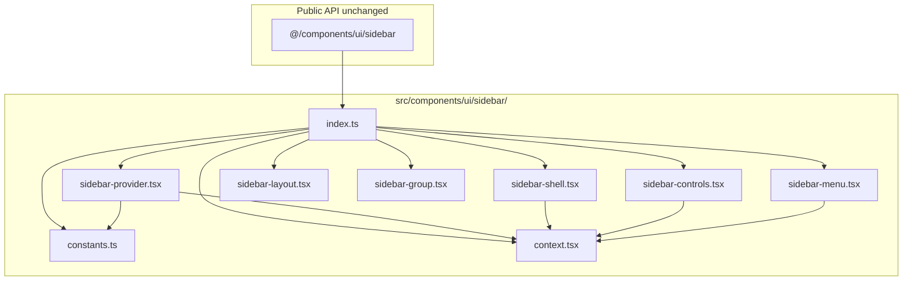

# Phase 8 Epic 4 — Decompose the sidebar primitive

**Active phase:** [Phase 8 Tech Debt Audit Remediation](docs/prds/phase-8-tech-debt-remediation.prd.md) (`Active`)

**Branch:** `phase-8/tech-debt-remediation` (already checked out — Epics 1–3 are `Complete`; no branch setup needed)

**Finding addressed:** F006 only (story 4.1)

This epic is **sequential** — one cohesive refactor with shared context/state; not a parallel-build candidate.

---

## Problem

[`src/components/ui/sidebar.tsx`](src/components/ui/sidebar.tsx) is a **726-line, multi-responsibility shell**: provider/state, mobile sheet shell, desktop layout, layout regions, groups, and the full menu subsystem (including a `cva` variant block) all live in one file with **25 named exports**. That violates the depth guidance in [ADR-0001](docs/adr/ADR-0001-component-sizing-by-depth.md) — wide interface from many responsibilities, not “large but deep.”

**Consumers today** (must not change imports):

| File | Symbols used |
|------|----------------|
| [`admin-shell.tsx`](src/app/admin/_components/admin-shell.tsx) | `SidebarProvider`, `SidebarInset` |
| [`admin-sidebar.tsx`](src/app/admin/_components/admin-sidebar.tsx) | `Sidebar`, layout/group/menu primitives, `SidebarRail` |
| [`admin-nav-user.tsx`](src/app/admin/_components/admin-nav-user.tsx) | `SidebarMenu*`, `useSidebar` |

Existing smoke tests mock `@/components/ui/sidebar` as a whole ([`admin-shell.unit.test.tsx`](src/app/admin/_components/admin-shell.unit.test.tsx), [`admin-sidebar.unit.test.tsx`](src/app/admin/_components/admin-sidebar.unit.test.tsx), [`admin-nav-user.unit.test.tsx`](src/app/admin/_components/admin-nav-user.unit.test.tsx)) — the public barrel must stay stable.

---

## Target architecture

Split by **responsibility**, not arbitrary LOC targets. `SidebarProvider` remains the orchestrator (context, cookie persistence, keyboard shortcut, mobile vs desktop toggle).



### Proposed module map

| Module | Responsibility | Exports |
|--------|----------------|---------|
| [`sidebar/constants.ts`](src/components/ui/sidebar/constants.ts) | Width/cookie/shortcut tokens | `SIDEBAR_*` constants (internal; not re-exported unless already public — today they are module-private) |
| [`sidebar/context.tsx`](src/components/ui/sidebar/context.tsx) | React context + hook | `useSidebar`, context type (internal) |
| [`sidebar/sidebar-provider.tsx`](src/components/ui/sidebar/sidebar-provider.tsx) | State orchestration | `SidebarProvider` |
| [`sidebar/sidebar-shell.tsx`](src/components/ui/sidebar/sidebar-shell.tsx) | Mobile `Sheet` + desktop fixed sidebar | `Sidebar` |
| [`sidebar/sidebar-controls.tsx`](src/components/ui/sidebar/sidebar-controls.tsx) | Interactive toggle/input chrome | `SidebarTrigger`, `SidebarRail`, `SidebarInput` |
| [`sidebar/sidebar-layout.tsx`](src/components/ui/sidebar/sidebar-layout.tsx) | Structural layout wrappers | `SidebarHeader`, `SidebarFooter`, `SidebarContent`, `SidebarSeparator`, `SidebarInset` |
| [`sidebar/sidebar-group.tsx`](src/components/ui/sidebar/sidebar-group.tsx) | Group composition | `SidebarGroup`, `SidebarGroupLabel`, `SidebarGroupAction`, `SidebarGroupContent` |
| [`sidebar/sidebar-menu.tsx`](src/components/ui/sidebar/sidebar-menu.tsx) | Menu tree + `sidebarMenuButtonVariants` cva + tooltip-collapsed behavior | All `SidebarMenu*` exports |
| [`sidebar/index.ts`](src/components/ui/sidebar/index.ts) | Barrel — same 25 exports as today | Full public surface |

### Public import path (no consumer edits)

Replace the monolith with a **thin shim** at the original path so resolution and shadcn tooling stay predictable:

- [`src/components/ui/sidebar.tsx`](src/components/ui/sidebar.tsx) becomes a one-line re-export: `export * from './sidebar/index'` (or equivalent named re-exports matching today exactly).
- Move all implementation into `src/components/ui/sidebar/`.

**Do not** rename exports, change prop signatures, or alter `data-slot` / `data-sidebar` attributes — admin styling and future shadcn diffs depend on them.

---

## Implementation steps

### 1. Scaffold the directory (move, don’t rewrite)

- Create `src/components/ui/sidebar/` and **lift code verbatim** from the monolith into the modules above — this is a structural split, not a behavior refactor.
- **`'use client'` placement** — add the directive only to modules that use hooks, context, or browser APIs:
  - **With `'use client'`:** `context.tsx`, `sidebar-provider.tsx`, `sidebar-shell.tsx`, `sidebar-controls.tsx`, `sidebar-menu.tsx`
  - **Without `'use client'`:** `sidebar-layout.tsx`, `sidebar-group.tsx` (pure markup), `constants.ts`, `index.ts`, and the [`sidebar.tsx`](src/components/ui/sidebar.tsx) barrel shim (re-exports only; no directive needed)
- Shared imports (`cn`, Radix `Slot`, shadcn `Button`/`Sheet`/`Tooltip`/`Skeleton`, `useIsMobile`) stay local to the modules that need them — no new shared “sidebar-utils” abstraction.

### 2. Wire the barrel

- [`sidebar/index.ts`](src/components/ui/sidebar/index.ts) re-exports the same 25 symbols currently listed at lines 701–726 of the monolith.
- Slim [`sidebar.tsx`](src/components/ui/sidebar.tsx) to re-export from the barrel only.

### 3. Verify compile surface

- Grep confirms only three app files import `@/components/ui/sidebar` (admin shell/sidebar/nav-user) — none should need edits.
- Run `pnpm type-check` — catches missing exports or broken internal imports immediately.

### 4. Quality gate

```bash
pnpm type-check && pnpm lint && pnpm format-check && pnpm test:ci
```

No new sidebar-specific tests are required by the PRD success criteria (behavior-preserving refactor). Existing admin smoke tests should pass unchanged because they mock the public module path.

### 5. Manual QA checklist

Exercise the admin sidebar end-to-end (desktop + narrow viewport):

- [ ] Sidebar renders on `/admin` and `/admin/users`
- [ ] Collapse to icon rail (rail trigger + `SidebarRail` hit area)
- [ ] Collapsed icon items show tooltip on hover (non-mobile)
- [ ] Mobile: sidebar opens as sheet; closes on navigate/toggle
- [ ] Keyboard shortcut **Cmd/Ctrl+B** toggles sidebar
- [ ] Collapse state persists via cookie across refresh
- [ ] `AdminNavUser` dropdown still works (uses `useSidebar` + menu primitives)
- [ ] Main content area (`SidebarInset`) layout unchanged

### 6. Audit resolution

After code verification, move **F006** from the open findings table to **Resolved** in [`TECH_DEBT_AUDIT.md`](TECH_DEBT_AUDIT.md) with date **2026-07-05** (or the actual completion date) and a one-line note pointing at the new `ui/sidebar/` layout. Update the executive summary line that still lists `sidebar.tsx` as a churn magnet if it remains stale after the split.

### 7. Mark epic complete

When implementation, quality gate, manual QA, and audit sync are done, run **`/mark-epic-complete`** so Epic 4 gets the `` `Complete` `` tag in the active PRD. `plan-next-epic` does not edit PRD files.

---

## Success criteria (from PRD story 4.1)

- No resulting module carries a **wide multi-responsibility surface** (provider = state; shell = responsive layout; controls = toggle/rail/input; menu = interactive nav primitives; layout/group = thin structural wrappers including `SidebarInset`).
- All existing `@/components/ui/sidebar` imports compile with **zero consumer diffs**.
- Sidebar behavior is **identical** (cookie, keyboard shortcut, mobile sheet, icon collapse, tooltips).
- `pnpm pre-push` green.

## Out of scope (later epics)

- Profile form decomposition (F007 — Epic 5)
- Admin actions refactor (F008 — Epic 5)
- Renaming `data-table1` (F009 — Epic 7)
- Adding dedicated sidebar primitive unit tests (optional follow-up; not required for this epic)
