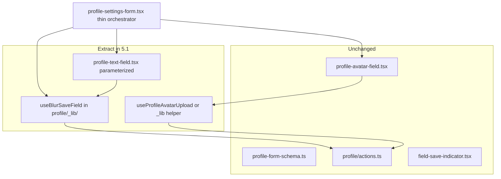

# Phase 8 Epic 5 — Refactor form, actions & env loading

**Active phase:** [Phase 8 Tech Debt Audit Remediation](docs/prds/phase-8-tech-debt-remediation.prd.md) (`Active`)

**Branch:** `phase-8/tech-debt-remediation` (already checked out — Epics 1–4 are `Complete`)

**Findings addressed:** F007, F008, F026, F049, F055, F057, F058 (stories 5.1–5.3)

This epic is a **good candidate for Build in Parallel** — three tracks with mostly disjoint file ownership (profile form, admin actions, env module). Story 5.2 consumes `createServiceClient` but does not need to land after 5.3. Write the plan sequentially; parallel agents can take one story each.

**Parallel file ownership (do not cross tracks):**


| Track | Exclusive files                                                                                                                                                                                                                                                                                                                                                         |
| ----- | ----------------------------------------------------------------------------------------------------------------------------------------------------------------------------------------------------------------------------------------------------------------------------------------------------------------------------------------------------------------------- |
| 5.1   | `src/app/(app)/profile/_components/`, `src/app/(app)/profile/_lib/` (profile form only)                                                                                                                                                                                                                                                                                 |
| 5.2   | `src/app/admin/users/actions.ts`, new `_lib/` helpers (`assert-admin-caller`, `map-users-action-fault`, `run-role-mutation`) — **must not modify** `[list-admin-users.ts](src/app/admin/users/_lib/list-admin-users.ts)`                                                                                                                                                |
| 5.3   | `[src/utils/env.ts](src/utils/env.ts)`, `[src/supabase/client.ts](src/supabase/client.ts)`, `[server.ts](src/supabase/server.ts)`, `[service.ts](src/supabase/service.ts)`, `[proxy.ts](src/supabase/proxy.ts)`, `[scripts/admin/lib/env.ts](scripts/admin/lib/env.ts)`, `**[list-admin-users.ts](src/app/admin/users/_lib/list-admin-users.ts)**` (F057 alias removal) |


---

## Problem

Three areas violate the depth guidance from [ADR-0001](docs/adr/ADR-0001-component-sizing-by-depth.md):

1. **Profile form** — `[profile-settings-form.tsx](src/app/(app)`/profile/_components/profile-settings-form.tsx) (~320 lines) owns blur-save orchestration, in-flight guards, avatar upload, and two text fields in one client component.
2. **Admin actions** — `[actions.ts](src/app/admin/users/actions.ts)` (~300 lines) holds `assertAdminCaller`, three fault envelopes, and near-duplicate promote/demote blocks despite mutation logic already living in `[admin-role-mutations.ts](src/utils/admin-role-mutations.ts)`.
3. **Env loading** — three patterns ask "are Supabase env vars set?" differently: boolean gate in `[env.ts](src/utils/env.ts)`, throw in `[service.ts](src/supabase/service.ts)`, exit in `[scripts/admin/lib/env.ts](scripts/admin/lib/env.ts)`, plus non-null assertions in `[client.ts](src/supabase/client.ts)` and `[server.ts](src/supabase/server.ts)`.

---

## Story 5.1 — Decompose the profile settings form (F007)

**Goal:** Extract reusable blur-save machinery; keep the orchestrator thin. Preserve all save models exactly (blur-save, upload-on-complete, explicit-submit dialog elsewhere).

### Current responsibilities in one file


| Concern                                 | Lines (approx) | Must preserve                                              |
| --------------------------------------- | -------------- | ---------------------------------------------------------- |
| RHF + zod setup                         | 74–81          | Same schema, same defaultValues                            |
| Per-field save state + in-flight guards | 59–72, 92–97   | Dedup concurrent saves per field                           |
| `persistField` → `updateProfileAction`  | 99–147         | Error envelope branching, refresh policy                   |
| Display name blur handler               | 149–175        | Validate on blur, trim, skip no-op, **refresh on success** |
| Bio blur handler                        | 177–203        | Same but **no refresh**                                    |
| Avatar upload handler                   | 205–237        | Client upload → cache-bust → persist                       |
| Form-level error UI                     | 312–316        | InlineError / ErrorPanel by `kind`                         |


**Out of scope for 5.1:** `[actions.ts](src/app/(app)`/profile/actions.ts), `[profile-form-schema.ts](src/app/(app)`/profile/_lib/profile-form-schema.ts), password dialog, theme segment. Epic 6 handles avatar URL leak (F017) and profile read failure UX (F037).

### Target architecture




### Implementation steps

1. **Add `useBlurSaveField`** in `[src/app/(app)/profile/_lib/](src/app/(app)`/profile/_lib/) (profile-specific, not global — only consumer today per `[forms.mdc](.cursor/rules/forms.mdc)`). Encapsulate:
  - Per-field save state (`idle` / `saving` / `saved`)
  - `inFlightRef` guard
  - `lastSavedRef` for change detection
  - Shared `persistField` calling `updateProfileAction`
  - Factory for blur handlers: `(fieldName, payloadMapper, { refresh })`
2. **Add one parameterized text field component** — `[profile-text-field.tsx](src/app/(app)`/profile/_components/profile-text-field.tsx) — RHF `FormField` + label + `FieldSaveIndicator` + blur wiring, accepting props for field key, control type (`Input` vs `Textarea`), label/placeholder, and refresh flag. Wire to `useBlurSaveField`. The orchestrator renders two instances (display name with refresh, bio without); no separate per-field component files.
3. **Extract avatar orchestration** — small hook or `_lib/profile-avatar-upload.ts` wrapping `uploadUserAvatar` + `withAvatarCacheBust` + `persistField`. Keep `[profile-avatar-field.tsx](src/app/(app)`/profile/_components/profile-avatar-field.tsx) presentational (preview, validation, file input).
4. **Slim `ProfileSettingsForm`** to ~80–120 lines: form init, compose hook(s), render two `ProfileTextField` instances + avatar field, form-level error panel. No field-level logic remains.

### Tests

- **Keep** `[profile-settings-form.integration.test.tsx](src/app/(app)`/profile/_components/profile-settings-form.integration.test.tsx) as the behavior contract (blur-save, validation skip, in-flight dedup, fault errors, refresh behavior for display name vs bio via the shared component).
- **Add** unit tests for `useBlurSaveField` covering in-flight guard, no-op skip, and refresh flag — lets integration tests stay focused.
- **Optional** unit test for `ProfileTextField` prop wiring (control type, refresh flag passed through to hook) if not fully covered by hook + integration tests.
- Optional: one avatar upload integration test once orchestration is extracted (currently untested end-to-end).

### Success criteria (from PRD)

Form behavior identical; orchestrator no longer holds field-level logic.

---

## Story 5.2 — Slim admin user actions (F008, F049)

**Goal:** `[actions.ts](src/app/admin/users/actions.ts)` holds thin action exports only; gate and fault mapping live in route `_lib/`.

### Extract to `_lib/`


| New module                  | Contents                                                                                                                                                         |
| --------------------------- | ---------------------------------------------------------------------------------------------------------------------------------------------------------------- |
| `assert-admin-caller.ts`    | `assertAdminCaller`, result types — canonical gated-action pattern referenced by `[security.mdc](.cursor/rules/security.mdc)` and `[LEXICON.md](LEXICON.md)`     |
| `map-users-action-fault.ts` | Shared fault mapper: `(logTag, userMessage, caught) → UsersActionError` — DRY the three identical catch blocks in list/promote/demote                            |
| `run-role-mutation.ts`      | Shared promote/demote envelope: assert → validate userId → optional pre-guard (self-demotion) → `createServiceClient()` → mutation → not_found mapping → success |


### `actions.ts` after refactor

- Re-export action signatures and types consumed by `[users-table.tsx](src/app/admin/users/_components/users-table.tsx)` / `[promote-demote-dialog.tsx](src/app/admin/users/_components/promote-demote-dialog.tsx)`
- `listUsersAction`: assert → validate page input → delegate to `[list-admin-users.ts](src/app/admin/users/_lib/list-admin-users.ts)` (import only — **do not modify that file**; F057 changes belong to Story 5.3) → fault mapper on catch
- `promoteUserAction` / `demoteUserAction`: thin wrappers calling `runRoleMutation` with different mutation fn, log tag, and fault message

**Do not change:** `[admin-role-mutations.ts](src/utils/admin-role-mutations.ts)` business logic, `[list-admin-users.ts](src/app/admin/users/_lib/list-admin-users.ts)`, or CLI scripts — they already share mutation core; env/F057 work is Story 5.3 only.

### Tests

- Update `[actions.unit.test.ts](src/app/admin/users/actions.unit.test.ts)` — behavior unchanged; may mock `_lib` helpers or test them directly in new unit files.
- Add focused unit tests for `runRoleMutation` (not_found → operational, self-demotion guard, fault catch).

### Doc touchpoints (after code lands)

Update canonical path references if `assertAdminCaller` moves: `[security.mdc](.cursor/rules/security.mdc)`, `[error-handling.mdc](.cursor/rules/error-handling.mdc)`, `[LEXICON.md](LEXICON.md)`.

### Success criteria (from PRD)

Actions file holds thin exports; promote and demote share one mutation envelope.

---

## Story 5.3 — One env-loading module (F026, F055, F057, F058)

**Goal:** Exactly one module answers "are Supabase env vars set?" with consumer-appropriate failure modes.

### Expand `[src/utils/env.ts](src/utils/env.ts)`

Layered API (public vs service are different var subsets — not one boolean):


| Export                    | Behavior                                   | Replaces                                               |
| ------------------------- | ------------------------------------------ | ------------------------------------------------------ |
| `hasPublicSupabaseEnv()`  | Boolean — URL + publishable key            | `hasEnvVars`                                           |
| `getPublicSupabaseEnv()`  | Throws with clear `[supabase-env]` message | `!` in client.ts, server.ts; guarded reads in proxy.ts |
| `getServiceSupabaseEnv()` | Throws — URL + secret key                  | private `getServiceEnv` in service.ts                  |
| `loadServiceEnvForCli()`  | `console.error` + `process.exit(1)`        | `loadAdminEnv` in scripts/admin/lib/env.ts             |


### Consumer rewiring


| File                                                                                   | Change                                                                                                                                                                 |
| -------------------------------------------------------------------------------------- | ---------------------------------------------------------------------------------------------------------------------------------------------------------------------- |
| `[client.ts](src/supabase/client.ts)`                                                  | `getPublicSupabaseEnv()` — removes F026 `!` assertions                                                                                                                 |
| `[server.ts](src/supabase/server.ts)`                                                  | Same                                                                                                                                                                   |
| `[proxy.ts](src/supabase/proxy.ts)`                                                    | Keep early `hasPublicSupabaseEnv()` bypass (dev clone-and-configure); use `getPublicSupabaseEnv()` only on the configured path — **preserve F039 production behavior** |
| `[service.ts](src/supabase/service.ts)`                                                | Import `getServiceSupabaseEnv()`; **delete `getServiceEnvForFetch` alias** (F057)                                                                                      |
| `[list-admin-users.ts](src/app/admin/users/_lib/list-admin-users.ts)`                  | Replace `getServiceEnvForFetch` import with direct `getServiceSupabaseEnv()` (or equivalent single export from shared env module) — **Story 5.3 exclusive**            |
| `[scripts/admin/lib/env.ts](scripts/admin/lib/env.ts)`                                 | Thin wrapper calling `loadServiceEnvForCli()` or re-export                                                                                                             |
| `[scripts/admin/lib/service-client.ts](scripts/admin/lib/service-client.ts)`           | Keep its own client construction; consume the new shared env module only (no merge into app `createServiceClient` — out of scope)                                      |
| `[landing-auth-buttons.tsx](src/app/(marketing)`/_components/landing-auth-buttons.tsx) | `hasPublicSupabaseEnv()`                                                                                                                                               |


Rename `hasEnvVars` → `hasPublicSupabaseEnv` in one pass (update imports + `[env.unit.test.ts](src/utils/env.unit.test.ts)`, `[proxy.unit.test.ts](src/supabase/proxy.unit.test.ts)`, `[proxy.no-env.unit.test.ts](src/supabase/proxy.no-env.unit.test.ts)`).

### Tests

- Expand `env.unit.test.ts` for throw/exit paths (mock `process.exit` for CLI wrapper).
- Adjust `[service.unit.test.ts](src/supabase/service.unit.test.ts)` — drop alias describe block; keep throw-on-missing tests on single export.
- Update `[list-admin-users.unit.test.ts](src/app/admin/users/_lib/list-admin-users.unit.test.ts)` if import path changes for F057.
- Run proxy no-env tests to confirm dev bypass unchanged.

### Success criteria (from PRD)

One module; no non-null assertions on Supabase env vars; no passthrough alias.

---

## Quality gate (all stories)

```bash
pnpm type-check && pnpm lint && pnpm format-check && pnpm test:ci
```

## Audit resolution

After each story, verify in code and move findings to **Resolved** in `[TECH_DEBT_AUDIT.md](TECH_DEBT_AUDIT.md)` with date — never from memory:

- 5.1 → F007
- 5.2 → F008, F049
- 5.3 → F026, F055, F057, F058

## Manual testing checklist

**Profile (5.1)**

- [x] Blur-save display name — inline "Saved" indicator, nav chrome updates after refresh
- [x] Blur-save bio — saves without full-page refresh
- [x] Tab quickly between fields — no duplicate saves or stacked indicators
- [ ] Invalid display name on blur — does not persist
- [ ] Avatar upload — preview updates, saves on complete, indicator works
- [ ] Simulate server fault — ErrorPanel renders; operational error — InlineError

**Admin (5.2)**

- [ ] List users, search, pagination unchanged
- [ ] Promote and demote still show success toast; self-demotion blocked
- [ ] Non-admin session gets forbidden envelope (no throw)

**Env (5.3)**

- [ ] Dev with missing `.env` — landing EnvVarWarning, proxy skip unchanged
- [ ] Dev with env configured — login, profile, admin all work
- [ ] `pnpm promote-admin` / `list-admins` still fail clearly when secret key missing

---

## Close-out

When all stories pass quality gates and audit findings are resolved, run `**/mark-epic-complete**` to tag Epic 5 `Complete` in the active PRD.