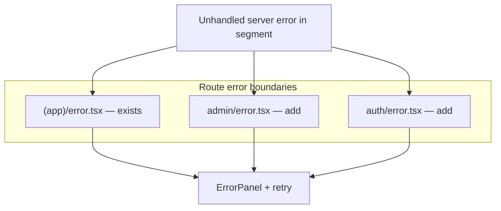

# Phase 8 Epic 6 — Runtime & error-handling hygiene

**Active phase:** [Phase 8 Tech Debt Audit Remediation](docs/prds/phase-8-tech-debt-remediation.prd.md) (`Active`)

**Branch:** `phase-8/tech-debt-remediation` (already checked out — Epics 1–5 are `Complete`)

**Findings addressed (audit IDs):** F016, F017, F018, F035, F037, F038, F039, F047, F048, F050 — mapped to PRD stories 6.1–6.5 below.

**Audit vs PRD ID note:** Story 6.5 in the PRD reuses F018/F047/F048 for different items than `TECH_DEBT_AUDIT.md`. When implementing, follow the PRD story text; when resolving in the audit file, always use the audit's own IDs matched by finding content (see Audit resolution section).

This epic is a **partial Build in Parallel** candidate. Stories **6.3**, **6.4**, and **6.5** (plus OG compression in **6.1**) have disjoint file ownership and can run in parallel. Stories **6.1** (avatar URL lifecycle) and **6.2** (avatar error surfacing) both touch [`profile-avatar-field.tsx`](src/app/(app)/profile/_components/profile-avatar-field.tsx) — land those sequentially in one track.

---

## Problem

Epic 5 fixed structure; Epic 6 fixes **runtime behavior and user-visible failure modes** the audit flagged:

| Area | Current gap |
|------|-------------|
| Production bundle | React Query Devtools ship in every build ([`layout.tsx:53`](src/app/layout.tsx)) |
| Avatar preview | Object URLs created but never revoked; preview persists after successful save ([`profile-avatar-field.tsx:56`](src/app/(app)/profile/_components/profile-avatar-field.tsx)) |
| Swallowed errors | Field-level empty `catch`; profile DB read returns empty fields with no fault signal ([`get-current-user-profile.ts:30-39`](src/app/(app)/_lib/get-current-user-profile.ts)) |
| Error boundaries | Only [`(app)/error.tsx`](src/app/(app)/error.tsx) exists — admin/auth use Next default |
| Missing env | Dev bypass is correct; production still allows public routes and redirects protected routes to login instead of hard-failing ([`proxy.ts:16-24`](src/supabase/proxy.ts)) |
| Template defaults | Bare `QueryClient()`, implicit logo `href`, undocumented resize bound |

Unlike Epic 5, **some stories change user-visible behavior** — that is intentional (F035, F037, F038, F039).

---

## Story 6.1 — Production bundle & resource fixes (F016, F017, F050)

### 6.1a — Gate React Query Devtools (F016)

**File:** [`src/app/layout.tsx`](src/app/layout.tsx)

**Current:** Static import + unconditional `<ReactQueryDevtools initialIsOpen={false} />` inside the root layout.

**Approach (minimal):** Extract a tiny client wrapper (e.g. `src/providers/react-query-devtools.tsx`) that returns `null` unless `process.env.NODE_ENV === 'development'`, or use `next/dynamic(() => import('@tanstack/react-query-devtools').then(m => m.ReactQueryDevtools), { ssr: false })` guarded by the same check. Keep devtools inside `ReactQueryProvider` so they share context.

**Success:** Production bundle analysis / build output no longer includes devtools; dev experience unchanged.

### 6.1b — Revoke avatar preview object URLs (F017)

**File:** [`src/app/(app)/profile/_components/profile-avatar-field.tsx`](src/app/(app)/profile/_components/profile-avatar-field.tsx)

**Current:** `URL.createObjectURL(file)` on every pick; no `revokeObjectURL`; `previewUrl` not cleared after successful upload so blob URL keeps winning over saved `avatarUrl`.

**Changes:**
1. Track the active blob URL in a ref (or state) and **revoke the previous URL** before assigning a new one.
2. **`useEffect` cleanup** on unmount — revoke any active preview URL.
3. After successful `onUpload`, **clear `previewUrl`** so `imageSrc` falls back to the persisted `avatarUrl` from form state (hook already updates form value on success in [`use-profile-avatar-upload.ts`](src/app/(app)/profile/_lib/use-profile-avatar-upload.ts)).
4. On validation failure or upload error, revoke and clear preview before resetting the file input.

**Tests (targeted):** Add or extend a unit test on the avatar field (mock `onUpload`) asserting preview clears after success and that `revokeObjectURL` is called — mock `URL.createObjectURL` / `URL.revokeObjectURL` at the boundary.

### 6.1c — Compress OG images (F050)

**Files:** [`src/app/opengraph-image.png`](src/app/opengraph-image.png), [`src/app/twitter-image.png`](src/app/twitter-image.png) (~479 KB each)

**Approach:**
1. Re-encode both PNGs (lossless or high-quality lossy) targeting a material size reduction with visually identical output at social-preview dimensions.
2. Add a one-line **re-skin note** in [`README.md`](README.md) (Quick start or a small "Branding" bullet): replacing OG/Twitter images lives under `src/app/` per Next.js metadata file conventions.

**Success:** File sizes materially smaller; appearance unchanged at preview size.

---

## Story 6.2 — Surface swallowed errors (F035, F037)

### 6.2a — Avatar upload errors (F035)

**Files:** [`profile-avatar-field.tsx`](src/app/(app)/profile/_components/profile-avatar-field.tsx), [`use-profile-avatar-upload.ts`](src/app/(app)/profile/_lib/use-profile-avatar-upload.ts)

**Current:** Epic 5 moved real error handling into the hook (`setFileError` for `AvatarUploadError`, `setFormError` for faults). The field still has an empty `catch` that resets preview without calling `onFileError` — mostly dead because the hook swallows throws, but it violates the error-handling rule and would silently fail if `onUpload` ever throws.

**Changes:**
1. **Remove the redundant empty `catch`** in the field — let the hook own all upload error surfacing (already wired to `InlineError` / `ErrorPanel` in [`profile-settings-form.tsx`](src/app/(app)/profile/_components/profile-settings-form.tsx)).
2. Coordinate with 6.1b: on hook-reported failure paths, revoke preview URL and reset file input in the field (either via an `onUpload` rejection contract or a callback prop — prefer keeping error state in the hook and preview cleanup in the field's `handleChange` finally block).

**Classification:** Operational upload failures → `InlineError` via `fileError`; unexpected failures → `ErrorPanel` via `formError` (already implemented).

### 6.2b — Profile read failure (F037)

**Files:** [`get-current-user-profile.ts`](src/app/(app)/_lib/get-current-user-profile.ts), [`profile/page.tsx`](src/app/(app)/profile/page.tsx)

**Current:** On `profiles` query error, logs and returns a partial profile with null fields — user sees empty name/avatar/bio with no explanation.

**Changes:**
1. Extend `CurrentUserProfile` (or return a small wrapper) with an explicit flag, e.g. `profileLoadFailed: boolean`.
2. On query error, set `profileLoadFailed: true` while still returning auth-derived fields (`userId`, `email`, `isAdmin`) so the shell can render.
3. On [`profile/page.tsx`](src/app/(app)/profile/page.tsx), when the flag is set, render an **`ErrorPanel`** above the form:

   > "We couldn't load your profile. Try refreshing the page."

   Do **not** toast; faults use `ErrorPanel` per [`error-handling.mdc`](.cursor/rules/error-handling.mdc).

4. [`app-shell.tsx`](src/app/(app)/_components/app-shell.tsx) can keep using cached partial data for nav initials — the profile page owns the fault banner where empty fields would mislead.

**Tests:** Unit test on `getCurrentUserProfile` (mock Supabase) asserting `profileLoadFailed: true` when the profiles query errors.

---

## Story 6.3 — Error boundaries for admin and auth (F038)

**Reference:** [`src/app/(app)/error.tsx`](src/app/(app)/error.tsx) — client boundary, `ErrorPanel`, retry button, contextual navigation.

**Add:**
- [`src/app/admin/error.tsx`](src/app/admin/error.tsx) — fault UI for admin console; retry + link to [`PROFILE_PATH`](src/constants/app-paths.ts) (non-admins already redirected by proxy).
- [`src/app/auth/error.tsx`](src/app/auth/auth/error.tsx) → actually `src/app/auth/error.tsx` — fault UI for auth flows; retry + link to login or home.

**Pattern:** Copy the `(app)` boundary structure; adjust copy and navigation links for context. Log with segment-specific tags (`[admin-error]`, `[auth-error]`). No shared abstraction needed (minimalism — two small files).

**Tests (optional, high value):** Lightweight render tests asserting `ErrorPanel` and retry button presence — only if coverage stays green without boilerplate.



---

## Story 6.4 — Fail closed in production (F039)

**Files:** [`src/supabase/proxy.ts`](src/supabase/proxy.ts), [`src/supabase/proxy.no-env.unit.test.ts`](src/supabase/proxy.no-env.unit.test.ts), [`README.md`](README.md)

**Scope decision (PRD):** Production **hard-errors** without Supabase env; dev clone-and-configure bypass **unchanged**.

**Current production no-env behavior** ([`proxy.ts:16-24`](src/supabase/proxy.ts)):
- Public routes (`/`, `/auth/**`) → 200 pass-through
- Protected routes → redirect to `/auth/login`

**Target behavior:**

| Environment | `hasPublicSupabaseEnv === false` |
|-------------|----------------------------------|
| `development` | Pass through all routes (unchanged) |
| `production` | Return **503** (or 500) with a clear plain-text/HTML body: Supabase env vars are not configured — not redirect, not silent public access |

**Implementation sketch:** Replace the production redirect block with `new NextResponse('…message…', { status: 503 })` for **all** paths when env is missing in production. Keep the early `return supabaseResponse` for development only.

**Tests:** Update [`proxy.no-env.unit.test.ts`](src/supabase/proxy.no-env.unit.test.ts):
- Dev `/profile` → still 200
- Prod `/profile`, prod `/`, prod `/auth/login` → all 503 with expected body snippet
- Remove or replace the "redirect protected routes to login" and "allow public routes" prod tests

**README:** In the env setup section (~lines 63–75), add a short paragraph documenting the **development-only auth proxy bypass** when Supabase env vars are absent — clone-and-configure UX is intentional; production deploys must set env or fail loudly.

---

## Story 6.5 — Small runtime defaults (audit F047, F048, F018)

### 6.5a — Query client defaults (audit **F047**; PRD story 6.5 cites F018)

**File:** [`src/providers/ReactQueryProvider.tsx`](src/providers/ReactQueryProvider.tsx)

**Current:** `new QueryClient()` — library defaults everywhere.

**Change:** Set conservative template `defaultOptions`:

```typescript
defaultOptions: {
  queries: {
    staleTime: 60_000,       // 1 min — avoids immediate refetch churn
    retry: 1,                // one retry, not the default 3
    refetchOnWindowFocus: false,
  },
}
```

No change to [`src/test/test-utils.tsx`](src/test/test-utils.tsx) test helper (`retry: false`) — tests stay deterministic.

### 6.5b — Logo link target required (audit **F048**; PRD story 6.5 cites F047)

**File:** [`src/components/seminova-logo.tsx`](src/components/seminova-logo.tsx)

**Current:** `href?: string` defaulting to `ADMIN_HOME` — only [`admin-sidebar.tsx`](src/app/admin/_components/admin-sidebar.tsx) relies on the implicit default.

**Change:**
1. Remove the `ADMIN_HOME` default; require explicit `href: string | null` — **`null` renders the static (non-link) mark** (replaces today's `href={undefined}` test pattern).
2. Update consumers to pass explicit targets:
   - `admin-sidebar.tsx` → `href={ADMIN_HOME}`
   - Existing explicit callers unchanged (`site-header`, `site-footer`, `auth/layout`, `landing-mobile-nav`)
3. Update [`seminova-logo.unit.test.tsx`](src/components/seminova-logo.unit.test.tsx) to use `href={null}` for static rendering.

### 6.5c — Avatar resize cap documentation (audit **F018**; PRD story 6.5 cites F048)

**Files:** [`src/utils/avatar-storage.ts`](src/utils/avatar-storage.ts) (at `resizeAvatarToWebp`), optionally [`src/constants/storage-paths.ts`](src/constants/storage-paths.ts)

**Change:** Add a brief `// debt:`-style or plain comment at the resize entry point stating:
- `AVATAR_MAX_DIMENSION` (256px) is the intentional main-thread bound for template scope
- Acceptable today; migrate to a Web Worker if products need larger source images

No worker implementation — documentation only per audit acceptance.

---

## Audit resolution & quality gate

After all stories pass review, sync [`TECH_DEBT_AUDIT.md`](TECH_DEBT_AUDIT.md) per the audit skill's living-file model — verify each fix in code before moving a row.

### Resolving Epic 6 findings

**Use `TECH_DEBT_AUDIT.md`'s finding IDs and descriptions — not the PRD's story finding IDs.** Match each row in the open findings table by its **content** (file path + issue description), move it to **Resolved** with the implementation date, and remove it from the open table. Do not rename or renumber rows to match PRD story labels.

Where the audit ID and PRD story ID diverge for the same work, keep the **audit ID** on the Resolved row and add a parenthetical PRD cross-reference:

| Audit ID | Finding (match by content) | PRD story |
| -------- | -------------------------- | --------- |
| F016 | React Query Devtools unconditional in root layout | 6.1 |
| F017 | Avatar preview object URLs never revoked | 6.1 |
| F050 | Oversized static OG image | 6.1 |
| F035 | Avatar upload catch swallows error | 6.2 |
| F037 | Profile read failure returns silent empty fields | 6.2 |
| F038 | Missing `error.tsx` on admin and auth route groups | 6.3 |
| F039 | Proxy skips auth when Supabase env missing | 6.4 |
| F047 | QueryClient default options not tuned | 6.5 *(PRD labels this F018)* |
| F048 | Logo default `href={ADMIN_HOME}` | 6.5 *(PRD labels this F047)* |
| F018 | Main-thread canvas resize — document 256px cap | 6.5 *(PRD labels this F048)* |

**Resolved row example (ID mismatch):**

> 2026-07-05 — **F047:** Set conservative `QueryClient` defaultOptions in `ReactQueryProvider.tsx` (resolved under PRD story 6.5).

Also update the prior partial F038 Resolved entry (2026-07-04) if the new admin/auth boundaries fully close the finding — replace or extend so the Resolved narrative reflects complete coverage.

Clear matching quick-win checkboxes (F016, F017, F035) in the audit file.

Then run full quality gate:

```bash
pnpm type-check && pnpm lint && pnpm format-check && pnpm test:ci
```

4. Run **`/mark-epic-complete`** once implementation is fully finished — this tags Epic 6 `Complete` in the active PRD.

---

## Manual testing checklist

- **Devtools:** `pnpm build && pnpm start` — confirm devtools absent in production; `pnpm dev` — devtools still available.
- **Avatar:** Upload twice in a row on `/profile` — no stale preview, no memory leak symptoms; force a bad upload (e.g. disconnect network mid-upload) — inline or panel error visible, not silent reset.
- **Profile read fault:** Temporarily break profiles RLS or mock a DB error — profile page shows fault panel, not blank fields pretending to be empty profile.
- **Error boundaries:** Throw in an admin server component (temporary) — admin fault UI, not Next default; same for auth segment.
- **No-env proxy:** With env vars removed, `NODE_ENV=development pnpm dev` — all routes reachable; production build/start without env — 503 on all routes with clear message.
- **Logo:** Admin sidebar logo links to `/admin`; marketing/auth logos still link correctly; static `href={null}` case still renders without link.
- **OG images:** Inspect compressed file sizes; spot-check social preview appearance.
