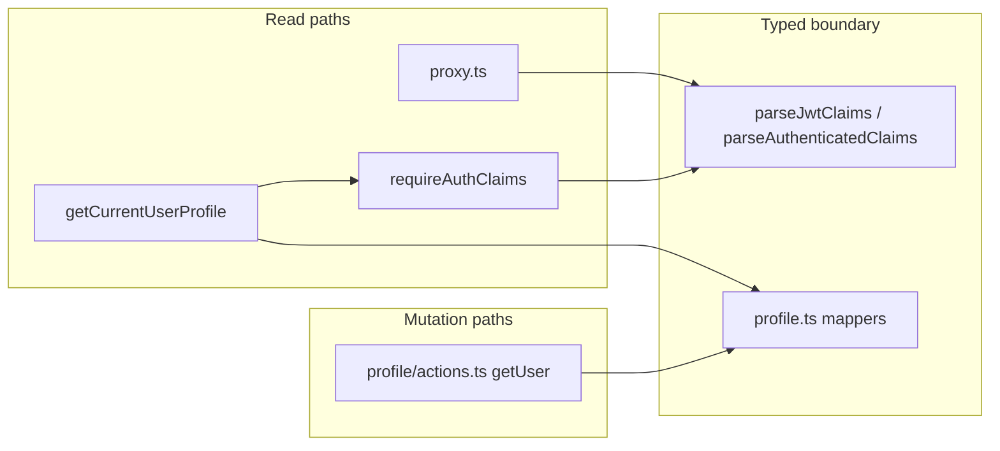

# Phase 8 Epic 7 — Types, naming & docs

**Active phase:** [Phase 8 Tech Debt Audit Remediation](docs/prds/phase-8-tech-debt-remediation.prd.md) (`Active`)

**Branch:** `phase-8/tech-debt-remediation` (already checked out — Epics 1–6 are `Complete`)

**Findings addressed:** F009, F021, F023, F024, F025, F027, F041, F042

**This is the last epic in Phase 8.** After implementation + audit resolution, run `/mark-epic-complete`; phase ship is a separate step via `ship-phase`.

Work is **sequential** (7.1 → 7.2 → 7.3). Stories 7.1 and 7.2 touch disjoint code files, but both 7.2 and 7.3 update [AGENTS.md](AGENTS.md) — keep AGENTS edits in order to avoid merge churn.

---

## Problem

Three remaining audit clusters block a clean TECH_DEBT sync:

| Cluster | Gap today |
|---------|-----------|
| **Domain types (F024–F027)** | [`Profile`](src/types/profile.ts) / `ProfileUpdate` have zero imports; profile read/actions use parallel camelCase DTOs; `AppMetadata = Record<string, unknown>`; proxy and several call sites use bare `as JwtClaims` casts |
| **Data-table naming (F009, F023)** | Canonical pattern lives in [`data-table1.tsx`](src/components/data-table1.tsx) with a `useDataTable` hook name that doesn't match the file |
| **Doc drift (F021, F041, F042)** | Read-vs-mutation auth split documented in [`require-auth.ts`](src/supabase/require-auth.ts) but not AGENTS.md; frozen archives still describe pre–Phase 6 `(admin)` / `/users` / `/protected` paths |

PRD scope decisions already locked: **keep** `Profile` as the spinoff domain-type pattern (do not delete). Epic is mostly non-behavioral, except **F027 proxy fail-closed** — treating unparseable claims as no session tightens the auth boundary; the phase PRD allows this because F027 is the finding itself.

---

## Story 7.1 — Wire the domain type pattern (F024, F025, F027)

### 7.1a — Extend profile domain types + mappers

**File:** [`src/types/profile.ts`](src/types/profile.ts)

Keep existing `Profile` / `ProfileUpdate` aliases. Add a minimal mapping layer so snake_case DB rows and camelCase UI shapes live in one place:

- A **profile fields subset** type (the three editable columns, snake_case) derived from `Profile`
- **Pure mappers:** row → camelCase view, partial camelCase → `ProfileUpdate` payload
- No new abstractions beyond what these two consumers need

### 7.1b — Wire profile read and actions

**Files:**
- [`src/app/(app)/_lib/get-current-user-profile.ts`](src/app/(app)/_lib/get-current-user-profile.ts)
- [`src/app/(app)/profile/actions.ts`](src/app/(app)/profile/actions.ts)

**Read path:** Type the Supabase select result as the profile fields subset; compose `CurrentUserProfile` from mapped profile fields + session enrichment (`userId`, `email`, `isAdmin`, `profileLoadFailed`). Remove the redundant `claims as JwtClaims` cast — `requireAuthClaims` already returns `AuthenticatedClaims`.

**Actions:** Type the update payload as a `Pick`/`Partial` of `ProfileUpdate` (not an inline object); type success `data` via the shared camelCase view. Keep zod validation in [`profile-form-schema.ts`](src/app/(app)/profile/_lib/profile-form-schema.ts) as the runtime boundary — do not change save models.

### 7.1c — Type `app_metadata` (F025)

**File:** [`src/utils/admin.ts`](src/utils/admin.ts)

Replace `AppMetadata = Record<string, unknown>` with a typed shape that preserves promote/demote merge behavior in [`admin-role-mutations.ts`](src/utils/admin-role-mutations.ts):

- Type `role` as **`string | null | undefined`** — do **not** use `typeof ADMIN_ROLE | string`; that union collapses to plain `string` in TypeScript and buys zero narrowing. Actual admin detection stays runtime-side in `isAdminFromAppMetadata` (`role === ADMIN_ROLE`).
- Keep an index signature if arbitrary keys must survive promote/demote spreads

Update auth-form casts (`login-form`, `update-password-form`, `auth/confirm/route`) to parse through the typed shape instead of `as AppMetadata`.

**Parse-failure fallback (redirect paths):** These call sites feed post-login admin-vs-profile redirect via `getPostAuthRedirectPath`. If metadata parsing fails where a cast previously "succeeded," **fail toward non-admin** — redirect to `/profile`, do not throw or block login. That is correct and safe: the proxy still gates `/admin/**` for non-admins.

### 7.1d — Centralize JWT claims parsing (F027)

**File:** [`src/utils/admin.ts`](src/utils/admin.ts) (or colocate with [`require-auth.ts`](src/supabase/require-auth.ts) if that reads cleaner)

Add shared helpers, e.g.:

- `parseJwtClaims(raw: unknown): JwtClaims | null` — validates object shape, optional `sub`/`email` strings, optional `app_metadata`
- `parseAuthenticatedClaims(raw: unknown): AuthenticatedClaims | null` — requires non-empty `sub`

**Behavior change (intentional):** Proxy fail-closed on unparseable claims is a real auth-boundary tightening — not a no-op refactor. Previously a malformed-but-truthy claims object could pass the admin gate via cast; after F027 it is treated like no session on protected routes. The phase PRD permits this because F027 is the finding.

**Wire consumers:**

| File | Change |
|------|--------|
| [`src/supabase/proxy.ts`](src/supabase/proxy.ts) | Parse claims before admin gate; treat unparseable claims like no session on protected routes (replace `user as JwtClaims`) — **fail-closed** |
| [`src/supabase/require-auth.ts`](src/supabase/require-auth.ts) | Use parser instead of bare cast after `getClaims` |
| [`src/app/admin/users/_lib/assert-admin-caller.ts`](src/app/admin/users/_lib/assert-admin-caller.ts) | Use parser |
| [`src/app/admin/users/page.tsx`](src/app/admin/users/page.tsx) | Use parser |
| [`get-current-user-profile.ts`](src/app/(app)/_lib/get-current-user-profile.ts) | Drop redundant cast |

**Pattern to mirror:** [`admin-auth-gate.tsx`](src/app/admin/_components/admin-auth-gate.tsx) — typed claims, no cast.

**Tests to update/add:**
- [`src/utils/admin.unit.test.ts`](src/utils/admin.unit.test.ts) — parser edge cases + existing `isAdmin` contract; auth-form parse-failure → non-admin redirect path
- [`src/supabase/proxy.unit.test.ts`](src/supabase/proxy.unit.test.ts) — malformed claims treated as unauthenticated
- **`check:auth-boundary` discovered-route tests** (e.g. [`src/supabase/proxy.no-env.unit.test.ts`](src/supabase/proxy.no-env.unit.test.ts) and any auth-boundary contract tests the script discovers) — must reflect the new fail-closed behavior, not only the unit file above
- [`src/supabase/require-auth.unit.test.ts`](src/supabase/require-auth.unit.test.ts)
- [`get-current-user-profile.unit.test.ts`](src/app/(app)/_lib/get-current-user-profile.unit.test.ts)
- [`profile/actions.unit.test.ts`](src/app/(app)/profile/actions.unit.test.ts) if payload typing changes surface

**Success:** `Profile` / `ProfileUpdate` have real consumers; `CurrentUserProfile` composes from mapped profile fields; role typing is honest (`string | null | undefined` + runtime gate); proxy admin gate uses validated claims with fail-closed semantics; auth-form metadata parse failures redirect non-admin without blocking login.



---

## Story 7.2 — Canonical data-table naming (F009, F023)

### Rename module

| From | To |
|------|-----|
| `src/components/data-table1.tsx` | `src/components/data-table-shell.tsx` |
| `useDataTable` | `useDataTableShell` |
| `UseDataTableOptions` | `UseDataTableShellOptions` |

**Keep unchanged:** `DataTableShell`, `DataTableColumnHeader`, `DataTableSkeletonBody` (separate file), column meta augmentation.

### Update imports (2 runtime consumers)

- [`src/app/admin/users/_components/users-table.tsx`](src/app/admin/users/_components/users-table.tsx) — import path + hook rename
- [`src/app/admin/users/_components/users-columns.tsx`](src/app/admin/users/_components/users-columns.tsx) — import path only

### Update living docs in this pass

- [AGENTS.md](AGENTS.md) — two `data-table1` path references (~lines 110, 161)
- [`.cursor/rules/data-tables.mdc`](.cursor/rules/data-tables.mdc) — add canonical module path + hook name to Reference Implementations
- [LEXICON.md](LEXICON.md) — link update

**Archived plans:** Do **not** bulk-edit `.cursor/plans/archive/` bodies (consistent with story 7.3 / F041). The archive README created in 7.3 will note that pre–Phase 8 plans may reference `data-table1`.

**Verification:** `rg 'data-table1|@/components/data-table1|useDataTable\b'` returns zero hits in `src/`, active docs, and living rules — archive README covers historical references.

**Success:** Canonical shell has a descriptive filename; hook/options names align with `DataTableShell`.

---

## Story 7.3 — Doc sync (F021, F041, F042)

### 7.3a — Mirror auth read/mutation split in AGENTS.md (F021)

**File:** [AGENTS.md](AGENTS.md) § Auth & session

Add one short paragraph **after** the existing read-path / ADR-0003 sentence, mirroring the docblock in [`require-auth.ts:59–66`](src/supabase/require-auth.ts):

- **Reads** (layouts, server components, gates, profile read): `requireAuthClaims` / `hasServerAuthSession` → cookie token + `getClaims(accessToken)` — never refreshes
- **Mutations** (server actions): `getUser()` at the trust boundary — Auth server validates the token
- **Refresh:** proxy-only; point to ADR-0003 and `require-auth.ts` / `server.ts`
- Reference live examples: [`profile/actions.ts`](src/app/(app)/profile/actions.ts), [`forms.mdc`](.cursor/rules/forms.mdc) step 1

Plain language only — no code blocks in AGENTS.md.

### 7.3b — Frozen context archive footnote (F042)

**File:** [docs/archive/CONTEXT_ARCHIVE.md](docs/archive/CONTEXT_ARCHIVE.md)

**Policy note:** `docs/DOC_RULES.md` marks `docs/archive/` as closed. Story 7.3 explicitly allows update **or** footnote. Prefer a **single top-of-file footnote** (after the header block, ~line 7) rather than rewriting Phase 3–5 narrative:

> Post–Phase 6 path note: admin moved from invisible `(admin)` + `/users` to `src/app/admin/` + `/admin/*`; non-admin landing moved from `/protected` to `/profile`. Historical entries below describe routes as shipped at the time. Current truth: AGENTS.md.

Stale lines to contextualize (not rewrite): ~69, 71, 104, 132, 215.

### 7.3c — Plans archive path-migration header (F041)

**New file:** [`.cursor/plans/archive/README.md`](.cursor/plans/archive/README.md)

Contents:

1. Purpose — historical Cursor plans, not shipped repo truth
2. **Phase 6 Epic 2 migration:** `src/app/(admin)/` → `src/app/admin/`; `/users` → `/admin/users`; admin home → `/admin`; non-admin post-auth → `/profile` (was `/protected`)
3. **Phase 8 Epic 7 naming:** canonical data-table shell is `data-table-shell.tsx` (was `data-table1.tsx`)
4. Do not bulk-edit archived plan bodies
5. Current truth: AGENTS.md + [`admin-paths.ts`](src/constants/admin-paths.ts)
6. Optional link: [`phase_6_epic_2_admin_namespace_4f36c748.plan.md`](.cursor/plans/archive/phase_6_epic_2_admin_namespace_4f36c748.plan.md)

**Success:** No living doc claims the old admin route-group as current; AGENTS.md documents the read/mutation split; archives have migration headers instead of bulk edits.

---

## Audit resolution

Per [TECH_DEBT_AUDIT.md](TECH_DEBT_AUDIT.md) living-file model and Epic 6 precedent:

- Move **F009, F021, F023, F024, F025, F027, F041, F042** to Resolved with date **2026-07-05** (or current date at implementation time)
- Verify each fix in code/docs before marking — never from memory
- Remove or update the "Things that look bad" / Top 5 bullets that reference these findings

---

## Quality gate

```bash
pnpm type-check && pnpm lint && pnpm format-check && pnpm test:ci
```

---

## Manual testing checklist

- **Profile:** Load `/profile` — display name, bio, avatar blur-save and upload still work; no type/runtime regressions
- **Admin users table:** `/admin/users` — search debounce, sort headers, skeleton loading unchanged after data-table rename
- **Auth flows:** Login as admin → lands on `/admin`; login as non-admin → `/profile`; admin gate still redirects non-admins; confirm login is not blocked when metadata shape is odd (falls back to non-admin redirect)
- **Proxy fail-closed:** Malformed claims on a protected route redirect to login (not silent admin access)
- **Docs:** Spot-check AGENTS.md auth paragraph and archive README read correctly; grep confirms no `data-table1` in active source/docs

---

## Close

When all stories pass the quality gate and audit findings are resolved, run **`/mark-epic-complete`** to tag Epic 7 `Complete` in the active PRD. Epic 7 is the final epic — after that, Phase 8 is ready for `ship-phase` (separate workflow).
