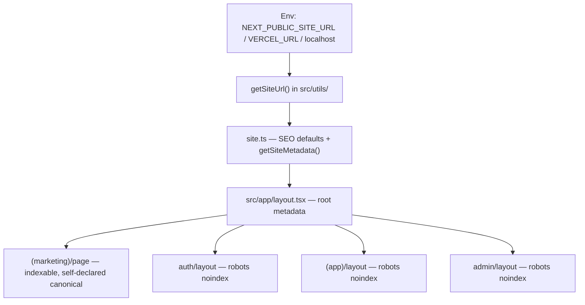

# Phase 9 Epic 1 — Metadata foundation

**Precondition:** confirm `git branch --show-current` outputs `phase-9/seo-geo`. If it doesn't match, halt and ask the user — do not switch branches.

**Branch:** `phase-9/seo-geo` was created from `main` for this first Phase 9 epic.

---

## What exists today

| Area | Current state |
|------|---------------|
| [src/config/site.ts](src/config/site.ts) | `getSiteMetadata()` sets `metadataBase`, title template, and description from `siteConfig` — **no default OG image** |
| [(marketing)/layout.tsx](src/app/(marketing)/layout.tsx) | Exists today (header/footer chrome) — **no metadata export needed**; root absence of noindex already makes marketing index-eligible |
| [src/app/layout.tsx](src/app/layout.tsx) | Inline `VERCEL_URL` → `metadataBase` logic (duplicated concern; Epic 4's `check:seo-base-url` will ban this pattern) |
| Route-group layouts | [auth](src/app/auth/layout.tsx), [(app)](src/app/(app)/layout.tsx), [admin](src/app/admin/layout.tsx) — **no `metadata` exports** |
| Individual pages | Marketing `/` has no page metadata; auth pages have no titles |
| [.env.example](.env.example) | Documents `VERCEL_URL` only — no explicit site URL for spinoffs |

**Partial head start from Phase 4 Epic 3** — site name, title template, and description already flow through `site.ts`; this epic extends that foundation rather than rebuilding it.

---

## Scope (from PRD)

**In scope — Story 1.1:** Centralize SEO defaults in site config; env-driven canonical base URL; root layout reads from config; every **public marketing** page gets intentional title (via template), description, and self-referential canonical.

**In scope — Story 1.2:** Marketing routes index-eligible; auth and authenticated surfaces (`/auth/**`, `(app)/**`, `/admin/**`) emit `noindex` as defense-in-depth.

**Out of scope (later epics):** robots.txt, sitemap, JSON-LD, dynamic OG images, `seo.mdc`, `check:seo-base-url`.

---

## Architecture



**Base URL resolution** (single helper, consumed everywhere — no inline URL construction in layouts):

1. `NEXT_PUBLIC_SITE_URL` if set (spinoff's production domain)
2. `https://${VERCEL_URL}` when Vercel auto-injects it
3. `http://localhost:3000` fallback for local dev

This preserves existing Vercel preview behavior while giving spinoffs an explicit override. Epic 4's deterministic check will target hardcoded URLs in route files — centralizing now avoids rework.

---

## Implementation steps

### 1. Add `getSiteUrl()` helper

- New file: [src/utils/site-url.ts](src/utils/site-url.ts) (alongside [src/utils/env.ts](src/utils/env.ts), not inside it — env.ts is Supabase-scoped today)
- Export `getSiteUrl(): URL` with the resolution order above
- Unit test: [src/utils/site-url.unit.test.ts](src/utils/site-url.unit.test.ts) — happy path per env priority, localhost fallback when unset

### 2. Extend site config SEO defaults (Story 1.1)

In [src/config/site.ts](src/config/site.ts):

- Add `defaultOgImage` to `SiteConfig` (absolute-path string, e.g. `/og-default.png`)
- Extend `getSiteMetadata(metadataBase: URL)` to include:
  - `openGraph` — title, description, images from config (absolute URLs resolved via `metadataBase`)
  - **Do not** set `alternates.canonical` at the root — Next.js inherits `alternates` to descendants, so a root `'/'` canonical would silently self-canonicalize any page that forgets to declare its own, deindexing real URLs toward home. Root supplies `metadataBase`, title template, description, and OG only.
- Add a minimal static OG asset: [public/og-default.png](public/og-default.png) (simple branded placeholder — spinoffs replace; Epic 3 later supersedes with dynamic generation)

Update [src/config/site.unit.test.ts](src/config/site.unit.test.ts) for new OG fields (no root canonical assertion).

**Convention for spinoffs:** each indexable page must declare its own self-referential canonical. Epic 4's `seo.mdc` will codify this; this epic demonstrates it on `/`.

### 3. Wire root layout (Story 1.1)

In [src/app/layout.tsx](src/app/layout.tsx):

- Replace inline `VERCEL_URL` logic with `getSiteUrl()`
- Pass result to `getSiteMetadata(getSiteUrl())`

### 4. Per-surface indexing policy (Story 1.2)

Export `metadata` with `robots: { index: false, follow: false }` from **noindex surfaces only**:

| Layout | Action |
|--------|--------|
| [(marketing)/layout.tsx](src/app/(marketing)/layout.tsx) | **No change** — layout already exists for chrome; root emits no noindex, so marketing is already index-eligible. Do not add redundant `{ index: true }`. |
| [auth/layout.tsx](src/app/auth/layout.tsx) | Add `robots` noindex — covers all `/auth/**` |
| [(app)/layout.tsx](src/app/(app)/layout.tsx) | Add `robots` noindex — covers `/profile` and future app routes |
| [admin/layout.tsx](src/app/admin/layout.tsx) | Add `robots` noindex — defense-in-depth on `/admin/**` |

### 5. Per-page metadata

**Indexable (public marketing) — title + canonical required (Story 1.1):**

- [(marketing)/page.tsx](src/app/(marketing)/page.tsx) — `alternates.canonical: '/'` (title inherits root default via template)

**Noindex surfaces — titles only, no canonical (canonical is an indexing signal; Story 1.1 scopes canonical to public pages):**

- Auth pages — `title` per screen (e.g. "Sign in", "Create account", "Forgot password", "Update password", "Check your email", "Authentication error") in each [src/app/auth/*/page.tsx](src/app/auth/login/page.tsx) file
- [(app)/profile/page.tsx](src/app/(app)/profile/page.tsx) — `title: 'Profile'`
- Admin pages — title on [src/app/admin/page.tsx](src/app/admin/page.tsx) and [src/app/admin/users/page.tsx](src/app/admin/users/page.tsx) if those pages exist without metadata today

Keep copy minimal and functional — this epic builds framework, not content tuning.

### 6. Env and docs sync

- [.env.example](.env.example) — add `NEXT_PUBLIC_SITE_URL` with comment (production canonical/OG base; Vercel fallback chain documented; do not set locally unless needed)
- Run `/sync-repo-docs` — update [README.md](README.md) env table and [AGENTS.md](AGENTS.md) implemented-features note for the metadata foundation

### 7. Quality gate

```bash
pnpm type-check && pnpm lint && pnpm format-check && pnpm test:ci
```

All must pass before closing the epic.

---

## Manual test checklist

1. **Local `/`** — View page source: `<title>Seminova</title>` (or template default), meta description present, `<link rel="canonical" href="http://localhost:3000/">`, OG tags present, **no** `noindex`
2. **Auth `/auth/login`** — Title shows "Sign in | Seminova"; `noindex` meta present; **no** canonical tag (noindex surface)
3. **`/profile` (logged in)** — Title "Profile | Seminova"; `noindex` present; no canonical tag
4. **`/admin` (admin user)** — `noindex` present
5. **Env override** — Set `NEXT_PUBLIC_SITE_URL=https://example.com` in `.env.local`, restart dev server, confirm canonical/OG URLs use `https://example.com` not localhost

---

## Risks and decisions

| Decision | Rationale |
|----------|-----------|
| `NEXT_PUBLIC_SITE_URL` over layout-only `VERCEL_URL` | PRD requires env-driven base URL; spinoffs need explicit production domain; Vercel URL remains automatic fallback |
| Static `og-default.png` now | Story 1.1 requires default OG in config; Epic 3 replaces with dynamic per-page images — static asset is the interim foundation |
| Admin gets noindex | Authenticated surface defense-in-depth; aligns with auth boundary intent even though proxy already gates it |
| No root canonical | Next.js inherits `alternates` — a root `'/'` canonical footguns future indexable pages; per-page self-referential canonical is the template convention (codified in Epic 4 `seo.mdc`) |
| No marketing layout robots edit | Marketing is index-eligible by default; explicit `{ index: true }` is redundant; layout file already exists for chrome |
| No canonical on noindex surfaces | Canonical is an indexing signal; Story 1.1 scopes it to public pages only |
| No `check:seo-base-url` yet | Epic 4.2 — but centralizing `getSiteUrl()` now means Epic 4 only adds enforcement, not a refactor |

---

## Close-out

When implementation is fully finished and the quality gate passes, run the **mark-epic-complete** skill to tag Epic 1 `Complete` in [docs/prds/phase-9-seo-geo.prd.md](docs/prds/phase-9-seo-geo.prd.md).
