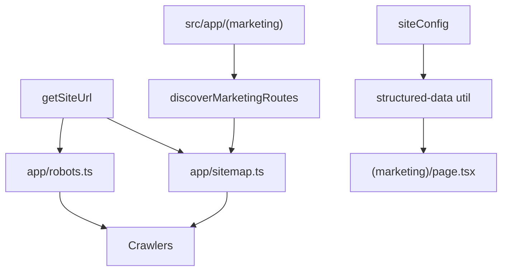

# Phase 9 Epic 2 — Crawler-facing surface

**Branch:** already on `phase-9/seo-geo` (Epic 1 complete; no first-epic branch setup needed).

## Goal

Ship the three Epic 2 stories from [docs/prds/phase-9-seo-geo.prd.md](docs/prds/phase-9-seo-geo.prd.md):


| Story | Deliverable                                                                                            |
| ----- | ------------------------------------------------------------------------------------------------------ |
| 2.1   | Opinionated `robots.txt` — allow retrieval/user-fetch bots, block training crawlers, sitemap reference |
| 2.2   | Dynamic `sitemap.xml` — marketing routes only, never auth/app/admin                                    |
| 2.3   | Typed JSON-LD helper — `Organization` + `WebSite` on `/`, values from site config                      |


Epic 1 already provides `[getSiteUrl()](src/utils/site-url.ts)`, `[siteConfig](src/config/site.ts)`, and per-surface noindex on auth/app/admin layouts.

## Architecture




## Step 1 — Promote route discovery to production utils

`[src/test/discover-app-routes.ts](src/test/discover-app-routes.ts)` is imported by proxy tests today but lives under `src/test/` (coverage-excluded). Production `sitemap.ts` cannot import from there.

- **Move** the file to `[src/utils/discover-app-routes.ts](src/utils/discover-app-routes.ts)` (canonical util home per code-minimalism ladder).
- **Update** the import in `[src/supabase/proxy.unit.test.ts](src/supabase/proxy.unit.test.ts)`.
- **Add** `discoverMarketingRoutes(appDir: string)` — walks only `appDir/(marketing)/` using the same `page.tsx` / `route.ts` discovery logic. Today this yields `['/']`; future marketing pages auto-included without touching sitemap code.
- **Add** a unit test asserting marketing routes are a subset of all discovered routes and that no `/auth`, `/profile`, or `/admin` paths appear.

This satisfies PRD 2.2's "cannot drift from the auth boundary" intent: sitemap source is the `(marketing)` route group, not the broader public proxy set (`/` + `/auth/**`).

## Step 2 — Story 2.1: Opinionated robots policy

**New util:** `[src/utils/robots-policy.ts](src/utils/robots-policy.ts)`

- Export `buildRobotsConfig(): MetadataRoute.Robots` (import `MetadataRoute` from `next`).
- **Default rule** (`userAgent: '*'`): `allow: '/'`.
- **Active disallow rules** — one rule per training crawler, each with `disallow: '/'`:
  - `GPTBot`, `ClaudeBot`, `CCBot`, `Google-Extended`, `Applebot-Extended`
- **Source-file comment block** (TypeScript comments, clearly labelled) listing the retrieval/user-fetch bots spinoffs may want to revisit: Googlebot, Bingbot, OAI-SearchBot, Claude-SearchBot, PerplexityBot, Applebot, DuckAssistBot, ChatGPT-User, Claude-User. These do not need separate `allow` rules when `*` already allows `/`.
- Set `sitemap: new URL('/sitemap.xml', getSiteUrl()).href`.

**New route file:** `[src/app/robots.ts](src/app/robots.ts)` — thin default export delegating to `buildRobotsConfig()`.

**Tests:** `[src/utils/robots-policy.unit.test.ts](src/utils/robots-policy.unit.test.ts)` — assert training crawlers each have a disallow rule, default allow exists, and sitemap URL uses the env-driven base.

## Step 3 — Story 2.2: Sitemap from marketing routes

**New route file:** `[src/app/sitemap.ts](src/app/sitemap.ts)`

- Call `discoverMarketingRoutes(join(process.cwd(), 'src/app'))`.
- Map each path to `{ url: new URL(path, getSiteUrl()).href }` (omit `lastModified` unless trivially useful — PRD doesn't require it).
- Return `MetadataRoute.Sitemap`.

**Tests:** `[src/utils/discover-app-routes.unit.test.ts](src/utils/discover-app-routes.unit.test.ts)` (or a small `sitemap-routes.unit.test.ts`) — marketing discovery contains `/`, excludes auth/app/admin paths; optionally test a pure `buildSitemapEntries()` helper if the route file stays too thin to cover.

## Step 4 — Story 2.3: Structured-data helper

**New util:** `[src/utils/structured-data.ts](src/utils/structured-data.ts)`

- Export `getOrganizationWebSiteJsonLd(siteUrl: URL)` returning a single `@graph` object with:
  - `Organization` — `name` from `siteConfig.name`, `url` from `siteUrl.origin`, `sameAs: [siteConfig.links.github]`
  - `WebSite` — `name`, `url`, `description` from site config
- Keep types as plain objects (`Record<string, unknown>` or a minimal interface) — no new dependency.

**Wire on landing page:** `[src/app/(marketing)/page.tsx](src/app/(marketing)`/page.tsx)

- Import helper + `getSiteUrl()`.
- Render one `<script type="application/ld+json">` via `dangerouslySetInnerHTML` with `JSON.stringify(...)` (standard Next.js pattern; data is server-controlled, not user input).

**Tests:** `[src/utils/structured-data.unit.test.ts](src/utils/structured-data.unit.test.ts)` — assert `@graph` contains both types, required fields populated from `siteConfig`, and `sameAs` includes the GitHub link.

## Step 5 — Quality gate and doc sync

Run the full agent workflow bar:

```bash
pnpm type-check && pnpm lint && pnpm format-check && pnpm test:ci
```

Manually verify in dev (`pnpm dev`):

- `http://localhost:3000/robots.txt` — training bots disallowed, sitemap line present
- `http://localhost:3000/sitemap.xml` — only `/` listed
- View source on `/` — valid JSON-LD with Organization + WebSite
- Optional: paste JSON-LD into [Google Rich Results Test](https://search.google.com/test/rich-results) or schema.org validator

Run `/sync-repo-docs` to extend the **SEO & metadata** section in [AGENTS.md](AGENTS.md) with robots policy stance, sitemap source, and structured-data helper paths.

## Step 6 — Mark epic complete

When implementation and quality gate pass, run the **mark-epic-complete** skill to append ``Complete`` to `### Epic 2: Crawler-facing surface` in [docs/prds/phase-9-seo-geo.prd.md](docs/prds/phase-9-seo-geo.prd.md) and bump the PRD's **Last updated** date.

## Out of scope (later epics)

- Dynamic OG images (Epic 3)
- `seo.mdc` and `check:seo-base-url` (Epic 4)
- Moving `discover-app-routes` usage into a new `check:sitemap-boundary` script — optional hardening; not required by this PRD

## Manual test checklist

- [x] `/robots.txt` shows disallow for each training crawler; `*` allows `/`; sitemap URL is absolute
- [x] `/sitemap.xml` lists only `/` with correct absolute URL
- [x] Landing page JSON-LD validates (Organization + WebSite, GitHub in `sameAs`)
- [x] `pnpm pre-push` green