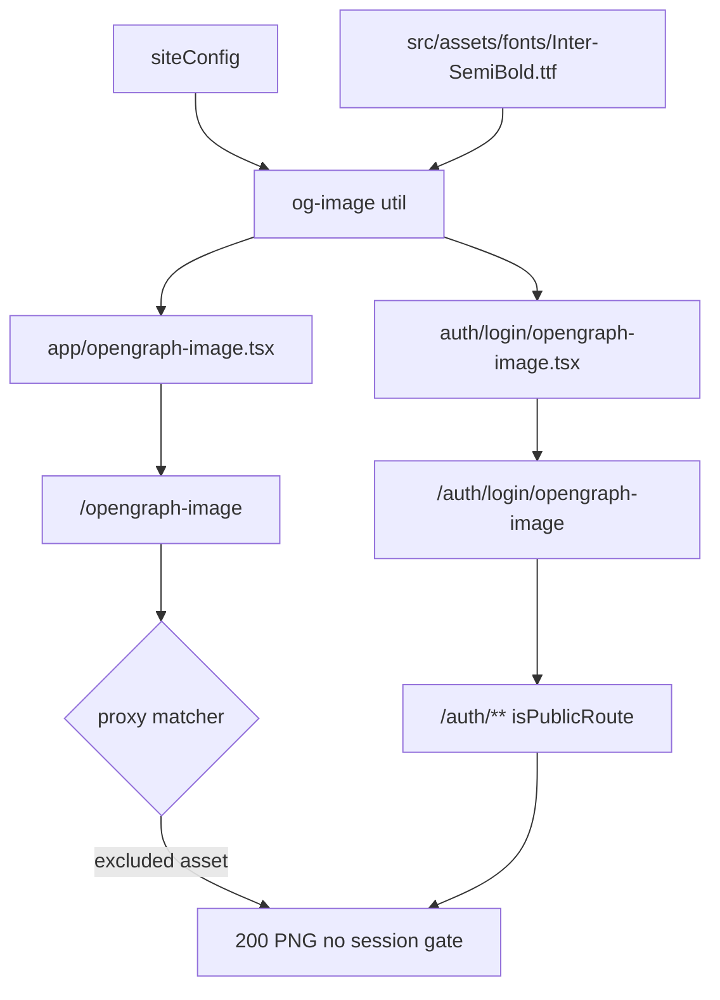

# Phase 9 Epic 3 — Social preview images

**Branch:** already on `phase-9/seo-geo` (Epics 1–2 complete; no first-epic branch setup needed).

## Goal

Ship story **3.1** from [docs/prds/phase-9-seo-geo.prd.md](docs/prds/phase-9-seo-geo.prd.md):

| Story | Deliverable |
| ----- | ----------- |
| 3.1 | Reusable dynamic OG-image pattern — branded template, per-page title/description, font plumbing once — demonstrated on `/` and one auth route with visibly distinct cards |

Epic 1 already provides [`getSiteUrl()`](src/utils/site-url.ts), [`siteConfig`](src/config/site.ts), and [`getSiteMetadata()`](src/config/site.ts) with `metadataBase`. Epic 2 is unrelated to OG.

## Confirmed: Next.js OG image URL shape

Dynamic `opengraph-image.tsx` routes use **extensionless path segments** — not `.png`, not a nested hash id:

| File location | HTTP pathname (no query) |
| ------------- | ------------------------ |
| `src/app/opengraph-image.tsx` | `/opengraph-image` (app-wide fallback — serves `/` and routes without a segment file) |
| `src/app/auth/login/opengraph-image.tsx` | `/auth/login/opengraph-image` |

**No `(marketing)/opengraph-image.tsx`.** Route groups contribute no URL segment, so a marketing-segment file would collide with the root file at the identical path `/opengraph-image` — the same class of conflict Next hard-errors on for duplicate `page.tsx` files. Root fallback already cascades to `/`; one root file + one login file yields the two distinct cards the PRD requires.

In rendered `<meta property="og:image">` tags, Next.js may append a **query-string** cache-buster (deployment/content hash) to the absolute URL — e.g. `https://example.com/opengraph-image?abc123`. Crawlers fetch the pathname; the query is cache metadata, not a separate route id.

**Why the proxy matters today:** static `opengraph-image.png` was excluded from the proxy by the matcher’s `.*\.(?:png|…)$` rule. Dynamic `/opengraph-image` has **no extension**, hits the proxy matcher, and is **not** in `isPublicRoute` (`/` and `/auth/**` only) — so cookieless requests get **307 → `/auth/login`**. Social crawlers never see the image. (`/auth/login/opengraph-image` is already under `/auth/**` and is fine.)

## Auth boundary decision (conscious pick)

**Chosen: matcher exclusion — OG images as assets, not app routes.**

The hard constraint reads “public routes are `/` and `/auth/**` only,” enforced via `isPublicRoute` in [`src/supabase/proxy.ts`](src/supabase/proxy.ts). Adding a third public category to `isPublicRoute` would be a **hard-constraint change** (AGENTS.md list + `isPublicAppRoute` + `check:auth-boundary` alignment).

Instead, extend the root [`proxy.ts`](proxy.ts) matcher negative-lookahead — same mechanism that already skips `_next/static`, `_next/image`, and `*.png` — to also skip paths ending in `/opengraph-image` or `/twitter-image`. The auth boundary constraint stays literally true; metadata images bypass session refresh like static assets (harmless for cookieless crawlers).

**If Step 3 was already implemented via `isPublicRoute`:** revert that carve-out before landing the matcher change — do not leave both.

**Testing model:** `config.matcher` must be a statically-analyzable literal — you cannot call a helper inside it. Export the pattern string as `PROXY_MATCHER_PATTERN`, use it in both [`proxy.ts`](proxy.ts) and a unit test that asserts `new RegExp(PROXY_MATCHER_PATTERN).test(pathname)` for excluded vs gated paths. Optional `isMetadataImagePath` helper is documentation only; the regex is the enforcement hook. Full-path verification stays manual (`curl -sI`).

## Current state (to replace)

- Static files at [`src/app/opengraph-image.png`](src/app/opengraph-image.png) and [`src/app/twitter-image.png`](src/app/twitter-image.png) — root-level Next.js metadata convention
- [`siteConfig.defaultOgImage`](src/config/site.ts) points at [`public/og-default.png`](public/og-default.png); [`getSiteMetadata()`](src/config/site.ts) sets `openGraph.images` to that static path
- No `ImageResponse` / `next/og` usage anywhere yet
- Landing page metadata: title inherits root default (`Seminova`); login page sets `title: 'Login'` in [`src/app/auth/login/page.tsx`](src/app/auth/login/page.tsx)

## Architecture



**Next.js file convention:** each `opengraph-image.tsx` default export returns `ImageResponse`; Next.js auto-injects `og:image`, dimensions, and `twitter:image` (no separate `twitter-image.tsx` needed unless Twitter-specific sizing is required later).

**Route choice for auth demo:** `/auth/login` — already has a distinct page title; visually different from landing while reusing the same template.

## Step 1 — Shared OG image utility

**New:** [`src/utils/og-image.tsx`](src/utils/og-image.tsx)

Centralize everything a spinoff copies once:

- **Constants:** `OG_IMAGE_SIZE` (`1200×630`), `OG_CONTENT_TYPE` (`image/png`)
- **Font loading:** bundle `Inter-SemiBold.ttf` at [`src/assets/fonts/Inter-SemiBold.ttf`](src/assets/fonts/Inter-SemiBold.ttf); load via `fetch(new URL('../../assets/fonts/Inter-SemiBold.ttf', import.meta.url))` with a **module-level cached promise** so repeat generations don't re-fetch
- **`createOgImageResponse({ title, description })`:** returns `new ImageResponse(...)` from `next/og` with fonts wired in
- **Branded layout JSX** (inline in the util): site name badge/footer, large title, smaller description — flexbox only (Satori constraint)
- **Colors:** hardcoded hex values matching the **light** theme tokens in [`src/app/globals.css`](src/app/globals.css) (`background`, `foreground`, `primary`, `muted-foreground`). Satori cannot read CSS variables; add a one-line comment that these mirror `:root` and should be updated on re-skin (same pattern as OG templates industry-wide)

**New:** [`src/utils/og-image.unit.test.ts`](src/utils/og-image.unit.test.ts)

Minimal pure-function coverage — e.g. a small exported `formatOgPageTitle(pageTitle: string)` that applies the `%s | ${siteConfig.name}` template (keeps OG title aligned with metadata template), plus a happy-path test that `createOgImageResponse` returns an `ImageResponse` instance (or assert exported `size`/`contentType` constants). No snapshot of rendered PNG bytes.

## Step 2 — Thin route segment files (two files only)

Two thin files, each exporting `alt`, `size`, `contentType`, and a default async function delegating to `createOgImageResponse`:

| File | Title | Description | Serves |
| ---- | ----- | ----------- | ------ |
| [`src/app/opengraph-image.tsx`](src/app/opengraph-image.tsx) | `siteConfig.name` | `siteConfig.description` | `/` (landing) + any route without a segment file |
| [`src/app/auth/login/opengraph-image.tsx`](src/app/auth/login/opengraph-image.tsx) | `'Login'` (via formatter → `Login \| Seminova` in image) | `siteConfig.description` | `/auth/login` |

**Do not** add [`src/app/(marketing)/opengraph-image.tsx`](src/app/(marketing)/opengraph-image.tsx) — collides with root at `/opengraph-image`.

Each file stays under ~15 lines; the pattern for new routes is copy the login file and change title (documented in Step 6 doc sync).

## Step 3 — Proxy matcher: exclude metadata image paths

**Export the pattern** from [`proxy.ts`](proxy.ts) (or [`src/utils/proxy-matcher.ts`](src/utils/proxy-matcher.ts) imported by `proxy.ts`):

```typescript
/** Next.js requires matcher entries to be statically analyzable — no runtime helpers. */
export const PROXY_MATCHER_PATTERN =
  '/((?!_next/static|_next/image|favicon.ico|.*\\.(?:svg|png|jpg|jpeg|gif|webp)$|opengraph-image$|.*\\/opengraph-image$|twitter-image$|.*\\/twitter-image$).*)'

export const config = {
  matcher: [PROXY_MATCHER_PATTERN],
}
```

Extend the existing negative-lookahead with metadata-image alternatives. Pay attention to anchoring: `opengraph-image$` and `.*\/opengraph-image$` exclude `/opengraph-image` and nested paths like `/auth/login/opengraph-image`, but **not** `/opengraph-image-evil` (no segment boundary — still gated). Same for `twitter-image`. Extend the matcher comment to document the carve-out.

**Optional** `isMetadataImagePath` helper — documentation aid only, not invoked at request time. Keep only if it makes the regex intent readable in code review; do not test it as the enforcement hook.

**Do not** change `isPublicRoute` in [`src/supabase/proxy.ts`](src/supabase/proxy.ts). **Revert** any `isMetadataImageRoute` / third-category logic already added there.

**New:** [`src/utils/proxy-matcher.unit.test.ts`](src/utils/proxy-matcher.unit.test.ts) (or co-located `proxy.unit.test.ts` if preferred — keep separate to avoid bloating auth-boundary tests)

Test the **regex** directly — this is the enforcement hook:

```typescript
const matcher = new RegExp(PROXY_MATCHER_PATTERN)

// false = middleware does not run = path excluded (like static assets)
expect(matcher.test('/opengraph-image')).toBe(false)
expect(matcher.test('/auth/login/opengraph-image')).toBe(false)
expect(matcher.test('/twitter-image')).toBe(false)

// true = middleware runs = still auth-gated
expect(matcher.test('/opengraph-image-evil')).toBe(true)
expect(matcher.test('/profile')).toBe(true)
expect(matcher.test('/')).toBe(true)
```

Also assert existing exclusions still hold (e.g. `matcher.test('/favicon.ico')` → false, `matcher.test('/logo.png')` → false) so the metadata-image splice doesn’t regress prior carve-outs.

**Remove** (if present) the `updateSession` cookieless-200 test for `/opengraph-image` — wrong layer. `check:auth-boundary` (`proxy.unit.test.ts`) stays unchanged; `isPublicAppRoute` stays `/` + `/auth/**` only.

**Verify after build** (manual): `pnpm build && pnpm start`, then `curl -sI http://localhost:3000/opengraph-image` — expect `200` and `content-type: image/png`, not `307` to `/auth/login`.

## Step 4 — Retire static OG assets and update site config

**Delete:**

- [`src/app/opengraph-image.png`](src/app/opengraph-image.png)
- [`src/app/twitter-image.png`](src/app/twitter-image.png)
- [`public/og-default.png`](public/og-default.png)

**Update** [`src/config/site.ts`](src/config/site.ts):

- Remove `defaultOgImage` from `SiteConfig` and `siteConfig`
- Remove `openGraph.images` from `getSiteMetadata()` — dynamic file convention owns image meta now

**Update** [`src/config/site.unit.test.ts`](src/config/site.unit.test.ts) to match (no `images` key in `openGraph` expectation).

**Update** [`README.md`](README.md) re-skinning bullet (currently points at static PNG paths) — via `/sync-repo-docs` in Step 6.

## Step 5 — Quality gate

```bash
pnpm type-check && pnpm lint && pnpm format-check && pnpm test:ci
```

**Manual verification** (`pnpm dev` or production build — opengraph.xyz cannot reach localhost):

- `curl -sI http://localhost:3000/opengraph-image` — **200**, not 307 to login
- Open `http://localhost:3000/opengraph-image` in browser — Seminova branding + site description
- Open `http://localhost:3000/auth/login/opengraph-image` — visibly different title ("Login")
- View source on `/` and `/auth/login` — `og:image` meta tags present, absolute URLs via `metadataBase`
- **Deployed preview only:** paste image URLs into [opengraph.xyz](https://www.opengraph.xyz/) — distinct titles, 1200×630 PNGs

## Step 6 — Doc sync

Run `/sync-repo-docs` to update:

- [AGENTS.md](AGENTS.md) **SEO & metadata** — replace static `og-default.png` / `defaultOgImage` references with dynamic OG pattern (`og-image` util + file convention); note metadata image paths bypass auth proxy via matcher (asset carve-out, same class as static image extensions)
- [README.md](README.md) re-skinning note — dynamic OG template + font/colors instead of replacing PNG files

**Do not** change the AGENTS.md **Hard constraints** auth-boundary bullet — constraint stays `/` + `/auth/**` only.

## Step 7 — Mark epic complete

When implementation and quality gate pass, run the **mark-epic-complete** skill to append `` `Complete` `` to `### Epic 3: Social preview images` in [docs/prds/phase-9-seo-geo.prd.md](docs/prds/phase-9-seo-geo.prd.md) and bump the PRD's **Last updated** date.

## Out of scope (Epic 4)

- `seo.mdc` authoring
- `check:seo-base-url` deterministic check
- Dynamic OG for every auth page individually (login demo satisfies PRD; others inherit root fallback)
- Dark-mode OG variants (social cards conventionally use fixed light branding)
- Hard-constraint change to `isPublicRoute` / `isPublicAppRoute` (deferred — matcher asset carve-out chosen instead)

## Manual test checklist

- [x] Cookieless `GET /opengraph-image` returns 200 (not 307 to login)
- [x] `/` OG image shows site name + description with branded layout
- [x] `/auth/login` OG image shows distinct "Login" title
- [x] No `(marketing)/opengraph-image.tsx` — only root + login segment files
- [x] Static PNGs and `og-default.png` removed; no broken image references in metadata
- [x] `pnpm pre-push` green
