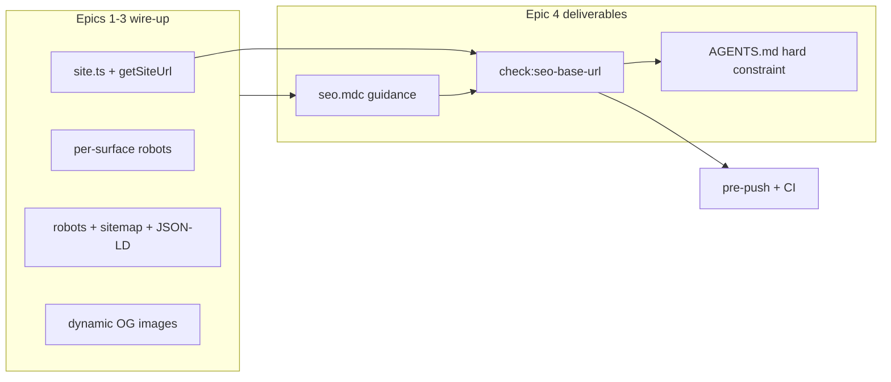

# Phase 9 Epic 4 — Agent Conventions

**Branch:** `phase-9/seo-geo` (already checked out — Epics 1–3 are `Complete`; no first-epic branch setup needed).

This epic closes Phase 9 by giving agents a single SEO rule file and one mechanical guardrail. Soft SEO standards stay in `seo.mdc` (guidance-only, like `ui-accessibility.mdc`). Base-URL centralization is the one mechanically enforced invariant — it joins AGENTS.md § Hard constraints so the `check:*` ⟺ hard-constraint correspondence stays intact.

**Decision log (plan iteration):**

1. **Hard constraint, not orphan check.** PRD's "cheap to reverse" applies to the robots training stance, not base-URL centralization. `check:seo-base-url` blocks pre-push/CI → it must appear in § Hard constraints alongside its enforcement script.
2. **Narrow check rules (Option A).** Flag only `localhost:3000` literals, `NEXT_PUBLIC_SITE_URL` reads outside the resolver, and `new URL('https://…')` with a literal origin. No bare-`https://` literal scan, no allowlist. Accepted latent gap: a hardcoded absolute canonical string (e.g. `canonical: 'https://myproduct.com/x'`) slips through — none exist today; avoids a per-spinoff allowlist treadmill for GitHub/docs/social links.



---

## Story 4.1 — Author `seo.mdc`

Read [`.cursor/skills/rule-authoring/SKILL.md`](.cursor/skills/rule-authoring/SKILL.md) and follow [`TEMPLATE.md`](.cursor/skills/rule-authoring/TEMPLATE.md) before writing.

**Activation:** Auto Attached — globs on SEO-touching paths:

- `src/app/**`
- `src/config/site.ts`
- `src/utils/site-url.ts`, `robots-policy.ts`, `sitemap-routes.ts`, `structured-data.ts`, `og-image.tsx`, `discover-app-routes.ts`, `proxy-matcher.ts`

**Ownership:** SEO is primary owner for metadata wire-up, indexing policy, OG pattern, structured data, robots stance, and soft content standards. Cross-reference — do not restate:

| Topic | Owner |
| ----- | ----- |
| Semantic HTML, heading order, alt text | [`ui-accessibility.mdc`](.cursor/rules/ui-accessibility.mdc) |
| SSR, `next/image`, metadata API mechanics | [`nextjs.mdc`](.cursor/rules/nextjs.mdc) |
| Auth boundary / route groups | [`AGENTS.md`](AGENTS.md), [`LEXICON.md`](LEXICON.md) |
| Base-URL centralization (enforced) | AGENTS.md § Hard constraints + `check:seo-base-url` — `seo.mdc` documents the convention; enforcement lives in the check |

**Sections to cover:**

### Wire-up (from Epics 1–3)

1. **Metadata source of truth** — [`src/config/site.ts`](src/config/site.ts) (`getSiteMetadata`) + root layout calling `getSiteMetadata(getSiteUrl())`. Per-page overrides via Next.js `metadata` export / `generateMetadata`.
2. **Base URL** — [`src/utils/site-url.ts`](src/utils/site-url.ts) is the **only** place for `NEXT_PUBLIC_SITE_URL` / `VERCEL_URL` resolution and the localhost fallback. Every absolute URL (canonical, OG, sitemap, robots sitemap ref, JSON-LD) goes through `getSiteUrl()` or `metadataBase` (relative canonicals like `'/'` resolve against it). External product links (GitHub, docs) are fine as bare literals — they are not site-base URLs.
3. **Per-surface indexing** — `(marketing)` indexable; [`src/app/auth/layout.tsx`](src/app/auth/layout.tsx), [`src/app/(app)/layout.tsx`](src/app/(app)/layout.tsx), [`src/app/admin/layout.tsx`](src/app/admin/layout.tsx) export `robots: { index: false, follow: false }`. Defense-in-depth on top of the auth proxy.
4. **Crawler surface** — [`src/utils/robots-policy.ts`](src/utils/robots-policy.ts) + [`src/app/robots.ts`](src/app/robots.ts): retrieval/user-fetch bots allowed, training crawlers blocked by default. Include the PRD note: **review training-consent per product** — the commented reference bot roster in the policy file is the edit surface when a spinoff reverses the default.
5. **Sitemap** — [`src/utils/sitemap-routes.ts`](src/utils/sitemap-routes.ts) + [`discoverMarketingRoutes()`](src/utils/discover-app-routes.ts): marketing routes only; never auth/app/admin.
6. **Structured data** — [`src/utils/structured-data.ts`](src/utils/structured-data.ts): `Organization` + `WebSite` on the landing page only; extend the helper for new schema types, don't inline JSON-LD.
7. **Social preview images** — [`src/utils/og-image.tsx`](src/utils/og-image.tsx) + per-route `opengraph-image.tsx` files. New public routes add their own segment file; values come from page metadata + site config. OG/twitter image paths are auth-exempt via [`src/utils/proxy-matcher.ts`](src/utils/proxy-matcher.ts) (keep in sync with [`proxy.ts`](proxy.ts)).

Point at reference implementations; no tutorial code blocks (rule-authoring discipline).

### Soft standards (SEO-owned guidance)

- **Unique intentional title + description** on every page (auth screens already set per-page titles; follow that pattern).
- **Answer-first content structure** — lead with the user's question/need, then detail.
- **Canonical discipline** — self-referential canonical per page; no duplicate indexable URLs; prefer relative canonical paths resolved via `metadataBase` (not hardcoded absolute origins).

### New-page checklist (end of rule)

Actionable bullets an agent can run when adding a route: metadata export, indexing policy (which layout group?), OG image file if public, sitemap inclusion if marketing, JSON-LD only if landing-level.

### Rule-authoring housekeeping

Add an SEO row to the ownership table in [`.cursor/skills/rule-authoring/SKILL.md`](.cursor/skills/rule-authoring/SKILL.md).

---

## Story 4.2 — `check:seo-base-url` + hard-constraint registration

### Hard constraint (AGENTS.md)

Add a sixth entry to [AGENTS.md](AGENTS.md) § Hard constraints, following the change protocol (constraint text + enforcement together). **Constraint text must mirror the three check flags exactly** — no broader claim than what `check:seo-base-url` catches:

- **SEO base URL centralization** — never hardcode `http://localhost:3000`, read `NEXT_PUBLIC_SITE_URL` outside the resolver, or construct `new URL()` with a literal origin; resolve absolute URLs via `getSiteUrl()` or `metadataBase`. **Enforced:** `check:seo-base-url`.

Bare-string absolute canonicals (e.g. `canonical: 'https://myproduct.com/x'`) are **not** in scope for this constraint — they pass the check and stay covered by `seo.mdc` canonical discipline (soft guidance).

Also update the quality-commands table and the pre-push prose in Foundation & tooling to list the new check. `seo.mdc` itself remains guidance — only the three flagged patterns above are hard.

### Check implementation

Follow the exportable-check pattern from [`scripts/checks/no-profiles-role.mjs`](scripts/checks/no-profiles-role.mjs): pure `checkSeoBaseUrl()` function + CLI wrapper with `[check:seo-base-url]` tagged output.

**Narrow rule set (Option A — no allowlist):**

| Flag | Pattern | Notes |
| ---- | ------- | ----- |
| Hardcoded dev origin | `http://localhost:3000` string literal | Only permitted in `src/utils/site-url.ts` |
| Inline env read | `process.env.NEXT_PUBLIC_SITE_URL` | Only permitted in `src/utils/site-url.ts` |
| Hardcoded absolute origin | `new URL('https://…')` or `new URL("https://…")` where the argument is a string literal containing an origin | Catches programmatic absolute URL construction; does **not** scan bare `https://` string literals |

**Explicit non-goals (accepted latent gap):**

- Bare string literals like `canonical: 'https://myproduct.com/page'` or `https://github.com/...` are **not** flagged. External links and a mistyped absolute canonical would not trip the check. `seo.mdc` canonical discipline covers the intended pattern; closing this gap would require Option B's allowlist treadmill.

**Scan scope:**

- **Include:** `src/app/**`, `src/config/site.ts`, SEO utils listed in 4.1
- **Exclude:** `**/*.{test,unit.test}.{ts,tsx}`, `src/utils/site-url.ts` (sole authorized home for fallback + env read)

**No allowlist block** — the narrow rules above are self-contained.

### Tests

Add [`scripts/checks/seo-base-url.unit.test.ts`](scripts/checks/seo-base-url.unit.test.ts) following [`no-profiles-role.unit.test.ts`](scripts/checks/no-profiles-role.unit.test.ts):

- Passes on current repo, including existing `https://github.com/...` and `https://schema.org` bare literals (H)
- Fails on temp content with hardcoded `http://localhost:3000` outside `site-url.ts` (I)
- Fails on inline `process.env.NEXT_PUBLIC_SITE_URL` outside `site-url.ts` (I)
- Fails on `new URL('https://example.com/...')` in a scanned path (I)
- Does **not** fail on bare `'https://github.com/...'` string in `site.ts` (boundary — confirms no bare-literal scan)

### Wire into quality gate

1. Add `"check:seo-base-url": "node scripts/checks/seo-base-url.mjs"` to [`package.json`](package.json)
2. Insert into `pre-push` after `check:semantic-tokens`, before `lint` (alongside the other hard-constraint checks)
3. Add a named CI step in [`.github/workflows/pull-request.yaml`](.github/workflows/pull-request.yaml) after "Check semantic tokens"

**Doc sync:** Update AGENTS.md hard-constraint list + quality commands in the same pass (not deferred to optional sync). Fix [`git-workflow.mdc`](.cursor/rules/git-workflow.mdc) pre-push prose if editing — it currently omits `check:*` steps.

---

## Verification

Run the full quality bar before marking complete:

```bash
pnpm type-check && pnpm lint && pnpm format-check && pnpm test:ci
pnpm check:seo-base-url   # explicit smoke after wiring
```

**Manual checklist:**

- [ ] AGENTS.md § Hard constraints lists base-URL centralization with `check:seo-base-url` enforcement
- [ ] Open a new page task with only `seo.mdc` loaded — checklist covers metadata, indexing, OG, sitemap, JSON-LD decisions
- [ ] Temporarily add `http://localhost:3000` to a route file — `pnpm check:seo-base-url` fails with a clear path/message
- [ ] Temporarily add `new URL('https://example.com')` to a route file — check fails
- [ ] Confirm bare `https://github.com/...` in `site.ts` still passes (narrow rules, no treadmill)
- [ ] Revert — check passes; `pnpm pre-push` green

---

## Close epic

When implementation is fully finished, run the **mark-epic-complete** skill to tag Epic 4 `Complete` in [`docs/prds/phase-9-seo-geo.prd.md`](docs/prds/phase-9-seo-geo.prd.md). That completes Phase 9 — ship-phase is the next workflow step when you're ready to merge.
