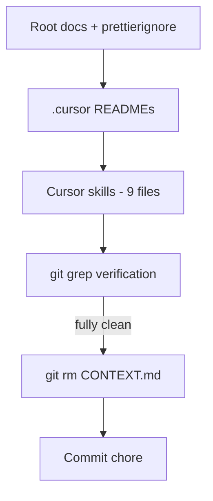

# Remove CONTEXT.md — reference cleanup plan

## Goal

Eliminate live `CONTEXT.md` references from the 16 files listed below, then delete [`CONTEXT.md`](CONTEXT.md). Planning truth moves to [`ROADMAP.md`](ROADMAP.md), [`docs/prds/`](docs/prds/), and [`docs/DOC_RULES.md`](docs/DOC_RULES.md). Frozen history stays in [`docs/archive/CONTEXT_ARCHIVE.md`](docs/archive/CONTEXT_ARCHIVE.md) — **do not edit**.

## Scope boundaries

| In scope | Out of scope (PM decision) |
| -------- | -------------------------- |
| 16 files listed below | [`.cursor/plans/`](.cursor/plans/) — excluded from final grep |
| `git rm CONTEXT.md` + commit | [`docs/archive/CONTEXT_ARCHIVE.md`](docs/archive/CONTEXT_ARCHIVE.md) — frozen |

**Forward reference:** `/ship-phase` is the designated replacement for `/sync-context-md` per [docs-restructure-plan](.cursor/plans/docs-restructure-plan.md), but the skill folder does not exist yet on this branch. References in `archive-cursor-plans` should name `/ship-phase` anyway; agents treat it as the phase-close workflow defined in [docs/DOC_RULES.md rule 6](docs/DOC_RULES.md).

## Recommended execution order



Work root → `.cursor/` → skills → verify → delete → commit. No file moves; text-only edits except deletion.

---

## Group 1 — Root docs

### [`AGENTS.md`](AGENTS.md)

**Line ~65 — Epic 1C bullet**

- **Find:** `AGENTS.md`, `CONTEXT.md`, `README.md`, and `CONTEXT_ARCHIVE.md` planning/doc layer.
- **Replace with:** `AGENTS.md`, `ROADMAP.md`, `docs/prds/`, `README.md`, and `docs/DOC_RULES.md` planning/doc layer.
- Do not change other AGENTS.md content (header already points at ROADMAP + prds).

### [`README.md`](README.md)

**Line ~13 — opening doc pointer**

- **Find:** `For roadmap and phase planning, see [CONTEXT.md](CONTEXT.md).`
- **Replace with:** `For roadmap and phase status, see [ROADMAP.md](ROADMAP.md); for active-phase planning detail, see [docs/prds/](docs/prds/).`

**Lines ~184–191 — Documentation table**

1. **Remove** the `CONTEXT.md` row entirely.
2. **Add** two rows (order: after README row or where CONTEXT was):
   - `[ROADMAP.md](ROADMAP.md)` | PM + agents | Phase status, planning horizon stubs
   - `[docs/prds/](docs/prds/)` | PM + agents | Per-phase epics/stories while Active
3. **Fix** DOC_RULES link: `[DOC_RULES.md](DOC_RULES.md)` → `[docs/DOC_RULES.md](docs/DOC_RULES.md)` with purpose unchanged.

### [`DESIGN.md`](DESIGN.md)

**Line ~3 — Purpose paragraph**

- **Find:** `For roadmap, see [CONTEXT.md](CONTEXT.md).`
- **Replace with:** `For roadmap, see [ROADMAP.md](ROADMAP.md); for active-phase design scope, see [docs/prds/](docs/prds/).`

**Lines ~11–16 — Document roles table**

1. **Remove** the `CONTEXT.md` row.
2. **Add** three rows:
   - `[ROADMAP.md](ROADMAP.md)` | Planning horizon and phase status
   - `[docs/prds/](docs/prds/)` | Active-phase forward intent (design work in flight)
   - `[docs/archive/CONTEXT_ARCHIVE.md](docs/archive/CONTEXT_ARCHIVE.md)` | Frozen pre-restructure phase history

### [`LOCKED_RULES.md`](LOCKED_RULES.md)

**Line ~5**

- **Find:** `Consumption detail lives in `.cursor/rules/`; CONTEXT.md §3 is a pointer + at-a-glance summary back here.`
- **Replace with:** `Consumption detail lives in [.cursor/rules/](.cursor/rules/). Locked-rule **changes** route through [AGENTS.md › Change protocol](AGENTS.md#change-protocol).`

### [`.prettierignore`](.prettierignore)

1. **Delete** line 23: `CONTEXT.md`
2. **Update** line 24: `CONTEXT_ARCHIVE.md` → `docs/archive/CONTEXT_ARCHIVE.md`
3. Leave `AGENTS.md`, `README.md`, `/.cursor` entries unchanged.

---

## Group 2 — `.cursor/` docs

### [`.cursor/README.md`](.cursor/README.md)

**Planning & repo truth table (~lines 17–21)**

1. **Remove** `CONTEXT.md` row.
2. **Add** two rows:
   - `[ROADMAP.md](../ROADMAP.md)` | PM + agents | Phase status, planning horizon stubs
   - `[docs/prds/](../docs/prds/)` | PM + agents | Active-phase build scope (epics/stories)
3. **Update** archive row path: `../CONTEXT_ARCHIVE.md` → `../docs/archive/CONTEXT_ARCHIVE.md`; role text: frozen shipped narratives (read-only).

**Copying this folder (~line 44)**

- **Find:** `adapt locked rules and doc map in AGENTS.md and CONTEXT.md for that product.`
- **Replace with:** `adapt locked rules and doc map in AGENTS.md, ROADMAP.md, and docs/DOC_RULES.md for that product.`

**Dead `/sync-context-md` cleanup** (skill folder deleted — remove mentions; do not replace):

| Line | Edit |
| ---- | ---- |
| **~10** (Layout table, skills row) | Remove `/sync-context-md` from the parenthetical example list (e.g. keep `/plan-next-epic` and other live skills only) |
| **~23** (Sync after shipping) | Remove `/sync-context-md` (planning brief) · — leave only `/sync-repo-docs` (AGENTS.md + README) |
| **~30** (Common skills table) | **Delete** the entire `/sync-context-md` row |

### [`.cursor/rules/README.md`](.cursor/rules/README.md)

**Line ~13 — intro paragraph**

- **Find:** `Locked principles and roadmap live in [CONTEXT.md](../../CONTEXT.md).`
- **Replace with:** `Locked principles live in [LOCKED_RULES.md](../../LOCKED_RULES.md); roadmap and active build scope in [ROADMAP.md](../../ROADMAP.md) and [docs/prds/](../../docs/prds/).`

**Line ~108 — data-tables.mdc bullet**

- **Find:** `Referenced by CONTEXT.md for admin and future table pages`
- **Replace with:** `Referenced by admin users-table epic in planning docs`

**Lines ~165–171 — Reference section**

1. **Remove** `CONTEXT.md` link.
2. **Add:**
   - `[ROADMAP.md](../../ROADMAP.md)` — roadmap and phase status
   - `[LOCKED_RULES.md](../../LOCKED_RULES.md)` — locked principles (canonical text)
   - `[docs/DOC_RULES.md](../../docs/DOC_RULES.md)` — doc maintenance procedure
3. Keep existing `AGENTS.md` and `DESIGN.md` links.

---

## Group 3 — Cursor skills (9 files)

### [`.cursor/skills/archive-cursor-plans/SKILL.md`](.cursor/skills/archive-cursor-plans/SKILL.md)

| Location | Edit |
| -------- | ---- |
| **Frontmatter description (~line 6)** | `after /sync-context-md` → `after /ship-phase` |
| **"Not the same as" (~line 17)** | Replace `sync-context-md` bullet with: **`ship-phase`** — flips active PRD `Active→Shipped` and marks ROADMAP shipped per [docs/DOC_RULES.md rule 6](../../../docs/DOC_RULES.md); does not write to `docs/archive/CONTEXT_ARCHIVE.md` (frozen) |
| **When to run (~line 26)** | `after /sync-context-md` → `after /ship-phase` |
| **Selective sources (~line 43)** | Replace `CONTEXT.md ACTIVE/archived sections` with `ROADMAP.md` (shipped phases) + `docs/prds/` (Active/Shipped PRDs) + `AGENTS.md` "Implemented now" |
| **Workflow step 5 checkbox (~line 56)** | Remove `optional /sync-context-md already done`; e.g. `optional /ship-phase already done` |
| **Step 3 do-not-edit (~line 85)** | `CONTEXT` → `ROADMAP.md or PRDs` (full: `Do not edit plan contents, AGENTS.md, README, ROADMAP.md, or PRDs unless the user asks`) |
| **Next steps report (~line 132)** | `Planning brief still stale: /sync-context-md` → `Planning docs stale: /ship-phase or manual ROADMAP/PRD updates per docs/DOC_RULES.md` |
| **Phase-close sequence (~lines 140–142)** | Step 1: `/ship-phase` — flip PRD Active→Shipped, mark ROADMAP shipped (rule 6); **drop** archive-append language. Keep steps 2–3 (`/sync-repo-docs`, `/archive-cursor-plans`) |

### [`.cursor/skills/archive-security-audit/SKILL.md`](.cursor/skills/archive-security-audit/SKILL.md)

**Step 4 cross-ref table (~line 110)**

- **Delete** the entire `CONTEXT.md` row (do not replace).
- Keep `AGENTS.md` and `TECH_DEBT_AUDIT.md` rows.

*Out of scope:* line 138 `sync-context-md` next-step (no `context.md` substring).

### [`.cursor/skills/archive-tech-debt-audit/SKILL.md`](.cursor/skills/archive-tech-debt-audit/SKILL.md)

**Step 4 cross-ref table (~line 101)**

- **Delete** the entire `CONTEXT.md` row.
- Keep `AGENTS.md` row.

### [`.cursor/skills/design-critique/SKILL.md`](.cursor/skills/design-critique/SKILL.md)

**Read-first #2 (~line 45)**

- **Replace** Cookloop-specific Phase 10 pointer with: `ROADMAP.md` + relevant phase PRD in `docs/prds/`; shipped history in `docs/archive/CONTEXT_ARCHIVE.md`
- Use relative links: `../../../ROADMAP.md`, `../../../docs/prds/`, `../../../docs/archive/CONTEXT_ARCHIVE.md`

**Principles (~line 195)**

- **Find:** `AGENTS.md + CONTEXT.md`
- **Replace with:** `AGENTS.md + ROADMAP.md + active PRD (docs/prds/)`

### [`.cursor/skills/sync-tech-debt-audit/SKILL.md`](.cursor/skills/sync-tech-debt-audit/SKILL.md)

**"Not the same as" (~line 19)**

- **Find:** `` `sync-repo-docs` / `sync-context-md` — AGENTS.md / README / planning brief only ``
- **Replace with:** `` `sync-repo-docs` — AGENTS.md / README only ``

**Step 5 report (~line 151)**

- **Find:** `If AGENTS.md / CONTEXT.md doc findings were involved, suggest sync-repo-docs or sync-context-md`
- **Replace with:** `If AGENTS.md doc findings were involved, suggest /sync-repo-docs (or ROADMAP/PRD update if planning-doc findings involved, per docs/DOC_RULES.md)`

### [`.cursor/skills/sync-tech-debt-audit/reference.md`](.cursor/skills/sync-tech-debt-audit/reference.md)

**Documentation drift checklist (~line 76)**

- **Find:** `- [ ] Read cited AGENTS.md / CONTEXT.md lines`
- **Replace with:** `- [ ] Read cited AGENTS.md lines`

**Related skills table (~line 146)**

- **Delete** the entire `sync-context-md` row (do not replace).

### [`.cursor/skills/tech-debt-audit/SKILL.md`](.cursor/skills/tech-debt-audit/SKILL.md)

**Phase 1 orient step 1 (~line 46)**

- **Find:** `planning brief (path from AGENTS.md documentation map — e.g. CONTEXT.md)`
- **Replace with:** `ROADMAP.md` + active PRD in `docs/prds/` (discoverable via `docs/DOC_RULES.md` document-roles table)

*Out of scope:* line 22 `sync-context-md` in "Not the same as" (no `context.md` substring).

### [`.cursor/skills/ux-copy/SKILL.md`](.cursor/skills/ux-copy/SKILL.md)

**Read-first #2 (~line 40)**

- **Replace** Phase 10 dialog spec with: `ROADMAP.md` + relevant phase PRD in `docs/prds/` (links: `../../../ROADMAP.md`, `../../../docs/prds/`)

**Principles workflow (~line 172)**

- **Find:** `Project truth lives in CONTEXT.md + shipped UI`
- **Replace with:** `Project truth lives in ROADMAP.md + active PRD + shipped UI`

**Tips #3 (~line 179)**

- **Find:** `conflicts with CONTEXT.md`
- **Replace with:** `conflicts with the active PRD or planning docs (ROADMAP.md / docs/prds/)`

---

## Group 4 — Verification and final cut

### Pre-delete grep (all 16 files edited)

```bash
git grep -i "context\.md" -- ':!CONTEXT.md' ':!.cursor/plans/' ':!docs/archive/'
```

**Expected:** No matches. If anything still hits, fix before proceeding.

### Delete and commit

When grep is fully clean:

```bash
git rm CONTEXT.md
git add -A   # stages all 16 file edits + deletion
git commit -m "$(cat <<'EOF'
chore: remove CONTEXT.md references and delete file (Phase 5 — docs restructure)

EOF
)"
```

### Post-commit checklist

- [ ] `CONTEXT.md` absent from repo root
- [ ] `.prettierignore` has `docs/archive/CONTEXT_ARCHIVE.md`, not root archive path
- [ ] README `docs/DOC_RULES.md` link resolves
- [ ] No edits to `docs/archive/CONTEXT_ARCHIVE.md`
- [ ] Optional later hygiene: `pre-release-review`, audit `reference.md` `sync-context-md` rows in other skills

### Quality gate (doc-only chore)

```bash
pnpm type-check && pnpm lint && pnpm format-check
```

Skip `pnpm test:ci` unless unrelated code changed.

---

## Reference count (16 files)

| File | `context.md` hits to clear | Other dead refs |
| ---- | --------------------------- | ----------------- |
| AGENTS.md | 1 | — |
| README.md | 2 | — |
| DESIGN.md | 2 | — |
| LOCKED_RULES.md | 1 | — |
| .prettierignore | 1 (filename line) | — |
| .cursor/README.md | 2 | `/sync-context-md` on lines ~10, ~23, ~30 |
| .cursor/rules/README.md | 3 | — |
| archive-cursor-plans/SKILL.md | 3 | — |
| archive-security-audit/SKILL.md | 1 | — |
| archive-tech-debt-audit/SKILL.md | 1 | — |
| design-critique/SKILL.md | 2 | — |
| sync-tech-debt-audit/SKILL.md | 1 | — |
| sync-tech-debt-audit/reference.md | 1 | `sync-context-md` row (~line 146) |
| tech-debt-audit/SKILL.md | 1 | — |
| ux-copy/SKILL.md | 3 | — |
| **Total** | **25** | **4** `/sync-context-md` removals |

(Remaining 3 of PM's original "28" likely count archive path updates or `sync-context-md` strings elsewhere.)
