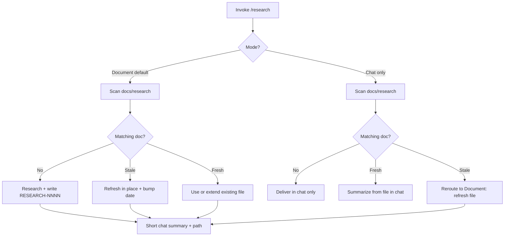

# Research Skill System

## Goal

Ship a **docs-only research workflow**: agents investigate a question (product, technical, competitive, or codebase), persist findings in `docs/research/` when appropriate, and register the new doc category across the planning doc stack. Spinoffs inherit the mechanism but not Seminova-specific briefs.

## Architecture

## Source of truth (create first)

### 1. [`docs/research/README.md`](docs/research/README.md)

Governing doc for the directory (mirror [`docs/adr/README.md`](docs/adr/README.md) brevity). Must define:

- **Role:** exploratory findings before PRD/ADR/planning; not build scope, not immutable decisions
- **When to write:** durable questions referenced by phase planning or later agent work
- **Staleness:** global **6-month** rule from `Researched: YYYY-MM-DD`; no status field; readers refresh stale docs on use (in-place update, same filename)
- **Numbering:** `RESEARCH-NNNN-short-slug.md` — global sequential, zero-padded
- **Template** for each brief:
  - Title line: `# RESEARCH-NNNN: Short title`
  - `**Researched:** YYYY-MM-DD`
  - Optional `**Type:**` tags (product / technical / competitive / codebase)
  - Sections: Question, Scope and constraints, Findings, Options compared (when applicable), Recommendation (optional), Open questions, Sources, Related (optional links to ROADMAP, PRD, ADR)
- **Cross-refs:** when findings become a committed decision → ADR; when they inform build scope → PRD; optional ROADMAP open-question link
- **Spinoff:** directory ships with README only; `RESEARCH-*.md` files are project-specific

### 2. [`.cursor/skills/research/SKILL.md`](.cursor/skills/research/SKILL.md)

Follow patterns from [`archive-cursor-plans/SKILL.md`](.cursor/skills/archive-cursor-plans/SKILL.md) and [`audit-tech-debt/SKILL.md`](.cursor/skills/audit-tech-debt/SKILL.md):

- Frontmatter: `name: research`, explicit description with trigger terms, `disable-model-invocation: true`
- **Agent mode required** (writes files in Document mode)
- **Not the same as** block: ADR, PRD/`phase-planning`, audit skills, `plan-next-epic`, `sync-repo-docs`

**Mode gate** (first step — halt if unclear):

| Mode | Triggers | Output |
|------|----------|--------|
| **Document** (default) | unspecified, "save", "document" | File in `docs/research/` + short chat summary |
| **Chat** | "chat only", "don't save", "ephemeral" | Chat only unless reroute rules apply |

Also collect if missing: research question, type(s).

**Reroute rule (Chat mode):** if user requested Chat but a **matching stale** doc exists → switch to Document mode, refresh that file in place, announce reroute in one line. If matching doc is **fresh** → summarize from file in chat (no duplicate research). If **no match** → chat only; offer once to persist if findings seem durable.

**Execution:**

1. Read [`AGENTS.md`](AGENTS.md) + active PRD in [`docs/prds/`](docs/prds/) when question touches current phase
2. List/scan [`docs/research/`](docs/research/) for topic matches (titles + opening paragraphs)
3. Research: codebase search/read; web search/fetch for external topics; optional built-in `explore` / `generalPurpose` Task subagents for large scopes — **no custom `.cursor/agents/` file in v1**
4. **Hard boundary:** never edit product code, migrations, or config
5. Write or refresh per [`docs/research/README.md`](docs/research/README.md) template
6. Close-out: path written (or chat-only confirmation), optional downstream link suggestions (ROADMAP, PRD — never required)

## Blast radius — tier 1 (required)

| File | Change |
|------|--------|
| [`docs/DOC_RULES.md`](docs/DOC_RULES.md) | Add `research/` row to document roles table (audience: PM + agents; owns: exploratory research briefs, revisable, 6-month staleness). Optionally mention `research` in the opening skills line. |
| [`.cursor/rules/documentation.mdc`](.cursor/rules/documentation.mdc) | Add `research/` to layout block; add "research brief → `docs/research/`" under Where things go. **This is the PM-approved new top-level docs directory.** |
| [`.cursor/skills/initialize-project/SKILL.md`](.cursor/skills/initialize-project/SKILL.md) | Add **9th idempotency check:** `docs/research/` contains only `README.md` (no `RESEARCH-*.md`). Add scrub step #9: delete all `RESEARCH-*.md`, preserve `README.md`. Update idempotency intro from "eight" to "nine". Mirror [`WORKFLOW_BACKLOG.md`](docs/WORKFLOW_BACKLOG.md) treatment in [`initialize-project` lines 60–62](.cursor/skills/initialize-project/SKILL.md). |
| [`docs/WORKFLOW_GUIDE.md`](docs/WORKFLOW_GUIDE.md) | Under **Other planning-system skills**, add `research` (Cursor-side, docs-only, `/research`). Under **initialize-project** outputs list (~line 94), add bullet clearing Seminova `RESEARCH-*.md` while keeping README. |

## Blast radius — tier 2 (discoverability)

| File | Change |
|------|--------|
| [`AGENTS.md`](AGENTS.md) | Skills table row under **Housekeeping** (`research` — exploratory briefs → `docs/research/`). **Where things live** row: `docs/research/`. |
| [`README.md`](README.md) | One row in **Documentation** table. |
| [`.cursor/README.md`](.cursor/README.md) | Optional row in planning/repo-truth table. |

## Explicitly out of scope (v1)

- Custom `.cursor/agents/researcher.md`
- `plan-next-epic` / Claude `phase-planning` auto-scan changes
- `ROADMAP.md` structural changes
- `sync-repo-docs` reference changes (register via DOC_RULES only)
- CI / `check:*` scripts
- Seeding a sample `RESEARCH-0001` file in the template (README template only)

## Verification

After implementation:

1. `grep -r "docs/research" docs/ .cursor/ AGENTS.md README.md` — confirm consistent registration, no contradictions
2. Confirm `documentation.mdc` layout matches `DOC_RULES` roles table
3. Confirm `initialize-project` idempotency count and scrub step align
4. No product code touched

Quality bar (docs-only change — skip `pnpm test:ci` unless unrelated drift; optional `pnpm lint` if any TS touched — there should be none):

## Manual test checklist (for PM)

- [ ] Invoke `/research` with no mode stated → asks or defaults to Document, writes `RESEARCH-0001-…`
- [ ] Invoke with "chat only" on a new topic → findings in chat, no new file
- [ ] Invoke "chat only" when a **stale** matching doc exists → agent refreshes file, announces reroute
- [ ] Invoke "chat only" when a **fresh** matching doc exists → summarizes from file, no rewrite
- [ ] Re-read a doc older than 6 months (simulate by backdating `Researched` in a test file) → agent treats as stale and refreshes on use
- [ ] Confirm `docs/research/README.md` exists with empty directory otherwise (no shipped example brief)

## Execution approach

**Single agent, sequential** — not multitask. Create README + skill first, then register across doc stack, then grep verify. Do not commit unless requested.
