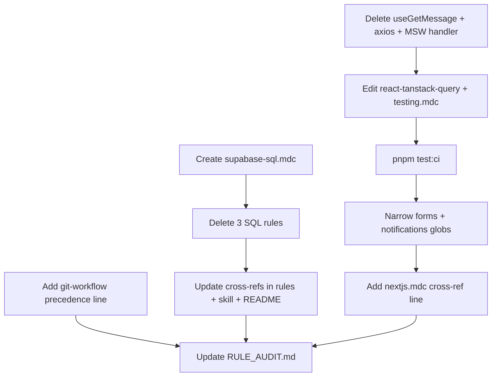

# Rule audit remediation (R004–R008, R012, R013)

## Scope boundary

**In scope:** deletions and edits explicitly listed in the request, cross-reference updates in `.cursor/rules/` and `.cursor/skills/`, [`.cursor/rules/README.md`](.cursor/rules/README.md) (inventory of deleted rule names), and [`RULE_AUDIT.md`](RULE_AUDIT.md).

**Out of scope:** `auth-button.tsx` removal and ROADMAP/TECH_DEBT doc sync — unless separately requested.

**Hard constraint:** Do not edit any rule file beyond those named in the request (plus the new `supabase-sql.mdc`).

Every edited `.mdc` file must follow [`.cursor/skills/rule-authoring/SKILL.md`](.cursor/skills/rule-authoring/SKILL.md): principle-first, file references over inline tutorial blocks, single ownership, valid frontmatter (`description`, `globs`, `alwaysApply` only).

---

## 1. Delete legacy demo hook (R004)

**Delete:**
- [`src/hooks/useGetMessage.ts`](src/hooks/useGetMessage.ts)
- [`src/hooks/useGetMessage.unit.test.tsx`](src/hooks/useGetMessage.unit.test.tsx)

**Conditional cleanup (verify after hook deletion):**
- Grep for `axios` imports — if `useGetMessage.ts` was the only consumer, run `pnpm remove axios` to drop the dependency from `package.json` / lockfile.
- If the `/api/message` handler in [`src/mocks/handlers.ts`](src/mocks/handlers.ts) has no remaining references, remove it (leave the MSW infra/`handlers` export intact for future route tests).

**Edit [`react-tanstack-query.mdc`](.cursor/rules/react-tanstack-query.mdc):**
- Remove the `useGetMessage` code block (lines 22–38) and all mentions of it.
- Replace with a short principle: query hooks use `createClient()` from `@/supabase/client` in `queryFn` with descriptive query keys (`['resource', id]`).
- Keep [`src/hooks/use-sign-out.ts`](src/hooks/use-sign-out.ts) as the hook-conventions reference (already cited for non-query hooks).
- Update **Reference Examples** to drop the legacy query-hook line; retain provider, error UI, and error-handling cross-ref.

**Edit [`testing.mdc`](.cursor/rules/testing.mdc):**
- In **Examples** (line 304), remove the `useGetMessage.unit.test.tsx` entry; keep `extract-auth-form-error` and `use-sign-out` examples.

**Verify:** run `pnpm test:ci` and confirm 80% coverage thresholds still pass.

---

## 2. Narrow forms and notifications globs (R006)

### Proposed glob sets (verify before commit)

**[`forms.mdc`](.cursor/rules/forms.mdc)** — replace broad `src/**/*.ts(x)` with:

| Glob | Covers |
|------|--------|
| `src/**/*form*` | Auth forms, `profile-settings-form`, `profile-form-schema`, `extract-auth-form-error`, `ui/form.tsx`, co-located tests |
| `src/**/actions.ts` | [`profile/actions.ts`](src/app/(app)/profile/actions.ts), [`admin/users/actions.ts`](src/app/admin/users/actions.ts) |
| `src/**/*password-dialog*` | [`profile-password-dialog.tsx`](src/app/(app)/profile/_components/profile-password-dialog.tsx) — credential autofill + modal submit (no `form` in filename) |
| `src/**/*avatar-field*` | [`profile-avatar-field.tsx`](src/app/(app)/profile/_components/profile-avatar-field.tsx) — upload-on-complete save model |

**[`notifications.mdc`](.cursor/rules/notifications.mdc)** — replace broad `src/**` with:

| Glob | Covers |
|------|--------|
| `src/**/*form*` | Blur-save forms using `FieldSaveIndicator` |
| `src/**/actions.ts` | Server-action feedback envelopes |
| `src/utils/app-toast.ts` | Toast API owner |
| `src/**/*password-dialog*` | Toast on password change |
| `src/**/*table*.tsx` | [`users-table.tsx`](src/app/admin/users/_components/users-table.tsx) promote/demote toasts |
| `src/**/*avatar-field*` | Inline save indicator on avatar upload |
| `src/**/field-save-indicator.tsx` | Inline indicator primitive |

Update the frontmatter comment on each file (replacing “Broad src/** intentional”) to explain **why** these globs trigger — per rule-authoring activation guidance — **and** add one sentence: new form or feedback components must either match these globs or be added to them.

**Leave unchanged:** [`security.mdc`](.cursor/rules/security.mdc), [`supabase.mdc`](.cursor/rules/supabase.mdc), [`logging.mdc`](.cursor/rules/logging.mdc) globs.

**[`nextjs.mdc`](.cursor/rules/nextjs.mdc):** add one line (e.g. under Server Actions or a new short “Forms & feedback” bullet): when building user-facing forms or feedback UI, read `forms.mdc` and `notifications.mdc`. Also update the existing RLS cross-ref on line 63 from `create-rls-policies.mdc` → `supabase-sql.mdc` (required by SQL consolidation, not an extra rule change).

**Pre-commit verification:** glob-match every current consumer listed above; adjust patterns if any fall outside (the password-dialog and avatar-field gaps are the known misses under a naive `*form*` + `actions.ts` only set).

---

## 3. PR format precedence (R007)

**Edit [`git-workflow.mdc`](.cursor/rules/git-workflow.mdc)** — in **PR Description** (after “REQUIRED FORMAT”), add exactly:

> This format overrides any built-in or default PR body template (e.g. Summary / Test plan).

No other PR format changes.

---

## 4. Consolidate Supabase SQL rules (R005, R008, R012, R013)

### Create [`supabase-sql.mdc`](.cursor/rules/supabase-sql.mdc)

```yaml
---
description: Project-specific Postgres SQL conventions for Supabase migrations — style, RLS, and functions (deltas only)
globs:
  - 'supabase/migrations/**/*.sql'
alwaysApply: false
---
```

**Content (~80–120 lines, no upstream tutorial SQL blocks):**

| Section | Project deltas only |
|---------|---------------------|
| **Style** | Lowercase SQL; snake_case; plural table names; `id bigint generated always as identity primary key` as default PK — **do not** carry the old “avoid generic names like id” bullet (resolves R005). Link [Supabase SQL docs](https://supabase.com/docs/guides/database/overview) for general formatting. |
| **RLS** | Owner-scoped pattern via `(select auth.uid()) = id`; cite [`supabase/migrations/20260622120000_create_profiles.sql`](supabase/migrations/20260622120000_create_profiles.sql) as canonical reference (SELECT `using` only; INSERT `with check` only; UPDATE both). Separate policies per operation — no `FOR ALL`. Policies are **PERMISSIVE** by default; MFA `as restrictive` is a **rare documented exception** only (resolves R013). Link [Supabase RLS docs](https://supabase.com/docs/guides/auth/row-level-security). |
| **Functions** | Default `security invoker`; `security definer` only when required (e.g. signup trigger); always `set search_path = ''`; fully qualified object names. Point at `handle_new_user()` in the profiles migration — not generic hello-world templates. Link [Supabase database functions docs](https://supabase.com/docs/guides/database/functions). |
| **Cross-refs** | Migration **process/safety** → [`do-migrations-agent.mdc`](.cursor/rules/do-migrations-agent.mdc); app-level security workflow → [`security.mdc`](.cursor/rules/security.mdc) + [`supabase.mdc`](.cursor/rules/supabase.mdc). |

### Delete source files

- [`postgres-sql-style-guide.mdc`](.cursor/rules/postgres-sql-style-guide.mdc)
- [`create-rls-policies.mdc`](.cursor/rules/create-rls-policies.mdc)
- [`create-db-functions.mdc`](.cursor/rules/create-db-functions.mdc)

### Cross-reference updates

| File | Change |
|------|--------|
| [`do-migrations-agent.mdc`](.cursor/rules/do-migrations-agent.mdc) | Line 22: SQL **content** → `supabase-sql.mdc`; keep create-migration skill for file-creation workflow. Add reciprocal cross-ref in `supabase-sql.mdc`. |
| [`security.mdc`](.cursor/rules/security.mdc) | Line 82: `create-rls-policies.mdc` → `supabase-sql.mdc` |
| [`supabase.mdc`](.cursor/rules/supabase.mdc) | Add cross-ref to `supabase-sql.mdc` for migration SQL conventions (alongside existing `do-migrations-agent.mdc` process ref) |
| [`nextjs.mdc`](.cursor/rules/nextjs.mdc) | Line 63 RLS performance pointer → `supabase-sql.mdc` (RLS indexing note can stay one line + Supabase docs link) |
| [`.cursor/rules/README.md`](.cursor/rules/README.md) | Replace three SQL rule entries with one Auto Attached `supabase-sql.mdc` entry |
| [`.cursor/skills/create-migration/SKILL.md`](.cursor/skills/create-migration/SKILL.md) | Cross-ref `supabase-sql.mdc` for SQL/RLS/function conventions; keep skill focused on file naming, agent constraints, verification marker, post-migration steps |

Grep confirmed no other live refs in `.cursor/rules/` or `.cursor/skills/` beyond archived plans.

---

## 5. Update RULE_AUDIT.md

**Open questions → answered (remove or collapse section):**

| Question | Resolution |
|----------|------------|
| Broad `src/**` globs | Narrowing forms + notifications to form-shaped paths, actions, and feedback call sites is acceptable; implemented in R006 fix |
| Legacy demo cleanup | Remove `useGetMessage` + test, orphaned `axios` dep, and `/api/message` MSW handler; update rule references (R004 fix) |
| PR format authority | Repo `git-workflow.mdc` Why/What/Testing/Risk format wins; explicit precedence line added (R007 fix) |
| SQL helper rules | Consolidated into `supabase-sql.mdc` with migration globs (R005/R008/R012/R013 fix) |

**Resolved section** — add one-line verification note each:

| ID | Verification note |
|----|-------------------|
| R004 | `useGetMessage` hook + test deleted; orphaned `axios` and `/api/message` MSW handler removed if unreferenced; `react-tanstack-query.mdc` cites Supabase query-key principle + `use-sign-out.ts`; `pnpm test:ci` passes |
| R005 | Conflicting “avoid id” bullet removed via consolidation; convention is `id bigint generated always as identity` |
| R006 | `forms.mdc` and `notifications.mdc` globs narrowed; all shipped consumers verified against new patterns |
| R007 | Precedence line added to `git-workflow.mdc` PR Description |
| R008 | Three template SQL rules replaced by project-delta-only `supabase-sql.mdc` |
| R012 | `supabase-sql.mdc` Auto Attached on `supabase/migrations/**/*.sql` |
| R013 | PERMISSIVE default documented; MFA restrictive noted as rare exception |

**Also refresh:** executive summary bullets and Orient table (rule count 27 → 25; replace three Agent Requested SQL rules with one Auto Attached `supabase-sql.mdc`; update forms/notifications glob descriptions). Remove resolved rows from Findings table. Adjust “Rules that are fine” note on forms.mdc broad glob.

Set **Last synced** to 2026-07-04.

---

## Execution order



---

## Manual testing checklist (post-implementation)

- Open a migration SQL file in the editor — confirm `do-migrations-agent.mdc` + `supabase-sql.mdc` + `supabase.mdc` attach (not the deleted files).
- Open `profile-settings-form.tsx` — confirm `forms.mdc` + `notifications.mdc` attach; open an unrelated `src/utils/` file — confirm they do **not** attach.
- Open `users-table.tsx` — confirm `notifications.mdc` attaches.
- Run `pnpm test:ci` — all tests and coverage gates green.
