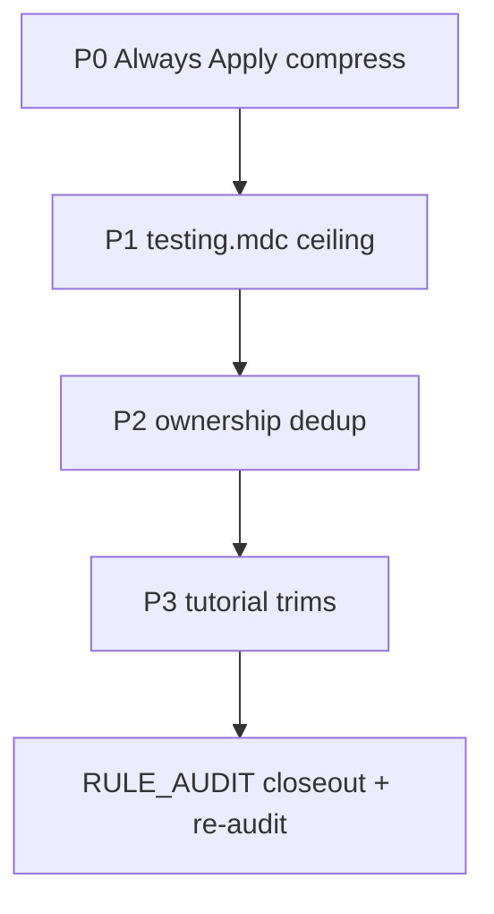

# Rule Audit Pass 3 — Deferred Trims

## Context

Passes 1–2 resolved activation modes, contradictions (C-001–C-004), and currency issues. **11 findings remain**, all tagged **DEFERRED** in [RULE_AUDIT.md](RULE_AUDIT.md):

| Priority | IDs | Files | Violation |
|----------|-----|-------|-----------|
| P0 — every request | RA-005, RA-006 | `code-minimalism.mdc`, `pm-collaboration.mdc` | Always Apply word budget (~150 words / ~30 lines) |
| P1 — hard ceiling | RA-003 (partial), RA-016 | `testing.mdc` | 340 lines (300 ceiling); good-vs-bad tutorial blocks |
| P2 — dedup | RA-020, RA-021, RA-022 | `project-standards.mdc`, `api-development.mdc` | Repeats owner rules |
| P3 — tutorial noise | RA-017, RA-018, RA-019, RA-025 | `git-workflow.mdc`, `project-standards.mdc`, `ui-styling.mdc`, SQL helpers | Generic walkthroughs |

**Standard:** [`.cursor/skills/rule-authoring/SKILL.md`](.cursor/skills/rule-authoring/SKILL.md) — cut tutorials, keep project-specific patterns, one principle + file ref beats three code blocks.

**Out of scope:** No activation-mode changes, no new contradictions fixes, no `useGetMessage` removal (open question #4 stays open).

---

## Execution order



Work in this order so the highest per-request cost is paid down first, then the only **hard ceiling** violation, then lower-risk dedup and tutorial cuts.

---

## P0 — Always Apply compression (RA-005, RA-006)

### [`code-minimalism.mdc`](.cursor/rules/code-minimalism.mdc) — 54 lines / ~453 words → ~30 / ~150

**Keep (non-negotiable):** the 7-rung ladder, UI rung-4 shadcn exception, `// debt:` convention, "Not Lazy About" guard list with cross-refs.

**Compress:**
- Merge "Core Principle" into a single opening sentence before the numbered ladder
- Shorten each ladder rung to one tight line (drop parenthetical elaboration where the rung title is self-explanatory)
- Collapse "Discipline" from 4 prose bullets → 3 terse bullets (understand flow, fix root cause once, no unrequested abstractions)
- "Cross-References" → inline on the guards list only; drop the duplicate closing section

**Do not:** demote `alwaysApply` — this is a true universal.

### [`pm-collaboration.mdc`](.cursor/rules/pm-collaboration.mdc) — 51 lines / ~321 words → ~30 / ~150

**Keep:** PM owns product / agent owns technical-with-approval, ask before implementing when unclear, no code blocks in discussions, tests built automatically, manual test checklist, explicit-only commits/PRs, partner-not-order-taker.

**Compress:**
- Fold "My Background" into the title paragraph (one line)
- Merge Planning, Technical Decisions, Communication into one `## How We Work` bullet list (~8 bullets)
- Keep "Code in Conversations" as 4 bullets (unique, not duplicated elsewhere)
- Merge Testing & Collaboration Principles into 3 bullets

**Do not:** demote `alwaysApply` — audit open question #2 decided to keep it for template forks; only size-trim.

---

## P1 — `testing.mdc` ceiling (RA-016, completes RA-003)

### [`testing.mdc`](.cursor/rules/testing.mdc) — 340 lines → ≤300

**Primary cut:** `### Examples of Over-Testing` (lines ~181–256, ~75 lines of ❌/✅ code blocks).

**Replace with** ~8–12 lines:

```markdown
### Over-testing anti-patterns
- One representative edge case beats a matrix of empty/unicode/emoji/null tests.
- Group validation into user-visible error-message tests, not one test per rule.
- Assert user-visible behavior (loading text, disabled submit), not internal state or handler calls.
- Repo references: `extract-auth-form-error.unit.test.ts`, `login-form.integration.test.tsx`.
```

**Preserve:** H/I/B pattern, MSW v2 section, mocking policy, coverage gates, real Examples paths (fixed in pass 1), authoring checklist.

**Secondary trim if still >300:** tighten "Test Authoring by Type" bullets (currently repetitive with earlier sections) — target ≤10 lines total across the three subsections.

---

## P2 — Single-ownership dedup (RA-020, RA-021, RA-022)

Replace restated owner content with one-line cross-refs. **Delete code blocks** where the owner rule already has them.

### [`project-standards.mdc`](.cursor/rules/project-standards.mdc)

| Section | Action |
|---------|--------|
| `## Error Handling` (159–163) | → `See error-handling.mdc` + one repo reminder (`error.tsx`, inline/panel components) |
| `## Security` (170–175) | → `See security.mdc` |
| `## Quality Standards` (181–186) | → `See git-workflow.mdc` + link `AGENTS.md` quality commands table |

### [`api-development.mdc`](.cursor/rules/api-development.mdc)

| Section | Action |
|---------|--------|
| `## Error Handling` quick-ref (40–50) | Keep 3 API-specific bullets (status codes, no stack leaks, `source` in logs); drop envelope field enumeration — already cross-refs `error-handling.mdc` |
| `## Response Structure` (64–76) | Delete both code blocks → "Use the envelope contract in `error-handling.mdc`; success returns `{ success: true, data }`." |
| `## Standard Error Codes` (84–94) | Keep code list (API-specific taxonomy) OR trim to 3-line pointer if redundant with `error-handling.mdc` — verify during edit; prefer keeping the API code names only |

---

## P3 — Tutorial / persona trims (RA-017, RA-018, RA-019, RA-025)

### [`git-workflow.mdc`](.cursor/rules/git-workflow.mdc) — RA-017

**Keep (repo-specific):** Husky pre-commit/pre-push contents, `pnpm pre-push` mirror, subagent `refactor-cleaner` commit exception, "only commit/PR when user asks."

**Cut:**
- `## Examples` bash block (46–59) → 2 one-line examples + link [Conventional Commits](https://www.conventionalcommits.org/)
- `## Commit Message Structure` ASCII diagram (69–76) — redundant with format section above
- `### Creating PRs via GitHub CLI` full avatar-upload example (155–160) → keep required `--body` format string only; note "user Cursor PR rule owns full `gh pr create` workflow"
- Duplicate PR title/description bullet lists if they repeat the format string

**Target:** ~30–40 lines removed; file lands ~160–170 lines (well under ceiling).

### [`project-standards.mdc`](.cursor/rules/project-standards.mdc) — RA-018

**Keep:** Ousterhout depth section (51–73), `_lib/` vs `src/utils/` placement (75–79), kebab-case naming, component skeleton is borderline — **replace 33-line skeleton** (83–115) with: "Follow order in `typescript.mdc`; see `profile/page.tsx` for a real settings surface."

**Cut:**
- SOLID enumerated list (16–21) → one line: "Apply SOLID via small, single-purpose modules."
- Import good/bad example (42–49) → "Always use `@/` for internal imports."
- RORO code block (132–150) → one-line principle + optional ref to a real function if one exists; otherwise drop example

### [`ui-styling.mdc`](.cursor/rules/ui-styling.mdc) — RA-019

**Cut:**
- `## Responsive Design` tutorial + breakpoint table + common patterns (78–122) → "Mobile-first Tailwind; breakpoint scale and layout patterns: `nextjs.mdc`."
- `## Image Optimization` code blocks (137–157) → "Use `next/image` with width/height; `priority` above fold — see `nextjs.mdc`."

**Keep:** semantic token guidance (fixed in pass 1), `cn()` usage, component organization paths, theme toggle pattern if project-specific.

### SQL helpers — RA-025

Apply the same persona trim across three Agent Requested rules:

| File | Trim |
|------|------|
| [`create-rls-policies.mdc`](.cursor/rules/create-rls-policies.mdc) | Replace opening persona paragraph with "Agent Requested SQL helper — use with `create-migration` skill." Collapse repeated policy-type explanations where the numbered rules (lines 18–27) already state them. Keep one canonical INSERT template (fixed in pass 2). Trim duplicate `authenticated`/`anon` role examples if a single `profiles` migration ref suffices. |
| [`create-db-functions.mdc`](.cursor/rules/create-db-functions.mdc) | Drop persona opener; keep `SECURITY INVOKER`, `search_path`, and Supabase-specific requirements as bullet principles. |
| [`postgres-sql-style-guide.mdc`](.cursor/rules/postgres-sql-style-guide.mdc) | Light pass only — already 133 lines; remove any redundant multi-example blocks if present. |

---

## Closeout

1. Update [RULE_AUDIT.md](RULE_AUDIT.md):
   - Mark RA-005, RA-006, RA-016–022, RA-025 **RESOLVED**
   - Mark RA-003 **RESOLVED** (line count ≤300)
   - Refresh executive summary — deferred items cleared
   - Note any intentional holdovers (e.g. `useGetMessage` legacy ref)

2. Re-run [`/rule-audit`](.cursor/skills/rule-audit/SKILL.md) to produce a clean repeat-run artifact and catch regressions.

3. Optionally verify [`.cursor/rules/README.md`](.cursor/rules/README.md) "What we adopted" list still matches trimmed rules (SOLID/RORO mentions may need softening if cut from `project-standards.mdc`).

---

## Verification checklist

After all edits:

```bash
# Always Apply budget
wc -w .cursor/rules/code-minimalism.mdc .cursor/rules/pm-collaboration.mdc
# Target: each ≤150 words

# Hard ceiling
wc -l .cursor/rules/testing.mdc
# Target: ≤300

# No tutorial sediment
rg "#### ❌|#### ✅" .cursor/rules/
# Target: zero matches

# Dedup — project-standards should not restate security/error checklists
rg -n "OWASP|try/catch for async" .cursor/rules/project-standards.mdc
# Target: zero (cross-refs only)

# Activation unchanged
rg -l 'alwaysApply: true' .cursor/rules/*.mdc
# Target: exactly 4 files (general-conventions, code-minimalism, pm-collaboration, do-migrations-pointer)
```

**Manual spot-check:** open a trimmed Always Apply rule and confirm the partnership contract and minimalism ladder still read coherently — these load on every request.

---

## Risk notes

- **Over-compression of Always Apply rules** is the main risk — prefer shorter sentences over deleting rungs/guards.
- **`git-workflow.mdc` PR section** overlaps the user's Cursor `creating-pull-requests` rule — trimming is safe if the format string + "user rule owns workflow" note remain.
- **SQL helper trims** must not remove Supabase-specific safety requirements (`search_path`, `WITH CHECK` vs `USING`) — only persona prose and duplicate examples.
