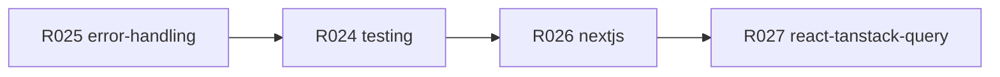

# Rule Audit Remediation (R024–R027)

## Scope

**Edit (4 files):**
- [`.cursor/rules/testing.mdc`](.cursor/rules/testing.mdc) — R024
- [`.cursor/rules/error-handling.mdc`](.cursor/rules/error-handling.mdc) — R025 (Medium priority)
- [`.cursor/rules/nextjs.mdc`](.cursor/rules/nextjs.mdc) — R026
- [`.cursor/rules/react-tanstack-query.mdc`](.cursor/rules/react-tanstack-query.mdc) — R027

**Do not touch:** `RULE_AUDIT.md` (synced separately by the audit-rules skill in sync mode), open questions (broad `src/**` globs, MSW deferral), Always Apply rules, or any `src/` application code.

**Standard:** Read [`.cursor/skills/rule-authoring/SKILL.md`](.cursor/skills/rule-authoring/SKILL.md) before editing. Every cited path must exist on disk (verified: `login-form.integration.test.tsx`, `extract-auth-form-error.unit.test.ts`, `profile/actions.unit.test.ts`, `seo.mdc`).

---

## Fix order (by severity)

---

## Step 1 — R025: Remove fictional REST error test (`error-handling.mdc`)

**Problem:** The `## Testing Error Scenarios` section (lines 172–187) shows a fictional `GET(mockRequest)` / `fetchPosts` / JSON envelope test. The repo has **no shipped `src/app/api/**` routes** — agents copying this would invent a REST pattern that does not exist here.

**Change:** Delete the entire TypeScript code block. Replace with a short principle + shipped file pointers (same pattern used in prior R017 remediation and in `testing.mdc` line 116):

- Keep the existing cross-ref: "See `.cursor/rules/testing.mdc` for comprehensive testing patterns."
- Add one principle line: test user-visible error UI for operational failures and envelope `kind`/`code` at the producer boundary — do not invent API-route handler tests when the feature uses Server Actions or client Supabase calls.
- Point at shipped references:
  - [`src/components/login-form.integration.test.tsx`](src/components/login-form.integration.test.tsx) — operational auth failure renders inline message, no `ErrorPanel` copy affordance
  - [`src/utils/extract-auth-form-error.unit.test.ts`](src/utils/extract-auth-form-error.unit.test.ts) — `operational` vs `fault` mapping
  - [`src/app/(app)/profile/actions.unit.test.ts`](src/app/(app)/profile/actions.unit.test.ts) — Server Action envelope assertions (`success: false`, `kind`, `code`)

**Leave unchanged:** the Quick Checklist below (lines 189–199) — it is still valid guidance.

---

## Step 2 — R024: Replace TipTap sediment (`testing.mdc`)

**Problem:** Line 98 cites TipTap editors as a third-party skip-test example; TipTap is not in this codebase.

**Change:** In the `#### Skip These:` bullet for third-party libraries, replace the TipTap clause with a dependency that actually exists:

- **Before:** "Don't test that Supabase queries work or TipTap editors function"
- **After:** "Don't test that Supabase queries work or Radix/shadcn primitives render correctly"

This stays project-specific without adding a new bullet or section.

---

## Step 3 — R026: Fix SEO ownership bleed (`nextjs.mdc`)

**Problem:** Line 15 ("Use proper metadata exports for SEO") restates content owned by [`seo.mdc`](.cursor/rules/seo.mdc) without cross-referencing it. Both rules load on `src/app/**` edits.

**Change:** In `## File Conventions`, replace line 15 with:

> See `seo.mdc` for metadata, indexing, and social-preview wire-up.

Keep the other File Conventions bullets (`error.tsx`, `loading.tsx`, `route.ts`) as-is.

---

## Step 4 — R027: Collapse duplicate query-key section (`react-tanstack-query.mdc`)

**Problem:** `## Query Key Conventions` (lines 29–34) repeats the same key-array guidance already in `## Custom Hooks Pattern` (lines 22–27), paying context twice on every hook edit.

**Change:**
- **Delete** the entire `## Query Key Conventions` section (lines 29–34).
- **Tighten** `## Custom Hooks Pattern` so key guidance appears once:
  - Keep the shipped `['profiles', userId]` example in the intro paragraph (line 22).
  - In Key points, keep exactly one bullet on descriptive key arrays; remove any second mention of the same pattern.
- **Do not touch** line 27's route-handler `{ success, data?, error? }` bullet.

Result: one section, one illustrative key example, no generic `posts`/`comments` examples.

---

## Verification

No `pnpm test:ci` required — rule-only edits. After implementation:

1. Re-read the four edited sections — each should pass the rule-authoring **no-op test** (every line changes behavior vs default).
2. Grep the four files for `TipTap`, `fetchPosts`, `mockRequest`, and `Query Key Conventions` — should return zero hits.
3. Confirm relative markdown links in `error-handling.mdc` resolve to existing test files.
