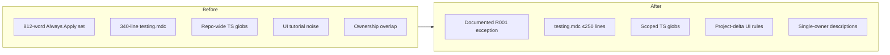

# Rule Audit Remediation Plan

## Scope

**Edit (9 files):**
- [`.cursor/skills/rule-authoring/SKILL.md`](.cursor/skills/rule-authoring/SKILL.md)
- [`.cursor/rules/testing.mdc`](.cursor/rules/testing.mdc)
- [`.cursor/rules/typescript.mdc`](.cursor/rules/typescript.mdc)
- [`.cursor/rules/ui-shadcn.mdc`](.cursor/rules/ui-shadcn.mdc)
- [`.cursor/rules/ui-accessibility.mdc`](.cursor/rules/ui-accessibility.mdc)
- [`.cursor/rules/ui-styling.mdc`](.cursor/rules/ui-styling.mdc)
- [`.cursor/rules/error-handling.mdc`](.cursor/rules/error-handling.mdc)
- [`.cursor/rules/security.mdc`](.cursor/rules/security.mdc)
- [`RULE_AUDIT.md`](RULE_AUDIT.md)

**Do not touch:** `code-minimalism.mdc`, `pm-collaboration.mdc`, or any other rule files.

**Standards:** Read [`.cursor/skills/rule-authoring/SKILL.md`](.cursor/skills/rule-authoring/SKILL.md) before editing; every cited path must exist (verified: `extract-auth-form-error.unit.test.ts`, `login-form.integration.test.tsx`, `src/app/admin/users/actions.ts`, `src/components/ui/`, `src/app/globals.css`, `DESIGN.md`, `components.json`, `src/providers/ThemeProvider.tsx`, `src/utils/tailwind.ts`).

---

## Step 1 — R001: Accepted exception in rule-authoring skill

In **Size budgets** (after the ~200-word per-file bullet, ~line 26), add exactly:

> Accepted exception: the current Always Apply set runs ~12 words over budget; code-minimalism.mdc's always-on placement is justified as the project's core ethos rule. Do not re-flag unless the set grows further.

No edits to the Always Apply rules themselves.

---

## Step 2 — R002: Trim `testing.mdc` (340 → ≤250 lines)

### Collapse over-testing examples (lines 181–256)

Replace the three good/bad comparison blocks (ContactForm samples, boundary-case sprawl, implementation-detail tests) with **one short principle paragraph**:

- Over-testing = many near-duplicate edge-case or validation micro-tests, or asserting implementation details instead of user-visible behavior.
- Point at shipped references: [`src/utils/extract-auth-form-error.unit.test.ts`](src/utils/extract-auth-form-error.unit.test.ts) (focused unit coverage) and [`src/components/login-form.integration.test.tsx`](src/components/login-form.integration.test.tsx) (behavior-level integration).

### Deduplicate minimalism

Currently repeated in: header "Core Principle: Minimalism", Goals, Best Practices, Coverage section, Authoring Checklist.

- Keep **one** minimalism statement (header or Goals — not both at length).
- Remove bullets that restate `code-minimalism.mdc` ("fewer high-value tests", "minimize test count", etc.).
- Do **not** duplicate the ladder; cross-ref `code-minimalism.mdc` once if needed.

### Additional safe trims (signal-to-noise)

- **Test Structure** generic RTL block (~lines 61–78): cut or reduce to one line ("use `@/test/test-utils` render").
- Merge overlapping **Goals** / **Testing Philosophy** sections.

### Mocking policy (preserve principles, cut inline example)

Keep the mocking-policy principles and boundary rules (only mock system boundaries; do/don't lists; MSW v2 location in `src/mocks/handlers.ts` + `src/mocks/server.ts`; Supabase boundary guidance). **Replace** the inline MSW example handler code block (~lines 103–112) with a one-line pointer to [`src/mocks/handlers.ts`](src/mocks/handlers.ts) — do not cut the surrounding mocking-policy section.

### Preserve intact (no structural changes)

| Section | Lines (approx) |
|---------|----------------|
| `pnpm test:ci` vs watch-mode table + warnings | 119–140 |
| H/I/B pattern | 142–160 |
| Mocking policy principles + MSW/Supabase boundary rules (no inline handler example) | 92–101, 114–117 |
| Coverage requirements (80%, vitest.config, in-scope/excluded) | 289–295 |
| File naming conventions | 307–318 |
| Authoring checklist | 330–340 |

Target: **≤250 lines** after edit.

---

## Step 3 — R003: Fix `typescript.mdc`

### Narrow globs (YAML list, no brace expansion)

```yaml
globs:
  - 'src/**/*.ts'
  - 'src/**/*.tsx'
  - 'scripts/**/*.ts'
```

Add a frontmatter comment (above or below globs) documenting trigger rationale: app and admin-script TypeScript only — excludes Vitest/config, Husky, migrations, `.cursor/`, and test files where TS conventions add little signal.

Update `description` to be project-specific (named exports, Supabase types, shared-type placement).

### Cut generic content

Remove entirely:
- **RORO Pattern** section (lines 50–66)
- **Example Component Structure** block (lines 34–48)
- **Anti-patterns to Avoid** bullets (lines 68–74)
- Generic **Code Style** bullets (functional/declarative, arrow functions, variable naming, curly-brace style)

### Keep project-specific guidance only

- **Named exports** convention + migration note (legacy default exports being migrated; new code uses named)
- **Supabase types:** `pnpm db:types` → [`src/types/database.types.ts`](src/types/database.types.ts)
- **One-line conventions:** prefer interfaces over types; avoid enums (const objects / `as const`)
- **Shared types placement:** appropriate locations (`src/types/`, route `_lib/`, `src/utils/`) — not inline; cross-ref `project-standards.mdc` if useful

Expected result: ~25–40 lines, high signal density.

---

## Step 4 — R009: Trim UI rules

### `ui-shadcn.mdc` (~223 → ~70–90 lines)

**Keep:**
- CLI canonical form with `-y -o`, `--dry-run`/`--diff`, flag table, when to / not to overwrite
- Primitive-first philosophy (own code in `src/components/ui/`, not npm package — aligns with AGENTS hard constraint)
- Structure bullets: location, `@/components/ui/` imports, `cn()` from `@/utils/tailwind`, cva/Slot mention (no tutorial)
- Reference: [`components.json`](components.json), [`src/components/ui/`](src/components/ui/)

**Cut:** cva customization walkthrough, `asChild`/Link examples, composite `UserMenu`, `LoadingButton`, Form/Dialog/Responsive code blocks (~lines 56–213).

**Replace customization section with:** edit primitives in place; follow shipped patterns in `src/components/ui/` (e.g. `button.tsx`, `form.tsx`).

### `ui-accessibility.mdc` (~221 → ~60–80 lines)

**Keep project-specific:**
- WCAG 2.1 AA target + semantic HTML first
- shadcn/Radix built-in a11y; preserve when customizing (no overriding ARIA roles)
- Visible `focus-visible` rings using semantic tokens (`ring-ring`, `ring-offset-background`)
- Manual testing checklist (keyboard-only, focus, contrast, screen readers)
- shadcn Dialog for modals (focus trap built-in)
- External resource links (WCAG quickref, Radix a11y)

**Cut generic tutorials:** semantic HTML lists, heading hierarchy, ARIA label code samples, keyboard shortcut tables, onKeyDown div-button pattern, contrast ratio tables, focus/screen-reader/form code blocks, skip-link example.

**Replace each cut area with one principle line**, e.g.:
- ARIA: add only when semantic HTML is insufficient
- Keyboard: all interactive elements operable without mouse; prefer native elements over synthetic roles

### `ui-styling.mdc` (~173 → ~50–70 lines)

**Keep:**
- Structure vs theme (fixed architecture, swappable token values)
- Semantic tokens only — [`src/app/globals.css`](src/app/globals.css), [`DESIGN.md`](DESIGN.md), AGENTS hard-constraint cross-ref
- `next-themes` via [`src/providers/ThemeProvider.tsx`](src/providers/ThemeProvider.tsx); CSS variables handle light/dark
- Component organization paths (`src/components/ui/`, page `_components/`)
- Next.js `Image` optimization (brief — project uses it for landing/assets)

**Cut:** `cn()` tutorial block, responsive breakpoint reference table, common responsive pattern code blocks, `useTheme` toggle example, duplicate mobile-first bullets.

**Replace with one-liners:** use `cn()` from `@/utils/tailwind` for conditional classes; mobile-first responsive utilities per Tailwind defaults.

---

## Step 5 — Ownership fixes (R010, R011)

### `error-handling.mdc`

- **Frontmatter description:** narrow to error taxonomy, response envelopes, and error UI surfaces (`InlineError` / `ErrorPanel` / `kind` branching). Remove "logging" and "monitoring".
- **Title:** drop "& Logging" → `# Error Handling Standards`
- **Logging section (~70–76):** remove ownership claim and inline `console.error` example; keep a single cross-ref line to [`logging.mdc`](.cursor/rules/logging.mdc) for levels/tags and the note that error logging passes the Error object as second arg.
- Leave taxonomy table, envelopes, Supabase mapping, auth-form fallback-first, UI patterns, toast boundary, and checklist intact.

### `security.mdc`

Replace inline code blocks with principles + file refs:

| Current block | Replacement |
|---------------|-------------|
| Server-side auth check (~27–43) | One line: verify auth server-side on every protected path; canonical gated-action pattern in [`src/app/admin/users/actions.ts`](src/app/admin/users/actions.ts) (`assertAdminCaller` — verified in repo). Cross-ref `error-handling.mdc` for envelope shape. |
| Resource ownership (~45–54) | One line: verify ownership before mutate; RLS is the DB layer — app code still checks where needed. |
| DTO block (~94–112) | One line: never `select('*')` or return raw rows; explicit field selection. Reference admin users list action or profile patterns as shipped examples. |
| Broken Access Control example (~163–186) | Collapse to checklist bullet (already covered by auth + ownership principles); remove duplicate GET/DELETE walkthrough. |

Keep: core principles, zod at boundary (forms.mdc ref), RLS/secret-key, env vars, proxy/is-safe-redirect, SSRF whitelist (brief — no API routes yet), checklists, cross-refs to `error-handling.mdc`, `api-development.mdc`, `supabase.mdc`.

---

## Step 6 — Update `RULE_AUDIT.md`

### Move to Resolved (add verification notes)

| ID | Verification note |
|----|-------------------|
| R001 | Accepted exception — set ~12 words over budget; code-minimalism always-on justified as core ethos; exception recorded in rule-authoring skill Size budgets |
| R002 | Over-testing examples collapsed; minimalism deduped; file ≤250 lines |
| R003 | Globs narrowed to `src/**/*.ts`, `src/**/*.tsx`, `scripts/**/*.ts`; generic TS tutorial cut; glob rationale in frontmatter |
| R009 | ui-shadcn, ui-accessibility, ui-styling trimmed to project-specific guidance + file pointers |
| R010 | error-handling description scoped to taxonomy/envelopes/UI; logging defers to logging.mdc |
| R011 | security auth/DTO inline blocks replaced with principles + shipped file refs |

Remove R001–R003, R009–R011 from **Findings** table.

### Refresh executive summary

Replace open-issue bullets with current state:
- R001 accepted (documented exception, no trim)
- testing.mdc trimmed to ≤250 lines
- typescript.mdc globs narrowed
- UI rules trimmed (generic tutorial cut)
- Remaining open themes if any: broad `src/**` on logging/security/supabase (unchanged this pass)

### Update Orient table

Change `typescript.mdc` row from `**/*.ts`, `**/*.tsx` (repo-wide) to `src/**/*.ts`, `src/**/*.tsx`, `scripts/**/*.ts`.

### Update "Rules that are fine"

- Revise `error-handling.mdc` entry (remove R010 caveat)
- Add/update entries for trimmed files (`testing.mdc`, `typescript.mdc`, `ui-shadcn.mdc`, `ui-accessibility.mdc`, `ui-styling.mdc`, `security.mdc`) reflecting new focus
- Remove or soften `pm-collaboration.mdc` R001 trim recommendation

### Set `Last synced: 2026-07-04` (already today; confirm unchanged or refresh timestamp)

---

## Step 7 — Quality gate

Run sequentially:

```bash
pnpm type-check && pnpm lint && pnpm format-check && pnpm test:ci
```

Fix any formatting/lint issues in edited files only. Rule `.mdc` files are typically Prettier-ignored — if `format-check` fails on them, run `pnpm format` only if the repo includes these paths in format scope; otherwise note and proceed if failure is pre-existing outside scope.

---

## Expected outcome



All six audit IDs resolved in `RULE_AUDIT.md`; no application code changes; quality gate green.
