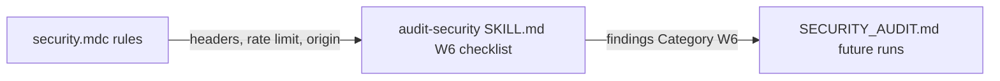

# Security W6: audit skill + rule sync

## Scope

Two documentation-only edits. No changes to application code, [`SECURITY_AUDIT.md`](SECURITY_AUDIT.md), or other skills/rules.

---

## File 1: [`.cursor/skills/audit-security/SKILL.md`](.cursor/skills/audit-security/SKILL.md)

### 1. Add W6 to the workstream table

Insert a new row after W5 (line 79), matching the existing two-column table format:

| ID | Scope |
| --- | --- |
| W6 | Transport & abuse hardening: security headers, rate limiting, CSRF/origin verification |

### 2. Add W6 checklist bullet

Append one bullet after the W5 checklist entry (after line 87), using the same `**W# — Title:**` prefix and semicolon-separated concrete checks as W1–W5:

- **W6 — Transport & abuse hardening:** security headers configured in next.config (Content-Security-Policy, frame-ancestors or X-Frame-Options, HSTS in production); CSP does not rely on `'unsafe-inline'`/`'unsafe-eval'` without a documented exception; rate limiting exists on auth-adjacent and expensive endpoints (or absence is recorded as accepted risk); state-changing operations are server actions (built-in origin check) or API routes that verify origin; no cookie-authenticated state-changing API route lacking origin verification.

This yields **5 concrete checks** — consistent with W1/W2 length (W3–W5 use 4).

### 3. Update YAML frontmatter description

In the `description:` block (lines 3–10), extend the domain list from:

> auth, RLS, server surface, storage, and exposure

to:

> auth, RLS, server surface, storage, exposure, and transport/abuse hardening

Preserve the rest of the frontmatter unchanged.

### 4. Rename W1–W5 → W1–W6 (5 occurrences)

Global replace within this file only:

| Location | Current text | Updated text |
| -------- | ------------ | ------------ |
| Line 34 — Full pass flow | `workstreams W1–W5` | `workstreams W1–W6` |
| Line 89 — finding metadata | `Category** (workstream W1–W5)` | `Category** (workstream W1–W6)` |
| Line 91 — Parallelism | `running W1–W5 sequentially` | `running W1–W6 sequentially` |
| Line 105 — Rules bullet | `category (W1–W5)` | `category (W1–W6)` |
| Line 127 — Output quality bar | `Every workstream W1–W5 was reviewed` | `Every workstream W1–W6 was reviewed` |

**Leave unchanged** (aside from frontmatter description above):

- Phase 1 surface map table (no new row required; W6 evidence lives in `next.config.ts`, `src/utils/security-headers.ts`, server actions, and any future `src/app/api/` routes discovered in Phase 1)
- Output template (Category column already accepts any W# value; example row stays `W2`)

### Repo alignment note (for future audits, not part of this edit)

This repo already has relevant W6 evidence the skill will eventually cite:

- Headers: [`src/utils/security-headers.ts`](src/utils/security-headers.ts) → [`next.config.ts`](next.config.ts) (CSP report-only, `frame-ancestors 'none'`, `X-Frame-Options`, HSTS)
- No custom API routes today (`src/app/api/` empty)
- State-changing surface is server actions only (profile + admin actions)
- Rate limiting: Supabase Auth built-in only; no app-level limiter — likely **Deferred / accepted risk** on next full pass

Existing finding S004 (CSP report-only) is categorized W5 today; a future full pass may recategorize transport/header items to W6 — out of scope for this doc edit.

---

## File 2: [`.cursor/rules/security.mdc`](.cursor/rules/security.mdc)

### 1. Add two `###` sections under `## Next.js Security`

**Placement:** After `### Open Redirect Prevention` (ends ~line 93) and before `### CORS Configuration` — keeps transport/abuse guidance grouped without reordering CORS or SSRF.

**### Security Headers** (short; rule + shipped pattern + doc pointer)

Content to add (~5–6 lines):

- Configure CSP, frame-ancestors (or X-Frame-Options), and HSTS via next.config headers
- Start strict; `'unsafe-inline'` / `'unsafe-eval'` are temporary compatibility debt requiring a documented removal plan
- **Reference (shipped pattern):** [`src/utils/security-headers.ts`](src/utils/security-headers.ts) wired through [`next.config.ts`](next.config.ts) — CSP is report-only by default; enforcing mode is opted into via `CSP_ENFORCE` (see the `// debt:` marker in that file for the nonce upgrade path before enforcement)
- **Reference:** [Next.js Security](https://nextjs.org/docs/app/building-your-application/configuring/security-headers) — same URL already in the Resources footer (line 158); keep both links inline, do not duplicate a new Resources entry

**### Rate Limiting** (short; requirement only, no library prescription)

Content to add (~3 lines):

- Auth-adjacent and expensive endpoints need rate limiting
- Supabase Auth enforces rate limits on its own endpoints; custom API routes and server actions do not
- Implementation choice is per-project (no prescribed library)

**Do not include** “absence should be recorded as accepted risk” here — that clause belongs only in the audit skill's W6 checklist (Deferred / accepted risk is an audit output concern, not a coding rule).

Match existing subsection style: `###` heading, terse bullet lines, optional **Reference:** line where other subsections use it (Auth Proxy, Open Redirect).

### 2. Add one Pre-Commit checklist line

**Placement:** [`### Pre-Commit`](.cursor/rules/security.mdc) checklist (lines 122–130), after the auth/authorization items and before secrets/DTO items — logically adjacent to “Auth checks for protected routes”:

- `[ ] State-changing operations use server actions (Next.js origin check) or API routes that explicitly verify origin`

**Why Pre-Commit over Common Vulnerabilities:** the existing Pre-Commit list is actionable per-change guidance; Common Vulnerabilities currently has only the Broken Access Control subsection with a pointer back to auth/RLS — a single origin-check line fits the checklist pattern better and mirrors W6’s CSRF/origin check without expanding Common Vulnerabilities.

---

## Cross-file consistency

| Topic | security.mdc (prescriptive) | audit-security W6 (verifiable) |
| ----- | ----------------------------- | ------------------------------ |
| Headers | Configure CSP, frame-ancestors/XFO, HSTS via next.config; document unsafe-* debt; shipped pattern in `security-headers.ts` | Verify next.config wiring; flag undocumented unsafe-inline/eval; CSP report-only vs enforce |
| Rate limiting | Required on auth-adjacent/expensive endpoints; Supabase Auth exempt; per-project impl | Verify presence; **or** record absence as accepted risk (audit-only) |
| CSRF/origin | Pre-Commit: server actions or explicit origin verify | Same checks in W6 checklist + no unprotected cookie-authenticated mutating API routes |

W6 checklist wording intentionally echoes the new rule sections so auditors and implementers read the same requirements.

---

## Verification (post-implementation)

- Grep `.cursor/skills/audit-security/SKILL.md` for `W1–W5` — should return zero matches
- Grep same file for `W6` — table row, checklist, and all five updated references present
- Grep same file for `transport/abuse hardening` in frontmatter description
- Grep `security.mdc` Rate Limiting section — no “accepted risk” wording; Security Headers section cites `security-headers.ts` and `CSP_ENFORCE`
- Confirm `security.mdc` still under rule-authoring line budget (adds ~15 lines; file is ~159 lines today, well under 300-line inspect trigger)
- No edits outside the two named files

## Manual review checklist (for PM)

- [ ] W6 table row and checklist read naturally alongside W1–W5
- [ ] Security Headers section cites the shipped pattern (`security-headers.ts`, report-only CSP, `CSP_ENFORCE`) plus Next.js docs link
- [ ] Rate Limiting section states the requirement without “accepted risk” language (that stays in W6 checklist only)
- [ ] Pre-Commit origin line is clear for a non-developer PM approving the rule
