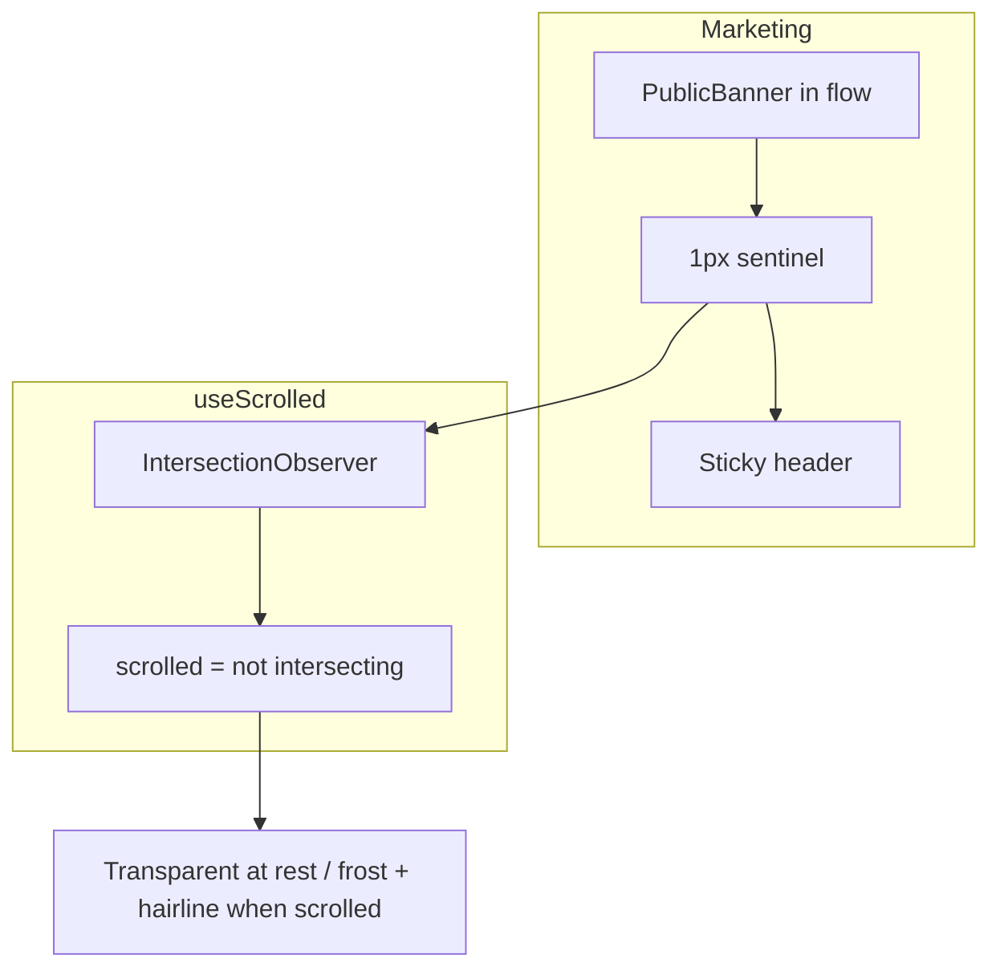

# Sentinel-based header scroll chrome

`window.scrollY` measures document scroll, not the header’s position. A banner above the header (authenticated today; marketing after this change) makes frost appear too early. Watch a sentinel at the header’s top edge instead.

## Hook: watch a sentinel, not `scrollY`

In [`src/hooks/use-scrolled.ts`](src/hooks/use-scrolled.ts):

- Take a ref to the sentinel. Drop `SCROLL_ON_THRESHOLD`, `SCROLL_OFF_THRESHOLD`, the dead band, and the scroll listener.
- Keep initial state `false` so SSR and first paint match “at top.”
- Keep the isomorphic layout effect (`useLayoutEffect` on the client, `useEffect` on the server).
- In that effect: apply the sentinel’s current viewport intersection immediately (so a mid-page load still corrects before paint), then attach an `IntersectionObserver` on the sentinel. Chrome is at rest while the sentinel intersects the viewport; scrolled once it does not. Disconnect on cleanup.
- Observer options: viewport root, `threshold: 0`. No `rootMargin` unless the visual sweep shows frost lagging the stick point — then a small inset is the only knob, not a new pixel threshold in JS.

## Chrome: render the sentinel above the header

In [`src/components/site-header-chrome.tsx`](src/components/site-header-chrome.tsx):

- Create the sentinel ref and pass it to `useScrolled`.
- Render a presentational sentinel as the previous sibling of `<header>` (fragment root — do not wrap both in a sticky container). `aria-hidden`, no layout contribution, not `hidden`/`display: none` (the observer would never see it). Give it a 1px height cancelled by a negative margin (`h-px -mb-px`), not `h-0` — a zero-area target gives IntersectionObserver a degenerate rect whose `intersectionRatio` is always 0, and `isIntersecting` on it is browser-dependent.
- **Verify the extra sibling costs nothing.** This component now emits two elements where it emitted one. Check the containers in [`app-shell.tsx`](src/app/(app)/_components/app-shell.tsx) and the marketing layout: if either is `flex` or `grid` with a `gap`, the sentinel adds one gap's worth of spacing. Confirm before build, not in the visual sweep — it would only show up in one shell.
- Class string unchanged: `cn()` from `@/utils/tailwind`, reserved `border-b`, rest vs scrolled tokens, `duration-swept`, `motion-reduce:transition-none`, `sticky top-0 z-50` when `sticky` is true.

## Required companion: let the public banner scroll away

[`src/app/(marketing)/_components/marketing-sticky-chrome.tsx`](src/app/(marketing)/_components/marketing-sticky-chrome.tsx) is `sticky top-0 z-50` around banner + header. A sentinel inside that wrapper can never leave the viewport, so frost would never appear.

Remove those sticky classes. The wrapper is then just a banner-above-header stack — rename the component and file to match (it is neither sticky nor a chrome wrapper anymore), since this change is what makes the current name wrong. The header keeps its own sticky via SiteHeaderChrome. The public banner scrolls away — same as the authenticated banner already does.

Authenticated layout already places the banner above a sticky `SiteHeader` with no sticky parent, so it picks this up with no layout change.

After dismiss (client state, no reload) the banner unmounts, the sentinel moves up, and the observer re-evaluates. No extra dismiss wiring.

## Tests

Rewrite [`src/hooks/use-scrolled.unit.test.ts`](src/hooks/use-scrolled.unit.test.ts):

- Mock `IntersectionObserver` at the boundary the same way [`src/hooks/use-mobile.unit.test.ts`](src/hooks/use-mobile.unit.test.ts) mocks `matchMedia`: stub the constructor, capture the callback, expose `observe` / `disconnect`.
- Pass a ref whose `current` is a real element so the layout effect can observe it.
- Assert: `false` while intersecting, `true` once not intersecting, `false` again on return.
- Delete the 10px / 4px / dead-band cases.

No new chrome or header tests. [`src/components/site-header.unit.test.tsx`](src/components/site-header.unit.test.tsx) already finds the `<header>` landmark; `aria-hidden` keeps the sentinel out of that query. Do not assert CSS classes.

## Visual verify (manual)

Live public banner on a marketing page, light and dark:

- At rest: transparent header, no hairline, banner visible above it.
- Scroll until the header reaches the top of the viewport: frost + hairline appear at that moment, not while the banner is still leaving, not after content is already under the header.
- Dismiss the banner without reloading: at rest stays transparent; scrolling again frosts at the same stick point.
- No banner / already dismissed: same stick-point frost.
- Authenticated banner (already unpinned): same — frost only after the banner has scrolled away and the header sticks.
- Reduced motion: chrome snaps, not fades.

Then `pnpm pre-push`. No README / DESIGN sync.

## Close-out

This is an amendment to the in-flight header-polish epic, not its own epic. Do not commit separately — it lands in that epic's single commit with the `Epic:` trailer, and `/code-review` runs once after the whole epic.
