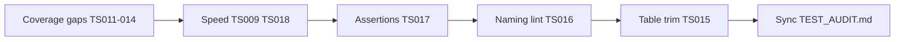

# Test Audit Do-Next Plan

Decisions locked from open questions:
- **Slow tests:** keep Vitest advisory output only — no CI fail-on-slow gate. Still apply `delay: null` and stub the 400ms reference delay.
- **TS016 scope:** expand lint for `_components/**` UI; `_lib/**` hook units that mock `@/supabase/client` stay `.unit` (explicit exclusion).

Deferred items (TS020–TS022) and Accepted (TS023–TS026) stay out of scope.

## Wave 1 — Coverage gaps (quick wins)

### TS011 — `probeSessionAction` (Critical)
Add colocated [`probe-session-action.unit.test.ts`](src/app/(app)/_lib/profile/probe-session-action.unit.test.ts):
- Mock `@/supabase/server` `createClient` → `auth.getUser`
- Cases: user present → `{ success: true }`; `error` set → `{ success: false }`; null user → `{ success: false }`
- Leave [`use-profile-avatar-upload.unit.test.ts`](src/app/(app)/_lib/profile/use-profile-avatar-upload.unit.test.ts) mock as-is

### TS012 — client-logs route fault paths (High)
Extend [`route.integration.test.ts`](src/app/api/client-logs/route.integration.test.ts) with three cases asserting status + envelope `kind`/`code` only:
1. Invalid JSON body → 400 `VALIDATION_ERROR` / `operational`
2. Session probe throws → still 202 success (best-effort)
3. Outer handler throw (e.g. force `appLog[level]` or post-parse failure) → 500 `INTERNAL_ERROR` / `fault` + `appLog.error` called

### TS014 — same-origin helper unit (Medium)
Add [`is-same-origin-relay-request.unit.test.ts`](src/app/api/client-logs/_lib/is-same-origin-relay-request.unit.test.ts):
- Malformed Origin → deny
- Valid Referer-only → allow
- Mismatched Referer → deny

### TS013 — logs action validation + fault (High)
Extend [`actions.unit.test.ts`](src/app/admin/logs/actions.unit.test.ts) (or thin `_lib` unit if cleaner):
- Invalid `sortDirection` on `listLogsAction`
- Invalid filters on **list** (not only mark-all)
- One `mapAdminActionFault` reject per family: list / stats / tags / mark-read — mock underlying helper to throw; assert fault envelope

## Wave 2 — Reliability & speed (no CI gate)

### TS018 — reference shipments delay
- Export or testably stub `REFERENCE_SHIPMENTS_FETCH_DELAY_MS` so tests can set `0` (prefer `vi.spyOn` / injectable delay over product behavior change; if stubbing requires a tiny export seam, keep demo UX delay at 400ms in production)
- Move `sortReferenceShipments` (and paginate if exported) coverage into [`reference-shipment-data.unit.test.ts`](src/app/(marketing)/reference/_lib/reference-shipment-data.unit.test.ts) or a tiny adjacent unit — drop overlapping filter/sort re-tests from the hook suite
- Keep ≤2 hook cases in [`use-reference-shipments.unit.test.tsx`](src/app/(marketing)/reference/_lib/use-reference-shipments.unit.test.tsx) with delay stubbed to `0` (or fake timers)
- **Do not** add a fail-on-slow CI allowlist

### TS009 — `userEvent` delay
Apply `userEvent.setup({ delay: null })` across remaining interactive suites that still use default delay, prioritizing slow offenders:
- [`banner-setting-row.unit.test.tsx`](src/app/admin/settings/_components/banner-setting-row.unit.test.tsx)
- [`logs-table.unit.test.tsx`](src/app/admin/logs/_components/logs-table.unit.test.tsx) (before/while trim)
- Settings rows/panel, profile form/modal, auth forms still on default delay, workflow diagram, nav-user, banner slots
- Share one `user` / `render` per `describe` where sequential cases allow
- Document the convention briefly in [`testing.mdc`](.cursor/rules/testing.mdc) (interactive suites use `delay: null`)

## Wave 3 — Assertion quality + mechanical ban (TS017)

Rewrite banner preview / Save-position cases in [`banner-setting-row.unit.test.tsx`](src/app/admin/settings/_components/banner-setting-row.unit.test.tsx) to role/name/text only:
- Preview dark/light toggles, Save enabled/disabled, preview status text
- Remove `querySelector('.dark…')` / `.light…` and `compareDocumentPosition`

Add ESLint `no-restricted-syntax` entries in the test block of [`eslint.config.mjs`](eslint.config.mjs):
- Ban `toHaveClass` in `*.test.*`
- Ban class-string `querySelector` / `querySelectorAll` probes that match CSS class selectors
- Allowlist the existing users-table `toHaveClass('sr-only')` a11y pin (filename/line override or eslint-disable-next-line with a short reason comment)

## Wave 4 — Structural naming lint (TS016)

Update [`eslint-rules/test-scope-naming.mjs`](eslint-rules/test-scope-naming.mjs):
1. Add `@/supabase/client` to `EXTERNAL_BOUNDARY_MOCKS`
2. For filenames matching `_components/**/*.unit.test.tsx` only: also flag `vi.mock(...)` of modules ending in `/actions` or relative `../actions` / `./actions`
3. Explicitly **skip** `_lib/**` paths so [`use-admin-logs-realtime.unit.test.tsx`](src/app/admin/logs/_lib/use-admin-logs-realtime.unit.test.tsx) stays `.unit`
4. Keep rule limited to `.unit.test.tsx` (not `.ts` helpers like `avatar-storage` / `use-sign-out`)
5. Extend / add unit coverage for the rule itself if a test file already exists for it

Rename affected `_components` UI suites to `.integration.test.tsx`:
- `users-table`, `logs-table`
- `banner-setting-row`, `app-setting-row`, `app-settings-panel`
- `app-nav-user`, `admin-nav-user`

Update [`testing.mdc`](.cursor/rules/testing.mdc) to state: UI under `_components` that mocks `@/supabase/client` or colocated actions is `.integration`; `_lib` hook units mocking the client remain `.unit`.

## Wave 5 — Collapse bloated table suites (TS015)

After (or paired with) Wave 4 renames:
- Add [`active-filter-chips.unit.test.tsx`](src/components/active-filter-chips.unit.test.tsx) for shared chip show / remove / clear UX (component currently has no tests)
- Trim [`logs-table`](src/app/admin/logs/_components/logs-table.unit.test.tsx) and [`users-table`](src/app/admin/users/_components/users-table.unit.test.tsx) to ~8–12 H/I/B representatives each:
  - Keep **one** Total-tile / filter-wiring case per table
  - Drop near-duplicate chip matrices (moved to chips unit)
  - Collapse logs mark-read to one representative path; rely on [`logs-live-preference.unit.test.ts`](src/app/admin/logs/_lib/logs-live-preference.unit.test.ts) for storage preference
- Target: both suites under ~400 lines and ≤~15 tests

**TS022 note:** tag-combobox remains Deferred; do not expand logs-table coverage for it during the trim.

## Close-out

1. Run `pnpm type-check && pnpm lint && pnpm format-check && pnpm test:ci`
2. Sync [`TEST_AUDIT.md`](TEST_AUDIT.md): move TS009–TS018 (all Do-next except already-resolved TS019) to **Resolved** with 2026-07-22 (or ship date); clear matching Quick wins; note open-question resolutions under Resolved or drop Open questions section
3. No product/route/schema changes → AGENTS.md sync not required unless `testing.mdc` / skill docs need a one-line pointer (rule edit only)

## Out of scope
- TS020–TS022 (Deferred homes)
- TS023–TS026 (Accepted)
- Fail-on-slow CI allowlist
- Renaming `_lib` realtime / focus-refetch hook tests to `.integration`
- MSW global setup
