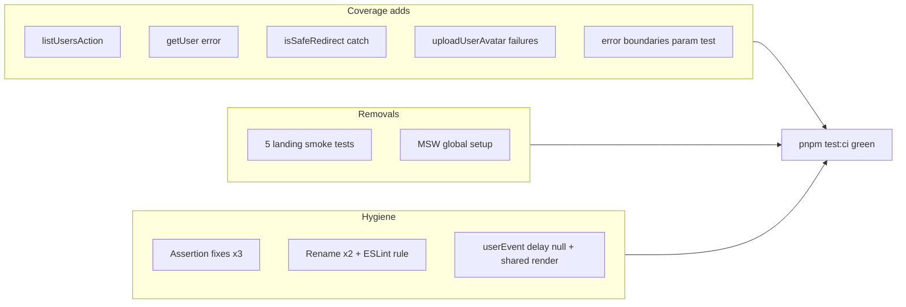

# TEST_AUDIT remediation plan

All work stays in test files, Vitest setup, ESLint config/rules, and (optionally) a brief note in [`testing.mdc`](.cursor/rules/testing.mdc) MSW section — **no production logic changes**.

## Scope summary

| ID | Action |
|----|--------|
| TS001, TS010 | Extend [`src/app/admin/users/actions.unit.test.ts`](src/app/admin/users/actions.unit.test.ts) |
| TS002 | Extend [`src/utils/is-safe-redirect.unit.test.ts`](src/utils/is-safe-redirect.unit.test.ts) |
| TS003 | Extend [`src/utils/avatar-storage.unit.test.ts`](src/utils/avatar-storage.unit.test.ts) |
| TS004 | New shared parameterized integration test for route `error.tsx` files |
| TS005 | Delete 5 marketing render-smoke test files |
| TS006 | Fix 3 assertion-quality tests |
| TS007 | Rename 2 test files + new ESLint rule |
| TS008 | Strip MSW from [`vitest.setup.ts`](vitest.setup.ts); remove idle mock files |
| TS009 | Speed up 3 flagged integration/unit UI suites |

---

## Coverage additions

### TS001 — `listUsersAction` ([`actions.unit.test.ts`](src/app/admin/users/actions.unit.test.ts))

Add `listAdminUsersPageMock` and mock `./_lib/list-admin-users` alongside the existing Supabase/role-mutation mocks (same `beforeEach` + `vi.resetModules()` + dynamic `import('./actions')` pattern used by promote/demote).

New `describe('listUsersAction')` with four cases:

1. **Non-admin caller** — `getUserMock` returns non-admin user → `{ success: false, error: { code: 'FORBIDDEN', message: 'Forbidden', kind: 'operational' } }`; `listAdminUsersPageMock` not called.
2. **Invalid page** — admin session, `{ page: 0 }` (or non-integer) → `VALIDATION_ERROR` / `"Page must be a positive integer"`.
3. **Happy path** — mock `listAdminUsersPage` to return `{ rows: [...], hasNextPage: false, page: 1 }` → success envelope with that data; assert service client created and list helper called with `{ page: 1, emailFilter: undefined }`.
4. **Fault** — `listAdminUsersPageMock.mockRejectedValue(new Error('db down'))` → fault envelope via [`mapUsersActionFault`](src/app/admin/users/_lib/map-users-action-fault.ts): `INTERNAL_ERROR`, `"Something went wrong loading users. Please try again."`, `kind: 'fault'`.

### TS010 — `getUser` error path (same file)

Add one test (top-level `describe` or inside `listUsersAction`) where:

```text
getUserMock.mockResolvedValue({ data: { user: null }, error: new Error('session invalid') })
```

Call any action using `assertAdminCaller` (e.g. `listUsersAction()`) → `FORBIDDEN` / `"Unauthorized"`. Covers the shared helper branch at [`assert-admin-caller.ts:38-46`](src/app/admin/users/_lib/assert-admin-caller.ts) for all three actions without a separate file.

### TS002 — `isSafeRedirect` catch branch

In [`is-safe-redirect.unit.test.ts`](src/utils/is-safe-redirect.unit.test.ts), add one test with input that throws inside `URL` parsing (verified locally: `'http://[%'` throws) → `false`.

### TS003 — `uploadUserAvatar` failure paths

In [`avatar-storage.unit.test.ts`](src/utils/avatar-storage.unit.test.ts) `describe('uploadUserAvatar')`, add three tests reusing existing canvas/auth mocks:

1. **Session/userId mismatch** — `mockGetUser` returns `{ id: TEST_USER_ID }` but call with a different `userId` → rejects with `"Could not upload your image. Please try again."`; `mockUpload` not called.
2. **Supabase upload error** — matching session, `mockUpload.mockResolvedValue({ error: { message: 'Storage full' } })` → same user-safe message.
3. **Generic throw** — matching session, force `resizeAvatarToWebp` or `mockUpload` to throw a plain `Error` (not `AvatarUploadError`) → re-wrapped user-safe message per [`avatar-storage.ts:174-178`](src/utils/avatar-storage.ts).

### TS004 — Route fault boundaries (parameterized)

Create [`src/app/route-error-boundaries.integration.test.tsx`](src/app/route-error-boundaries.integration.test.tsx) with `it.each` over three segments:

| Segment | Import | Panel copy (substring) | Escape link |
|---------|--------|------------------------|-------------|
| `(app)` | [`(app)/error.tsx`](src/app/(app)/error.tsx) | `This page could not be loaded` | `Sign in` → [`LOGIN_PATH`](src/constants/app-paths.ts) |
| `admin` | [`admin/error.tsx`](src/app/admin/error.tsx) | `The admin console could not be loaded` | `Back to profile` → [`PROFILE_PATH`](src/constants/app-paths.ts) |
| `auth` | [`auth/error.tsx`](src/app/auth/error.tsx) | `This sign-in page could not be loaded` | `Home` → `/` |

Each case:

- Render default export with `{ error: new Error('test fault'), reset: vi.fn() }`.
- Assert heading `"Something went wrong"`.
- Assert `ErrorPanel` message text present.
- Click `Try again` → `reset` called once.
- Assert escape link `href` (auth segment: test `Home` link; other segments: single outline escape link).

Do **not** assert `useEffect` logging (no `console.error` spies).

---

## Test removals (TS005)

Delete these five config-echo render-smoke files under [`src/app/(marketing)/_components/`](src/app/(marketing)/_components/) — **do not replace**:

- `landing-hero.unit.test.tsx`
- `landing-header.unit.test.tsx`
- `landing-footer.unit.test.tsx`
- `landing-features.unit.test.tsx`
- `landing-tech-stack.unit.test.tsx`

**Keep** [`landing-auth-slot`](src/app/(marketing)/_components/landing-auth-slot.unit.test.tsx) (renamed in TS007). Shared chrome tests ([`site-header`](src/components/site-header.unit.test.tsx), [`site-footer`](src/components/site-footer.unit.test.tsx)) stay — they cover shared components with behavioral cases beyond config echo.

---

## Assertion fixes (TS006)

### [`landing-auth-slot`](src/app/(marketing)/_components/landing-auth-slot.unit.test.tsx) (before rename)

Replace the stacked-layout test's `toHaveClass('w-full')` with user-visible behavior: anonymous visitor + `layout: 'stack'` → both `Sign in` and `Sign up` links present (two distinct CTAs). Authenticated stack case is already covered by the existing Open-app test.

### [`auth/layout.unit.test.tsx`](src/app/auth/layout.unit.test.tsx)

Drop `toHaveClass('bg-muted', 'min-h-svh')`. Assert wordmark link (`SeminovaLogo` → `/`) and child content remain visible — behavior a user sees.

### [`data-table-skeleton-body.unit.test.tsx`](src/components/data-table-skeleton-body.unit.test.tsx)

Remove the third test's `toHaveClass('h-5', 'w-32')` dimension assertion. Replace with structural/user-facing check: skeleton placeholders still render at the expected row × column count when `meta.skeletonClassName` is set (already partially covered by test 1); optionally assert skeletons carry `aria-hidden` (loading placeholders hidden from assistive tech per [`data-table-skeleton-body.tsx:27`](src/components/data-table-skeleton-body.tsx)). If redundant with test 1, collapse test 3 into a single assertion on placeholder count rather than CSS.

---

## Structural / config (TS007, TS008)

### TS007 — Rename + lint rule

**Renames** (git mv, no import changes — co-located):

- `admin-auth-gate.unit.test.tsx` → `admin-auth-gate.integration.test.tsx`
- `landing-auth-slot.unit.test.tsx` → `landing-auth-slot.integration.test.tsx`

**New ESLint rule** [`eslint-rules/test-scope-naming.mjs`](eslint-rules/test-scope-naming.mjs), wired in [`eslint.config.mjs`](eslint.config.mjs) alongside `no-unquarantined-skips`:

- **Trigger:** file matches `*.unit.test.{ts,tsx}` AND contains `vi.mock(...)` for an external session/auth boundary:
  - `@/supabase/require-auth`
  - `@/supabase/server`
  - `next/headers`
- **Message:** rename to `.integration.test.*` per [`testing.mdc`](.cursor/rules/testing.mdc) file-naming section.
- **Scope:** `.unit.test.ts` files that mock these modules while testing the module itself (e.g. [`require-auth.unit.test.ts`](src/supabase/require-auth.unit.test.ts), [`actions.unit.test.ts`](src/app/admin/users/actions.unit.test.ts)) are **exempt** — rule applies only to `*.unit.test.tsx` (component tests) OR add a filename allowlist for known server-side unit tests if needed after lint run.

This matches the two flagged files without false-positiving nav components that only mock `next/navigation` `useRouter`/`usePathname`.

### TS008 — Remove idle MSW global setup

In [`vitest.setup.ts`](vitest.setup.ts):

- Remove `server.listen()` / `resetHandlers()` / `close()` and the `@/mocks/server` import.
- Leave a short comment: MSW deferred until a real HTTP boundary needs it; Supabase/auth boundaries use `vi.mock` per testing policy.
- Keep `matchMedia` stub and `queryCache.clear()` in `afterEach`.

Delete [`src/mocks/handlers.ts`](src/mocks/handlers.ts) and [`src/mocks/server.ts`](src/mocks/server.ts) (only consumer is setup). Keep `msw` in `package.json` for future use. Optionally add one line to the MSW subsection in [`testing.mdc`](.cursor/rules/testing.mdc) noting global setup is deferred — keeps docs aligned.

---

## Speed optimizations (TS009)

Apply `userEvent.setup({ delay: null })` everywhere in the three flagged suites (currently default delay adds ~per-keystroke latency).

### [`profile-password-dialog.integration.test.tsx`](src/app/(app)/profile/_components/profile-password-dialog.integration.test.tsx)

Merge the two sequential validation tests into **one** `it` with a **single** dialog open + render:

1. Open dialog once.
2. Mismatch passwords → assert error, `mockUpdateUser` not called.
3. Without re-rendering, clear/adjust fields → short password → assert error, still not called.
4. Keep the success-path test separate (different mock setup).

### [`login-form.integration.test.tsx`](src/components/login-form.integration.test.tsx)

Add `{ delay: null }` to all `userEvent.setup()` calls. No test merge needed (distinct mock outcomes per case).

### [`users-table.unit.test.tsx`](src/app/admin/users/_components/users-table.unit.test.tsx)

Add `{ delay: null }` to `userEvent.setup()` in search and promote flows. No render sharing across tests (each case needs different `listUsersActionMock` data).

---

## Verification

After all changes:

```bash
pnpm type-check && pnpm lint && pnpm test:ci
```

Confirm:

- All tests green
- Global coverage remains above 80% floor (currently ~91% lines — net effect should be neutral-to-positive after coverage adds outweigh deletions)
- No new ESLint violations from the scope-naming rule
- Slow-test count reduced in Vitest output for the three optimized suites

## Manual testing checklist (post-merge)

No app behavior changed — smoke-check is CI-only:

- [ ] `pnpm test:ci` passes locally
- [ ] `pnpm lint` passes (new rule active)
- [ ] Deleted marketing tests are gone; `landing-auth-slot.integration.test.tsx` and `admin-auth-gate.integration.test.tsx` run under integration naming


