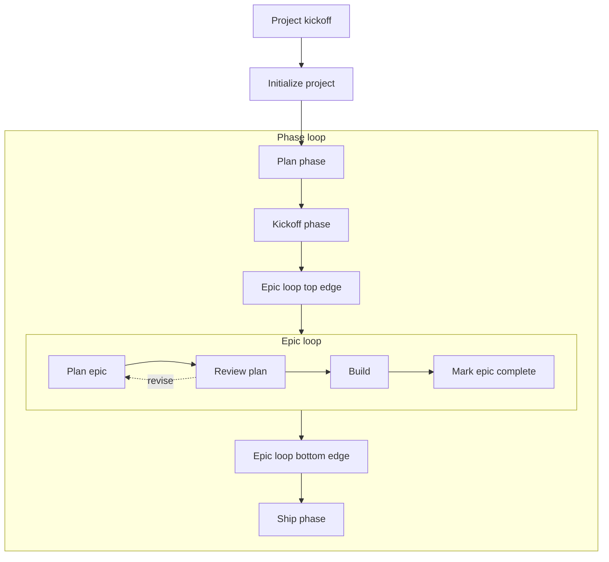

# Update the workflow loop diagram

## What changes, and why

The live diagram is a single wide row of seven nodes, missing **Kickoff phase** and **Mark epic complete**. Adding two nodes to a single row would force every node smaller and leave no room for the new hover copy. The approved mockup at [docs/mockups/workflow_loop_stepped_phase_loop_interactive.html](docs/mockups/workflow_loop_stepped_phase_loop_interactive.html) solves that by stacking the phase loop into three centered rows, which keeps nodes at full size.

The diagram keeps its current `max-w-6xl` breakout wrapper. It is a structurally content-heavy section, not prose, and stays wider than the page's prose column.

The diagram has **nine** nodes: eight named skills plus **Build** (Cursor only, no skill). All nine must render with correct title, skill (when present), and owning environment.

## Target layout

Row structure inside the phase loop, all centered on the same vertical axis:

- Row 1: Plan phase then Kickoff phase
- Row 2: Epic loop container (Plan epic → Review plan → Build → Mark epic complete)
- Row 3: Ship phase

Connector rules from the mockup (coordinates are not copied; routing is):

- Kickoff phase drops to the **epic loop container’s top edge**, not a node inside it
- Ship phase is reached from the **epic loop container’s bottom edge**, not from Mark epic complete
- Both of those are solid arrows
- The dashed **revise** return from Review plan to Plan epic stays as-is

## Files to change

**Node data** — [src/app/(marketing)/workflow/_lib/workflow-page-content.ts](src/app/(marketing)/workflow/_lib/workflow-page-content.ts)

- Insert `kickoff-phase` after Plan phase, and `mark-epic-complete` after Build
- Keep tab/reading order as visual order: setup pair → Plan phase → Kickoff phase → epic four → Ship phase
- New hover copy, exactly as specified:
  - Kickoff phase: “Creates the phase branch, flips the phase to Active, commits the planning-doc updates.”
  - Mark epic complete: “Closes the epic out: updates the PRD and commits the epic with its trailer.”
- Leave existing node copy alone (including Review plan)
- Recalculate every node’s geometry for a taller, narrower viewBox in the mockup’s neighborhood (about 680 by 496). Match node set, order, row structure, and connector routing — not the mockup’s exact numbers
- Node geometry lives in this file alongside node copy, deliberately — keep it colocated rather than splitting coordinates into a separate module

**Diagram SVG** — [src/app/(marketing)/workflow/_components/workflow-diagram.tsx](src/app/(marketing)/workflow/_components/workflow-diagram.tsx)

- Grow the viewBox and background to the new taller canvas
- Rebuild the phase-loop and epic-loop dashed containers for the stacked rows
- Replace the single-row connectors (including the current Build → Ship line) with the mockup’s routing
- Update the SVG description to name the two new steps and the container-edge attachments
- Keep the current interaction model (hover preview, keyboard focus, click-to-select, sibling dim, focus ring) and the semantic-token coloring (`color-mix` with `--info` / `--primary`). Do not introduce hex

## Mobile and overflow

`width="100%"` plus a ~680-wide viewBox scales inside the existing `max-w-6xl` wrapper — no horizontal scroll at any breakpoint. No mobile-specific layout, no scroll container: the single scaling layout serves all widths. If any skill name clips after the geometry pass, widen that node slightly rather than shrinking the type.

## Tests

Existing integration tests in [src/app/(marketing)/workflow/_components/workflow-diagram.integration.test.tsx](src/app/(marketing)/workflow/_components/workflow-diagram.integration.test.tsx) already walk `WORKFLOW_LOOP_NODES`, so extra tab stops come along for free.

Add one focused case: every node renders as a button whose accessible name includes title, skill (when present), and owning environment. That is the acceptance-criteria check. Do not assert coordinates or path `d` strings.

## Out of scope

- [docs/WORKFLOW_GUIDE.md](docs/WORKFLOW_GUIDE.md), README diagram alt text, and the section’s “plan, adversarial review, and build” prose
- Archiving the mockup
- Any change to the diagram wrapper’s column width — it stays `max-w-6xl`
- Changing hover/focus behavior beyond the new nodes inheriting it

## Manual check

- `/workflow` in light and dark: all nine nodes, correct titles/skills/owners, no hex
- Phase loop is three stacked rows; Kickoff → epic-container top; epic-container bottom → Ship; dashed revise unchanged
- Hover/focus a node: it highlights and its detail appears below
- Resize from desktop to phone: no horizontal overflow

## Close out

1. Run the quality bar: `pnpm pre-push`
2. Commit the change
3. Hand off with the baseline SHA for this change
