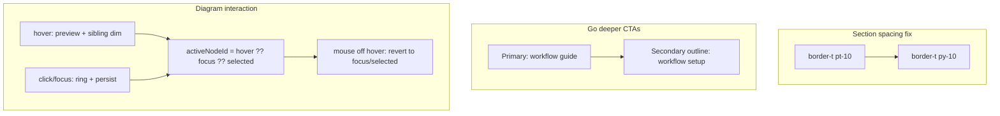

# Workflow page polish

## Scope

Polish pass on the shipped [`/workflow`](src/app/(marketing)/workflow/page.tsx) page — no route, auth, or schema changes.



---

## 1. Section separator spacing

**Problem:** Workflow sections use `border-t pt-10` (padding only below the line). Stacked with `space-y-0` on the page wrapper, the border sits flush against the previous section's content.

**Pattern to match:** Reference page sections use `border-t py-10` — bottom padding on section N creates breathing room before section N+1's top border. See [`reference-feedback-section.tsx`](src/app/(marketing)/reference/_components/reference-feedback-section.tsx).

**Change:** In all five workflow section components, replace `border-t pt-10` with `border-t py-10`:

- [`workflow-two-environments-section.tsx`](src/app/(marketing)/workflow/_components/workflow-two-environments-section.tsx)
- [`workflow-plan-review-section.tsx`](src/app/(marketing)/workflow/_components/workflow-plan-review-section.tsx)
- [`workflow-documents-section.tsx`](src/app/(marketing)/workflow/_components/workflow-documents-section.tsx)
- [`workflow-conventions-section.tsx`](src/app/(marketing)/workflow/_components/workflow-conventions-section.tsx)
- [`workflow-guide-cta.tsx`](src/app/(marketing)/workflow/_components/workflow-guide-cta.tsx)

No change needed to [`page.tsx`](src/app/(marketing)/workflow/page.tsx) wrapper.

---

## 2. Go deeper — secondary setup CTA

**Content:** Add `WORKFLOW_SETUP_URL` in [`workflow-page-content.ts`](src/app/(marketing)/workflow/_lib/workflow-page-content.ts), mirroring the existing guide constant:

- Guide: `` `${siteConfig.links.github}/blob/main/docs/WORKFLOW_GUIDE.md` ``
- Setup: `` `${siteConfig.links.github}/blob/main/docs/WORKFLOW_SETUP.md` ``

**UI:** Update [`workflow-guide-cta.tsx`](src/app/(marketing)/workflow/_components/workflow-guide-cta.tsx):

- Wrap buttons in a `flex flex-wrap gap-2` container (same dual-button pattern as [`landing-auth-buttons.tsx`](src/app/(marketing)/_components/landing-auth-buttons.tsx))
- Keep existing button as **primary** (`variant="default"`): "Read the full workflow guide"
- Add second button as **secondary** (`variant="outline"`): "Read the full workflow setup"
- Both use `asChild` + external `<a>` with `target="_blank"` and `rel="noopener noreferrer"`, each with `ExternalLink` icon

**Test:** Extend [`workflow-page-content.unit.test.ts`](src/app/(marketing)/workflow/_lib/workflow-page-content.unit.test.ts) with a parallel assertion for `WORKFLOW_SETUP_URL`.

---

## 3. Diagram — three-state interaction with spotlight

**File:** [`workflow-diagram.tsx`](src/app/(marketing)/workflow/_components/workflow-diagram.tsx)

Replace the single `activeNodeId` state with three separate pieces of state. Remove `isWithinDiagram`, `svgRef` (if only used for the old mouse-leave guard), per-node `onBlur`, and the diagram-wide mouse-leave guard.

### State

| State | Set by | Cleared by |
|---|---|---|
| `hoveredNodeId` | `onMouseEnter` on node | `onMouseLeave` on that node (always; no diagram-wide guard) |
| `selectedNodeId` | `onClick`, Enter/Space `onKeyDown` | Container focus-out (see below) |
| `focusedNodeId` | `onFocus` on node | Container focus-out (see below) |

### Derived (compute once per render)

```typescript
const activeNodeId = hoveredNodeId ?? focusedNodeId ?? selectedNodeId
```

### Per-node render (in the step map)

- **Detail text:** panel below diagram shows detail for `activeNodeId`; falls back to default placeholder when `activeNodeId` is null.
- **Ring (focus rect):** render when `focusedNodeId === node.id` OR `selectedNodeId === node.id`. Never for hover alone.
- **Spotlight dim:** dim a step node when `activeNodeId != null` AND `activeNodeId !== node.id`. Active node stays full opacity; siblings dim.

### Spotlight scope (important)

Only step nodes (`<g role="button">` elements) receive the dim opacity. The outer "Phase loop" container, inner "Epic loop" container, all connector paths, and the dashed "revise" return arrow stay at full opacity always — they are never dimmed.

### Clearing (container-level, not per-node)

Put a single `onBlur` on the diagram wrapper element (`<div>` wrapping svg + detail panel). React's `onBlur` bubbles (implemented on native `focusout`), so it fires on the wrapper when a descendant loses focus and `relatedTarget` is available on the synthetic event:

```typescript
onBlur={(e) => {
  if (!e.currentTarget.contains(e.relatedTarget)) {
    setFocusedNodeId(null)
    setSelectedNodeId(null)
  }
}}
```

The `contains(relatedTarget)` check distinguishes tabbing between step nodes (focus stays inside the wrapper — do not clear) from focus leaving the diagram entirely (clear both `selectedNodeId` and `focusedNodeId`).

Remove per-node `onBlur` handlers entirely.

### Handlers

| Event | Action |
|---|---|
| `onMouseEnter` | `setHoveredNodeId(node.id)` |
| `onMouseLeave` | `setHoveredNodeId(null)` |
| `onClick` | `setSelectedNodeId(node.id)` |
| `onFocus` | `setFocusedNodeId(node.id)` |
| `onKeyDown` (Enter/Space) | `setSelectedNodeId(node.id)` in addition to existing focus behavior |

### Resulting behavior

| Input | Detail | Spotlight dim (siblings) | Ring | Persistence |
|---|---|---|---|---|
| Mouse hover | preview | yes | no | transient (reverts on mouse leave) |
| Click | yes | yes | yes | persists after mouse leaves |
| Keyboard focus/Enter | yes | yes | yes | persists until focus leaves diagram |

**Hover priority:** hovering step B while step A is clicked moves the spotlight and detail to B; reverts to A when mouse leaves B. A keeps its ring throughout.

### Copy

Minor tweak in [`workflow-plan-review-section.tsx`](src/app/(marketing)/workflow/_components/workflow-plan-review-section.tsx) intro if needed — e.g. "Hover a step to preview… Click or focus to select" so prose matches the UI.

### Tests

Update [`workflow-diagram.integration.test.tsx`](src/app/(marketing)/workflow/_components/workflow-diagram.integration.test.tsx):

- **Keep passing:** keyboard focus + Enter/Space tests
- **Hover:** `userEvent.hover(step)` shows detail and dims siblings, no ring; `userEvent.unhover(step)` restores default detail, full opacity, no ring
- **Click:** click shows ring + detail + dimmed siblings; ring and detail persist after unhover
- **Blur scope:** focus one step, tab to adjacent step — selection/focus persists (not cleared); blur out of diagram clears both

---

## Quality gate

Run before finishing:

```bash
pnpm type-check && pnpm lint && pnpm format-check && pnpm test:ci
```

No AGENTS.md sync needed — behavior polish on an existing documented route, no new routes or constraints.

---

## Manual test checklist

1. `/workflow` — scroll each section boundary; separator lines should have even space above and below (match `/reference` feel)
2. Go deeper — primary guide button + outline setup button; both open correct GitHub docs in a new tab
3. Diagram — hover a step: detail updates, siblings dim, no ring; mouse away: detail and dim revert; click a step: ring appears and stays after mouse leaves; hover another step while one is clicked: spotlight moves to hovered step, clicked step keeps ring; tab between steps: ring and detail follow focus without clearing; tab out of diagram: selection clears
