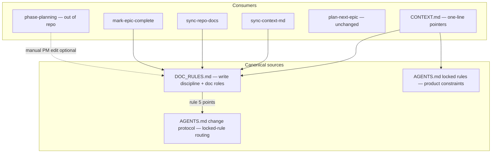

# DOC_RULES extraction plan

Docs-only change set — no code, migrations, or tests. Goal: one canonical file for invariant doc-maintenance procedure; every current copy becomes a pointer.

## Architecture after extraction



---

## 1. Create [`DOC_RULES.md`](DOC_RULES.md) (repo root)

New file, peer to [`CONTEXT.md`](CONTEXT.md) and [`AGENTS.md`](AGENTS.md). Structure:

**Header** — purpose: invariant doc-maintenance procedure (not project state); governs writes to CONTEXT.md / CONTEXT_ARCHIVE.md from planning and sync skills.

**Document roles table** — collapse the three current copies into one authoritative table. Merge rows from [`sync-context-md/reference.md`](.cursor/skills/sync-context-md/reference.md) (lines 5–12) and the mockups row from [`sync-repo-docs/reference.md`](.cursor/skills/sync-repo-docs/reference.md) (line 10). Include: CONTEXT.md, CONTEXT_ARCHIVE.md, AGENTS.md, README.md, DESIGN.md, `.cursor/rules/`, `.cursor/skills/`, `.cursor/plans/`, `.mockups/` + `.mockups/archive/`.

**Write discipline rules 1–10** — migrate verbatim prose from [`CONTEXT.md`](CONTEXT.md) lines 17–26, with two intentional edits:

| Rule | Content |
|------|---------|
| 1 | ACTIVE = source of truth; never contradict repo |
| 2 | **Decision A** — DRAFT→ACTIVE promotion is owned solely by `phase-planning` (Claude-side). Relocate phase block, tag `Active` on header + Roadmap row, delete Draft stub. `mark-epic-complete` must **not** perform this promotion. |
| 3 | Schema + agent workflow → AGENTS.md only |
| 4 | Locked rules canonical in AGENTS.md; CONTEXT §3 is pointer only |
| 5 | **Pointer only** — locked-rule change routing lives in [AGENTS.md change protocol](AGENTS.md#change-protocol). Sync skills are mirror-only (Decision B). |
| 6 | Phase ships → append CONTEXT_ARCHIVE (append-only) + update status/roadmap + remove ACTIVE |
| 7 | Resolved open questions → append `## Resolved decisions` in CONTEXT_ARCHIVE |
| 8 | Mockups → `.mockups/`; superseded → `.mockups/archive/` |
| 9 | Epic format `### Epic N: Name`; `` `Complete` `` appended by `mark-epic-complete` only — never manual or inferred |
| 10 | Stub sections intentional — do not delete |

Add a short **sync order** note (currently in reference.md line 14): evidence once → AGENTS.md (sync-repo-docs) → planning brief from AGENTS.md + PM conversation.

---

## 2. Trim [`CONTEXT.md`](CONTEXT.md)

Replace the full `## File Management Rules` block (lines 13–26) with a one-line pointer, mirroring §3's pattern:

> File management rules (write discipline, doc roles, archive policy) are canonical in **[DOC_RULES.md](DOC_RULES.md)** — do not duplicate here.

**Leave §3 unchanged** (locked-rules at-a-glance pointer to AGENTS.md).

**Fix downstream reference** at line 176: change "per the File Management Rule" → "per [DOC_RULES.md](DOC_RULES.md)" (locked-rule routing rule).

---

## 3. Update [`AGENTS.md`](AGENTS.md)

**Documentation map** — add row (per your preference):

| [DOC_RULES.md](DOC_RULES.md) | PM + agents | Doc maintenance procedure — write discipline, doc roles, archive policy |

**Change protocol** (lines 182–189) — verify canonical wording is complete. Current table row already states text-only vs code-conforming (including `.cursor/rules/` leg). Add one clarifying sentence under the table:

> Sync skills (`sync-context-md`, `sync-repo-docs`) never initiate locked-rule changes — they mirror changes already made through this protocol.

No changes to the Locked rules subsection itself.

---

## 4. Refactor [`sync-context-md`](.cursor/skills/sync-context-md/)

### [`SKILL.md`](.cursor/skills/sync-context-md/SKILL.md)

| Section | Action |
|---------|--------|
| `## Two-file model` table | Replace with pointer: "See [DOC_RULES.md](../../DOC_RULES.md) for document roles and edit policy." |
| `## When to touch which file` — phase-ship bullets | Keep skill workflow steps; add "per DOC_RULES rule 6" citation instead of restating archive policy |
| `## Archive rules` (lines 43–50) | Remove inline rules; replace with pointer to DOC_RULES rules 6–7 |
| Step 4 — locked rules approval block (lines 110–112) | **Decision B**: reword to "mirror a locked-rule change already made via AGENTS.md change protocol; never initiate one" |
| Workflow checklist line 69 | Split: roadmap/vision need approval; locked rules are mirror-only |
| Anti-pattern line 171 | Replace "mirror AGENTS.md only after explicit approval" → "never initiate locked-rule changes — mirror only per change protocol" |

Keep all skill-specific workflow: evidence gathering, drift patterns, output format, routine vs phase-ship sequencing.

### [`reference.md`](.cursor/skills/sync-context-md/reference.md)

| Section | Action |
|---------|--------|
| `## Document roles` table (lines 3–12) | Replace with pointer to DOC_RULES |
| Sync order line 14 | Move to DOC_RULES (already planned); reference from here as one-liner |
| Phase complete checklist (lines 45–50) | Keep checklist items; cite DOC_RULES rule 6 instead of restating |
| Example E (lines 136–147) | Keep example; cite DOC_RULES for archive discipline |
| Locked-rules lines (25, 61, 112) | **Decision B** mirror-only wording |

---

## 5. Refactor [`sync-repo-docs`](.cursor/skills/sync-repo-docs/)

### [`reference.md`](.cursor/skills/sync-repo-docs/reference.md)

- Replace `## Document roles` table (lines 3–10) with pointer to DOC_RULES.
- Keep AGENTS.md / README section maps and audit checklists (skill-specific).
- Rewrite locked-rule checklist items (lines 73–79) to mirror-only: "mirror a locked-rule change already made via change protocol; never initiate one."

### [`SKILL.md`](.cursor/skills/sync-repo-docs/SKILL.md)

- Step 4 lines 83–84: mirror-only wording (cite change protocol, not "wait for approval to edit").
- Anti-pattern line 133: same mirror-only phrasing.
- Workflow checklist line 32: align with Decision B.

---

## 6. Update [`mark-epic-complete/SKILL.md`](.cursor/skills/mark-epic-complete/SKILL.md)

**Replace step 3** (current Draft→Active flip at lines 22–24):

```
3. Consistency check (Decision A): if the phase header OR its Roadmap row still reads `Draft`, halt and report the inconsistency — do not change tags. DRAFT→ACTIVE promotion is owned by phase-planning (see DOC_RULES.md rule 2).
```

**Add DOC_RULES citation** at top or in steps: epic numbering and `` `Complete` `` tag rules (DOC_RULES rule 9).

**Align "Explicitly out of scope"** — line 34 already says don't move DRAFT→ACTIVE; reinforce that halt-and-report is the enforcement mechanism.

---

## Out of scope (per brief)

| Item | Notes |
|------|-------|
| `phase-planning` skill | Claude UI skill — PM manual edit optional later |
| `plan-next-epic` | No file edits required; already references epic format implicitly |
| README / `.cursor/README` doc maps | Per your choice — AGENTS.md only |
| `DOC_RULES_EXTRACTION_MAP.md` | Delete or archive after merge — build brief, not shipped truth |
| `project-bootstrap` skill | Future work, depends on this extraction |

---

## Validation checklist (manual)

After edits, grep for stale duplicates:

```bash
rg "File Management Rules|mirror AGENTS.md only after|change both to .Active.|Document roles" --glob '*.{md,mdc}'
```

Confirm:
- CONTEXT.md has one-line DOC_RULES pointer (not 10 inline rules)
- `mark-epic-complete` has halt-and-report, not Draft→Active flip
- No skill still contains a full doc-roles table
- AGENTS.md doc map lists DOC_RULES.md
- Cross-links resolve (CONTEXT → DOC_RULES, skills → DOC_RULES, DOC_RULES rule 5 → AGENTS change protocol)

No `pnpm test:ci` required (docs-only). Optional: `pnpm format` if Prettier touches markdown (agent-authored docs may be Prettier-ignored — check [`.prettierignore`](.prettierignore)).

---

## Suggested commit message (when you ask)

```
docs: extract File Management Rules into DOC_RULES.md

Single canonical doc for write discipline and doc roles; skills become pointers with mirror-only locked-rule handling and mark-epic-complete halt-on-Draft check.
```
