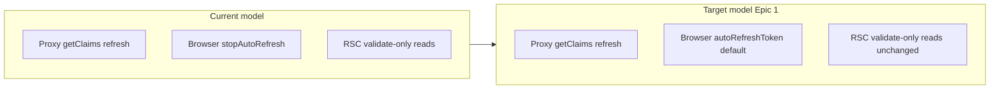

# Phase 13 Epic 1 — Browser session refresh

> **Track progress:** as you complete each step, update the corresponding `todos` entry's `status` to `completed` in this plan's frontmatter.

> **Precondition:** confirm `git branch --show-current` outputs `phase-13/realtime-logs-session-refresh`. If it doesn't match, halt and ask the user — do not switch branches.

> **Precondition:** `git status --porcelain` must be empty before the first implementation edit. If dirty, halt and ask the user to commit or stash. The epic must land as a single commit containing only this epic's work — `code-review` derives its range from that commit.

## Context

Phase 13 Epic 1 unblocks Epic 2 (Realtime logs feed). Today [`src/supabase/client.ts`](src/supabase/client.ts) calls `stopAutoRefresh()` on first browser client creation, leaving the proxy as the only refresh path. [RESEARCH-0004 §6](docs/research/RESEARCH-0004-supabase-realtime-session-refresh-nextjs.md) explains the original three-authority race (browser + proxy + RSC reads) and why re-enabling browser refresh is now safe: RSC refresh was removed in commit `c3276dd`; only the two-authority model Supabase documents remains.



**In scope:** one code change, ADR amendment, comment/doc sync, manual race-flow verification.

**Explicitly out of scope (later epics or follow-up):** Realtime subscription, `app_logs` publication migration, users-page refetch-on-focus, removing avatar idle-tab probe workaround, Option C scoped refresh fallback.

## Step 1 — Re-enable browser auto-refresh

In [`src/supabase/client.ts`](src/supabase/client.ts):

- Remove the module-level `stoppedBrowserAutoRefresh` flag and the `stopAutoRefresh()` block (lines 5–16).
- Leave `createBrowserClient()` at its default (`autoRefreshToken: true`).
- No changes to [`src/supabase/proxy.ts`](src/supabase/proxy.ts), [`src/supabase/require-auth.ts`](src/supabase/require-auth.ts), [`src/supabase/server.ts`](src/supabase/server.ts) behavior — only comments (Step 3).

**Keep unchanged:** [`probeSessionAction`](src/app/(app)/_lib/profile/probe-session-action.ts) and the avatar upload retry path in [`use-profile-avatar-upload.ts`](src/app/(app)/_lib/profile/use-profile-avatar-upload.ts). Browser refresh reduces how often this fires, but it remains valid defense-in-depth for cookie/memory reconciliation edge cases noted in RESEARCH-0004 open question #2.

## Step 2 — Amend ADR-0005 in place

Update [`docs/adr/ADR-0005-proxy-as-sole-session-authority.md`](docs/adr/ADR-0005-proxy-as-sole-session-authority.md) (keep filename; amend content per PRD):

- Reframe decision: **proxy remains the server-side session gate and refresh authority on matched HTTP requests**; **browser client resumes default foreground auto-refresh** for Client Components (auth forms, avatar upload, future Realtime).
- Retain: RSC reads stay validate-only via `getDisplayAuthClaims()` (`allowExpired: true`, no refresh); mutations still use `getUser()` at trust boundary.
- Update trade-offs:
  - Remove or soften trade-off (2) about browser having "no refresh authority" — note browser now refreshes in foreground; avatar probe path remains as fallback.
  - Add brief pointer to [RESEARCH-0004 §6](docs/research/RESEARCH-0004-supabase-realtime-session-refresh-nextjs.md) for why two-authority is safe (third RSC authority removed; reuse interval + LockManager).
- Note: if refresh races reappear, that is **out of Phase 13 scope** (PRD out-of-scope) — separate work, not Option C in this epic.

## Step 3 — Sync stale comments and repo truth

Update prose that still claims proxy is the *sole* refresh authority:

| Location | What to update |
| -------- | -------------- |
| [`src/supabase/require-auth.ts`](src/supabase/require-auth.ts) | JSDoc: proxy is session **gate**; browser refreshes client-side; RSC reads validate-only |
| [`src/supabase/read-auth-cookie.ts`](src/supabase/read-auth-cookie.ts) | Comment lines 75–76: proxy is server-side refresh authority (not "only layer") |
| [`src/supabase/server.ts`](src/supabase/server.ts) | Header comment: refresh is proxy (server requests) + browser (client); RSC never refreshes |
| [`.cursor/rules/security.mdc`](.cursor/rules/security.mdc) | Auth proxy paragraph |
| [`.cursor/rules/supabase.mdc`](.cursor/rules/supabase.mdc) | Auth proxy comment block |
| [`ROADMAP.md`](ROADMAP.md) | Deferred JWT item resolution blurb — distinguish "sole gate" from "sole refresh authority" if it overstates |

The AGENTS.md Auth & session prose (currently "sole session authority" / "Refresh is proxy-only") is updated later via `/sync-repo-docs`, which derives it from the supabase-module comments and `.cursor/rules/security.mdc` + `supabase.mdc` updated in this step — do not edit AGENTS.md directly here.

Do **not** edit archived plans, shipped PRDs, or RESEARCH-0004 (historical record).

## Step 4 — Manual verification (PRD success gate)

Run locally against a linked Supabase project (`pnpm dev`). Watch server logs and browser network/console for `Invalid Refresh Token: Already Used` and unexpected sign-outs.

| Flow | How to exercise | Pass criteria |
| ---- | ---------------- | ------------- |
| Sign-in + parallel navigation | Sign in → immediately navigate to `/home`, `/admin`, open admin sidebar links rapidly | No refresh-token race error; session persists |
| Near-expiry navigation | (Optional: temporarily lower `jwt_expiry` in local `supabase/config.toml` for faster iteration) Navigate protected routes as token nears expiry | No race error; no unexpected redirect to login |
| Two tabs | Open app in two tabs; navigate in both; sign out in one | No race error; remaining tab behaves predictably |
| Idle tab return | Leave tab idle past access-token lifetime (~1 hr, or shortened JWT locally); return and interact (e.g. avatar upload or protected navigation) | No unexpected sign-out; session recovers without manual re-login |
| Proxy + RSC unchanged | Trigger protected server request; confirm debug logs still show refresh vs reuse in proxy | Proxy still refreshes on matched requests |
| RSC validate-only | Protected page loads with valid/expired-but-tolerated token | No RSC-path refresh; existing unit/integration tests still pass |

If any flow reproduces the historical race, **halt the epic** and report to PM — PRD commits to Option B only; fallback Option C is separate scoped work.

## Step 5 — Automated quality bar

Existing tests should remain green without behavioral changes to proxy or require-auth:

- [`src/supabase/proxy.unit.test.ts`](src/supabase/proxy.unit.test.ts)
- [`src/supabase/require-auth.unit.test.ts`](src/supabase/require-auth.unit.test.ts)
- [`src/supabase/auth-session-flow.integration.test.ts`](src/supabase/auth-session-flow.integration.test.ts)

Run:

```bash
pnpm type-check && pnpm lint && pnpm format-check && pnpm test:ci
```

### Verification

Quality bar — same commands as [WORKFLOW_GUIDE Step 5 exit condition](docs/WORKFLOW_GUIDE.md). Stop on failure:

```bash
pnpm type-check && pnpm lint && pnpm format-check && pnpm test:ci
```

### Commit epic

Authorized by this approved plan:

1. Review diff; stage only files in scope for this epic.
2. Write a conventional commit message (`feat`/`fix`/`docs`/etc.). It **must** end with an `Epic:` git trailer — this is the only thing `code-review` uses to find the commit:

   ```
   feat(phase-13): re-enable browser session auto-refresh

   Epic: 13.1
   ```

   Format is `Epic: {phase}.{id}` — phase number as written in ROADMAP (decimals OK: `7.5`), epic id as written (`1`, `1A`). Blank line before the trailer, nothing after it. Exactly one commit in the repo may carry a given `Epic:` value.
3. Commit (request `git_write`). Pre-commit hook runs automatically — if it fails, **fix and retry the commit** (a failed pre-commit hook aborts the commit, so there is nothing to amend).
4. Verify `git status --porcelain` is empty after commit.

**Do not push** — push remains `ship-phase`.

### Handoff

Epic committed. Next: open a new agent window and run `/code-review`.
