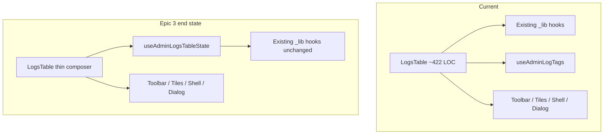

# Phase 14 Epic 3 — Logs Table Decomposition

> **Track progress:** as you complete each step, update the corresponding `todos` entry's `status` to `completed` in this plan's frontmatter.

> **Precondition:** `git status --porcelain` must be empty before the first implementation edit. If dirty, halt and ask the user to commit or stash. The epic must land as a single commit containing only this epic's work — `code-review` derives its range from that commit. Before the first implementation edit, record `git rev-parse HEAD` — this is the epic baseline SHA, carried into the handoff below.

*(Note: two untracked plan files under `.cursor/plans/` currently show in porcelain — commit them in their own housekeeping commit before the first implementation edit (or add `.cursor/plans/` to `.gitignore` if that matches repo convention; it is not ignored today). Rationale: this plan file's frontmatter is updated during execution, and the post-commit `git status --porcelain` check must pass with the epic commit containing only implementation files.)*

## Context

Phase 14 is active on branch `phase-14/tech-debt-hardening` (verified). Epics 1–2 (`Complete`) shipped shared helpers and the users-table pattern this epic mirrors.

| Helper | Location |
| ------ | -------- |
| Debounce | [`src/hooks/use-debounced-value.ts`](src/hooks/use-debounced-value.ts) |
| Admin query retry | [`src/app/admin/_lib/admin-query-options.ts`](src/app/admin/_lib/admin-query-options.ts) |
| Action unwrap | [`src/app/admin/_lib/unwrap-action-result.ts`](src/app/admin/_lib/unwrap-action-result.ts) |
| Error guard | [`src/utils/is-app-error.ts`](src/utils/is-app-error.ts) — `toAppError` for query/mutation errors |

**Current problem:** [`src/app/admin/logs/_components/logs-table.tsx`](src/app/admin/logs/_components/logs-table.tsx) (~422 LOC) owns cursor paging, debounced search, level/unread/tag filters, live toggle + localStorage preference, Realtime refresh wiring, mark-read mutations, stat tiles, detail dialog, toolbar, and table shell — audit finding F065.

**Target:** one state hook owns orchestration; the component composes presentational children only. [`use-admin-log-tags.ts`](src/app/admin/logs/_lib/use-admin-log-tags.ts) is merged into the hook and deleted (F094).



Reference implementation: [`use-admin-users-table-state.ts`](src/app/admin/users/_lib/use-admin-users-table-state.ts) + slim [`users-table.tsx`](src/app/admin/users/_components/users-table.tsx) (~168 LOC).

## Scope boundaries

**In scope:**

- New hook: [`src/app/admin/logs/_lib/use-admin-logs-table-state.ts`](src/app/admin/logs/_lib/use-admin-logs-table-state.ts)
- Slim [`logs-table.tsx`](src/app/admin/logs/_components/logs-table.tsx) to composition-only
- Inline tags query (today in [`use-admin-log-tags.ts`](src/app/admin/logs/_lib/use-admin-log-tags.ts)) into the state hook; **delete** the standalone module
- Move `DEFAULT_SORTING` into the hook file

**Out of scope (unchanged):**

- Presentational components: toolbar, stat tiles, active filters, filtered empty, columns, detail dialog, live toggle UI
- Existing data/mutation/realtime hooks in `_lib/` (composed by state hook, not inlined): `use-admin-logs-list`, `use-admin-log-stats`, `use-admin-logs-realtime`, mark-read mutation hooks
- Server actions, query keys, filter helpers, list/stats/realtime unit tests
- Users table (Epic 2 done), type derivation (Epic 4), actions barrel split (Epic 5)
- New tests unless needed to keep coverage — primary regression gate is [`logs-table.unit.test.tsx`](src/app/admin/logs/_components/logs-table.unit.test.tsx) (~720 LOC, mocks actions at module boundary, not `useAdminLogTags`)

## Implementation steps

### 1. Create `useAdminLogsTableState`

Add [`use-admin-logs-table-state.ts`](src/app/admin/logs/_lib/use-admin-logs-table-state.ts) with **no props** (logs table has no page-level inputs unlike users' `currentAdminUserId`).

**Move into the hook** (lift verbatim from `logs-table.tsx` today):

- **Cursor paging:** `cursorStack`, `cursorStackIndex`, derived `page` / `cursor`, `handlePrevious`, `handleNext`, `resetCursorStack`
- **Page size:** `perPage`, `handlePageSizeChange` (resets cursor stack)
- **Debounced search:** `searchInput`, `useDebouncedValue(300)`, `trackedDebouncedSearch` reset-to-cursor-stack pattern (same adjust-during-render pattern as users table)
- **Tile filters:** `useToggleFilterSet<LogLevel>`, `selectedLevels`, level toggle handlers
- **Other filters:** `unreadOnly`, `selectedTag`, `filters` memo via [`log-list-filters.ts`](src/app/admin/logs/_lib/log-list-filters.ts)
- **Sort:** `DEFAULT_SORTING`, `sorting` → `sortDirection`, `handleSortingChange` (resets cursor)
- **Live feed:** `liveEnabled` state, hydration `useEffect` calling `readLogsLiveEnabledPreference()` (keep existing eslint-disable — F089 is intentional), `handleLiveEnabledChange` writing via `writeLogsLiveEnabledPreference`
- **Realtime refresh:** compose `useAdminLogsRealtime({ enabled: liveEnabled })` → `refresh`, `isRefreshing`
- **Data orchestration:** compose `useAdminLogStats`, `useAdminLogsList` from derived cursor/sort/perPage/filters
- **Tags query (F094 merge):** inline the `useQuery` block from [`use-admin-log-tags.ts`](src/app/admin/logs/_lib/use-admin-log-tags.ts) — same query key, `unwrapActionResult(await listLogTagsAction())`, `adminActionQueryRetry` — expose `tags` and `tagsError` (via `toAppError`)
- **Mutations:** compose `useMarkLogReadMutation`, `useMarkLogUnreadMutation`, `useMarkAllLogsReadMutation`; merged `mutationAppError` via `toAppError`
- **Detail dialog:** `selectedLog`, `detailOpen`, `handleRowClick`, `handleMarkUnread`, `setDetailOpen` / `onOpenChange`
- **Filter chip handlers:** `handleResetFilters`, `handleRemoveFilterChip`, `handleLevelToggle`, `handleUnreadToggle`, `handleTagChange`, `handleSearchInputChange`
- **Derived UI:** `showFilteredEmptyState`, `markAllTooltip` via `buildMarkAllLogsReadTooltip`, `columns` via `createLogsColumns`, `useDataTableShell` setup

**Return flat named fields** — same convention as [`useAdminUsersTableState`](src/app/admin/users/_lib/use-admin-users-table-state.ts): no nested prop-bag objects (`toolbarProps`, etc.). The slim component destructures and passes explicit named props to each child.

**Do not** reimplement debounce, query retry, or unwrap logic — child hooks and the inlined tags query use Epic 1 helpers.

### 2. Slim `LogsTable` to a composer

Refactor [`logs-table.tsx`](src/app/admin/logs/_components/logs-table.tsx) to:

1. Call `useAdminLogsTableState()`
2. Render presentational children with hook outputs (explicit named props, no spreads):
   - `LogsStatTiles`, `LogsToolbar`, `LogsActiveFilters`
   - `AppErrorSurface` for stats / tags / list / mutation errors
   - `DataTableShell` + `DataTablePaginationControls`
   - `LogDetailDialog`
3. Remove all local `useState` / orchestration logic

Target: component holds **no orchestration beyond composition** — roughly the JSX block that exists today (lines 330–421), plus the hook call. Aim for parity with users-table thinness (~150–180 LOC).

### 3. Delete `use-admin-log-tags.ts`

After the tags query lives in the state hook:

- Delete [`src/app/admin/logs/_lib/use-admin-log-tags.ts`](src/app/admin/logs/_lib/use-admin-log-tags.ts)
- Grep repo for `useAdminLogTags` / `use-admin-log-tags` — only the deleted file and archived docs/plans should remain

### 4. Verify no behavior change

Run the logs-table test suite:

```bash
pnpm test:file -- src/app/admin/logs/_components/logs-table.unit.test.tsx
```

Sanity-check realtime hook tests (unchanged module, but consumed from new location):

```bash
pnpm test:file -- src/app/admin/logs/_lib/use-admin-logs-realtime.unit.test.tsx
```

Then full quality bar (see Verification section).

## Success criteria (from PRD)

- Depends on Epic 1 — consumes debounce, query-options, and unwrap helpers; no duplicates
- Extracted hook is the **single owner** of logs-table state, **including the tags query**
- `use-admin-log-tags` no longer exists as a standalone module
- Realtime behavior, live toggle persisted preference, manual refresh, cursor paging, mark-read flows all behave exactly as before
- **No visible behavior change** — existing coverage passes against new structure

## Manual testing checklist

After implementation, verify on `/admin/logs`:

- [ ] Table loads with default sort (Created desc)
- [ ] Search debounces (~300ms) and resets cursor to page 1
- [ ] Level stat tiles toggle independently; Total clears all filters + search
- [ ] Unread tile toggles; tag combobox filters; active filter chips remove individual filters
- [ ] Cursor Previous/Next and page-size change work; controls disable while fetching
- [ ] Live toggle restores from localStorage on reload; pausing stops Realtime subscription
- [ ] Manual refresh spinner runs ≥1s minimum
- [ ] Row click opens detail dialog; unread row click marks read; dot click marks read without opening
- [ ] Mark all read respects active filter scope
- [ ] Filtered zero results shows reset + refresh empty state
- [ ] Mutation fault renders inline error panel (not toast)

## Verification

Quality bar — same commands as [WORKFLOW_GUIDE Step 5 exit condition](docs/WORKFLOW_GUIDE.md). Stop on failure:

```bash
pnpm type-check && pnpm lint && pnpm format-check && pnpm test:ci
```

## Commit epic

Authorized by this approved plan:

1. Review diff; stage only files in scope for this epic.
2. Write a conventional commit message. It **must** end with an `Epic:` git trailer:

   ```
   refactor(phase-14): extract logs table state hook

   Epic: 14.3
   ```

   Format is `Epic: {phase}.{id}` — blank line before the trailer, nothing after it. Exactly one commit in the repo may carry a given `Epic:` value.
3. Commit (request `git_write`). Pre-commit hook runs automatically — if it fails, **fix and retry the commit** (a failed pre-commit hook aborts the commit, so there is nothing to amend).
4. Verify `git status --porcelain` is empty after commit.

**Do not push** — push remains `ship-phase`.

## Handoff

Epic 14.3 committed. Baseline SHA (pre-implementation): `<SHA recorded in the Precondition step>`. Next: open a new agent window and run `/code-review` from that baseline.
