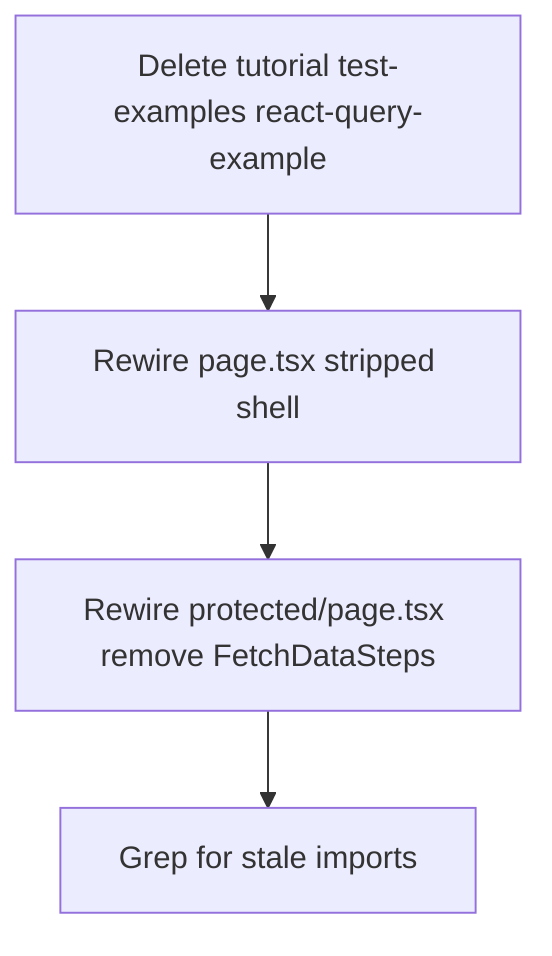

# Phase 1 Epic 1A — Foundation Cleanup

**Phase:** 1 — Foundation & Cleanup (in progress)  
**Epic status:** Not started — all three stories (1A.1–1A.3) are open  
**Structure:** Sequential (each story gates the next; no parallel tracks)

Verified against the repo on 2026-06-17:
- Tutorial scaffolding, demo routes, and `package-lock.json` still present
- [AGENTS.md](AGENTS.md) does not exist yet (Epic 1C)
- Stack is Next.js 16 + Vitest (rules still say 14/Jest — fixed in Epic 1B, not here)

---

## Goal

Turn the cloned `supa-next-starter` into a **clean Seminova baseline**: no demo/tutorial surfaces, pnpm-only dependency management, and up-to-date dev tooling with passing build + tests.

---

## Story 1A.1 — Remove starter scaffolding

### Delete outright

| Path | Reason |
|------|--------|
| [`src/components/tutorial/`](src/components/tutorial/) (5 files) | Tutorial step components |
| [`src/app/test-examples/`](src/app/test-examples/) (4 files) | Demo route + counter tests |
| [`src/components/react-query-example.tsx`](src/components/react-query-example.tsx) | Demo component |
| [`src/components/react-query-example.test.tsx`](src/components/react-query-example.test.tsx) | Demo test |

### Rewire pages (stripped shell — per your choice)

**[`src/app/page.tsx`](src/app/page.tsx)** — remove tutorial imports and Hero; keep only:
- Nav bar with link home
- `EnvVarWarning` / `AuthButton` (via existing `hasEnvVars` from [`src/utils/env.ts`](src/utils/env.ts))
- `ThemeSwitcher` in footer if already present
- No "Next steps" block, no Hero, no starter marketing copy

**[`src/app/protected/page.tsx`](src/app/protected/page.tsx)** — remove `FetchDataSteps` import and the "Next steps" section; keep the auth info banner + `UserDetails` pre block (useful auth smoke test until Phase 3/5).

**[`src/utils/env.ts`](src/utils/env.ts)** — keep `hasEnvVars` (still used by `EnvVarWarning`); remove the "tutorial purposes" comment.

### Optional cleanup (same story, low risk)

- [`src/components/hero.tsx`](src/components/hero.tsx), [`next-logo.tsx`](src/components/next-logo.tsx), [`supabase-logo.tsx`](src/components/supabase-logo.tsx) — delete if nothing imports them after page rewire
- Grep for any remaining references to deleted paths before finishing

### Out of scope for 1A.1

- Rebrand copy ("Next.js Supabase Starter" → "Seminova") — Phase 4 landing
- Rules that reference deleted test files ([`testing.mdc`](.cursor/rules/testing.mdc) cites `react-query-example.test.tsx`) — Epic 1B
- New replacement tests — Phase 5 reference implementations



---

## Story 1A.2 — Standardize on pnpm

1. **Delete** [`package-lock.json`](package-lock.json) (accidental npm artifact; [`pnpm-lock.yaml`](pnpm-lock.yaml) is canonical)
2. Confirm no `yarn.lock` (already absent)
3. Run `pnpm install` — verify clean tree, no lockfile conflicts
4. Optionally add `package-lock.json` to [`.gitignore`](.gitignore) if not already ignored (prevents recurrence)

**Gate:** `pnpm install` succeeds with only `pnpm-lock.yaml` present.

---

## Story 1A.3 — Dependency security pass

### Approach (from [CONTEXT.md](CONTEXT.md) locked constraint)

- Run `pnpm audit` to capture baseline advisories
- Update **forward only** — do **not** run `npm audit fix --force` (would downgrade Next.js)
- Use **targeted version bumps** — do **not** use `--latest` on any update command (`--latest` ignores declared ranges and can silently jump Next.js off 16.x)
- **Vitest 3.x is required** — not optional. Advisory GHSA-5xrq-8626-4rwp (critical: arbitrary file read/execute via Vitest UI server) affects versions `<3.2.6` with no patch on the 2.x line. Fix: `vitest >=3.2.6`. There is no stay-on-2.x option.

### Current baseline ([`package.json`](package.json))

| Package | Current | Target |
|---------|---------|--------|
| next | ^16.2.6 | latest patch within `^16.x` |
| vitest | ^2.1.9 | `>=3.2.6` (required) |
| @vitest/ui | ^2.1.9 | match vitest 3.x |
| vite | 5.4.21 (transitive) | `>=6.4.3` (via `@vitejs/plugin-react` bump) |
| esbuild | 0.21.5 (transitive) | resolved by vite bump |

### Update steps

1. Set explicit minimums in [`package.json`](package.json) devDependencies:
   - `vitest`: `^3.2.6` (and `@vitest/ui` to matching 3.x)
   - `@vitejs/plugin-react`: version that pulls `vite >=6.4.3`
2. Install: `pnpm install`
3. Update Next.js separately within its declared range (no `--latest`):

```bash
pnpm update next
```

4. Re-run `pnpm audit`

### Expected advisory closure

Two direct dep updates should close the bulk of findings:

| Bump | Closes |
|------|--------|
| **vitest → 3.2.6+** | Critical vitest advisory (GHSA-5xrq-8626-4rwp), both `ws` advisories, `form-data` (all transitive through vitest/jsdom) |
| **vite → 6.4.3+** | Both vite advisories, `esbuild` (transitive through vite) |
| **next → latest 16.x patch** | `postcss`, `@babel/core` (bundled through Next's styled-jsx) |

### Expected residual — js-yaml (moderate)

27 audit paths run through `@eslint/eslintrc`. If updating eslint does not pull in a patched version, add a `pnpm.overrides` entry for `js-yaml` to `>=4.1.2`. Document as known residual in commit/PR notes if it cannot be resolved cleanly without a broader eslint migration.

### Vitest 3 config breakage (expected)

Vitest 2 → 3 is a **major version bump**. Config or API changes may break `pnpm test:ci` — treat any failures surfaced by the verification gate as **in scope for this story**, not a reason to revert to 2.x. Fix config (e.g. `vitest.config.ts`, setup files, `@vitejs/plugin-react` compatibility) until tests pass.

### Verification gate

```bash
pnpm type-check
pnpm lint
pnpm format-check
pnpm build
pnpm test:ci
```

**Gate:** Build + full test suite pass; critical/high advisories closed; js-yaml documented or overridden.

### Package metadata (optional, same PR)

Update [`package.json`](package.json) `name`, `description`, and `keywords` from `supa-next-starter` to Seminova — keeps the repo honest after cleanup. Root README rewrite is Epic 1C.

---

## Verification checklist (end of epic)

- [ ] No `src/components/tutorial/`, `src/app/test-examples/`, or `react-query-example*`
- [ ] `/` renders nav + auth only (no Hero, no tutorial steps)
- [ ] `/protected` shows auth details without FetchDataSteps
- [ ] Only `pnpm-lock.yaml` exists (no `package-lock.json`)
- [ ] `pnpm audit` reviewed; vitest >=3.2.6, vite >=6.4.3, next on latest 16.x patch
- [ ] Vitest 3 config fixes applied if test:ci broke on major bump
- [ ] js-yaml residual documented or overridden via `pnpm.overrides`
- [ ] `pnpm type-check && pnpm lint && pnpm format-check && pnpm build && pnpm test:ci` all pass

---

## Manual testing (PM)

1. `pnpm dev` — visit `/` (stripped shell, auth button or env warning)
2. Sign in — visit `/protected` (user claims visible, no tutorial steps)
3. Confirm `/test-examples` returns 404
4. Toggle light/dark theme still works

---

## What comes next

| Epic | Scope |
|------|-------|
| **1B** | Rules stack accuracy (Vitest not Jest, Next 16, `@/supabase/*`, `proxy.ts`, de-specialize examples) |
| **1C** | Create [AGENTS.md](AGENTS.md), rewrite root [README.md](README.md), create [CONTEXT_ARCHIVE.md](CONTEXT_ARCHIVE.md) |

Epic 1A should merge before 1B so rules cleanup references a codebase without demo file paths.
