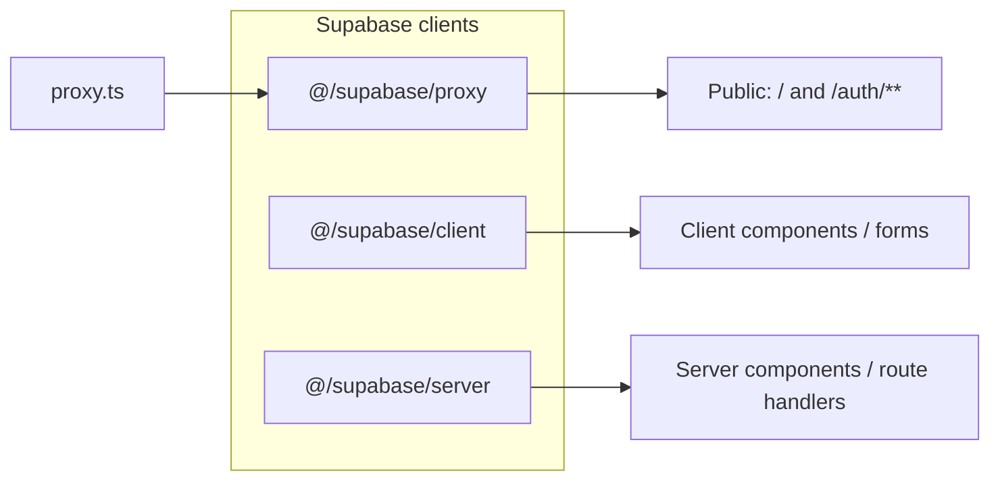

# Phase 1 Epic 1B — Rules Correctness & De-specialization

## Prerequisite status

**Epic 1A is done** (verified in repo):

- No `tutorial/`, `test-examples/`, or `react-query-example*` surfaces
- No `package-lock.json`; `packageManager` is pnpm
- `pnpm audit` reports no known vulnerabilities; dev stack is current (Vitest 3, Vite 6, Next 16.2.x)
- Routes are clean: `/`, `/auth/**`, `/protected` only

**Next uncompleted epic:** 1B (1C Docs and 1D Dev tooling remain after this).

---

## Canonical codebase truth (reconciliation targets)

Use this as the single source of truth when editing rules. **Verify in code; do not guess.**

| Topic | Canonical in repo today |
|-------|-------------------------|
| Test runner | **Vitest** — [`vitest.config.ts`](vitest.config.ts), [`vitest.setup.ts`](vitest.setup.ts); `pnpm test` = watch, `pnpm test:ci` = `vitest run` |
| Next.js | **16** (App Router) |
| Supabase browser client | `import { createClient } from '@/supabase/client'` — [`src/supabase/client.ts`](src/supabase/client.ts) |
| Supabase server client | `import { createClient } from '@/supabase/server'` then `await createClient()` — [`src/supabase/server.ts`](src/supabase/server.ts) |
| Auth proxy | Root [`proxy.ts`](proxy.ts) → [`src/supabase/proxy.ts`](src/supabase/proxy.ts) `updateSession()` — **not** `src/middleware.ts` |
| Public routes | `/` and `/auth/**` only; unauthenticated users redirected to `/auth/login` |
| `cn()` utility | `@/utils/tailwind` — [`src/utils/tailwind.ts`](src/utils/tailwind.ts) |
| TanStack Query example | [`src/hooks/useGetMessage.ts`](src/hooks/useGetMessage.ts) + [`src/providers/ReactQueryProvider.tsx`](src/providers/ReactQueryProvider.tsx) |
| Test render helper | [`src/test/test-utils.tsx`](src/test/test-utils.tsx) |
| MSW | [`src/mocks/`](src/mocks/) (handlers, server, browser) |
| API routes | **None yet** (`src/app/api/` does not exist) |
| DB scripts / migrations | **None yet** (no `supabase/migrations/`, no `pnpm db:*` scripts in [`package.json`](package.json)) |
| `zod` | **Not in dependencies** (deferred to Phase 5) |
| Error UI components | **Do not exist yet** (`ErrorDisplay`, `ErrorBoundary`, etc. — Phase 5) |
| Coverage enforcement | **Not configured yet** (Epic 1D.2) |



---

## Approach: sequential, file-by-file pass

1B.1 (stack accuracy) and 1B.2 (de-specialization) touch the **same files** — do one consolidated edit pass per file rather than two separate sweeps.

**Out of scope for 1B** (later epics):

- [`.cursor/README.md`](.cursor/README.md) still says "Localfront" — Phase 7 skills pass or a small follow-up with 1C
- Cookloop-branded **skills** (`design-critique`, `ux-copy`, etc.) — Phase 7 Agent Tooling
- Creating [`AGENTS.md`](AGENTS.md) — Epic 1C.1
- Coverage thresholds / pre-push hook — Epic 1D

**Keep `refactor-cleaner` references** — the subagent ships with the template ([`.cursor/agents/refactor-cleaner.md`](.cursor/agents/refactor-cleaner.md), skill, git-workflow exception).

---

## Story 1B.1 — Stack & structure accuracy

### High-priority files (most drift)

**[`testing.mdc`](.cursor/rules/testing.mdc)** — largest mismatch

- Frontmatter + title: Jest → **Vitest**
- Commands: `jest --ci --coverage` → `vitest run`; note coverage thresholds are **planned in Epic 1D** (do not claim 80% is enforced today)
- `pnpm test` watch warning: Vitest, not Jest
- Example imports stay `@/test/test-utils` (path is correct)
- Replace deleted example refs (`react-query-example.test.tsx`, `AdminSidebar.unit.test.tsx`, `login-form.unit.test.tsx`) with neutral placeholders or `src/hooks/useGetMessage.ts` once tests exist
- MSW v2 paths: confirm [`src/mocks/handlers.ts`](src/mocks/handlers.ts) / [`src/mocks/server.ts`](src/mocks/server.ts)

**[`supabase.mdc`](.cursor/rules/supabase.mdc)**

- Globs: remove `src/utils/supabase.ts`, `src/middleware.ts`; add `src/supabase/**`, root `proxy.ts`
- Replace four-client `@/utils/supabase` examples with the **two-file pattern** (`@/supabase/client`, `@/supabase/server`) plus proxy note
- Remove or soften `pnpm db:status` / `db:push` / `db-preflight.sh` commands until Phase 6 adds them — keep agent safety cross-ref to [`do-migrations-agent.mdc`](.cursor/rules/do-migrations-agent.mdc) only
- Middleware section → **proxy** (`proxy.ts` + `updateSession`)

**[`security.mdc`](.cursor/rules/security.mdc)**

- Globs: `src/middleware.ts` → `proxy.ts`, `src/supabase/proxy.ts`
- Auth examples: `createServerClient(cookies())` from `@/utils/supabase` → `await createClient()` from `@/supabase/server`
- Zod section: remove "Dependency: zod in package.json" — frame as **planned pattern** (Phase 5) or generic server-boundary validation until zod lands

**[`project-standards.mdc`](.cursor/rules/project-standards.mdc)**

- Import example: `@/utils/supabase` → `@/supabase/client` or `@/supabase/server` as appropriate

**[`api-development.mdc`](.cursor/rules/api-development.mdc)**

- `createServerClient()` from `@/utils/supabase` → `@/supabase/server`
- "Follow patterns from existing handlers under `src/app/api/`" → principle-based guidance until API routes exist (Phase 5)

**[`nextjs.mdc`](.cursor/rules/nextjs.mdc)**

- Description + H1: Next.js **16**
- API route guidance: same as above — conventions stand, but drop "follow existing `src/app/api/`" until routes exist

**[`rule-authoring.mdc`](.cursor/rules/rule-authoring.mdc)**

- Version examples: "Next.js 14" → "Next.js 16"

**[`README.md` in rules dir](.cursor/rules/README.md)**

- "Next.js 14" → 16; "Jest" → Vitest (full pass in 1B.2 also rewrites provenance)

### Secondary pass (grep sweep)

Run targeted grep across [`.cursor/rules/`](.cursor/rules/) for stale tokens and fix any stragglers:

- `@/utils/supabase`, `createServerClient`, `createRouteHandlerClient`, `createMiddlewareClient`
- `middleware.ts`, `src/middleware.ts`
- `Jest`, `jest`
- `Next.js 14`
- `@/lib/utils` (if any)

---

## Story 1B.2 — Project-agnostic examples & locked-principle compliance

### De-specialize domain residue

| File | Replace |
|------|---------|
| [`react-tanstack-query.mdc`](.cursor/rules/react-tanstack-query.mdc) | Recipe hooks/repos → [`useGetMessage.ts`](src/hooks/useGetMessage.ts) or neutral `useResourceList` pattern; keep repository guidance as **future pattern** when `src/services/` exists |
| [`error-handling.mdc`](.cursor/rules/error-handling.mdc) | `process-recipe`, `skill-generation`, recipe action paths → neutral tags (`[api-posts]`, `[auth-login]`); drop refs to non-existent `ErrorDisplay` / `ErrorBoundary` files — use inline error UI principles until Phase 5 |
| [`security.mdc`](.cursor/rules/security.mdc) | Cookloop Zod validator paths → generic `src/utils/validate-*` examples or deferred-until-Phase-5 wording |

### Semantic tokens (locked principle)

| File | Change |
|------|--------|
| [`ui-styling.mdc`](.cursor/rules/ui-styling.mdc) | `bg-blue-600` → `bg-primary` / `bg-accent` |
| [`ui-shadcn.mdc`](.cursor/rules/ui-shadcn.mdc) | `bg-purple-600` variant example → semantic token variant |
| [`ui-accessibility.mdc`](.cursor/rules/ui-accessibility.mdc) | `text-red-600` → `text-destructive` |

### Rules-dir README rewrite

**[`.cursor/rules/README.md`](.cursor/rules/README.md)**

- Title: "Localfront" → **Seminova** (or generic "Cursor Rules — Seminova")
- Replace provenance narrative ("battle-tested on cursorrules.org from Cookloop/Localfront") with a short description of **what this rule set is**: template-wide conventions for Next 16 + Supabase + Vitest + shadcn
- Update adopted/excluded lists to match actual stack (Vitest, no PWA, no Zustand, etc.)
- Link to [`CONTEXT.md`](CONTEXT.md) locked rules and future [`AGENTS.md`](AGENTS.md) (1C)

### `refactor-cleaner`

**No change** — subagent ships with template; [`git-workflow.mdc`](.cursor/rules/git-workflow.mdc) exception stays.

---

## Verification checklist (done = epic shippable)

Run after all edits:

```bash
# Stale reference sweep (expect zero hits except intentional historical notes)
rg -i 'jest|@/utils/supabase|middleware\.ts|Cookloop|Localfront|recipe|appliance|bg-blue-600|bg-purple-600|text-red-600' .cursor/rules/

# Stack claims match package.json
rg 'vitest|next.*16' .cursor/rules/testing.mdc .cursor/rules/nextjs.mdc

# Supabase import examples
rg '@/supabase/' .cursor/rules/supabase.mdc .cursor/rules/security.mdc .cursor/rules/project-standards.mdc
```

Manual spot-checks:

- [ ] `testing.mdc` describes Vitest commands that match [`package.json`](package.json) scripts
- [ ] `supabase.mdc` proxy/auth boundary matches [`src/supabase/proxy.ts`](src/supabase/proxy.ts)
- [ ] No rule points at files deleted in Epic 1A or not yet built (recipes, api routes, error components)
- [ ] No hardcoded Tailwind color utilities in UI rule examples
- [ ] Rules-dir README describes Seminova template, not Localfront

**No new tests required** — this epic is documentation/guidance only. Run `pnpm type-check` only if any non-markdown files change (should be none).

---

## Suggested commit shape

One PR, conventional commit:

`docs(rules): align cursor rules with Seminova stack and remove prior-project residue`

Body: note 1B.1 + 1B.2 completed; list primary files touched.

---

## What unlocks after 1B

- **Epic 1C** can author [`AGENTS.md`](AGENTS.md) without contradicting stale rules
- **Phases 2–6** build against guidance that matches the real file layout and auth boundary
- **Epic 1D** can safely add coverage thresholds to `testing.mdc` once Vitest coverage is configured
