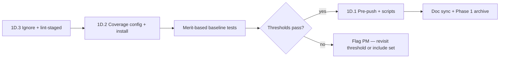

# Phase 1 Epic 1D — Dev Tooling Hygiene

## Prerequisites (verified)

| Epic | Status |
|------|--------|
| **1A** Foundation cleanup | Shipped |
| **1B** Rules correctness | Shipped |
| **1C** Docs | Shipped |
| **1D** Dev tooling | **Shipped** |

---

## Baseline tests — merit over metric

Write proxy, auth-form, hooks, and utils tests because that code is genuinely worth testing and every product built from this template inherits both the tests and the pattern — **not** to reach 80%.

- If clearing 80% would require tests that don't catch a real bug, **stop and flag** rather than padding.
- **Do not** add theme-switcher tests (or any other) solely to lift branch coverage.
- If 80% can't be reached with useful tests, surface it and revisit threshold or include set — consistent with testing.mdc "no per-file 80% crusades."

Approved test targets:

| Test file | Target | Why |
|-----------|--------|-----|
| `src/utils/tailwind.unit.test.ts` | `cn()` | Pure utility |
| `src/utils/env.unit.test.ts` | `hasEnvVars` | Auth proxy gate |
| `src/components/env-var-warning.unit.test.tsx` | render | User-visible env state |
| `src/hooks/useGetMessage.unit.test.ts` | MSW happy path | Hook + MSW pattern |
| `src/supabase/proxy.unit.test.ts` | redirect rules | Security-critical |
| Auth form integration tests (4) | happy + error | Inherited auth pattern |
| `logout-button.integration.test.tsx` | signOut flow | Auth boundary |
| `confirm/route.integration.test.ts` | OTP branches | Auth route handler |

**Explicitly excluded:** theme-switcher and any filler tests.

---

## `.prettierignore` audit (1D.3)

**Keep agent-authored top-level docs Prettier-ignored** — do not remove:

- `CONTEXT.md`, `AGENTS.md`, `CONTEXT_ARCHIVE.md`, `README.md`
- `/.cursor`

Lint-staged switches to `--ignore-path .prettierignore`; the markdown glob formats other markdown but skips these four automatically.

**Also keep ignored:** build output, lock files (`pnpm-lock.yaml`), env files, coverage, `.next`, etc.

**Drop:** genuinely stale starter entries only (if any remain after review).

---

## Coverage config (1D.2)

```typescript
coverage: {
  provider: 'v8',
  include: ['src/**/*.{ts,tsx}', 'proxy.ts'],
  exclude: [
    'src/components/ui/**',
    'src/mocks/**',
    'src/test/**',
    'src/app/globals.css',
    '**/*.d.ts',
  ],
  thresholds: { lines: 80, functions: 80, branches: 80, statements: 80 },
}
```

All of `src/components/**` outside `ui/` stays in scope.

`test:ci` → `vitest run --coverage`. Thresholds land in the **same change** as baseline tests.

---

## Hooks + CI (1D.1)

- Pre-commit: `pnpm lint-staged && pnpm type-check` (unchanged)
- Pre-push: `pnpm pre-push` → type-check → lint → format-check → test:ci (with coverage)
- CI workflow unchanged in step order; `test:ci` picks up coverage flag

---

## Doc sync + Phase 1 archive

- [AGENTS.md](AGENTS.md), [README.md](README.md) — hooks + coverage enforced
- [testing.mdc](.cursor/rules/testing.mdc), [git-workflow.mdc](.cursor/rules/git-workflow.mdc) — flip coverage from planned to enforced
- [CONTEXT.md](CONTEXT.md) — mark 1D shipped; Phase 1 complete
- [CONTEXT_ARCHIVE.md](CONTEXT_ARCHIVE.md) — append Phase 1 narratives

---

## Implementation order



### Step 1 — `.prettierignore` + lint-staged (1D.3 + 1D.1 partial)

- Keep `CONTEXT.md`, `AGENTS.md`, `CONTEXT_ARCHIVE.md`, `README.md`, `/.cursor` in `.prettierignore`
- Organize sections; keep `pnpm-lock.yaml`, build output, env, coverage ignored
- [`.lintstagedrc.js`](.lintstagedrc.js): add `*.{md,json,yml,yaml,css}` Prettier; switch to `--ignore-path .prettierignore`
- Pre-commit unchanged: `pnpm lint-staged && pnpm type-check`

### Step 2 — Coverage + scripts (1D.2)

- `pnpm add -D @vitest/coverage-v8`
- Update [`vitest.config.ts`](vitest.config.ts) with coverage block above
- [`package.json`](package.json): `test:ci` → `vitest run --coverage`; add `pre-push` script

### Step 3 — Merit-based baseline tests (1D.2)

Land with thresholds. Auth forms: mock `@/supabase/client` at boundary; assert user-visible outcomes (H/I/B, 1–2 cases each). Proxy: mock `NextRequest` + `getClaims`. Confirm route: mock `redirect` throw pattern.

**If 80% fails after useful tests:** report coverage report + gap analysis; do not add filler.

### Step 4 — Pre-push hook (1D.1)

- Create [`.husky/pre-push`](.husky/pre-push): `pnpm pre-push`
- Fix [git-workflow.mdc](.cursor/rules/git-workflow.mdc) pre-push section to document full CI mirror

### Step 5 — Doc sync + archive

Run quality gate, then `/sync-repo-docs` + `/sync-context-md` equivalents.

---

## Verification gate

```bash
pnpm type-check && pnpm lint && pnpm format-check && pnpm test:ci
```

- Pre-commit formats staged `.md` (not agent docs) and `.ts`
- `pnpm pre-push` passes
- Coverage ≥80% on all four metrics **or** PM notified with gap analysis
