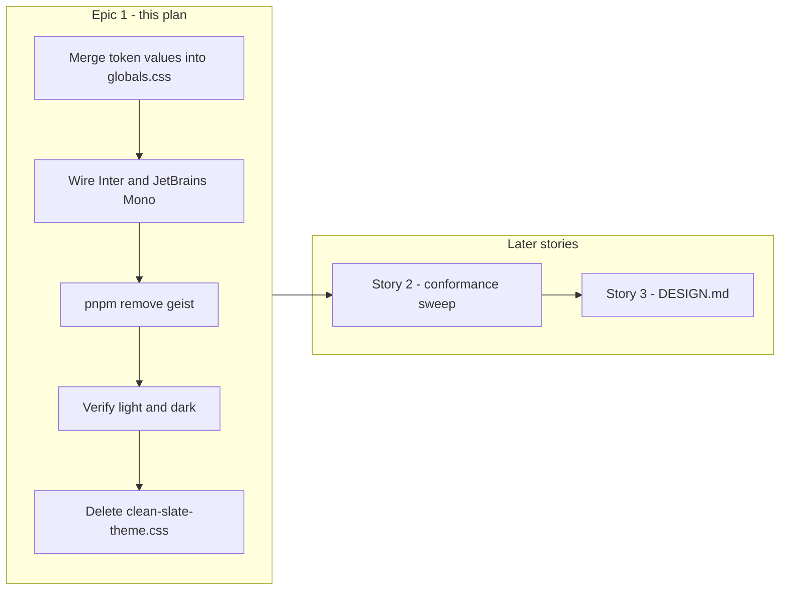

# Phase 2 Epic 1 — Clean Slate Token System

**Phase:** 2 — Design-System Token Layer (`Active`)  
**Epic status:** Not started — CONTEXT [Story 1](CONTEXT.md) is the first open item  
**Structure:** Sequential (single track; Stories 2 and 3 gate on this)

Verified against the repo on 2026-06-18:
- [src/app/globals.css](src/app/globals.css) still uses stock shadcn **neutral** tokens (gray primary, no `--destructive-foreground`, no font/shadow/spacing token groups)
- [clean-slate-theme.css](clean-slate-theme.css) exists at repo root (frozen tweakcn export) — **not yet merged**
- [audit-hardcoded-colors.md](audit-hardcoded-colors.md) catalogues violations — **fixes are Story 2, not this epic**
- [src/app/layout.tsx](src/app/layout.tsx) loads **Geist** via `next/font/google`; [package.json](package.json) also lists an orphaned **`geist`** npm dep (unused — layout imports from `next/font/google`, not the package)
- Clean Slate defines Inter / Merriweather / JetBrains Mono — only Inter and JetBrains Mono have current UI consumers
- No [DESIGN.md](DESIGN.md) yet — Story 3
- Phase 1 epics (1A–1D) shipped per [CONTEXT_ARCHIVE.md](CONTEXT_ARCHIVE.md)



---

## Goal

Replace the stock neutral theme with **tweakcn Clean Slate** (indigo primary) and complete the token *definition* layer the locked rules already assume: color (light + dark), typography, spacing, radius, and shadow. This is inherited **structure** with Seminova's default **theme** — re-skinnable per product.

**Resolves without component edits:** adding `--destructive-foreground` + `@theme` mapping unblocks existing `text-destructive-foreground` usage in [button.tsx](src/components/ui/button.tsx) and [badge.tsx](src/components/ui/badge.tsx).

---

## Step 1 — Merge Clean Slate values into globals.css

**Primary file:** [src/app/globals.css](src/app/globals.css)  
**Source:** [clean-slate-theme.css](clean-slate-theme.css)

### Replace in `:root` and `.dark`

Copy all Clean Slate **color** variables (background through sidebar-ring), including `--destructive-foreground`. Replace the current neutral oklch values entirely.

Also copy from Clean Slate:
- `--font-sans`, `--font-serif`, `--font-mono` token definitions — then override `--font-sans` and `--font-mono` in Step 2 to point at next/font variables; `--font-serif` stays as the plain `Merriweather, serif` stack (no loader)
- `--radius` (Clean Slate uses `0.5rem` — intentional theme change from current `0.625rem`)
- Shadow primitives: `--shadow-x` through `--shadow-2xl`, `--shadow-color`, `--shadow-opacity`
- `--spacing: 0.25rem`
- `--tracking-normal: 0em` (harmless to include)

### Preserve from current globals.css (Clean Slate omits these)

Keep the existing extended radius scale in `@theme inline`:

```css
--radius-2xl: calc(var(--radius) + 8px);
--radius-3xl: calc(var(--radius) + 12px);
--radius-4xl: calc(var(--radius) + 16px);
```

Per CONTEXT: "Preserve the existing radius 2xl–4xl tokens, which Clean Slate omits."

### Extend `@theme inline`

Add mappings from Clean Slate that are missing today:

| Add to `@theme inline` | Purpose |
|---|---|
| `--color-destructive-foreground: var(--destructive-foreground)` | Fixes destructive button/badge text |
| `--font-sans`, `--font-serif`, `--font-mono` | Tailwind `font-*` utilities |
| `--shadow-2xs` through `--shadow-2xl` | Theme-aligned shadow utilities |
| `--spacing: var(--spacing)` | tweakcn spacing base (optional but completes the export) |

Keep the existing `@theme` block structure (currently `@theme` precedes `:root` — either order works in Tailwind v4; prefer minimal reordering).

### Do not duplicate

- Do **not** copy the second `@import "tailwindcss"` or duplicate `@custom-variant` / `@layer base` from the export — they already exist in globals.css.
- Do **not** fix auth-form `text-red-500` or `NextTopLoader` hex color here — Story 2.

---

## Step 2 — Wire fonts in layout.tsx

**File:** [src/app/layout.tsx](src/app/layout.tsx)

Replace Geist with **two** `next/font/google` loaders — only fonts with real UI consumers today:

| Font | next/font export | CSS variable | Consumer |
|---|---|---|---|
| Inter | `Inter` | `--font-inter` | body (`font-sans`) |
| JetBrains Mono | `JetBrains_Mono` | `--font-jetbrains-mono` | `font-mono` on [protected/page.tsx](src/app/protected/page.tsx) pre block |

**Do not** load Merriweather via next/font. Nothing in the current UI uses `font-serif`; shipping a webfont loader for it adds unused bytes to the template baseline.

**Pattern:**

1. Each loader: `subsets: ['latin']`, `display: 'swap'`, `variable: '--font-…'`
2. Apply both variable classes on `<html>` or `<body>`
3. Replace `geistSans.className` with `font-sans antialiased` on `<body>`
4. Font stacks in `:root` / `.dark` (globals.css):

```css
--font-sans: var(--font-inter), sans-serif;
--font-serif: Merriweather, serif;           /* token exists for re-skin; no next/font loader */
--font-mono: var(--font-jetbrains-mono), monospace;
```

The `--font-serif` token and `@theme` `--font-serif` mapping still ship (structure for future serif usage and theme re-skins); the browser falls back to system serif unless a product later adds a loader or `@font-face`.

---

## Step 2b — Remove orphaned geist dependency

**File:** [package.json](package.json)

After removing Geist from layout.tsx, run:

```bash
pnpm remove geist
```

The `geist` npm package is unused — layout imports `Geist` from `next/font/google`, not from the `geist` package. Removing it keeps the baseline free of dead dependencies.

---

## Step 3 — Visual verification

Manual smoke test in browser (`pnpm dev`):

- **Light mode:** indigo primary on default buttons; soft blue-gray background; cards white
- **Dark mode:** toggle via theme switcher — background/card/primary shift correctly; destructive button text readable (white on red in light, dark bg on red in dark per Clean Slate values)
- **Typography:** body renders Inter (not Geist); `font-mono` on [protected/page.tsx](src/app/protected/page.tsx) pre block renders JetBrains Mono
- **Radius:** buttons/inputs use slightly tighter radius (`0.5rem` base vs old `0.625rem`) — expected
- **Shadows:** inputs/buttons use theme shadow values (subtle change from Tailwind defaults)

No new automated tests required — existing suite asserts error *text*, not colors/fonts. CSS-only change should not break coverage.

---

## Step 4 — Quality gate and cleanup

Run the standard quality bar:

```bash
pnpm type-check && pnpm lint && pnpm format-check && pnpm test:ci
```

**Delete** [clean-slate-theme.css](clean-slate-theme.css) once verified — it is a one-time implementation input, not a durable artifact (per CONTEXT).

**Do not delete** [audit-hardcoded-colors.md](audit-hardcoded-colors.md) yet — Story 2 uses it as its fix checklist.

---

## Out of scope (Stories 2 and 3)

| Item | Story |
|---|---|
| Replace `text-red-500` → `text-destructive` in four auth forms | Story 2 |
| Map `NextTopLoader` `color="#2acf80"` → `var(--primary)` | Story 2 |
| Delete `audit-hardcoded-colors.md` + re-audit grep | Story 2 |
| Author `DESIGN.md` (architecture, re-skin workflow, tweakcn provenance) | Story 3 |
| Update `components.json` `baseColor` (cosmetic metadata; tokens are authoritative in CSS) | Optional — low priority |
| Rebrand metadata title/description in layout.tsx | Phase 4 |

---

## Doc sync

No AGENTS.md or CONTEXT.md update required for Story 1 alone — theming is already listed under "Implemented now" as `next-themes` over CSS variables; the *values* change, not the architecture. After **Phase 2 ships in full**, run `/sync-context-md` to archive ACTIVE content and `/sync-repo-docs` if AGENTS.md theming description should mention Clean Slate provenance (or defer provenance detail to DESIGN.md in Story 3).

---

## Risk

**LOW** — CSS and font-loader changes only; no routes, schema, or auth logic touched. Main regression vectors: font loading hydration mismatch (mitigated by `display: 'swap'` + variable pattern) and destructive variant contrast (verify manually in both modes).
