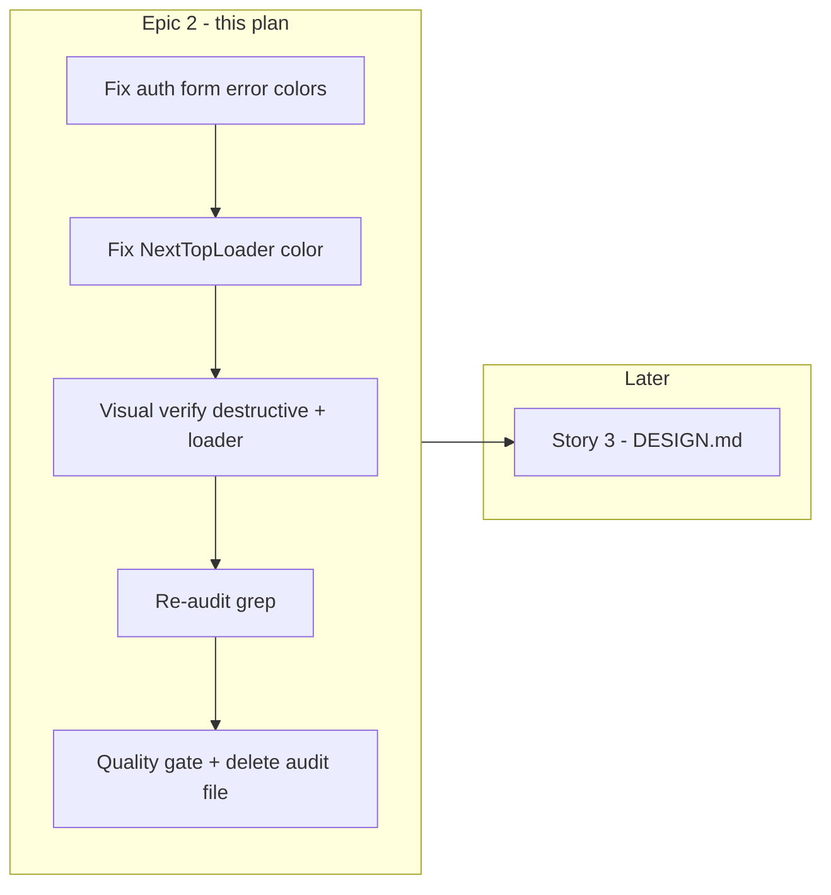

# Phase 2 Epic 2 — Token Conformance

**Phase:** 2 — Design-System Token Layer (`Active`)  
**Epic status:** Not started — [CONTEXT Story 2](CONTEXT.md) is the next open item  
**Prerequisite:** [Phase 2 Epic 1](.cursor/plans/phase_2_epic_1_clean_slate_tokens_aafb3d1e.plan.md) complete (verified 2026-06-18)  
**Structure:** Sequential (single track; small, dependent sweep — not worth parallel tracks)

Verified against the repo:

- [src/app/globals.css](src/app/globals.css) ships Clean Slate tokens including `--destructive-foreground` + `@theme` `--color-destructive-foreground` — **button/badge token gap from the audit is already resolved**
- [clean-slate-theme.css](clean-slate-theme.css) deleted (Story 1 cleanup done)
- [audit-hardcoded-colors.md](audit-hardcoded-colors.md) still exists — **this epic's checklist**
- **5 violations remain** in `src/` (4× `text-red-500`, 1× hex loader color)
- No [DESIGN.md](DESIGN.md) yet — Story 3 / Epic 3



---

## Goal

Bring all existing UI code into conformance with the locked rule: **semantic tokens only** — no Tailwind color-scale utilities or raw hex for themeable color. After this epic, `src/**` should pass the re-audit checklist in [audit-hardcoded-colors.md](audit-hardcoded-colors.md).

**No changes needed** for [button.tsx](src/components/ui/button.tsx) or [badge.tsx](src/components/ui/badge.tsx) — Story 1's `--destructive-foreground` definition makes their existing `text-destructive-foreground` classes resolve correctly.

---

## Step 1 — Auth form error text (4 files)

Replace `text-red-500` → `text-destructive` in each inline error `<p>`:

| File | Line |
|------|------|
| [src/components/login-form.tsx](src/components/login-form.tsx) | 91 |
| [src/components/sign-up-form.tsx](src/components/sign-up-form.tsx) | 104 |
| [src/components/forgot-password-form.tsx](src/components/forgot-password-form.tsx) | 85 |
| [src/components/update-password-form.tsx](src/components/update-password-form.tsx) | 68 |

**Pattern change (each file):**

```tsx
// Before
{error && <p className="text-sm text-red-500">{error}</p>}

// After
{error && <p className="text-sm text-destructive">{error}</p>}
```

**Optional a11y alignment** (not required by CONTEXT, but matches [error-handling.mdc](.cursor/rules/error-handling.mdc) and [ui-accessibility.mdc](.cursor/rules/ui-accessibility.mdc)): add `role="alert"` to these error paragraphs so screen readers announce failures. Low-risk one-attribute addition if done in the same pass.

**Tests:** Integration tests ([login-form.integration.test.tsx](src/components/login-form.integration.test.tsx), etc.) assert error **message text**, not CSS classes — no test updates expected.

---

## Step 2 — NextTopLoader theme alignment

**File:** [src/app/layout.tsx](src/app/layout.tsx) line 44

Per CONTEXT Story 2: map the hardcoded green to the primary token so the loader inherits the theme.

```tsx
// Before
<NextTopLoader showSpinner={false} height={2} color="#2acf80" />

// After
<NextTopLoader showSpinner={false} height={2} color="var(--primary)" />
```

**Visual expectation:** loader bar shifts from mint green to Clean Slate indigo (`oklch(0.5854 …)` in light mode). This is intentional — strict theme conformance over preserving the starter's green accent.

`nextjs-toploader` accepts CSS variable strings for `color`; no new token or wrapper component needed.

---

## Step 3 — Visual verification

Manual smoke test (`pnpm dev`):

- **Auth errors:** trigger a login failure on `/auth/login` — error text renders in destructive red (not Tailwind red-500); readable in light and dark mode
- **Destructive button/badge:** confirm destructive variant text contrast in both modes (validates Story 1 token + no regression)
- **Top loader:** navigate between routes — progress bar uses indigo primary, updates correctly in dark mode

No new automated tests required — behavior unchanged; only styling tokens.

---

## Step 4 — Re-audit

Run grep sweeps from [audit-hardcoded-colors.md](audit-hardcoded-colors.md) re-audit checklist:

```bash
# From repo root — expect zero component hits after fixes
rg 'text-red-500' src/
rg '#[0-9a-fA-F]{3,8}' src/
rg '-(red|green|blue|gray|slate)-\d+' src/
```

`globals.css` oklch values and structural utilities (`bg-transparent`, etc.) remain the only acceptable non-semantic color usage.

---

## Step 5 — Quality gate and cleanup

```bash
pnpm type-check && pnpm lint && pnpm format-check && pnpm test:ci
```

**Delete** [audit-hardcoded-colors.md](audit-hardcoded-colors.md) once verified — one-time implementation input, not a durable artifact (per CONTEXT).

---

## Out of scope (Story 3 / Epic 3)

| Item | Story |
|------|-------|
| Author `DESIGN.md` (architecture, re-skin workflow, tweakcn provenance) | Story 3 |
| Update `components.json` `baseColor` metadata | Optional — low priority |
| Auth screen layout restyle | Phase 3 |
| `/sync-context-md` or `/sync-repo-docs` | After **full Phase 2** ships (all 3 stories) |

---

## Doc sync

No AGENTS.md or CONTEXT.md update for Story 2 alone — conformance is already implied by locked rules; no new routes, schema, or architectural surface. Archive ACTIVE Phase 2 content after Story 3 lands.

---

## Risk

**LOW** — Five one-line class/prop changes across 5 files. Regression vectors: loader color visibility on dark backgrounds (verify manually), destructive error text contrast (verify in both themes). Existing test suite should pass unchanged.
