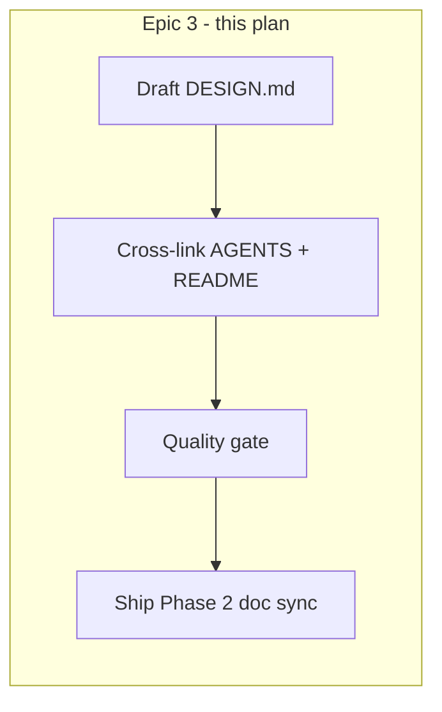

# Phase 2 Epic 3 — DESIGN.md

**Phase:** 2 — Design-System Token Layer (`Active`)  
**Epic status:** Not started — [CONTEXT Story 3](CONTEXT.md) is the last open item  
**Prerequisites:** Stories 1–2 verified in repo (2026-06-18)

| Prerequisite | Status |
|---|---|
| Clean Slate tokens in [`src/app/globals.css`](src/app/globals.css) | Done — color, font, shadow, spacing, radius groups + `@theme inline` mappings |
| Fonts wired in [`src/app/layout.tsx`](src/app/layout.tsx) | Done — Inter + JetBrains Mono via `next/font`; Merriweather CSS fallback in globals |
| Token conformance in `src/` | Done — auth forms use `text-destructive`; loader uses `var(--primary)`; no `text-red-*` / hex in `src/` |
| `clean-slate-theme.css` deleted | Done |
| `audit-hardcoded-colors.md` deleted | Done (staged deletion in working tree) |

**Structure:** Sequential (single documentation track — not worth parallel tracks)



---

## What DESIGN.md must cover (from CONTEXT)

Per [CONTEXT Story 3](CONTEXT.md):

1. **Token architecture** — how the three layers connect (do not duplicate values):
   - **Definition layer:** `:root` and `.dark` custom properties in [`src/app/globals.css`](src/app/globals.css) (oklch values live here only)
   - **Tailwind bridge:** `@theme inline` maps `--color-*`, `--font-*`, `--shadow-*`, `--radius-*`, `--spacing` to CSS vars
   - **Consumption layer:** semantic utilities in components (`bg-background`, `text-primary`, `shadow-md`, `font-sans`, etc.)

2. **Structure vs theme split** — align with AGENTS locked rule *"Structure is fixed; theme is swappable"*:
   - **Inherited structure:** token *names*, groupings, `@theme` mappings, semantic-class convention, dark-mode class strategy (`next-themes`), font wiring pattern in layout
   - **Re-skinnable theme:** oklch/hsl *values* inside `:root` / `.dark`, default font choices, `--radius` base, shadow recipes

3. **Token inventory (names only)** — document groups without re-hosting values:
   - Semantic colors: `background`, `foreground`, `primary`, `secondary`, `muted`, `accent`, `destructive` (+ `-foreground` pairs), `border`, `input`, `ring`
   - Chart: `chart-1` … `chart-5`
   - Sidebar: `sidebar-*` (ready for Phase 3 shell)
   - Typography: `--font-sans`, `--font-serif`, `--font-mono` (note Inter/JetBrains loaded in layout; Merriweather is CSS-only fallback today)
   - Radius: `sm` through `4xl` (Seminova-preserved extensions beyond tweakcn export)
   - Shadow: `2xs` through `2xl`
   - Spacing base: `--spacing`

4. **Usage conventions** — short, practical guidance for builders and agents:
   - Always semantic tokens for themeable color (per [`.cursor/rules/ui-styling.mdc`](.cursor/rules/ui-styling.mdc))
   - Error text pattern already in auth forms: `role="alert"` + `text-destructive`
   - Third-party props that accept color: use `var(--primary)` etc. (see `NextTopLoader` in layout)
   - Pointer to shadcn primitives in `src/components/ui/` — variants already token-aware

5. **Dark mode** — `ThemeProvider` with `attribute="class"`; tokens swap via `.dark` block in globals.css

6. **Default theme provenance** — record that shipped default is **tweakcn Clean Slate**:
   - https://tweakcn.com/r/themes/clean-slate.json
   - Indigo primary; Inter / Merriweather / JetBrains Mono

7. **Re-skin workflow** — step-by-step for products forking Seminova:
   1. Generate or pick a theme in [tweakcn](https://tweakcn.com)
   2. Export CSS
   3. Diff-apply **values only** into `:root` and `.dark` in `globals.css` (preserve `@theme inline` structure and Seminova-only tokens like `radius-2xl`–`4xl`)
   4. Update `layout.tsx` font loaders if font families change
   5. Grep `src/` for hardcoded colors; fix to semantic tokens
   6. Visual smoke test light + dark

8. **Authoritative source statement** — `globals.css` is the single source of token *values*; DESIGN.md documents the system, not a copy of the CSS

9. **Related docs** — links to [`AGENTS.md`](AGENTS.md) (locked rules), [`.cursor/rules/ui-styling.mdc`](.cursor/rules/ui-styling.mdc), [`.cursor/rules/ui-shadcn.mdc`](.cursor/rules/ui-shadcn.mdc)

---

## Step 1 — Author `DESIGN.md` at repo root

**File:** [`DESIGN.md`](DESIGN.md) (new)

**Conventions to match sibling docs:**
- Opening purpose paragraph (audience: PM + agents + contributors)
- `Last updated: 2026-06-18` line
- Concise sections with markdown tables for token *names* (not values)
- No emoji; no pasted oklch blocks from globals.css

**Suggested outline:**

| Section | Content |
|---|---|
| Purpose | What DESIGN.md is vs AGENTS.md / CONTEXT.md |
| Structure vs theme | Inherited vs re-skinnable (bullet split) |
| Architecture | Three-layer diagram or prose: CSS vars → `@theme` → utilities |
| Token groups | Name inventory tables per group |
| Fonts | layout.tsx loaders + CSS `--font-*` chain |
| Dark mode | next-themes + `.dark` selector |
| Using tokens | Do/don't examples (semantic classes; no hex/Tailwind palette scales) |
| Default theme | Clean Slate provenance + tweakcn URL |
| Re-skinning a product | Numbered workflow (above) |
| Authoritative source | `globals.css` pointer |
| Related documentation | AGENTS, rules links |

**Explicit non-goals for DESIGN.md:**
- Do not duplicate locked rules verbatim (link to AGENTS.md)
- Do not document Phase 3+ UI (sidebar layout, auth restyle) — defer to Phase 3
- Do not list every shadcn component variant

---

## Step 2 — Wire DESIGN.md into doc map + refresh AGENTS.md theming truth

Cross-links and repo-truth updates so agents and humans see the shipped token layer accurately:

| File | Change |
|---|---|
| [`AGENTS.md`](AGENTS.md) — **Documentation map** | Add `DESIGN.md` row (audience: PM + agents; role: token architecture, re-skin workflow) |
| [`AGENTS.md`](AGENTS.md) — **Implemented now** | Replace the generic **Theming** bullet (`next-themes` light/dark over CSS variables) with concrete shipped state: tweakcn **Clean Slate** as the default theme in `globals.css`; **Inter** + **JetBrains Mono** via `next/font` in `layout.tsx` (Merriweather as CSS serif fallback); `next-themes` class-based light/dark. Ensure no Geist references remain anywhere in AGENTS.md |
| [`README.md`](README.md) | One-line link after CONTEXT/AGENTS pointers: "For design tokens and re-skinning, see DESIGN.md" |

Apply these AGENTS.md edits **in Step 2** (not deferred to `/sync-repo-docs`) so Step 4's sync pass validates already-correct repo truth rather than discovering stale theming copy.

Use `/sync-repo-docs` in Step 4 only for any residual drift after DESIGN.md + Step 2 edits land.

---

## Step 3 — Quality gate

### Fix `components.json` baseColor

[`components.json`](components.json) still has `"baseColor": "neutral"` from initial scaffolding. Clean Slate's neutral-adjacent tokens (background, border, muted, foreground) carry a cool blue-leaning hue (~258–260°), which aligns with shadcn's **slate** base color, not neutral.

**Change:** `"baseColor": "neutral"` → `"baseColor": "slate"`

This is CLI/metadata only — CSS tokens in `globals.css` remain authoritative — but keeps shadcn CLI defaults consistent with the shipped theme for future `shadcn add` operations.

### Run quality commands

```bash
pnpm format-check && pnpm type-check && pnpm lint && pnpm test:ci
```

Tests should pass unchanged. Run `pnpm format` on `DESIGN.md` if format-check fails (file is **not** in [`.prettierignore`](.prettierignore)).

**Manual verification checklist:**
- [ ] `components.json` `baseColor` is `"slate"`
- [ ] DESIGN.md has zero pasted token values from globals.css (names/references only)
- [ ] tweakcn Clean Slate URL present
- [ ] Re-skin workflow mentions preserving `@theme inline` structure + `radius-2xl`–`4xl`
- [ ] Links to globals.css, AGENTS.md, and relevant rules resolve
- [ ] AGENTS.md **Implemented now** describes Clean Slate + Inter/JetBrains Mono (no Geist)

---

## Step 4 — Ship Phase 2 (doc sync)

After DESIGN.md merges, Phase 2 is complete. Run both skills:

1. **`/sync-context-md`** — append Phase 2 epic narrative to [`CONTEXT_ARCHIVE.md`](CONTEXT_ARCHIVE.md); update roadmap row to `Shipped`; remove ACTIVE Phase 2 section; bump Status line to Phase 3 draft/active as appropriate
2. **`/sync-repo-docs`** — confirm AGENTS.md / README from Step 2 are still accurate after DESIGN.md lands; catch any residual drift only

---

## Out of scope

| Item | Where |
|---|---|
| Auth screen layout restyle | Phase 3 |
| Landing page / metadata rebrand | Phase 4 |
| Design-system skills suite | Phase 7 |
| New tests for documentation | Not needed — no runtime behavior change |
| Lint rule enforcing semantic tokens | Future enhancement; grep workflow documented in re-skin steps is sufficient for now |

---

## Risk

**LOW** — Documentation + one-line `components.json` metadata fix; no runtime behavior change. Main failure mode is **value duplication** (DESIGN.md drifting from globals.css) — mitigated by naming-only inventory and explicit "authoritative source" section. Phase-archive sync is procedural; use skills to avoid manual CONTEXT editing mistakes.
