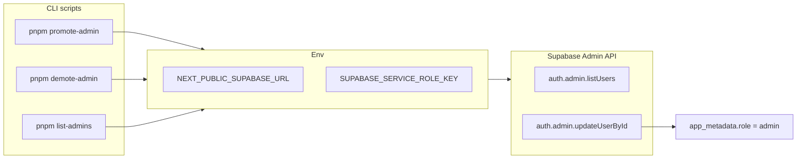

# Phase 3 Epic 1 — Admin Authentication

## Prerequisites (verified)

| Prerequisite | Status |
|--------------|--------|
| Phase 1 Foundation | Shipped |
| Phase 2 Design-system token layer | Shipped |
| `@supabase/supabase-js` in dependencies | Present ([package.json](package.json)) |
| Supabase URL + publishable key in `.env.example` | Present |
| `SUPABASE_SERVICE_ROLE_KEY` in env | **Missing** — must add |
| Admin CLI scripts | **Not built** — no `scripts/` directory |
| `app_metadata.role` locked rule in AGENTS.md | **Not added** |

**Manual prerequisite (not a Cursor story):** A Supabase project must exist and `.env.local` must be filled in before CLI commands work. No migration is required.

---

## Scope

One story from [CONTEXT.md](CONTEXT.md) ACTIVE § Epic 1:

> Promote a user to admin from the command line

**In scope:** CLI commands, service-role client for scripts, env/docs updates, locked rule, unit tests for extracted logic.

**Out of scope (later epics):** `isAdmin()` or any app-code admin helper ([src/utils/admin.ts](src/utils/admin.ts) is Epic 2 when the shell actually consumes it), admin route gating in [src/supabase/proxy.ts](src/supabase/proxy.ts), sidebar shell, Users table, auth restyle.

---

## Architecture



**Admin gate convention:** `user.app_metadata?.role === 'admin'` is the canonical check. Sensitive, JWT-embedded, set only via service-role tooling — not a `profiles` column (Phase 6 product roles live elsewhere).

---

## Implementation (sequential)

### 1. Env and script runner

- Add `SUPABASE_SERVICE_ROLE_KEY` to [.env.example](.env.example) with a placeholder and a comment that it is **server/CLI only** — never `NEXT_PUBLIC_*` (already documented in [.cursor/rules/security.mdc](.cursor/rules/security.mdc)).
- Add `tsx` as a **devDependency** for running TypeScript CLI scripts (`tsconfig` has `noEmit: true`; no compile step exists).
- Wire `package.json` scripts. **Proposed** invocation (verify during implementation — do not assume this combo works without a live test):

```json
"promote-admin": "node --env-file=.env.local --import tsx scripts/admin/promote-admin.ts",
"demote-admin": "node --env-file=.env.local --import tsx scripts/admin/demote-admin.ts",
"list-admins": "node --env-file=.env.local --import tsx scripts/admin/list-admins.ts"
```

**Implementation gate:** Run `pnpm list-admins` (or equivalent) as the first step after wiring scripts. If `node --env-file` + `--import tsx` fails to load `.env.local` or execute TypeScript, fall back to a known-good alternative (e.g. `tsx --env-file=.env.local scripts/admin/list-admins.ts` if supported, or `dotenv` preload). A wrong flag combo fails entirely at runtime — partial success is not possible.

Scripts live under `scripts/admin/` (outside `src/` — excluded from Vitest coverage denominator).

### 2. Shared CLI library (`scripts/admin/lib/`)

Extract testable pure logic from I/O:

| Module | Responsibility |
|--------|----------------|
| `env.ts` | Read/validate `NEXT_PUBLIC_SUPABASE_URL` + `SUPABASE_SERVICE_ROLE_KEY`; fail fast with clear messages |
| `service-client.ts` | `createServiceClient()` using `@supabase/supabase-js` `createClient(url, serviceRoleKey, { auth: { autoRefreshToken: false, persistSession: false } })` |
| `admin-users.ts` | Core operations: `findUserByEmail`, `promoteUser`, `demoteUser`, `listAdminUsers` |
| `prompt.ts` | y/N confirmation for promote/demote; prints project URL before prompting |
| `cli.ts` | Arg parsing (`<email>` required for promote/demote), exit codes, bracket-tagged `console.*` per AGENTS.md logging convention |

**Supabase API patterns:**

- **Find user by email:** `auth.admin.listUsers()` — paginate if needed until email match or exhausted.
- **Promote:** `auth.admin.updateUserById(id, { app_metadata: { ...existing, role: 'admin' } })` — merge existing `app_metadata` to avoid clobbering other keys.
- **Demote:** merge existing `app_metadata`, then **remove the `role` key** (destructure/omit — do not set `role: null`). A null value would leave a truthy-ish field in `app_metadata` and could confuse Epic 3's Role-badge display logic.
- **List admins:** paginate `listUsers`, filter `app_metadata?.role === 'admin'`.

**Behavior matrix (acceptance criteria):**

| Command | Confirmation | On missing user | On already admin / not admin |
|---------|--------------|-----------------|------------------------------|
| `promote-admin <email>` | y/N + print URL | Exit 1: `no user found with that email — sign up first` | Idempotent success message |
| `demote-admin <email>` | y/N + print URL | Same missing-user error | Idempotent no-op message |
| `list-admins` | None | N/A | Print email list (or "no admins found") |

### 3. Tests

Per testing minimalism — test extracted logic, mock Supabase at the boundary:

| File | What it catches |
|------|-----------------|
| `scripts/admin/lib/admin-users.unit.test.ts` | Promote/demote merge behavior (including role-key removal on demote), idempotency decisions, list filtering |

Do **not** test readline prompts or full CLI argv wiring beyond one smoke path if needed. No `src/` app-code tests — Epic 1 ships CLI-only per CONTEXT.md. Scripts under `scripts/` are outside coverage thresholds.

### 4. Documentation updates

**[README.md](README.md)** — new **Initial setup** section (after Quick start env step):

1. Start dev server, sign up at `/auth/sign-up`
2. Add `SUPABASE_SERVICE_ROLE_KEY` to `.env.local` (Project Settings → API → service_role)
3. Run `pnpm promote-admin your@email.com`
4. Note: existing session JWT won't reflect new role until re-login (JWT lag — intentional per CONTEXT)

Add the three commands to the Scripts table.

**[AGENTS.md](AGENTS.md)** — two updates:

1. **Locked rules** — new bullet: `app_metadata.role` is the canonical admin gate; do not move to `profiles` without PM approval.
2. **Implemented now** — admin CLI commands shipped.

Run `/sync-repo-docs` at epic close to keep README + AGENTS aligned.

---

## Quality gate

```bash
pnpm type-check && pnpm lint && pnpm format-check && pnpm test:ci
```

**Manual verification checklist:**

- [ ] `.env.local` has service role key; `pnpm list-admins` runs without confirmation
- [ ] `pnpm promote-admin` on unknown email → clear error
- [ ] `pnpm promote-admin` on signed-up user → confirmation → success; second run idempotent
- [ ] `pnpm demote-admin` reverses role with confirmation
- [ ] Promote/demote print the Supabase project URL before acting

---

## Downstream dependencies

| Epic | Depends on Epic 1 |
|------|-------------------|
| Epic 2 Admin app shell | Promoted admin user exists; Epic 2 introduces `isAdmin()` (or equivalent) when shell gating is built |
| Epic 3 Users page | `app_metadata.role` column display; `auth.admin.listUsers` pattern |
| Epic 4 Auth restyle | Independent — can run in parallel after Epic 1 if desired |

---

## Risks

| Risk | Mitigation |
|------|------------|
| Service role key committed | `.env*.local` gitignored; only placeholder in `.env.example` |
| Clobbering `app_metadata` | Always merge existing keys on update |
| JWT lag after promote | Document re-login in README; admin UI gating in Epic 2 should handle stale JWT gracefully |
