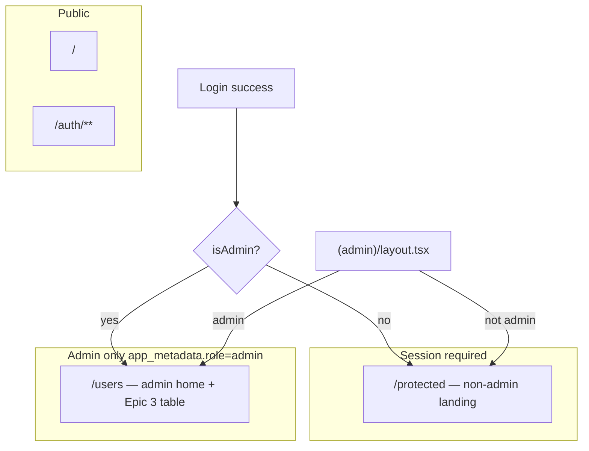

# Phase 3 Epic 2 — Admin App Shell

## Prerequisites (verified)

| Prerequisite | Status |
|---|---|
| Phase 3 Epic 1 (admin CLI + locked rule) | Shipped — [`scripts/admin/`](scripts/admin/), AGENTS.md locked rule |
| Sidebar design tokens | Present in [`src/app/globals.css`](src/app/globals.css) (`--sidebar-*`) |
| shadcn config | [`components.json`](components.json) — `new-york`, CSS variables; `registries: {}` empty |
| Session proxy (auth boundary) | [`src/supabase/proxy.ts`](src/supabase/proxy.ts) — session only, no admin gate |
| Sidebar / breadcrumb / avatar UI | **Not installed** |
| Admin routes / layout | **Not built** — only starter [`src/app/protected/`](src/app/protected/) |
| `isAdmin()` in app code | **Not built** — CLI has `isUserAdmin` in [`scripts/admin/lib/admin-users.ts`](scripts/admin/lib/admin-users.ts) (not importable from `src/`) |

**Manual prerequisite:** Supabase project wired in `.env.local`; at least one user promoted via `pnpm promote-admin <email>` (re-login required for JWT to reflect role).

**PM decision (confirmed):** Admins land on **`/users`** after login. Non-admins continue to `/protected` until Phase 6.

---

## Scope

One story from [CONTEXT.md](CONTEXT.md) ACTIVE Epic 2:

> Authenticated admin layout with sidebar

**In scope:** shadcn sidebar block + primitives, `(admin)` route group, admin gate, Seminova branding placeholder, Users nav link (page stub OK), dynamic breadcrumb, nav-user footer with Sign out, post-login redirect updates.

**Out of scope (later epics):** Users table data ([Epic 3](.cursor/plans/phase_3_epic_1_admin_auth_10d9bef8.plan.md)), auth screen restyle (Epic 4), non-admin header shell (Phase 6), proxy-level admin gate (layout gate is sufficient for this phase).

---

## Architecture



**Admin gate convention (unchanged):** `app_metadata.role === ADMIN_ROLE` — single shared constant, not a duplicated literal (see §2). Read from JWT via existing `getClaims()` pattern (same as [`src/components/auth-button.tsx`](src/components/auth-button.tsx)). **Implementation gate:** confirm claim shape on first build (`claims.app_metadata?.role` vs nested path); document accessor in `src/utils/admin.ts`.

**Defense in depth:** Server-side gate in [`src/app/(admin)/layout.tsx`](src/app/(admin)/layout.tsx) — redirect non-admins to `/protected`. No proxy change needed this epic.

---

## Route structure

| Path | Group | Access | Purpose |
|---|---|---|---|
| `/users` | `(admin)` | Admin only | Admin home; Epic 3 adds table in `_components/` |
| `/protected` | `protected` | Any authenticated user | Non-admin placeholder until Phase 6 |

```
src/app/
  (admin)/
    layout.tsx          # Sidebar shell + admin gate
    users/
      page.tsx          # Stub page (title + placeholder copy)
      _components/      # Epic 3: users-table.tsx lands here
  protected/            # Keep; non-admin landing
```

---

## Implementation (sequential)

### 1. Install shadcn primitives and sidebar block

Per [`.cursor/rules/ui-shadcn.mdc`](.cursor/rules/ui-shadcn.mdc) — always non-interactive:

```bash
pnpm dlx shadcn@latest add sidebar-07 -y -o
```

This pulls `sidebar` and transitive primitives (avatar, breadcrumb, separator, sheet, tooltip, collapsible, etc.). **If `sidebar-07` fails** (block registry), install primitives individually then `sidebar`, and manually adapt from the [sidebar-07 reference](https://ui.shadcn.com/blocks).

For header/inset/breadcrumb **layout shape**, use `@shadcnblocks/sidebar1` as structural reference per CONTEXT — may require adding shadcnblocks registry to [`components.json`](components.json) first:

```bash
pnpm dlx shadcn@latest add @shadcnblocks/sidebar1 -y -o
```

**Gate:** After install, run `pnpm type-check`. Use `--dry-run` before overwriting any customized files in `src/components/ui/`.

**Retain unchanged from sidebar-07:** `SidebarRail`, `SidebarTrigger`, collapsible-icon behavior.

### 2. Shared admin role constant + app utility

**Single source for the role string** — today [`scripts/admin/lib/admin-users.ts`](scripts/admin/lib/admin-users.ts) defines `ADMIN_ROLE = 'admin'` locally; Epic 2 must not leave two independent literals.

Create [`src/constants/admin-role.ts`](src/constants/admin-role.ts):

```typescript
export const ADMIN_ROLE = 'admin' as const
```

Both consumers import from here (functions stay separate — different input shapes):

| Module | Function | Input |
|---|---|---|
| [`src/utils/admin.ts`](src/utils/admin.ts) | `isAdmin()` | JWT claims from `getClaims()` |
| [`scripts/admin/lib/admin-users.ts`](scripts/admin/lib/admin-users.ts) | `isUserAdmin()` | Supabase `User.app_metadata` |

Refactor CLI lib: remove local `ADMIN_ROLE` definition; import from `@/constants/admin-role` (tsx + tsconfig paths). Update [`scripts/admin/lib/admin-users.unit.test.ts`](scripts/admin/lib/admin-users.unit.test.ts) imports if they referenced the old export location.

**Implementation gate:** `@/` is a `src/`-rooted tsconfig alias — confirm it resolves when [`scripts/admin/lib/admin-users.ts`](scripts/admin/lib/admin-users.ts) is loaded via `node --import tsx` (different resolution context than Next's bundler). Run `pnpm list-admins` (or a minimal import smoke) immediately after wiring the import; if alias resolution fails, fall back to a relative path (`../../../src/constants/admin-role`).

```typescript
// src/utils/admin.ts
import { ADMIN_ROLE } from '@/constants/admin-role'

export const isAdmin = (claims: JwtClaims | null | undefined): boolean =>
  claims?.app_metadata?.role === ADMIN_ROLE
```

- Unit test: [`src/utils/admin.unit.test.ts`](src/utils/admin.unit.test.ts) — happy (admin role), invalid (missing/other role), boundary (undefined claims). Mirror `isUserAdmin` semantics from CLI lib.

### 3. Shared Seminova logo placeholder

Create [`src/components/seminova-logo.tsx`](src/components/seminova-logo.tsx) — text wordmark "Seminova" + lucide icon placeholder (no CDN image). Used in sidebar header now; Epic 4 auth restyle reuses it.

Semantic tokens only; component ≤150 lines.

### 4. Admin layout shell (`src/app/(admin)/layout.tsx`)

Server Component layout:

1. `createClient()` + `getClaims()` — redirect unauthenticated → `/auth/login`
2. `isAdmin(claims)` — redirect non-admin → `/protected`
3. Wrap children in `SidebarProvider` (client island if required by shadcn sidebar)
4. Compose from installed block files, adapted:
   - **Sidebar:** `SeminovaLogo` in header; nav items as real `Link`s
   - **Nav items (minimum):** Users → `/users` (lucide `Users` icon)
   - **Inset:** header row with `SidebarTrigger` + dynamic breadcrumb + main content area

Split into focused subcomponents (≤150 lines each) under `src/app/(admin)/_components/`:

| Component | Responsibility |
|---|---|
| `admin-sidebar.tsx` | Logo, nav links, footer slot |
| `admin-nav-user.tsx` | Client: avatar initials fallback + email trigger + Sign out dropdown |
| `admin-breadcrumb.tsx` | Client: `usePathname()` + label map (`/users` → "Users") |
| `admin-shell.tsx` | SidebarProvider + layout composition (if layout.tsx grows) |

**Nav-user footer (CONTEXT requirements):**
- Avatar: initials from email (or generic fallback) — no `avatar_url` yet
- Trigger row: avatar + email
- Dropdown: **Sign out only** — wire to Supabase `signOut()` (adapt pattern from [`src/components/logout-button.tsx`](src/components/logout-button.tsx)); strip Account/Billing/Notifications from reference block
- Remove stock shadcnblocks CDN logo image

**Breadcrumb:** dynamic from current path — not hardcoded "Dashboard / …". Single-segment map is fine for Epic 2 (`/users` → Home / Users).

### 5. Users page stub

[`src/app/(admin)/users/page.tsx`](src/app/(admin)/users/page.tsx) — Server Component with page title and short placeholder ("User list coming in Epic 3"). Sets breadcrumb context. Epic 3 replaces body with real table at `users/_components/users-table.tsx` (path already referenced in [`.cursor/rules/data-tables.mdc`](.cursor/rules/data-tables.mdc)).

### 6. Post-login redirects and `/protected` handling

Update client redirects in:

- [`src/components/login-form.tsx`](src/components/login-form.tsx)
- [`src/components/update-password-form.tsx`](src/components/update-password-form.tsx)

**Pattern:** After successful auth, read session claims client-side (`supabase.auth.getSession()` or `getUser()`), then:
- Admin → `router.push('/users')`
- Non-admin → `router.push('/protected')`

Update integration tests for both forms to assert correct redirect targets.

**Optional hardening:** In [`src/app/protected/page.tsx`](src/app/protected/page.tsx), if `isAdmin(claims)` → `redirect('/users')` so promoted admins don't linger on the starter page.

**JWT lag note:** If user was just promoted but hasn't re-logged in, they land on `/protected` — already documented in README Initial setup.

### 7. Documentation

**CONTEXT.md (done in plan iteration):** Epic 2 story documents post-login redirect behavior — admin → `/users`, non-admin → `/protected`.

Run `/sync-repo-docs` at epic close:

- **AGENTS.md:** Add `(admin)` routes (`/users`), admin shell in "Implemented now", update "Where things live"
- **README.md:** Note admin area at `/users` after promote + re-login

---

## Testing (minimal, high-value)

| File | What it catches |
|---|---|
| `src/utils/admin.unit.test.ts` | Wrong role string, missing metadata, false positives |
| `src/app/(admin)/layout.integration.test.tsx` (or gate unit) | Non-admin redirected away from admin layout |
| Update `login-form.integration.test.tsx` | Admin vs non-admin redirect paths |

Do **not** snapshot-test sidebar CSS or test shadcn collapsible behavior.

---

## Quality gate

```bash
pnpm type-check && pnpm lint && pnpm format-check && pnpm test:ci
```

**Manual verification checklist:**

- [ ] Promoted admin (after re-login) sees sidebar at `/users`
- [ ] Non-admin authenticated user hitting `/users` → redirected to `/protected`
- [ ] Sidebar collapses via rail/trigger (sidebar-07 behavior intact)
- [ ] Breadcrumb updates on `/users`
- [ ] Nav-user shows email + initials avatar; Sign out returns to `/auth/login`
- [ ] Users nav link is a real `Link` to `/users`
- [ ] Login as admin → lands on `/users`; login as non-admin → `/protected`
- [ ] No hardcoded theme colors; semantic tokens only

---

## Downstream dependencies

| Epic | Depends on Epic 2 |
|---|---|
| Epic 3 Users page | `/users` route, admin layout, admin gate, `_components/` folder |
| Epic 4 Auth restyle | Reuses `SeminovaLogo` placeholder |
| Phase 6 non-admin shell | `/protected` becomes header+content shell |

---

## Risks

| Risk | Mitigation |
|---|---|
| shadcnblocks registry not configured | Add registry to `components.json`; fall back to manual sidebar-07 port |
| `getClaims()` claim shape differs from `app_metadata` | Verify on first implementation; adjust `isAdmin` accessor once |
| `@/` alias fails in tsx script runner | Implementation gate in §2: smoke `pnpm list-admins`; fall back to relative import |
| SidebarProvider requires client boundary | Small `'use client'` wrapper; keep layout mostly RSC |
| Component size >150 lines | Extract `_components/` per locked rules |
| Stale JWT after promote | README already documents re-login; non-admin redirect is correct behavior |
