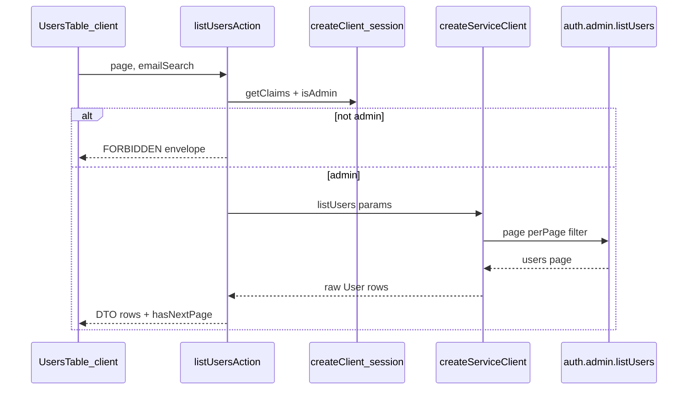

# Phase 3 Epic 3 — Users Reference Page

## Prerequisites (verified)


| Prerequisite                                       | Status                                                                                                                          |
| -------------------------------------------------- | ------------------------------------------------------------------------------------------------------------------------------- |
| Phase 3 Epic 1 (admin CLI + `SUPABASE_SECRET_KEY`) | Shipped — `[scripts/admin/](scripts/admin/)`, `[.env.example](.env.example)`                                                    |
| Phase 3 Epic 2 (admin shell + `/users` stub)       | Shipped — `[src/app/(admin)/](src/app/(admin)`/), `[src/utils/admin.ts](src/utils/admin.ts)`                                    |
| Admin layout gate                                  | `[src/app/(admin)/layout.tsx](src/app/(admin)`/layout.tsx) redirects non-admins                                                 |
| `badge` UI primitive                               | Present — `[src/components/ui/badge.tsx](src/components/ui/badge.tsx)`                                                          |
| Table / TanStack Table                             | **Not installed** — no `table.tsx`, no `@tanstack/react-table` in `[package.json](package.json)`                                |
| shadcnblocks registry                              | Configured — `[components.json](components.json)` `@shadcnblocks`                                                               |
| Data-table rule (placeholder path)                 | `[/.cursor/rules/data-tables.mdc](.cursor/rules/data-tables.mdc)` already points at `users-table.tsx` (file does not exist yet) |
| App-side service client                            | **Not built** — only CLI `[scripts/admin/lib/service-client.ts](scripts/admin/lib/service-client.ts)`                           |


**Manual prerequisite:** Supabase project wired; at least one signed-up user (promote optional for viewing admin badge). `SUPABASE_SECRET_KEY` must be set in `.env.local` for the Server Action — same key the CLI uses.

---

## Scope

Two stories from [CONTEXT.md](CONTEXT.md) ACTIVE Epic 3:

1. **Admin can view all signed-up users** — real data, read-only, five columns
2. **Search and pagination** — email search, page size 50, Next/Previous only

**In scope:** shadcn `table` + `@shadcnblocks/data-table1` baseline (demo stripped), Server Action + service client, DTO mapping, `users-table.tsx` reference implementation, targeted tests, confirm `[data-tables.mdc](.cursor/rules/data-tables.mdc)` paths, `/sync-repo-docs`.

**Out of scope:** Row actions (promote/demote/delete in UI), mock data, proxy-level admin gate changes, auth restyle (Epic 4), extracting shared list logic into CLI scripts (optional follow-up only if trivial).

---

## Architecture




**Why Server Action (not Route Handler):** Internal admin UI read with no external caller — matches `[.cursor/rules/nextjs.mdc](.cursor/rules/nextjs.mdc)` and CONTEXT.

**Why service client (not session client):** `auth.admin.listUsers()` requires the secret key; the publishable-key client cannot call Admin Auth APIs.

**Defense in depth:** Layout gate is not enough — the Server Action must re-verify `isAdmin(claims)` on every call before touching the service client.

---

## File layout

```
src/
  supabase/
    service.ts                          # createServiceClient() — server/CLI only
  app/(admin)/users/
    page.tsx                            # RSC shell: title + UsersTable
    actions.ts                          # 'use server' listUsersAction
    _lib/
      admin-user-row.ts                 # DTO type + mapUserToRow (pure)
      list-admin-users.ts               # listAdminUsersPage (pure params → API call)
    _components/
      users-table.tsx                   # Client: search, pagination, table
      users-columns.tsx                 # Column defs (email searchable flag)
```

Reuse existing helpers — do **not** import from `scripts/admin/` into app code:

- `[isAdmin](src/utils/admin.ts)` / `[isAdminFromAppMetadata](src/utils/admin.ts)` for role checks
- `[ADMIN_ROLE](src/constants/admin-role.ts)` for admin badge display

---

## Implementation (sequential)

### 1. Install table primitives and data-table block

Per `[.cursor/rules/ui-shadcn.mdc](.cursor/rules/ui-shadcn.mdc)`:

```bash
pnpm dlx shadcn@latest add table -y -o
pnpm dlx shadcn@latest add @shadcnblocks/data-table1 -y -o
```

**Gate:** `pnpm type-check` after install. Use `--dry-run` / `--diff` before overwriting customized UI files.

**Adaptation (critical):** Strip the block's product/inventory demo schema, seed data, and client-side “load all rows” behavior. Keep TanStack Table for column rendering; wire **manual server pagination** per `[data-tables.mdc](.cursor/rules/data-tables.mdc)`.

### 2. App-side service client

Add `[src/supabase/service.ts](src/supabase/service.ts)` — mirror CLI pattern from `[scripts/admin/lib/service-client.ts](scripts/admin/lib/service-client.ts)`:

- `createClient(url, SUPABASE_SECRET_KEY)` with `autoRefreshToken: false`, `persistSession: false`
- Throw a clear startup error if env vars missing (same spirit as CLI `[env.ts](scripts/admin/lib/env.ts)`)
- **Never** import this module from client components

### 3. DTO + list helper (pure, testable)

`**AdminUserRow` DTO** (explicit fields only — no raw `app_metadata` leak):


| Column       | Source field              | Display                                              |
| ------------ | ------------------------- | ---------------------------------------------------- |
| Email        | `user.email`              | plain text                                           |
| Verified     | `user.email_confirmed_at` | Badge “Verified” or muted “Unverified”               |
| Created      | `user.created_at`         | locale date via `Intl.DateTimeFormat`                |
| Last sign-in | `user.last_sign_in_at`    | date or “—”                                          |
| Role         | `user.app_metadata.role`  | “Admin” badge when `=== ADMIN_ROLE`; empty otherwise |


`**listAdminUsersPage({ page, perPage: 50, emailFilter? })`:**

- Calls `serviceClient.auth.admin.listUsers({ page, perPage: 50, filter })`
- Maps each `User` → `AdminUserRow`
- Returns `{ rows, hasNextPage }` where `hasNextPage = users.length === 50` (no total-count query — per data-tables rule)

**Search / filter behavior:**

- Empty search: paginate with `page` only
- Non-empty search: pass `filter` to `listUsers` when supported
- **Implementation gate:** On first build, check whether installed `@supabase/supabase-js` exposes `filter` on `listUsers`. If yes, require **≥3 characters** before calling (API rejects shorter filters). Show inline hint: “Enter at least 3 characters to search email.” If `filter` is unavailable in the installed version, fall back to server-side substring filter over paginated fetches with a documented performance caveat — prefer upgrading `@supabase/supabase-js` if a compatible version adds `filter` without breaking the repo.

### 4. Server Action

`[src/app/(admin)/users/actions.ts](src/app/(admin)`/users/actions.ts):

```typescript
'use server'
// 1. createClient() + getClaims → isAdmin — else { success: false, error: { code: 'FORBIDDEN' } }
// 2. Validate page >= 1; trim emailFilter
// 3. createServiceClient() + listAdminUsersPage(...)
// 4. return { success: true, data: { rows, hasNextPage, page } }
```

Follow error envelope from `[.cursor/rules/error-handling.mdc](.cursor/rules/error-handling.mdc)`. Log failures with `[users-list]` tag.

### 5. Users table UI

`**[users-columns.tsx](src/app/(admin)`/users/_components/users-columns.tsx):**

- Mark email column as the designated searchable column (e.g. `meta: { searchable: true }` or a named export constant `SEARCHABLE_COLUMN = 'email'`)
- Verified + Role use `[Badge](src/components/ui/badge.tsx)`; semantic tokens only
- No row actions column

`**[users-table.tsx](src/app/(admin)`/users/_components/users-table.tsx)** (`'use client'`, ≤150 lines — extract subcomponents if needed):

- Single search `Input` labeled/scoped to email (placeholder e.g. “Search by email…”)
- Debounce search (~300ms) before calling action
- `useTransition` for loading state on page/search changes
- Pagination: **Previous** / **Next** buttons only; disable Previous on page 1; disable Next when `!hasNextPage`
- Table grows naturally; page scrolls — **no** fixed-height body scroll region
- Error state: `role="alert"` destructive text from action envelope
- Empty state: “No users found” when `rows.length === 0`

### 6. Wire page

Replace stub in `[src/app/(admin)/users/page.tsx](src/app/(admin)`/users/page.tsx):

- Keep page `h1` “Users”
- Render `<UsersTable />` below
- Initial fetch can happen client-side on mount (action returns page 1) — no need for RSC prefetch this epic

### 7. Rules + docs + quality gate

- **Confirm** `[.cursor/rules/data-tables.mdc](.cursor/rules/data-tables.mdc)` reference path and globs match final files (already correct; verify after landing)
- Run `/sync-repo-docs` — update **AGENTS.md** “Implemented now” with Users table; README if admin workflow mentions `/users` content
- Full gate: `pnpm type-check && pnpm lint && pnpm format-check && pnpm test:ci`

---

## Testing (minimal, high-value)


| File                                                            | What it catches                                                                               |
| --------------------------------------------------------------- | --------------------------------------------------------------------------------------------- |
| `src/app/(admin)/users/_lib/admin-user-row.unit.test.ts`        | Wrong verified/admin badge logic, date edge cases (`null` last sign-in)                       |
| `src/app/(admin)/users/_lib/list-admin-users.unit.test.ts`      | `hasNextPage` boundary (49/50/51 users), filter param passthrough — mock Supabase at boundary |
| `src/app/(admin)/users/actions.unit.test.ts` (optional if thin) | Non-admin gets FORBIDDEN without calling service client                                       |
| `src/app/(admin)/users/_components/users-table.unit.test.tsx`   | Search debounce triggers fetch; Next disabled when `hasNextPage` false                        |


Do **not** snapshot-test table CSS or test TanStack Table internals.

---

## Manual verification checklist

- [x] Admin at `/users` sees real Supabase users (not mock data)
- [x] Verified column reflects `email_confirmed_at`; Role shows Admin badge only for promoted users
- [x] Search filters by email (≥3 chars); clearing search resets list
- [ ] Next/Previous paginate 50 at a time; Next disabled on short last page
- [x] Non-admin cannot retrieve users (layout redirect + action returns forbidden if probed)
- [ ] No secret key in client bundle; no passwords/tokens in logs
- [ ] Semantic tokens only; components ≤150 lines

---

## Risks


| Risk                                                | Mitigation                                                                        |
| --------------------------------------------------- | --------------------------------------------------------------------------------- |
| `data-table1` block is demo-heavy                   | Strip demo data/schema first; keep only table shell + column pattern              |
| `listUsers` email `filter` missing in installed SDK | Implementation gate in step 3; upgrade or documented fallback                     |
| Service client env missing in Vercel                | Document `SUPABASE_SECRET_KEY` in deploy env (same as CLI)                        |
| Accidental client import of `service.ts`            | Keep factory in `src/supabase/service.ts`; only import from `actions.ts` / `_lib` |
| Coverage on excluded page/layout shells             | Put logic in `_lib` + unit tests (in-scope for thresholds)                        |


---

## Downstream dependencies


| Consumer                          | Depends on Epic 3                                                                 |
| --------------------------------- | --------------------------------------------------------------------------------- |
| Epic 4 Auth restyle               | Independent — can proceed in parallel after Epic 2                                |
| Phase 5 Reference Implementations | Inherits data-table pattern from `users-table.tsx` + `data-tables.mdc`            |
| Future admin tables               | Copy Users table structure (search column flag, server pagination, Server Action) |


